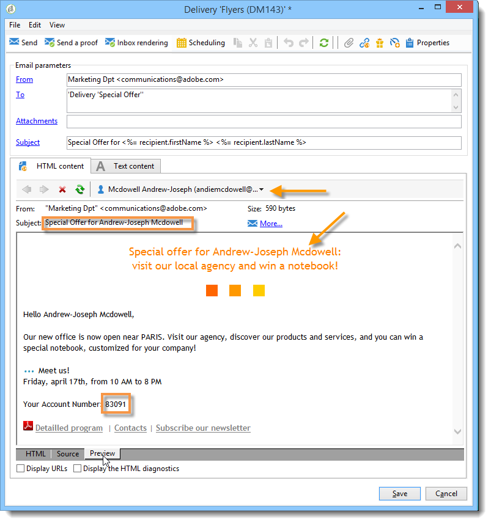

# Campi di personalizzazione{#personalization-fields}

I campi di personalizzazione sono utilizzati per la personalizzazione di primo livello del contenuto dei messaggi inviati. I campi inseriti in un contenuto principale mostrano la posizione in cui inserire i dati dall&#39;origine dati selezionata.

Ad esempio, il campo di personalizzazione con la sintassi **&lt;%= receive.LastName %>** indica a  Adobe Campaign di inserire il nome del destinatario nel database (tabella del destinatario).

 [Scopri questa funzione nel video](#personalization-fields-video)

>[!CAUTION]
>
>Il contenuto dei campi di personalizzazione non può superare i 1024 caratteri.

## Origini dati {#data-sources}

I campi di personalizzazione possono provenire da due tipi di origine dati, in base alla modalità di consegna selezionata:

* Il database Adobe Campaign  è l&#39;origine dati. Questo è il caso più comune, ad esempio &quot;campi di personalizzazione del destinatario&quot;. Si tratta di tutti i campi definiti nella tabella dei destinatari, siano essi campi standard (in genere: cognome, nome, indirizzo, città, data di nascita, ecc.) o campi definiti dall’utente.
* Un file esterno è l&#39;origine dati. Si tratta di tutti i campi definiti nelle colonne del file presentati come input durante la consegna utilizzando i dati presenti in un file esterno.

>[!NOTE]
>
>Un tag di personalizzazione Adobe Campaign  ha sempre il seguente modulo **&lt;%=table.field%>**.

## Inserimento di un campo di personalizzazione {#inserting-a-personalization-field}

Per inserire campi di personalizzazione, fai clic sull’icona a discesa accessibile da qualsiasi campo di modifica di intestazione, oggetto o corpo del messaggio.

Dopo la selezione di un&#39;origine dati (campi del destinatario o campo del file), l&#39;inserimento assume la forma di un comando che verrà interpretato da  Adobe Campaign e sostituito dal valore del campo per un dato destinatario. La sostituzione fisica può essere visualizzata nella **[!UICONTROL Preview]** scheda.

## Esempio di campi di personalizzazione {#personalization-fields-example}

Creiamo un&#39;e-mail in cui inseriremo prima il nome del destinatario e quindi la data di creazione del profilo nel corpo del messaggio. Per eseguire questa operazione:

1. Create una nuova consegna o aprite una consegna di tipo e-mail esistente.
1. Nella procedura guidata di consegna, fai clic **[!UICONTROL Subject]** per modificare l’oggetto del messaggio e immettere un oggetto.
1. Immettete &quot; **[!UICONTROL Special offer for]** &quot; e utilizzate il pulsante nella barra degli strumenti per inserire un campo di personalizzazione. Seleziona **[!UICONTROL Recipients>Title]**.

   

1. Ripetere l&#39;operazione per inserire il nome del destinatario. Inserite spazi tra tutti i campi di personalizzazione.
1. Fare clic **[!UICONTROL OK]** per eseguire la convalida.
1. Inserisci la personalizzazione nel corpo del messaggio. A tal fine, fare clic nel contenuto del messaggio e fare clic sul pulsante di inserimento del campo.
1. Seleziona **[!UICONTROL Recipient>Other...]**.

   

1. Selezionare il campo con le informazioni da visualizzare e fare clic **[!UICONTROL OK]**.

   

1. Fate clic sulla **[!UICONTROL Preview]** scheda per visualizzare il risultato della personalizzazione. È necessario selezionare un destinatario per visualizzare il messaggio del destinatario.

   

   >[!NOTE]
   >
   >Quando una consegna fa parte di un flusso di lavoro, potete utilizzare i dati della tabella del flusso di lavoro temporaneo. Questi dati sono raggruppati nel **[!UICONTROL Target extension]** menu. Per ulteriori informazioni, consulta [questa sezione](../../workflow/using/data-life-cycle.md#target-data).

## Ottimizzazione della personalizzazione {#optimizing-personalization}

Puoi ottimizzare la personalizzazione utilizzando un&#39;opzione dedicata: **[!UICONTROL Prepare the personalization data with a workflow]**, disponibile nella **[!UICONTROL Analysis]** scheda delle proprietà di consegna. Per ulteriori informazioni sull&#39;analisi della consegna, consulta [questa sezione](../../delivery/using/steps-validating-the-delivery.md#analyzing-the-delivery).

Durante l&#39;analisi della consegna, questa opzione crea ed esegue automaticamente un flusso di lavoro che memorizza tutti i dati collegati alla destinazione in una tabella temporanea, compresi i dati provenienti da tabelle collegate in FDA.

Selezionando questa opzione è possibile migliorare notevolmente le prestazioni dell&#39;analisi di distribuzione quando vengono elaborati molti dati, soprattutto se i dati di personalizzazione provengono da una tabella esterna tramite FDA. Per ulteriori informazioni, vedere [Accesso a un database esterno (FDA)](../../platform/using/additional-options.md#optimizing-email-personalization-with-external-data).

Ad esempio, in caso di problemi di prestazioni durante la distribuzione a un numero elevato di destinatari utilizzando molti campi di personalizzazione e/o blocchi di personalizzazione nel contenuto dei messaggi, questa opzione può accelerare la gestione della personalizzazione e quindi la distribuzione dei messaggi.

Per utilizzare questa opzione, attenetevi alla procedura seguente:

1. Creare una campagna. Per ulteriori informazioni, consulta [questa sezione](../../campaign/using/setting-up-marketing-campaigns.md#creating-a-campaign).
1. Nella **[!UICONTROL Targeting and workflows]** scheda della campagna, aggiungete un&#39;attività **Query** al flusso di lavoro. For more on using this activity, refer to [this section](../../workflow/using/query.md).
1. Aggiungete un&#39; **[!UICONTROL Email delivery]** attività al flusso di lavoro e apritela. For more on using this activity, refer to [this section](../../workflow/using/delivery.md).
1. Passate alla **[!UICONTROL Analysis]** scheda del **[!UICONTROL Delivery properties]** pannello e selezionate l&#39; **[!UICONTROL Prepare the personalization data with a workflow]** opzione.

   

1. Configurate la distribuzione e avviate il flusso di lavoro per avviare l&#39;analisi.

Al termine dell&#39;analisi, i dati di personalizzazione vengono memorizzati in una tabella temporanea tramite un flusso di lavoro tecnico temporaneo creato al volo durante l&#39;analisi.

Questo flusso di lavoro non è visibile nell&#39;interfaccia  Adobe Campaign. È solo uno strumento tecnico per memorizzare e gestire rapidamente i dati di personalizzazione.

Una volta completata l&#39;analisi, andate al flusso di lavoro **[!UICONTROL Properties]** e selezionate la **[!UICONTROL Variables]** scheda. Qui puoi vedere il nome della tabella temporanea che potresti usare per effettuare una chiamata SQL per visualizzare gli ID che contiene.

## Timeout della fase di personalizzazione {#timing-out-personalization}

Per migliorare la protezione della distribuzione, puoi impostare un periodo di timeout per la fase di personalizzazione.

Nella **[!UICONTROL Delivery]** scheda dell&#39; **[!UICONTROL Delivery properties]**, selezionate un valore massimo in secondi per l&#39; **[!UICONTROL Maximum personalization run time]** opzione.

Durante l&#39;anteprima o l&#39;invio, se la fase di personalizzazione supera il tempo massimo impostato in questo campo, il processo verrà interrotto con un messaggio di errore e la distribuzione non riuscirà.

Il valore predefinito è 5 secondi.

Se impostate questa opzione su 0, non vi sarà alcun limite di tempo per la fase di personalizzazione.

## Come personalizzare le e-mail utilizzando i campi di personalizzazione {#personalization-field-video}

Scoprite come aggiungere un campo di personalizzazione alla riga dell&#39;oggetto e al contenuto di una distribuzione tramite e-mail.

>[!VIDEO](https://video.tv.adobe.com/v/24925?quality=12)
