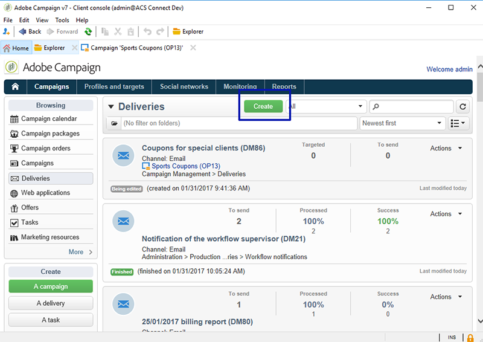
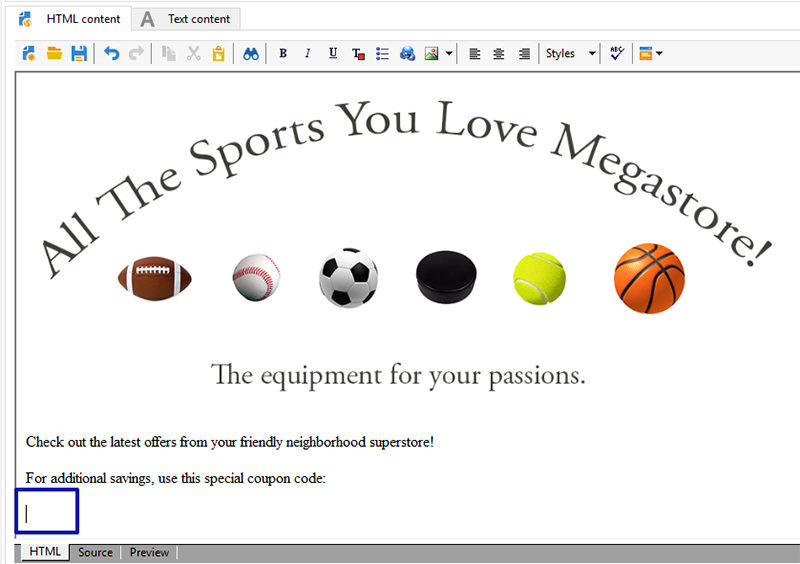

# Coupon personalizzati{#personalized-coupons}

L’aggiunta di coupon alle consegne può fornire ai destinatari un valore aggiunto per prodotti e servizi. Puoi utilizzare il modulo coupon di Campaign per creare un set di coupon da aggiungere alle prossime offerte di marketing. Quando sei pronto a creare una consegna, assegna i coupon applicabili. Poiché i coupon sono validi per un periodo selezionato, un coupon assegnato è collegato in modo univoco al relativo messaggio di consegna. Inoltre, Campaign conferma che sono presenti coupon sufficienti per il numero di messaggi prima dell’invio della consegna.

>[!AVAILABILITY]
>
>La gestione dei coupon non è disponibile in Campaign v8 nel contesto di una distribuzione Enterprise (FFDA). Ulteriori informazioni in [Documentazione di Campaign v8](https://experienceleague.adobe.com/en/docs/campaign/campaign-v8/config/architecture/ffda/enterprise-deployment){target="_blank"}.

La gestione dei coupon si basa su un pacchetto che deve essere installato. Per confermare che hai la gestione Coupon, seleziona **[!UICONTROL Administration > Configuration > Package management > Installed packages.]**

I dati del coupon possono essere importati ed esportati utilizzando i formati CSV e XML. [Ulteriori informazioni](../../platform/using/get-started-data-import-export.md).

## Crea un coupon {#creating-a-coupon}

Il modulo Gestione coupon offre due opzioni per la creazione di coupon:

* **Anonimo**: coupon generico per determinati destinatari o elenchi di destinatari.
* **Individuale**: coupon personalizzato per destinatari selezionati.

Prima di seguire i passaggi seguenti, assicurati di conoscere il tipo di coupon che desideri creare.

1. Nella struttura Campaign, vai a **[!UICONTROL Resources > Campaign management > Coupons]**.

   

1. Fai clic sul pulsante **[!UICONTROL New]**.
1. Inserisci il nome del coupon in **[!UICONTROL Label]** campo. Un codice univoco è stato immesso automaticamente in **[!UICONTROL Coupon code]**. Puoi conservare il codice o immetterne uno nuovo.

   

1. Scegli **[!UICONTROL Start date]** e **[!UICONTROL End date]** per impostare il periodo di validità della cedola.
1. In entrata **[!UICONTROL Coupon type]**, scegliere Anonimo o Individuale.

   **[!UICONTROL Anonymous coupons]** : un coupon anonimo è identico per tutti i destinatari. Conferma che Anonimo sia selezionato in **Tipo di coupon** e fai clic su **Salva** per generare il coupon.

   **[!UICONTROL Individual coupons]** : un singolo coupon può essere ulteriormente personalizzato con codici coupon aggiuntivi. Ad esempio, viene creato un singolo coupon per la vendita in un negozio di attrezzatura sportiva. Tuttavia, la lista dei destinatari è lunga e non condividono lo stesso entusiasmo per un singolo sport. Puoi aggiungere nomi in codice per il singolo coupon in base a uno sport (ad esempio, calcio, calcio, baseball, ecc.) e invia ciascun codice ai destinatari applicabili.

   1. Quando si sceglie Individuale, in basso a sinistra viene visualizzata una nuova scheda, Coupon. Vai a **[!UICONTROL Coupons]** e fai clic su **[!UICONTROL Add]**.
   1. Inserire un codice univoco per il singolo coupon quando richiesto dalla finestra popup.
   1. Clic **[!UICONTROL Save]** per generare il coupon.

   Per ulteriori dettagli sulla scheda Coupon, vedi [Configurare singoli coupon](#configuring-individual-coupons).

   >[!NOTE]
   >
   >I singoli coupon possono essere importati in blocco. Per ulteriori informazioni sull&#39;importazione e l&#39;esportazione, fare riferimento a [questa sezione](../../platform/using/get-started-data-import-export.md).

### Configurare singoli coupon {#configuring-individual-coupons}

La scheda Coupon è disponibile solo con i singoli coupon. Dopo aver associato un coupon a una consegna, la scheda Coupon fornisce i seguenti dettagli:

* **[!UICONTROL Status]** : disponibilità del coupon.
* **[!UICONTROL Redeemed on]** : data in cui la cedola viene rimborsata.
* **[!UICONTROL Channel]** : canale utilizzato per inviare il coupon.
* **[!UICONTROL Address]** : gli indirizzi e-mail dei destinatari.

Valori per **[!UICONTROL status]**, **[!UICONTROL channel]**, e **[!UICONTROL address]** vengono completate automaticamente. Tuttavia, i valori per **[!UICONTROL redeemed on]** non vengono recuperati da Campaign. Possono essere completati importando un file con i dettagli per il rimborso del coupon.

## Inserire un coupon in una consegna e-mail {#inserting-a-coupon-into-an-email-delivery}

Nell’esempio seguente, la consegna viene creata dalla pagina Home. Per istruzioni dettagliate su come creare una consegna, consulta [questa sezione](about-email-channel.md). Puoi anche aggiungere un coupon a una consegna in un flusso di lavoro.

1. Vai a **[!UICONTROL Campaigns]** e scegli **[!UICONTROL Deliveries]**.
1. Fai clic su **[!UICONTROL Create]**.

   

1. Inserisci un nome in **[!UICONTROL Label]** e fai clic su **[!UICONTROL Continue]**.
1. Clic **[!UICONTROL To]** per aggiungere destinatari.
1. Clic **[!UICONTROL Add]** per scegliere i destinatari per la consegna. Dopo aver selezionato i destinatari, fai clic su **[!UICONTROL Ok]** per tornare alla consegna.

   

1. Inserisci un oggetto e aggiungi il contenuto al messaggio.

   

1. Nella barra degli strumenti, fai clic su **[!UICONTROL Properties]** e scegli la **[!UICONTROL Advanced]** scheda.
1. Fai clic sull’icona della cartella per **[!UICONTROL Coupon management]**.

   

1. Scegli il coupon e fai clic su **[!UICONTROL Ok]**. Clic **[!UICONTROL Ok]** di nuovo.

   

1. Fai clic sul messaggio per scegliere dove posizionare il coupon.

   

1. Fai clic sull’icona di personalizzazione per scegliere una delle seguenti opzioni in base al tipo di coupon:

   * Coupon anonimo: **[!UICONTROL Coupon > Coupon code]**

     

   * Coupon individuale: **[!UICONTROL Coupon value > Coupon code]**

     

     Il coupon viene inserito nel messaggio come codice anziché come nome assegnato. Il codice viene utilizzato all’interno del modello dati di Campaign ootb.

   

1. Esegui un test per confermare il nome assegnato al coupon. Vai a **[!UICONTROL Preview]** e fai clic su **[!UICONTROL Test personalization]**. Scegli un destinatario per il test.

   

   Dopo il test, il coupon deve essere visualizzato come nome assegnato anziché come codice.

   

1. Nella barra degli strumenti, fai clic su **[!UICONTROL Send]** (in alto a sinistra) e scegli come desideri inviare la consegna.

   

1. Fai clic su **[!UICONTROL Analyze]**. Se il registro di analisi conferma che sono presenti coupon sufficienti per tutti i destinatari, fai clic su **[!UICONTROL Confirm delivery]** per inviarlo.

   

>[!NOTE]
>
>Per istruzioni su come gestire coupon insufficienti per una consegna, consulta [Gestisci coupon insufficienti](#managing-insufficient-coupons)

Per confermare che la consegna è avvenuta correttamente:

1. Vai a **[!UICONTROL Explorer > Resources > Campaign management > Coupons]**.
1. Fai clic su **[!UICONTROL Deliveries]** scheda.

   

   Lo stato è **[!UICONTROL Finished]** per una consegna corretta.

>[!NOTE]
>
>Per impostazione predefinita, il modulo di gestione dei coupon utilizza un **nms:destinatario** tabella. [Ulteriori informazioni](../../configuration/using/about-data-model.md#default-recipient-table).
>
>Scopri come utilizzare una tabella dei destinatari personalizzata [in questa pagina](../../configuration/using/about-custom-recipient-table.md).

## Gestisci coupon insufficienti {#managing-insufficient-coupons}

L’analisi della consegna si interrompe se il numero di coupon è inferiore a quello dei messaggi. In questo caso, puoi importare più coupon o limitare il numero di messaggi. Per limitare il numero di messaggi, segui le istruzioni riportate di seguito.

1. Vai alla finestra di consegna e-mail.
1. Fai clic su **[!UICONTROL To]**.
1. In entrata **[!UICONTROL Select target]**, passare alla **[!UICONTROL Exclusions]** scheda.

   

1. Nella sezione delle impostazioni di esclusione, fai clic su **[!UICONTROL Edit]**.
1. Immetti il numero di messaggi da inviare **[!UICONTROL Limit delivery to...messages]** e fai clic su **[!UICONTROL Ok]**. Puoi inviare la consegna.

   

>[!NOTE]
>
>Quando gestisci un numero limitato di coupon, un flusso di lavoro di consegna ti consente di suddividere la consegna in base ai criteri. È una buona opzione se desideri inviare coupon a una popolazione selezionata senza limitare il target.
