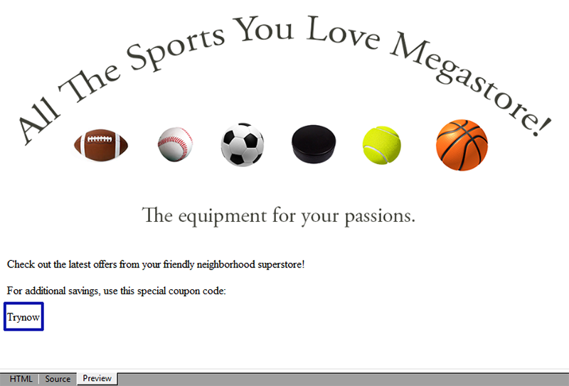

# Coupon personalizzati{#personalized-coupons}

L&#39;aggiunta di buoni alle consegne consente di offrire ai destinatari un valore aggiunto per prodotti e servizi. Puoi utilizzare il modulo coupon Campagna per creare un set di buoni da aggiungere alle prossime offerte di marketing. Quando sei pronto a creare una consegna, assegna i coupon applicabili. Poiché le cedole sono valide per un periodo selezionato, una cedola assegnata è collegata in modo univoco al messaggio di consegna. Campaign inoltre conferma che esistono abbastanza buoni sconto per il numero di messaggi prima dell&#39;invio.

>[!NOTE]
>
>La gestione dei coupon è un pacchetto che deve essere installato. Per confermare di disporre della gestione del coupon, controllare **[!UICONTROL Administration > Configuration > Package management > Installed packages.]**
>
>I dati coupon possono essere importati ed esportati utilizzando i formati CSV e XML. Per informazioni dettagliate sull&#39;importazione e l&#39;esportazione, consultare [questa sezione](../../platform/using/generic-imports-and-exports.md).

## Creazione di un coupon {#creating-a-coupon}

Il modulo del coupon offre due opzioni per la creazione dei coupon:

* **Anonimo**: Un coupon generico per specifici destinatari o elenchi di destinatari.
* **Individuale**: Un coupon personalizzato per specifici destinatari.

Prima di seguire i passaggi descritti di seguito, accertatevi di conoscere il tipo di coupon da creare.

1. Nella struttura della campagna, andate a **[!UICONTROL Resources > Campaign management > Coupons]**.

   

1. Fai clic sul pulsante **[!UICONTROL New]**.
1. Immettere il nome del coupon nel campo **[!UICONTROL Label]**. È stato immesso automaticamente un codice univoco in **[!UICONTROL Coupon code]**. È possibile mantenere il codice o inserirne uno nuovo.

   

1. Scegliere **[!UICONTROL Start date]** e **[!UICONTROL End date]** per impostare il periodo in cui il coupon è valido.
1. In **[!UICONTROL Coupon type]**, scegliete Anonimo o Singolo.

   **[!UICONTROL Anonymous coupons]** : Un coupon anonimo è identico per tutti i destinatari. Verificare che sia selezionato Anonymous nel menu **Coupon type** e fare clic su **Save** per generare il coupon.

   **[!UICONTROL Individual coupons]** : Un singolo coupon può essere ulteriormente personalizzato con codici coupon aggiuntivi. Ad esempio, un singolo coupon viene creato per una vendita presso un negozio di attrezzature sportive. Tuttavia, l&#39;elenco dei beneficiari è lungo e non condividono lo stesso entusiasmo per un solo sport. È possibile aggiungere nomi di codice per il singolo coupon basato su uno sport (ad es. calcio, calcio, baseball, ecc.) e inviare ciascun codice ai destinatari pertinenti.

   1. Quando si sceglie Singolo, in basso a sinistra compare una nuova scheda, Coupons. Vai alla scheda **[!UICONTROL Coupons]** e fai clic su **[!UICONTROL Add]**.
   1. Immettete un codice univoco per il singolo coupon quando richiesto dalla finestra a comparsa.
   1. Fare clic su **[!UICONTROL Save]** per generare il coupon.

   Per ulteriori dettagli sulla scheda Coupons, vedere [Configurazione di singoli coupon](#configuring-individual-coupons).

   >[!NOTE]
   >
   >I singoli coupon possono essere importati in massa. Per informazioni dettagliate sull&#39;importazione e l&#39;esportazione, consultare [questa sezione](../../platform/using/generic-imports-and-exports.md).

### Configurazione di singoli coupon {#configuring-individual-coupons}

La scheda Coupons è disponibile solo con i singoli coupon. Dopo che un coupon è associato a una consegna, la scheda Coupon fornisce i seguenti dettagli:

* **[!UICONTROL Status]** : Disponibilità coupon.
* **[!UICONTROL Redeemed on]** : Data in cui la cedola viene rimborsata.
* **[!UICONTROL Channel]** : Canale utilizzato per inviare il coupon.
* **[!UICONTROL Address]** : Gli indirizzi e-mail dei destinatari.

I valori per **[!UICONTROL status]**, **[!UICONTROL channel]** e **[!UICONTROL address]** vengono completati automaticamente. Tuttavia, i valori di **[!UICONTROL redeemed on]** non vengono recuperati da Campaign. Possono essere completati importando un file con i dettagli per il rimborso del buono sconto.

## Inserimento di un coupon in una consegna di posta elettronica {#inserting-a-coupon-into-an-email-delivery}

Nell&#39;esempio seguente, la consegna viene creata dalla home page. Per istruzioni dettagliate su come creare una consegna, consultare [questa sezione](../../delivery/using/about-email-channel.md). Potete anche aggiungere un coupon a una consegna in un flusso di lavoro.

1. Vai a **[!UICONTROL Campaigns]** e scegli **[!UICONTROL Deliveries]**.
1. Fai clic su **[!UICONTROL Create]**.

   

1. Immettete un nome in **[!UICONTROL Label]** e fate clic su **[!UICONTROL Continue]**.
1. Fare clic su **[!UICONTROL To]** per aggiungere i destinatari.
1. Fate clic su **[!UICONTROL Add]** per scegliere i destinatari per la consegna. Dopo aver selezionato i destinatari, fate clic su **[!UICONTROL Ok]** per tornare alla consegna.

   

1. Immettete un oggetto e aggiungete il contenuto al messaggio.

   

1. Nella barra degli strumenti, fare clic su **[!UICONTROL Properties]** e scegliere la scheda **[!UICONTROL Advanced]**.
1. Fate clic sull&#39;icona della cartella per **[!UICONTROL Coupon management]**.

   

1. Scegliere il coupon e fare clic su **[!UICONTROL Ok]**. Fare di nuovo clic su **[!UICONTROL Ok]**.

   

1. Fare clic sul messaggio per scegliere dove inserire il coupon.

   

1. Fate clic sull&#39;icona di personalizzazione per scegliere una delle opzioni seguenti in base al tipo di coupon:

   * Buono anonimo: **[!UICONTROL Coupon > Coupon code]**

      

   * Cedola singola: **[!UICONTROL Coupon value > Coupon code]**

      

      Il coupon viene inserito nel messaggio come codice anziché come nome assegnato. Il codice viene utilizzato all&#39;interno del modello dati standard di Campaign.
   

1. Eseguire un test per confermare il nome assegnato al coupon. Vai alla scheda **[!UICONTROL Preview]** e fai clic su **[!UICONTROL Test personalization]**. Scegliete un destinatario per il test.

   

   Dopo il test, il coupon deve essere visualizzato come nome assegnato anziché come codice.

   

1. Nella barra degli strumenti, fate clic su **[!UICONTROL Send]** (in alto a sinistra) e scegliete come inviare la consegna.

   

1. Fai clic su **[!UICONTROL Analyze]**. Se il registro di analisi conferma che esistono abbastanza buoni per tutti i destinatari, fare clic su **[!UICONTROL Confirm delivery]** per inviarlo.

   

>[!NOTE]
>
>Per istruzioni su come gestire i buoni sconto insufficienti per una consegna, vedere [Gestione dei buoni sconto insufficienti](#managing-insufficient-coupons)

Per confermare che la consegna è avvenuta correttamente:

1. Vai a **[!UICONTROL Explorer > Resources > Campaign management > Coupons]**.
1. Fare clic sulla scheda **[!UICONTROL Deliveries]**.

   

   Lo stato viene letto come **[!UICONTROL Finished]** per la consegna riuscita.

>[!NOTE]
>
>Per impostazione predefinita, il modulo di gestione delle cedole utilizza una tabella **nms:Recipients**. Per istruzioni sull&#39;utilizzo di altre tabelle, vedere [Modifica di schemi](../../configuration/using/data-schemas.md).

## Gestione di coupon insufficienti {#managing-insufficient-coupons}

L&#39;analisi di consegna si interrompe se i coupon sono più numerosi dei messaggi. In questo caso, puoi importare più coupon o limitare il numero di messaggi. Seguite le istruzioni riportate di seguito per limitare il numero di messaggi.

1. Passate alla finestra di consegna e-mail.
1. Fai clic su **[!UICONTROL To]**.
1. In **[!UICONTROL Select target]**, passare alla scheda **[!UICONTROL Exclusions]**.

   

1. Nella sezione delle impostazioni di esclusione, fare clic su **[!UICONTROL Edit]**.
1. Immettere il numero di messaggi che si desidera inviare in **[!UICONTROL Limit delivery to...messages]** e fare clic su **[!UICONTROL Ok]**. Puoi spedire la consegna.

   

>[!NOTE]
>
>Quando gestite un numero limitato di buoni, un flusso di lavoro di consegna consente di suddividere la consegna in base ai criteri impostati. È una buona opzione se si desidera inviare i coupon a una popolazione selezionata senza limitare la destinazione.
