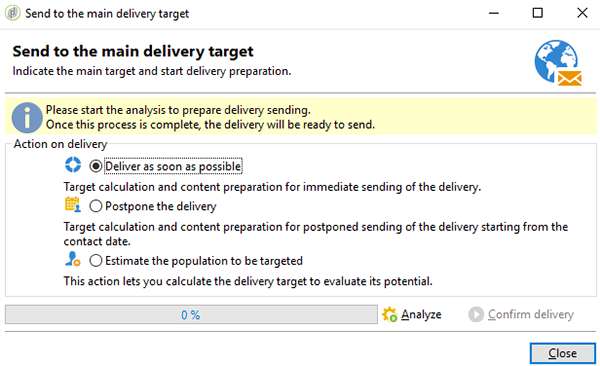

# Coupon personalizzati{#personalized-coupons}

L’aggiunta di coupon alle consegne può fornire ai destinatari un valore aggiunto per prodotti e servizi. Puoi utilizzare il modulo Coupon di Campaign per creare un set di coupon da aggiungere alle prossime offerte di marketing. Quando sei pronto per creare una consegna, assegna i coupon applicabili. Poiché i coupon sono validi per un periodo selezionato, un coupon assegnato è collegato in modo univoco al relativo messaggio di consegna. Inoltre, Campaign conferma che ci sono abbastanza coupon per il numero di messaggi prima che la consegna venga inviata.

>[!NOTE]
>
>La gestione dei coupon è un pacchetto che deve essere installato. Per confermare la gestione del coupon, controlla **[!UICONTROL Administration > Configuration > Package management > Installed packages.]**
>
>I dati dei coupon possono essere importati ed esportati utilizzando i formati CSV e XML. Per informazioni dettagliate sull&#39;importazione e l&#39;esportazione, consulta [questa sezione](../../platform/using/get-started-data-import-export.md).

## Creazione di un coupon {#creating-a-coupon}

Il modulo coupon offre due opzioni quando si creano i coupon:

* **Anonimo**: Coupon generico per destinatari selezionati o elenchi di destinatari.
* **Individuale**: Un coupon personalizzato per i destinatari selezionati.

Prima di seguire i passaggi seguenti, assicurati di conoscere il tipo di coupon che desideri creare.

1. Nella struttura ad albero di Campaign, vai a **[!UICONTROL Resources > Campaign management > Coupons]**.

   

1. Fai clic sul pulsante **[!UICONTROL New]**.
1. Immetti il nome del coupon nel campo **[!UICONTROL Label]** . Un codice univoco è stato immesso automaticamente in **[!UICONTROL Coupon code]**. Puoi mantenere il codice o inserirne uno nuovo.

   

1. Scegliere **[!UICONTROL Start date]** e **[!UICONTROL End date]** per impostare il periodo in cui il coupon è valido.
1. In **[!UICONTROL Coupon type]**, scegli Anonymous o Individuale.

   **[!UICONTROL Anonymous coupons]** : Un coupon anonimo è identico per tutti i destinatari. Conferma che Anonymous sia selezionato nel menu **Tipo di coupon** e fai clic su **Salva** per generare il coupon.

   **[!UICONTROL Individual coupons]** : Un singolo coupon può essere ulteriormente personalizzato con codici coupon aggiuntivi. Ad esempio, viene creato un coupon individuale per una vendita presso un negozio di attrezzature sportive. Tuttavia, l&#39;elenco dei beneficiari è lungo e non condividono lo stesso entusiasmo per un solo sport. È possibile aggiungere nomi di codice per il singolo coupon in base a uno sport (ad esempio calcio, calcio, baseball, ecc.) e invia ogni codice ai destinatari applicabili.

   1. Quando si sceglie Individuale, viene visualizzata una nuova scheda, Coupon, in basso a sinistra. Vai alla scheda **[!UICONTROL Coupons]** e fai clic su **[!UICONTROL Add]**.
   1. Inserisci un codice univoco per il singolo coupon quando richiesto dalla finestra pop-up.
   1. Fare clic su **[!UICONTROL Save]** per generare il coupon.

   Per ulteriori dettagli sulla scheda Coupon, vedere [Configurazione di singoli coupon](#configuring-individual-coupons).

   >[!NOTE]
   >
   >I singoli coupon possono essere importati in massa. Per informazioni dettagliate sull&#39;importazione e l&#39;esportazione, consulta [questa sezione](../../platform/using/get-started-data-import-export.md).

### Configurazione di singoli coupon {#configuring-individual-coupons}

La scheda Coupon è disponibile solo con singoli coupon. Dopo che un coupon è associato a una consegna, la scheda Coupon fornisce i seguenti dettagli:

* **[!UICONTROL Status]** : Disponibilità coupon.
* **[!UICONTROL Redeemed on]** : La data in cui il buono viene rimborsato.
* **[!UICONTROL Channel]** : Il canale utilizzato per inviare il coupon.
* **[!UICONTROL Address]** : Gli indirizzi e-mail dei destinatari.

I valori per **[!UICONTROL status]**, **[!UICONTROL channel]** e **[!UICONTROL address]** vengono completati automaticamente. Tuttavia, i valori per **[!UICONTROL redeemed on]** non vengono recuperati da Campaign. È possibile completarli importando un file con i dettagli per il rimborso delle cedole.

## Inserimento di un coupon in una consegna e-mail {#inserting-a-coupon-into-an-email-delivery}

Nell’esempio seguente, la consegna viene creata dalla home page. Per istruzioni dettagliate su come creare una consegna, consulta [questa sezione](about-email-channel.md). Puoi anche aggiungere un coupon a una consegna in un flusso di lavoro.

1. Vai a **[!UICONTROL Campaigns]** e scegli **[!UICONTROL Deliveries]**.
1. Fai clic su **[!UICONTROL Create]**.

   

1. Immetti un nome in **[!UICONTROL Label]** e fai clic su **[!UICONTROL Continue]**.
1. Fai clic su **[!UICONTROL To]** per aggiungere i destinatari.
1. Fai clic su **[!UICONTROL Add]** per scegliere i destinatari della consegna. Dopo aver selezionato i destinatari, fai clic su **[!UICONTROL Ok]** per tornare alla consegna.

   

1. Inserisci un oggetto e aggiungi contenuto al messaggio.

   

1. Nella barra degli strumenti, fai clic su **[!UICONTROL Properties]** e scegli la scheda **[!UICONTROL Advanced]** .
1. Fai clic sull’icona della cartella per **[!UICONTROL Coupon management]**.

   

1. Scegli il coupon e fai clic su **[!UICONTROL Ok]**. Fare nuovamente clic su **[!UICONTROL Ok]**.

   

1. Fare clic sul messaggio per scegliere dove si desidera inserire il coupon.

   

1. Fai clic sull’icona di personalizzazione per scegliere una delle opzioni seguenti in base al tipo di coupon:

   * Coupon anonimo: **[!UICONTROL Coupon > Coupon code]**

      

   * Cedola individuale: **[!UICONTROL Coupon value > Coupon code]**

      

      Il coupon viene inserito nel messaggio come codice anziché come nome assegnato. Il codice viene utilizzato all’interno del modello dati di ootb di Campaign.
   

1. Esegui un test per confermare il nome assegnato al coupon. Vai alla scheda **[!UICONTROL Preview]** e fai clic su **[!UICONTROL Test personalization]**. Scegli un destinatario per il test.

   

   Dopo il test, il coupon deve essere visualizzato come nome assegnato anziché come codice.

   

1. Nella barra degli strumenti, fai clic su **[!UICONTROL Send]** (in alto a sinistra) e scegli come desideri inviare la consegna.

   

1. Fai clic su **[!UICONTROL Analyze]**. Se il registro di analisi conferma che ci sono abbastanza coupon per tutti i destinatari, fai clic su **[!UICONTROL Confirm delivery]** per inviarlo.

   

>[!NOTE]
>
>Per istruzioni su come gestire i coupon insufficienti per una consegna, consulta [Gestione dei coupon insufficienti](#managing-insufficient-coupons)

Per confermare l’esito positivo della consegna:

1. Vai a **[!UICONTROL Explorer > Resources > Campaign management > Coupons]**.
1. Fai clic sulla scheda **[!UICONTROL Deliveries]** .

   

   Lo stato indica come **[!UICONTROL Finished]** per una consegna riuscita.

>[!NOTE]
>
>Per impostazione predefinita, il modulo di gestione delle cedole utilizza una tabella **nms:recipient** . Per istruzioni sull’utilizzo di altre tabelle, vedere [Modifica di schemi](../../configuration/using/data-schemas.md).

## Gestione dei coupon insufficienti {#managing-insufficient-coupons}

L’analisi della consegna si interrompe se ci sono meno coupon dei messaggi. In questo caso, puoi importare più coupon o limitare il numero di messaggi. Per limitare il numero di messaggi, segui le istruzioni riportate di seguito.

1. Passa alla finestra di consegna e-mail.
1. Fai clic su **[!UICONTROL To]**.
1. In **[!UICONTROL Select target]**, vai alla scheda **[!UICONTROL Exclusions]** .

   

1. Nella sezione delle impostazioni di esclusione, fai clic su **[!UICONTROL Edit]**.
1. Immetti il numero di messaggi da inviare in **[!UICONTROL Limit delivery to...messages]** e fai clic su **[!UICONTROL Ok]**. Puoi inviare la consegna.

   

>[!NOTE]
>
>Quando gestisci un numero limitato di coupon, un flusso di lavoro di consegna ti consente di suddividere la consegna in base ai tuoi criteri. È una buona opzione se desideri inviare coupon a una popolazione selezionata senza limitare il target.
