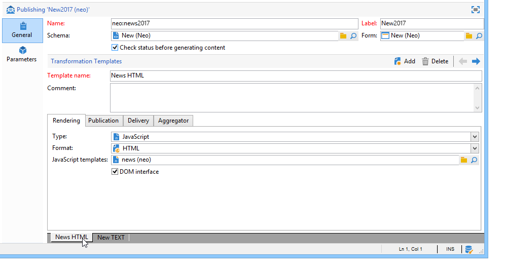
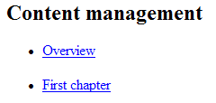
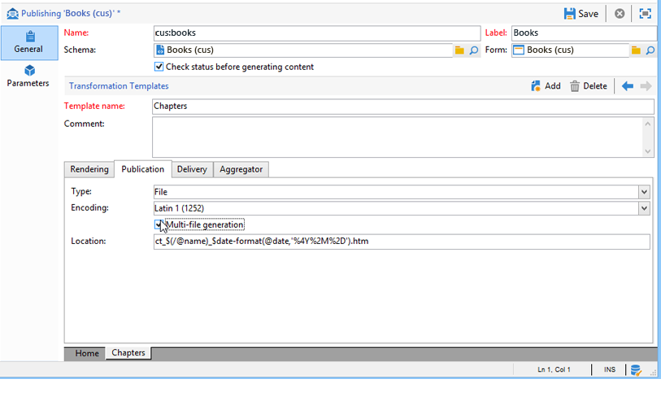

# Modelli di pubblicazione{#publication-templates}

## Informazioni sui modelli di pubblicazione {#about-publication-templates}

Il modello di pubblicazione fa riferimento alle risorse utilizzate nel processo di pubblicazione, ovvero:

* lo schema di dati,
* il modulo di input,
* i modelli di trasformazione per ciascun documento di output.

## Identificazione di un modello di pubblicazione {#identification-of-a-publication-template}

Un modello di pubblicazione è identificato dal nome e dallo spazio dei nomi.

La chiave di identificazione di un foglio di stile è una stringa costituita dallo spazio dei nomi e dal nome separati da due punti, ad esempio: **cus:newsletter**.

>[!NOTE]
>
>In pratica, si consiglia di utilizzare la stessa chiave per lo schema, il modulo e il modello di pubblicazione.

## Creare e configurare il modello {#creating-and-configuring-the-template}

I modelli di pubblicazione sono archiviati per impostazione predefinita nel nodo **[!UICONTROL Administration > Configuration > Publication templates]**. Per creare un nuovo modello, fare clic sul pulsante **[!UICONTROL New]** sopra l&#39;elenco dei modelli.

Per configurare il modello di pubblicazione, compila il nome del modello (ovvero la chiave di identificazione costituita dal nome e dallo spazio dei nomi), l’etichetta, lo schema dati e il modulo di input a cui è collegato.



>[!NOTE]
>
>L&#39;etichetta verrà visualizzata ogni volta che il contenuto viene creato in base a questo modello di pubblicazione.

L&#39;opzione **Controlla stato per convalidare la generazione del contenuto** forza un controllo dello stato &quot;Convalidato&quot; delle istanze di contenuto per autorizzare la generazione dei file. Per ulteriori informazioni, consulta [Pubblicazione](#publication).

È necessario aggiungere un modello di trasformazione per ciascun documento di output. Puoi creare tutti i modelli di trasformazione necessari.

Il campo **[!UICONTROL Name of template]** è un&#39;etichetta libera che descrive il tipo di rendering nell&#39;output. Per ogni modello di trasformazione, le impostazioni di pubblicazione sono disponibili nelle schede.

### Rendering {#rendering}

Nella scheda **[!UICONTROL Rendering]**, scegliere:

* il tipo di rendering utilizzato per proiettare il documento di output: foglio di stile XSL o modello JavaScript,
* il formato del documento di output: HTML, Text, XML o RTF,
* il modello contenente i dati di costruzione, ovvero il foglio di stile o il modello JavaScript da utilizzare.

### Pubblicazione {#publication}

La pubblicazione comporta la generazione del documento di output sotto forma di file, se il tipo selezionato è **[!UICONTROL File]**.


Sono disponibili le seguenti opzioni di pubblicazione:

* Il set di caratteri di codifica del file di output può essere forzato tramite il campo **[!UICONTROL Encoding]**. Per impostazione predefinita viene utilizzato il set di caratteri Latin 1 (1252).
* L&#39;opzione **[!UICONTROL Multi-file generation]** attiva una modalità speciale di pubblicazione dei documenti. Questa opzione consiste nel popolare un tag di partizionamento all&#39;inizio di ogni pagina del documento di output. La generazione del contenuto genera un file per ogni tag di partizionamento popolato. Questa modalità viene utilizzata per generare mini-siti da un blocco di contenuto. per ulteriori informazioni, consulta [Generazione di più file](#multi-file-generation).
* Il campo **[!UICONTROL Location]** contiene il nome del file di output. Il nome può essere composto da variabili per generare un nome di file automatico.

  Una variabile viene compilata con il seguente formato: **`$(<xpath>)`**, dove **`<xpath>`** è il percorso di un campo dello schema dati del modello di pubblicazione.

  Il nome di un file può essere un campo di tipo data. Per formattare correttamente il campo, utilizzare la funzione **$date-format**, utilizzando il percorso del campo e il formato di output come parametri.

  Per impostazione predefinita, il formato di costruzione del nome del file utilizza le variabili nei campi &quot;@name&quot; e &quot;@date&quot;:

  ```xml
  ct_$(@name)_$date-format(@date,'%4Y%2M%2D').htm
  ```

  Il nome del file generato sarà simile al seguente: ct_news12_20110901.htm.

  >[!NOTE]
  >
  >Per ulteriori informazioni sulla generazione del contenuto, fare riferimento a [Creare un&#39;istanza del contenuto](using-a-content-template.md#creating-a-content-instance).

### Consegna {#delivery}

Questa scheda ti consente di selezionare uno scenario per avviare una consegna direttamente sul contenuto. Il contenuto dell’e-mail verrà popolato automaticamente in base al formato di output (HTML o Testo).


>[!NOTE]
>
>Per un esempio di creazione della consegna basata su un contenuto, consulta [Distribuire un&#39;istanza di contenuto](using-a-content-template.md#delivering-a-content-instance).

### Aggregatore {#aggregator}

L&#39;aggregazione dei dati da un elenco di script o query consente di arricchire il documento XML con i dati del contenuto. Lo scopo è integrare determinate informazioni a cui fanno riferimento i collegamenti o aggiungere elementi dal database.

### Generazione di più file {#multi-file-generation}

Per attivare la generazione di più file, selezionare l&#39;opzione **[!UICONTROL Multi-file generation]** nel modello di pubblicazione. Questa opzione consente di specificare i tag di partizionamento nel foglio di stile per l&#39;inizio di ogni pagina del documento di output. La generazione del contenuto genera un file per ogni tag di partizionamento rilevato.

Il tag di partizione da integrare nel foglio di stile è il seguente:

**`<xsl:comment> #nl:output_replace(<name_of_file>) </xsl:comment>`** dove **`<name_of_file>`** è il nome file della pagina da generare.

**Esempio:** generazione di più file utilizzando lo schema &quot;cus:book&quot;.

Il principio consiste nel generare una pagina principale in cui sono elencati i capitoli, con la possibilità di visualizzare i dettagli del capitolo in una pagina esterna.



Il foglio di stile corrispondente (&quot;cus:book.xsl&quot;) è il seguente:

```xml
<?xml version="1.0" encoding="ISO-8859-1" ?>
<xsl:stylesheet xmlns:xsl="http://www.w3.org/1999/XSL/Transform" version="1.0">
  <xsl:output encoding="ISO-8859-1" method="html"/>

  <!-- Style sheet entry point -->
  <xsl:template match="/book">
    <html>
      <body>
        <h1><xsl:value-of select="@name"/></h1>
        <lu>
          <xsl:for-each select="chapter">
            <li><a target="_blank" href="chapter{@id}.htm"><xsl:value-of select="@name"/></a></li>  
          </xsl:for-each>
       </lu>
      </body>
    </html>
   </xsl:template>
</xsl:stylesheet>
```

Per generare i dettagli dei capitoli è necessario un secondo foglio di stile (&quot;cus:chapter.xsl&quot;):

```xml
<?xml version="1.0" encoding="ISO-8859-1" ?>
<xsl:stylesheet xmlns:xsl="http://www.w3.org/1999/XSL/Transform" version="1.0">
  <xsl:output encoding="ISO-8859-1" method="html"/>

  <!-- Detail of a chapter -->
  <xsl:template match="chapter">
    <!-- Cut tag -->   
    <xsl:comment> #nl:output_replace($(path)/chapter<xsl:value-of select="@id"/>.htm)</xsl:comment>
    
    <html>
      <body>
        <h1><xsl:value-of select="@name"/></h1>
        <xsl:value-of select="page" disable-output-escaping="yes"/>
      </body>
    </html>
  </xsl:template>

  <!-- Style sheet entry point -->
  <xsl:template match="/book">
    <xsl:apply-templates/>
   </xsl:template>
</xsl:stylesheet>
```

Il tag di partizionamento viene popolato all’inizio della pagina da includere nel file da generare.

```xml
<xsl:comment> #nl:output_replace($(path)/<xsl:value-of select="@id"/>.htm)</xsl:comment>
```

Il nome file è costruito con la variabile **$(path)** contenente il percorso di pubblicazione e **`<xsl:value-of select="@id" />`**, che corrisponde all&#39;identificatore del capitolo nel documento di input.

Il modello di pubblicazione deve essere compilato con i due fogli di stile &quot;cus:book.xsl&quot; e &quot;cus:chapter.xsl&quot;.

L&#39;opzione **[!UICONTROL Multi-file generation]** deve essere attiva nel modello di trasformazione del capitolo:



Il campo **[!UICONTROL Location]** non viene utilizzato nella generazione di più file, ma è comunque necessario compilare il campo per evitare errori durante la pubblicazione.
