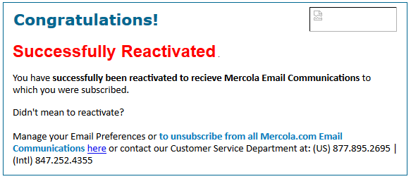

# Miglioramento della realizzabilità mediante il nuovo impegno{#re-engagement}

Durante l&#39;implementazione della funzionalità di recapito, alcune delle best practice consistono nel cercare di mantenere una base di abbonati sana e migliorare la recapito mediante strategie di ricoinvolgimento.

* Mantenere una base di abbonati sana è uno degli aspetti principali per garantire una distribuzione corretta e coerente. Molti problemi di recapito derivano da procedure e manutenzione dei dati scadenti.
* Uno dei problemi più comuni che gli esperti di marketing devono affrontare oggi è l&#39;attività di abbonati inattiva (o meno), che può influenzare negativamente la distribuzione delle e-mail e il basso ROI.

>[!NOTE]
>
>Per ulteriori informazioni sulle strategie per il nuovo coinvolgimento nelle campagne e sui servizi di distribuzione di Adobe, contattate il vostro consulente per la distribuzione o contattate il vostro agente di vendita Adobe.

## In che modo gli ISP visualizzano l&#39;attività non legata al coinvolgimento? {#how-do-isps-view-non-engagement-activity-}

Per anni, gli ISP hanno utilizzato le metriche di feedback del coinvolgimento dei loro utenti per decidere dove inserire i messaggi, o se distribuirli o meno. Il coinvolgimento dell&#39;utente consiste in un feedback positivo e negativo e nel monitorare gli ISP su base costante. Non avere impegno è forse uno dei principali fattori che contribuiscono all&#39;impegno negativo. Dal punto di vista della recapito, l&#39;invio coerente di campagne agli utenti che non mostrano alcun coinvolgimento può anche ridurre la reputazione complessiva dell&#39;indirizzo IP e dei domini.

ISP come AOL, Gmail, Microsoft e Yahoo! visualizzate i messaggi non associati come e-mail indesiderata e iniziate a reindirizzare i messaggi alla cartella spam. Inoltre, questi abbonati non possono più possedere l&#39;account e-mail e questo può essere utilizzato come trappola per spam &quot;riciclata&quot;. Questo significa che l&#39;indirizzo non è valido per un certo periodo di tempo e tutti i messaggi vengono rifiutati. Se il sistema di gestione degli abbonati non rimuove gli indirizzi &quot;rimbalzati&quot;, è molto probabile che invii trappole spam che portano a significativi problemi di consegna.

## Come si dovrebbe affrontare l&#39;inattività? {#how-should-you-approach-inactivity-}

Fortunatamente, i clienti che usano la piattaforma di Adobe Campaign  possono visualizzare l&#39;inattività all&#39;interno della propria istanza rivedendo i dati aperti e facendo clic su in base al segmento. Poiché il mancato coinvolgimento può ostacolare la consegna, il primo pensiero può essere quello di rimuovere semplicemente gli abbonati dal database. In alcuni casi, tuttavia, questa potrebbe rivelarsi un&#39;opzione sbagliata. Di conseguenza, una strategia di riimpegno (nota anche come &quot;win back&quot;) è la migliore raccomandazione per mantenere gli abbonati interessati a ricevere la posta, e gradualmente eliminare quelli che non mostrano più attività.

## Le campagne di recoinvolgimento funzionano davvero? {#do-re-engagement-campaigns-really-work-}

Secondo uno studio sul percorso di ritorno, le campagne di reimpegno sono uscite con un tasso di apertura del 12% rispetto a un tasso medio del 14% per le campagne normali. Anche se solo il 24% degli abbonati aveva letto la campagna di ricoinvolgimento, circa il 45% di loro ha letto i messaggi successivi.

## Come si crea una campagna di nuovo coinvolgimento? {#how-do-you-create-a-re-engagement-campaign-}

### Fase 1 {#phase-1}

* Il primo passaggio consiste nell&#39;identificare gli abbonati che hanno un&#39;attività che non può essere aperta o fare clic su un elemento molto piccolo, e quindi segmentare il gruppo in base a un intervallo di tempo impostato. La regola del pollice consiste nel rivedere gli utenti che non hanno aperto o fatto clic su un&#39;e-mail negli ultimi 90 giorni. Tuttavia, questo varia a seconda della natura dell&#39;attività (ad esempio, l&#39;invio stagionale).
* Un altro punto da tenere a mente durante la definizione dei tempi è che gli ISP e le aziende di liste di blocchi considerano il coinvolgimento a un punto qualsiasi tra 1,5 e 1,8 anni. Inoltre, attività comportamentali come acquisti e attività sul sito Web o altri punti di contatto, come le preferenze durante la fase di registrazione o il primo punto di contatto.

### Fase 2 {#phase-2}

* Una volta definito un segmento, il passo successivo consiste nel creare una campagna di coinvolgimento reattiva che si rivolga all&#39;utente iscritto in base alle metriche identificate. La creazione di un oggetto aumenterà l&#39;interesse dell&#39;utente iscritto. Secondo uno studio Return Path, le righe di oggetto e i contenuti con lo stato &quot;Ci manchi&quot; generano tassi di risposta più alti rispetto a &quot;Ti vogliamo indietro&quot;.
* È inoltre possibile offrire un incentivo per il riutilizzo dell&#39;e-mail. Quando si considerano le offerte con sconti, è consigliabile utilizzare gli importi in dollari rispetto alle percentuali. Anche Percorso di ritorno suggerisce di eseguire questa operazione in quanto causerà tassi di risposta più elevati. Infine, l&#39;esecuzione di test suddivisi A/B per esaminare la risposta e i tassi di successo è anche un&#39;opzione utile.

### Fase 3 {#phase-3}

Il passo successivo consiste nel determinare la frequenza della campagna di recoinvolgimento. A differenza dei messaggi di riconferma, le campagne di recoinvolgimento mirano a richiamare l&#39;utente con una serie di e-mail nel tempo. L&#39;esempio seguente fornisce un esempio della frequenza.

Gli iscritti che interagiscono con la campagna seguendo l&#39;attività aperta o di clic vengono aggiunti nuovamente all&#39;elenco degli iscritti coinvolti.

### Fase 4 {#phase-4}

* La fase successiva consiste nell&#39;identificare gli abbonati che non mostrano mai alcuna attività e ridurre gradualmente l&#39;invio di e-mail a tali utenti in un determinato periodo di tempo. Se non è presente alcuna attività nell&#39;ultimo anno, è utile mettere in pausa l&#39;iscrizione all&#39;e-mail degli abbonati. Sebbene non abbiano mostrato alcun interesse per il contenuto dell’e-mail, esiste sempre l’ultima possibilità per consentire loro di riattivare l’iscrizione inviando una campagna di riconferma una tantum.
* Le campagne di riconferma sono un buon modo per chiedere agli utenti che restano inattivi per un periodo di tempo prolungato se desiderano rimanere nell’elenco di iscrizione. Durante la creazione della campagna, è preferibile aggiungere un collegamento &quot;clic qui&quot; in modo che possano confermare l&#39;azione e verificare il loro indirizzo. In questo modo, l&#39;azione può essere registrata nel database. Di seguito è riportato un esempio di messaggio e-mail di conferma:

   

   Una volta che l’utente iscritto ha avviato un’azione, è possibile offrire una pagina di destinazione con la conferma del suo nuovo abbonamento. Di seguito è riportato un esempio della pagina di destinazione:

   
