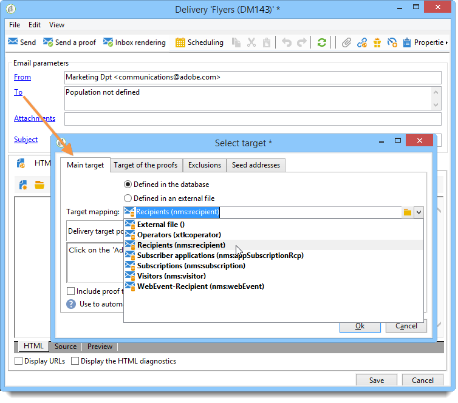

# Selezionare una mappatura di destinazione{#selecting-a-target-mapping}

Per impostazione predefinita, i modelli di consegna sono target **[!UICONTROL Recipients]**. La loro mappatura target utilizza quindi i campi del **nms:destinatario** tabella. Adobe Campaign offre altre mappature di destinazione per le consegne, da utilizzare in base alle tue esigenze.

Queste mappature sono le seguenti:

| Nome | Utilizzare | Schema standard |
|---|---|---|
| Destinatari | Consegna ai destinatari del database di Adobe Campaign | nms:recipient |
| Visitatori | Distribuisci ai visitatori i cui profili sono stati raccolti tramite riferimento (marketing virale) o tramite social network (Facebook, X, precedentemente noto come Twitter), ad esempio. | mns:visitor |
| Abbonamenti | Consegnare ai destinatari abbonati o iscritti a un servizio informativo, ad esempio una newsletter | nms:subscription |
| Abbonamenti visitatore | Consegnare ai visitatori abbonati o iscritti a un servizio informativo | nms:visitorSub |
| Servizio | Pubblicare su un account X o su una pagina Facebook | nms:service |
| Operatori | Consegnare agli operatori Adobe Campaign | nms:operator |
| File esterno | Consegnare tramite un file contenente tutte le informazioni necessarie per la consegna | Nessuno schema collegato, nessuna destinazione immessa |

>[!NOTE]
>
>Puoi anche creare nuove mappature di destinazione. Questa operazione è riservata agli utenti esperti. Per ulteriori informazioni, consulta [questa sezione](../../configuration/using/target-mapping.md).
