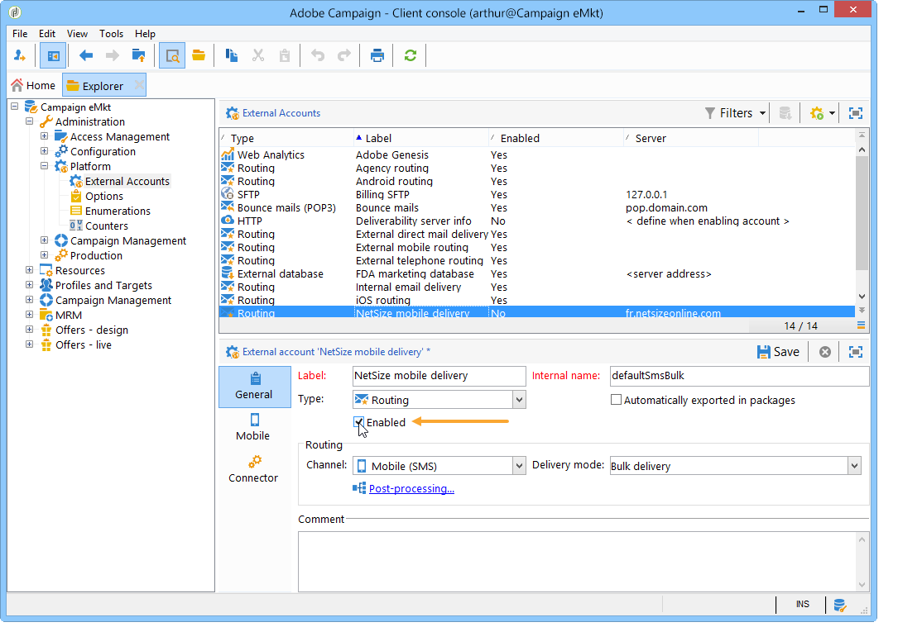

# Canale SMS{#sms-channel}

Adobe Campaign consente di eseguire consegne personalizzate di massa di messaggi SMS. I profili dei destinatari devono contenere almeno un numero di telefono cellulare.

>[!NOTE]
>
>Adobe Campaign consente inoltre di inviare notifiche sui terminali mobili tramite l&#39;opzione Canale app mobile (NMAC) **di** Adobe Campaign.
> 
>Per ulteriori informazioni, consulta la sezione [Informazioni sul canale](../../delivery/using/about-mobile-app-channel.md) dell’app mobile.

Le sezioni seguenti forniscono informazioni specifiche per il canale SMS. Per informazioni globali su come creare una consegna, consulta[questa sezione](../../delivery/using/steps-about-delivery-creation-steps.md).

## Configurazione del canale SMS {#setting-up-sms-channel}

Per inviare a un telefono cellulare, è necessario:

1. Un account esterno che specifica un connettore e il tipo di messaggio.

   I connettori disponibili sono: NetSize, SMPP generico (SMPP versione 3.4 che supporta la modalità binaria), Sybase365 (SAP SMS 365), CLX Communications, Tele2, O2 e Extended SMPP generico.

1. Un modello di consegna in cui viene fatto riferimento a questo account esterno.

### Attivazione di un account esterno {#activating-an-external-account}

L&#39;elenco degli account esterni si trova nel nodo **[!UICONTROL Platform]** > **[!UICONTROL External accounts]** della struttura di esplorazione di Adobe Campaign.

* Ad esempio, passate all&#39;account predefinito denominato **[!UICONTROL NetSize mobile delivery]**.
* Nella **[!UICONTROL General]** scheda, selezionare la **[!UICONTROL Enabled]** casella.

   

* Verificare che l&#39; **[!UICONTROL Mobile]** opzione sia selezionata per il **[!UICONTROL Channel]** campo.
* Nella **[!UICONTROL Mobile]** scheda, selezionare un connettore dall&#39;elenco a discesa: NetSize, SMPP generico, Sybase365 (SAP SMS 365), comunicazioni CLX, Tele2, O2 o SMPP generico esteso. Per ulteriori informazioni sul connettore SMPP generico esteso, fare riferimento alla sezione [Creazione di un account](#creating-an-smpp-external-account) esterno SMPP.

   

* Configurare il connettore in base alle informazioni fornite dal fornitore. Nell&#39;esempio seguente, l&#39;operatore è NetSize.

   

* Nella **[!UICONTROL Connector]** scheda, lasciate selezionata la modalità di **[!UICONTROL Call Web Service]** attivazione per impostazione predefinita.

   

* Se viene visualizzata la **[!UICONTROL Connector]** scheda, specificate l&#39;URL di accesso per il connettore. L&#39;indirizzo deve terminare in **netsize.jsp** se il provider è NetSize. Per tutti gli altri connettori, l&#39;indirizzo URL termina in **smpp34.jsp**.

### Creazione di un account esterno SMPP {#creating-an-smpp-external-account}

Se desiderate utilizzare il protocollo SMPP, potete anche creare un nuovo account esterno.

Per ulteriori informazioni sul protocollo e sulle impostazioni SMS, consultare questa nota [tecnica](https://helpx.adobe.com/campaign/kb/sms-connector-protocol-and-settings.html).

A questo scopo, attenetevi alla procedura seguente:

1. Nel nodo **[!UICONTROL Platform]** > **[!UICONTROL External accounts]** della struttura ad albero, fate clic sull&#39; **[!UICONTROL New]** icona.
1. Definite il tipo di account come **Routing**, il canale come **Mobile (SMS)** e la modalità di consegna come consegna **in** blocco.

   

1. Controlla la **[!UICONTROL Enabled]** casella.
1. Nella **[!UICONTROL Mobile]** scheda, selezionare **[!UICONTROL Extended generic SMPP]** dall&#39;elenco a **[!UICONTROL Connector]** discesa.

   

   L&#39; **[!UICONTROL Enable verbose SMPP traces in the log file]** opzione consente di scaricare tutto il traffico SMPP nei file di registro. Questa opzione deve essere abilitata per la risoluzione dei problemi del connettore e per il confronto con il traffico rilevato dal provider.

1. Contatta il tuo provider di servizi SMS che ti spiegherà come completare i diversi campi dell&#39;account esterno dalla **[!UICONTROL Connection settings]** scheda.

   Quindi, contattate il vostro fornitore, a seconda di quello scelto, che vi darà il valore da immettere nel **[!UICONTROL SMSC implementation name]** campo.

   È possibile definire il numero di connessioni al provider per figlio MTA. Per impostazione predefinita, è impostata su 1.

1. Per impostazione predefinita, il numero di caratteri in un SMS soddisfa gli standard GSM.

   I messaggi SMS che utilizzano la codifica GSM sono limitati a 160 caratteri, o 153 caratteri per SMS per i messaggi inviati in più parti.

   >[!NOTE]
   >
   >Alcuni caratteri contano come due (parentesi quadre, simboli dell&#39;euro, ecc.).
   >
   >L&#39;elenco dei caratteri GSM disponibili è presentato di seguito.

   Se lo desideri, puoi autorizzare la traslazione dei caratteri selezionando la casella corrispondente.

   

   For more on this, refer to [this section](#about-character-transliteration).

1. Nella **[!UICONTROL Throughput and delays]** scheda, puoi specificare la velocità massima di trasmissione dei messaggi in uscita (&quot;MT&quot;, Mobile Terminated) in MT al secondo. Se si inserisce &quot;0&quot; nel campo corrispondente, la velocità effettiva sarà illimitata.

   I valori di tutti i campi corrispondenti alle durate devono essere completati in secondi.

1. Nella **[!UICONTROL Mapping of encodings]** scheda è possibile definire le codifiche.

   For more on this, refer to [this section](#about-text-encodings).

1. Nella **[!UICONTROL SMSC specificities]** scheda, l&#39; **[!UICONTROL Send full phone number]** opzione è disabilitata per impostazione predefinita. Non attivarla se si desidera rispettare il protocollo SMPP e trasferire solo cifre al server del provider SMS (SMSC).

   Tuttavia, dato che alcuni provider richiedono l&#39;uso del prefisso &quot;+&quot;, si consiglia di consultare il provider e si consiglia di abilitare questa opzione, se necessario.

   La **[!UICONTROL Enable TLS over SMPP]** casella di controllo consente di crittografare il traffico SMPP. Per ulteriori informazioni, consultare questa nota [](https://helpx.adobe.com/campaign/kb/sms-connector-protocol-and-settings.html)tecnica.

1. Se si sta configurando un **[!UICONTROL Extended generic SMPP]** connettore, è possibile impostare le risposte automatiche.

   For more on this, refer to [this section](#automatic-reply).

### Informazioni sulla traslitterazione dei caratteri {#about-character-transliteration}

La traslitterazione dei caratteri può essere impostata in un account esterno SMPP mobile delivery, nella **[!UICONTROL Mobile]** scheda.

La traslitterazione consiste nel sostituire un carattere di un SMS con un altro quando tale carattere non è preso in considerazione dallo standard GSM.

* Se la traslitterazione è **[!UICONTROL authorized]**, ogni carattere non preso in considerazione viene sostituito da un carattere GSM al momento dell&#39;invio del messaggio. Ad esempio, la lettera &quot;ë&quot; è sostituita da &quot;e&quot;. Il messaggio viene quindi leggermente modificato, ma il limite di caratteri rimane lo stesso.
* Quando la traslitterazione è **[!UICONTROL not authorized]**, ogni messaggio che contiene caratteri non presi in considerazione viene inviato in formato binario (Unicode): tutti i caratteri vengono quindi inviati così come sono. Tuttavia, i messaggi SMS che utilizzano Unicode sono limitati a 70 caratteri (o 67 caratteri per SMS per i messaggi inviati in più parti). Se viene superato il numero massimo di caratteri, verranno inviati diversi messaggi, il che potrebbe comportare costi aggiuntivi.

>[!IMPORTANT]
>
>L&#39;inserimento di campi di personalizzazione nel contenuto del messaggio SMS potrebbe introdurre caratteri che non vengono presi in considerazione dalla codifica GSM.

Per impostazione predefinita, la traslazione dei caratteri è disabilitata. Se si desidera che tutti i caratteri nei messaggi SMS siano mantenuti invariati, per non modificare ad esempio i nomi propri, si consiglia di non abilitare questa opzione.

Tuttavia, se i messaggi SMS contengono molti caratteri che generano messaggi Unicode, è possibile abilitare questa opzione per limitare i costi di invio dei messaggi.

Nella tabella seguente sono riportati i caratteri presi in considerazione dallo standard GSM. Tutti i caratteri inseriti nel corpo del messaggio, diversi da quelli indicati di seguito, convertono l&#39;intero messaggio in formato binario (Unicode) e quindi lo limitano a 70 caratteri.

**Caratteri base**

<table> 
 <tbody> 
  <tr> 
   <td> @ </td> 
   <td>  </td> 
   <td> SP </td> 
   <td> 0 </td> 
   <td> ¡ </td> 
   <td> P </td> 
   <td> ¿ </td> 
   <td> p </td> 
  </tr> 
  <tr> 
   <td> £ </td> 
   <td> _ </td> 
   <td> ! </td> 
   <td> 1 </td> 
   <td> A </td> 
   <td> Q </td> 
   <td> a </td> 
   <td> q </td> 
  </tr> 
  <tr> 
   <td> $ </td> 
   <td>  </td> 
   <td> " </td> 
   <td> 2 </td> 
   <td> B </td> 
   <td> R </td> 
   <td> b </td> 
   <td> r </td> 
  </tr> 
  <tr> 
   <td> ¥ </td> 
   <td>  </td> 
   <td> # </td> 
   <td> 3 </td> 
   <td> C </td> 
   <td> S </td> 
   <td> c </td> 
   <td> s </td> 
  </tr> 
  <tr> 
   <td> è </td> 
   <td>  </td> 
   <td> ¤ </td> 
   <td> 4 </td> 
   <td> D </td> 
   <td> T </td> 
   <td> d </td> 
   <td> t </td> 
  </tr> 
  <tr> 
   <td> é </td> 
   <td>  </td> 
   <td> % </td> 
   <td> 5 </td> 
   <td> E </td> 
   <td> U </td> 
   <td> e </td> 
   <td> u </td> 
  </tr> 
  <tr> 
   <td> ù </td> 
   <td>  </td> 
   <td> &amp; </td> 
   <td> 6 </td> 
   <td> F </td> 
   <td> V </td> 
   <td> f </td> 
   <td> v </td> 
  </tr> 
  <tr> 
   <td> ì </td> 
   <td>  </td> 
   <td> ' </td> 
   <td> 7 </td> 
   <td> G </td> 
   <td> W </td> 
   <td> g </td> 
   <td> w </td> 
  </tr> 
  <tr> 
   <td> ò </td> 
   <td>  </td> 
   <td> ( </td> 
   <td> 8 </td> 
   <td> H </td> 
   <td> X </td> 
   <td> h </td> 
   <td> x </td> 
  </tr> 
  <tr> 
   <td> OA </td> 
   <td>  </td> 
   <td> ) </td> 
   <td> 9 </td> 
   <td> I </td> 
   <td> Y </td> 
   <td> i </td> 
   <td> y </td> 
  </tr> 
  <tr> 
   <td> LF </td> 
   <td>  </td> 
   <td> * </td> 
   <td> : </td> 
   <td> J </td> 
   <td> Z </td> 
   <td> j </td> 
   <td> z </td> 
  </tr> 
  <tr> 
   <td> Ø </td> 
   <td> ESC </td> 
   <td> + </td> 
   <td> ; </td> 
   <td> K </td> 
   <td> Execute </td> 
   <td> k </td> 
   <td> ä </td> 
  </tr> 
  <tr> 
   <td> ø </td> 
   <td> AE </td> 
   <td> , </td> 
   <td> &lt; </td> 
   <td> L </td> 
   <td> Ö </td> 
   <td> l </td> 
   <td> ö </td> 
  </tr> 
  <tr> 
   <td> CR </td> 
   <td> æ </td> 
   <td> - </td> 
   <td> = </td> 
   <td> M </td> 
   <td> question </td> 
   <td> m </td> 
   <td> D </td> 
  </tr> 
  <tr> 
   <td> ank </td> 
   <td> ß </td> 
   <td> . </td> 
   <td> &gt; </td> 
   <td> N </td> 
   <td> ü </td> 
   <td> n </td> 
   <td> ü </td> 
  </tr> 
  <tr> 
   <td> å </td> 
   <td> É </td> 
   <td> / </td> 
   <td> ? </td> 
   <td> O </td> 
   <td> § </td> 
   <td> o </td> 
   <td> à </td> 
  </tr> 
 </tbody> 
</table>

SP: Space

ESC: Esc

LF: Avanzamento riga

CR: Ritorno a capo

**Caratteri avanzati (contati due volte)**

^ { } `[ ~ ]` | €

### Informazioni sulle codifiche di testo {#about-text-encodings}

Quando invii un messaggio SMS, Adobe Campaign può utilizzare una o più codifiche di testo. Ogni codifica ha un set di caratteri specifico e determina il numero di caratteri che possono essere inclusi in un messaggio SMS.

Quando si configura un nuovo account esterno per la distribuzione di dispositivi mobili SMPP, è possibile definire il contenuto **[!UICONTROL Mapping of encodings]** nella **[!UICONTROL Mobile]** scheda: il **[!UICONTROL data_coding]** campo consente ad Adobe Campaign di comunicare quale codifica viene utilizzata per SMSC.

>[!NOTE]
>
>La mappatura tra il valore **data_coding** e la codifica effettivamente utilizzata è standardizzata. Tuttavia, alcuni SMSC hanno una propria mappatura specifica: in questo caso, l&#39;amministratore di **Adobe Campaign** deve dichiarare questa mappatura. Consultate il vostro fornitore per saperne di più.

È possibile dichiarare **data_codings** e forzare la codifica, se necessario: a tal fine, specificate una singola codifica nella tabella.

* Quando non viene definita alcuna mappatura delle codifiche, il connettore assume un comportamento generico:

   * Proverà a utilizzare la codifica GSM a cui assegna il valore **data_coding = 0**.
   * Se la codifica GSM non riesce, utilizzerà la codifica **UCS2** a cui assegna il valore **data_coding = 8**.

* Quando definisci le codifiche che desideri utilizzare e i valori dei **[!UICONTROL data_coding]** campi collegati, Adobe Campaign cercherà di utilizzare la prima codifica nell&#39;elenco, quindi quanto segue, se la prima codifica risulta impossibile.

>[!IMPORTANT]
>
>L&#39;ordine di dichiarazione è importante: si consiglia di inserire l&#39;elenco in ordine crescente **di costo** per favorire le codifiche che consentono di contenere il maggior numero possibile di caratteri in ogni messaggio SMS.
>
>Dichiarare solo le codifiche che si desidera utilizzare. Se alcune delle codifiche fornite dal SMSC non corrispondono al vostro scopo di utilizzo, non dichiararle nell&#39;elenco.

### Risposta automatica {#automatic-reply}

Quando si configura un connettore SMPP generico esteso, è possibile configurare le risposte automatiche.

Quando un utente iscritto risponde a un messaggio SMS inviato tramite Adobe Campaign e il suo messaggio contiene una parola chiave come &quot;STOP&quot;, puoi configurare i messaggi che vengono automaticamente inviati di nuovo nella **[!UICONTROL Automatic reply sent to the MO]** sezione.

>[!NOTE]
>
>Le parole chiave non fanno distinzione tra maiuscole e minuscole.

Per ogni parola chiave, specificate un codice breve, che è un numero utilizzato di solito per inviare le consegne e fungerà da nome del mittente, quindi immettete il messaggio che verrà inviato al sottoscrittore.

Potete anche collegare un’azione alla risposta automatica: **[!UICONTROL Send to quarantine]** o **[!UICONTROL Remove from quarantine]**. Ad esempio, se un destinatario invia la parola chiave &quot;STOP&quot;, riceverà automaticamente una conferma di annullamento dell&#39;iscrizione e verrà inviata alla quarantena.


Se collegate l’ **[!UICONTROL Remove from quarantine]** azione a una risposta automatica, i destinatari che inviano la parola chiave corrispondente vengono automaticamente rimossi dalla quarantena.

I destinatari sono elencati nella **[!UICONTROL Non deliverables and addresses]** tabella disponibile dal menu **[!UICONTROL Administration]** > **[!UICONTROL Campaign Management]** > **[!UICONTROL Non deliverables Management]** .

* Per inviare la stessa risposta indipendentemente dal codice breve, lasciare vuota la **[!UICONTROL Short code]** colonna.
* Per inviare la stessa risposta indipendentemente dalla parola chiave, lasciare vuota la **[!UICONTROL Keyword]** colonna.
* Per eseguire un&#39;azione senza inviare una risposta, lasciare vuota la **[!UICONTROL Response]** colonna. Ad esempio, questo consente di rimuovere dalla quarantena un utente che risponde con un messaggio diverso da &quot;STOP&quot;.

Se si dispone di più account esterni utilizzando il connettore SMPP generico esteso con lo stesso account provider, potrebbe verificarsi il seguente problema: quando invii una risposta a un codice breve, potrebbe essere ricevuta su una qualsiasi delle tue connessioni di account esterne. Di conseguenza, la risposta automatica inviata non poteva essere il messaggio previsto.
Per evitare questo problema, applicate una delle seguenti soluzioni, a seconda del provider in uso:
* Create un account fornitore per ciascun account esterno.
* Utilizzare il **[!UICONTROL System type]** campo della scheda **[!UICONTROL Mobile]** > **[!UICONTROL Connection settings]** per distinguere ciascun codice breve. Chiedete al vostro fornitore un valore diverso per ciascun account.

   

I passaggi per la configurazione di un account esterno tramite il connettore SMPP generico esteso sono descritti nella sezione [Creazione di un account](../../delivery/using/sms-channel.md#creating-an-smpp-external-account) esterno SMPP.

### Modifica del modello di consegna {#changing-the-delivery-template}

Adobe Campaign ti offre un modello per la distribuzione a dispositivi mobili. Questo modello è disponibile nel **[!UICONTROL Resources > Templates > Delivery templates]** nodo. Per ulteriori informazioni, consultare la sezione [Informazioni sui modelli](../../delivery/using/about-templates.md) .

Per distribuire tramite canale SMS, è necessario creare un modello in cui viene fatto riferimento al connettore del canale.

Per mantenere il modello di consegna nativo, si consiglia di duplicarlo e configurarlo.

Nell&#39;esempio seguente, creiamo un modello per inviare messaggi tramite l&#39;account NetSize abilitato in precedenza. Per eseguire questa operazione:

1. Vai al **[!UICONTROL Delivery templates]** nodo.
1. Fare clic con il pulsante destro del mouse sul **[!UICONTROL Send to mobiles]** modello e selezionare **[!UICONTROL Duplicate]**.

   

1. Modificate l’etichetta del modello.

   

1. Clic **[!UICONTROL Properties]**.
1. Nella **[!UICONTROL General]** scheda, selezionare una modalità di routing che corrisponda a un account esterno configurato, ad esempio **[!UICONTROL NetSize mobile delivery]**.

   

1. Fate clic **[!UICONTROL Save]** per creare il modello.

   

Ora disponete di un account esterno e di un modello di consegna che vi consente di distribuire tramite SMS.

## Creazione di un invio SMS {#creating-a-sms-delivery}

### Selezione del canale di consegna {#selecting-the-delivery-channel}

Per creare una nuova consegna SMS, segui i passaggi seguenti:

>[!NOTE]
>
>In [questa sezione](../../delivery/using/steps-about-delivery-creation-steps.md)vengono illustrati i concetti globali relativi alla creazione dei contenuti.

1. Create una nuova consegna, ad esempio dal dashboard Consegna.
1. Selezionate il modello di consegna **[!UICONTROL Send to mobiles (NetSize)]** creato in precedenza. Per ulteriori informazioni, consulta la sezione [Modifica del modello](#changing-the-delivery-template) di consegna.

   

1. Identifica la consegna con un&#39;etichetta, un codice e una descrizione. For more on this, refer to [this section](../../delivery/using/steps-create-and-identify-the-delivery.md#identifying-the-delivery).
1. Fai clic **[!UICONTROL Continue]** per confermare queste informazioni e visualizzare la finestra di configurazione del messaggio.

## Definizione del contenuto SMS {#defining-the-sms-content}

Per creare il contenuto dell&#39;SMS, procedere come segue:

1. Immettete il contenuto del messaggio nella **[!UICONTROL Text content]** sezione della procedura guidata. I pulsanti della barra degli strumenti consentono di importare, salvare o cercare contenuti. L&#39;ultimo pulsante viene utilizzato per inserire campi di personalizzazione.

   

   L’uso dei campi di personalizzazione è presentato nella sezione [Informazioni sulla personalizzazione](../../delivery/using/about-personalization.md) .

1. Fai clic **[!UICONTROL Preview]** nella parte inferiore della pagina per visualizzare il rendering del messaggio con la relativa personalizzazione. Per avviare l&#39;anteprima, seleziona un destinatario utilizzando il **[!UICONTROL Test personalization]** pulsante nella barra degli strumenti. Puoi selezionare un destinatario dalle destinazioni definite o scegliere un altro destinatario.

   

   Puoi approvare il messaggio SMS. È inoltre possibile visualizzare il contenuto dell&#39;SMS sullo schermo del telefono cellulare visualizzato a destra dell&#39;editor di contenuti. Fare clic sullo schermo e utilizzare il mouse per scorrere il contenuto.

   

1. Fare clic sul **[!UICONTROL Data loaded]** collegamento per visualizzare le informazioni relative al destinatario.

   

   >[!NOTE]
   >
   >I messaggi SMS possono contenere un massimo di 160 caratteri se viene utilizzata la tabella codici Latin-1 (ISO-8859-1). Se il messaggio è scritto in Unicode, non deve superare i 70 caratteri. Alcuni caratteri speciali possono influenzare la lunghezza del messaggio. Per ulteriori informazioni sulla lunghezza del messaggio, consulta la sezione [Informazioni sulla traslitterazione](#about-character-transliteration) dei caratteri.
   >
   >Quando sono presenti campi di personalizzazione o campi di contenuto condizionale, le dimensioni del messaggio variano da un destinatario all&#39;altro. La lunghezza del messaggio deve essere valutata al momento della personalizzazione.
   >
   >Quando avviate l&#39;analisi, la lunghezza dei messaggi viene controllata e viene visualizzato un avviso in caso di overflow.

1. Se si utilizza il connettore NetSize o un connettore SMPP, è possibile personalizzare il nome del mittente della consegna. Per ulteriori informazioni, consulta la sezione Parametri [](#advanced-parameters) avanzati.

## Selezione della popolazione di destinazione {#selecting-the-target-population}

Il processo dettagliato per la selezione della popolazione di destinazione di una consegna è presentato in [questa sezione](../../delivery/using/steps-defining-the-target-population.md).

Per ulteriori informazioni sull’uso dei campi di personalizzazione, consulta [Informazioni sulla personalizzazione](../../delivery/using/about-personalization.md).

Per ulteriori informazioni sull&#39;inclusione di un elenco di sementi, vedere [Informazioni sugli indirizzi](../../delivery/using/about-seed-addresses.md)di sementi.

## Invio di messaggi SMS {#sending-sms-messages}

Per approvare il messaggio e inviarlo ai destinatari della consegna che si sta creando, fai clic su **[!UICONTROL Send]**.

La procedura dettagliata per la convalida e l&#39;invio di una consegna è descritta nelle sezioni seguenti:

* [Convalida della consegna](../../delivery/using/steps-validating-the-delivery.md)
* [Invio della consegna](../../delivery/using/steps-sending-the-delivery.md)

### Parametri avanzati {#advanced-parameters}

Il **[!UICONTROL Properties]** pulsante consente di accedere al parametro di consegna avanzato. I parametri specifici per le consegne via SMS si trovano nella **[!UICONTROL SMS parameters]** sezione della **[!UICONTROL Delivery]** scheda.

Sono disponibili le seguenti opzioni:

* **Indirizzo** mittente (solo per i connettori NetSize e SMPP): consente di personalizzare il nome del mittente della consegna utilizzando una stringa di caratteri alfanumerici limitati a undici caratteri. Il campo non deve essere costituito esclusivamente da cifre. È possibile definire una condizione per visualizzare, ad esempio, nomi diversi in base al codice dell&#39;area del destinatario:

   ```
   <% if( String(recipient.mobilePhone).indexOf("+1") == 0){ %>NeoShopUS<%} else %>
   ```

   >[!IMPORTANT]
   >
   >Controlla la legge del tuo paese riguardo alla modifica dei nomi dei mittente. È inoltre necessario verificare con l&#39;operatore se questa funzionalità è disponibile.

* **Modalità** di trasmissione: trasmissione di messaggi via SMS.
* **Priorità**: livello di importanza assegnato a un messaggio. **[!UICONTROL Normal]** la priorità è selezionata per impostazione predefinita. Chiedete al vostro fornitore di servizi il costo degli SMS inviati con **[!UICONTROL High]** priorità.
* **Tipo di applicazione**: scegli l&#39;applicazione che desideri assegnare al tuo SMS. L’ **[!UICONTROL Direct Marketing]** opzione è selezionata per impostazione predefinita ed è la più comune utilizzata.

**Parametri specifici per il connettore NetSize**


* **Utilizza diversi SMS per un singolo messaggio**: questo consente di inviare un messaggio lungo più di 160 caratteri tramite diversi messaggi SMS.

**Parametri specifici per un connettore SMPP**


* **Numero massimo di SMS per messaggio**: questa opzione consente di impostare il numero di SMS da utilizzare per inviare un messaggio. Se il numero è impostato su 0, è possibile utilizzare un SMS per inviare il messaggio. Se ad esempio il numero di SMS è impostato su 1 o 2 e il messaggio supera tale soglia, non verrà inviato.

## Monitoraggio e monitoraggio delle consegne mediante SMS {#monitoring-and-tracking-sms-deliveries}

Dopo aver inviato i messaggi, puoi monitorare e tenere traccia delle consegne. Per ulteriori informazioni, consulta le sezioni seguenti:

* [Monitoraggio di una consegna](../../delivery/using/monitoring-a-delivery.md)
* [Informazioni sugli errori di consegna](../../delivery/using/understanding-delivery-failures.md)
* [Informazioni sul tracciamento dei messaggi](../../delivery/using/about-message-tracking.md)

## Elaborazione dei messaggi in entrata {#processing-inbound-messages}

Il modulo **nlserver sms** invia una query al router SMS a intervalli regolari. Questo consente ad Adobe Campaign di monitorare l&#39;avanzamento delle consegne e di gestire i rapporti sullo stato e le richieste di annullamento dell&#39;iscrizione del destinatario.

* **Rapporti** di stato: visualizza i registri di consegna per verificare lo stato dei messaggi.

   >[!NOTE]
   >
   >Ogni SMS inviato è collegato a un account esterno la sua chiave primaria. In questo modo:
   >
   > * I report di stato da un account SMS esterno eliminato non vengono elaborati correttamente.
   > * Un account SMS può essere collegato a un solo account esterno per garantire che i rapporti sullo stato siano attribuiti all&#39;account corretto


* **Annullamento sottoscrizione**: i destinatari che desiderano interrompere la ricezione di SMS possono restituire un messaggio contenente la parola STOP. Se il tuo provider lo consente in base ai termini del contratto, puoi recuperare i messaggi tramite l&#39;attività flusso di lavoro SMS **** in entrata e quindi creare una query per abilitare l&#39;opzione **Non contattare più il destinatario** per i destinatari interessati.

   Fare riferimento alla guida [Flussi](../../workflow/using/architecture.md) di lavoro.

## Schema InSMS {#insms-schema}

Lo schema InSMS contiene informazioni relative agli SMS in arrivo. Una descrizione di questi campi è disponibile tramite l&#39;attributo desc.

* **messaggio**: contenuto dell&#39;SMS ricevuto.
* **origine**: numero mobile all’origine del messaggio.
* **providerId**: identificatore del messaggio restituito dal SMSC (message center).
* **create**: il messaggio data in arrivo è stato inserito in Adobe Campaign.
* **extAccount**: Account esterno di Adobe Campaign.

   >[!IMPORTANT]
   >
   >I campi seguenti sono specifici di NetSize.
   >
   >Se l&#39;operatore in uso non è NetSize, questi campi sono considerati vuoti.

* **alias**: alias del messaggio in arrivo.
* **separatore**: separatore tra l&#39;alias e il corpo del messaggio.
* **messageDate**: data del messaggio data dall&#39;operatore.
* **ricevutaData**: il messaggio data dall&#39;operatore è stato ricevuto da SMSC (message center).
* **deliveryDate**: messaggio data inviato da SMSC (message center).
* **largeAccount**: codice account cliente collegato a SMS in arrivo.
* **countryCode**: codice del paese dell&#39;operatore.
* **operatorCode**: codice di rete dell&#39;operatore.
* **linkedSmsId**: Identificatore di Adobe Campaign (BroadlogId) collegato all&#39;SMS in uscita, dove questo SMS è la risposta.

## Gestione delle risposte automatiche (regolamento americano) {#managing-automatic-replies--american-regulation-}

Quando gli abbonati rispondono a un messaggio SMS che è stato loro inviato tramite Adobe Campaign e utilizzano una parola chiave come STOP, HELP o YES, è necessario, nel mercato statunitense, configurare i messaggi che vengono automaticamente restituiti.

Ad esempio, se i destinatari inviano la parola chiave STOP, riceveranno automaticamente un messaggio di conferma in cui si attesta che sono stati annullati la sottoscrizione.

Il nome del mittente per questo tipo di messaggio è un codice breve di solito utilizzato per inviare le consegne.

>[!IMPORTANT]
>
>La seguente procedura dettagliata è valida solo per i connettori SMPP, ad eccezione del connettore SMPP generico esteso. Per ulteriori informazioni, consultare la sezione [Creazione di un account](#creating-an-smpp-external-account) esterno SMPP.
>
>Essa fa parte del processo di certificazione effettuato dagli operatori americani per le campagne di commercializzazione negli Stati Uniti. Queste risposte ai messaggi SMS dell&#39;abbonato contenenti la parola chiave devono essere inviate all&#39;abbonato subito dopo aver ricevuto un messaggio.

1. Create questo tipo di file XML:

   ```
   <autoreply>
     <shortcode name="12345">
       <reply keyword="STOP" text="You will not receive SMS anymore" />
       <reply keyword="HELP" text="Powered by Adobe Campaign" />
     </shortcode>
     <shortcode name="43115">
       <reply keyword="STOP" text="Vous ne recevrez plus de SMS" />
       <reply keyword="HELP" text="Service rendu par Adobe Campaign" />
     </shortcode>
     <shortcode name="*">
       <reply keyword="ADOBE" text="This text is replied when you send ADOBE to any short code" />
     </shortcode>
   </autoreply>
   ```

1. Per l&#39;attributo **name** del **`<shortcode>`** tag , specificate il codice breve che verrà visualizzato al posto del nome del mittente del messaggio.

   In ciascun **`<reply>`** tag, inserite l&#39;attributo **parola chiave** con una parola chiave e l&#39;attributo **testo** con il messaggio che desiderate inviare per questa parola chiave.

   >[!NOTE]
   >
   >Ogni parola chiave deve essere scritta in lettere maiuscole.

   Se si desidera inviare lo stesso messaggio per più parole chiave, duplicare la riga corrispondente.

   Ad esempio:

   ```
   <reply keyword="STOP" text="You will not receive SMS anymore" />
   <reply keyword="QUIT" text="You will not receive SMS anymore" />
   ```

1. Al termine, salvare il file con il nome **smsAutoReply.xml**.

   Il nome del file distingue tra maiuscole e minuscole in Linux.

1. Copiate questo file nella directory **conf** di Adobe Campaign, nello stesso punto del server Web.

>[!IMPORTANT]
>
>Questi tipi di messaggi automatici non mantengono una cronologia. Pertanto, non vengono visualizzati nel dashboard [di](../../delivery/using/monitoring-a-delivery.md#delivery-dashboard)distribuzione.
>
>Questi messaggi non rientrano nelle norme [commerciali sulla pressione](../../campaign/using/pressure-rules.md).
