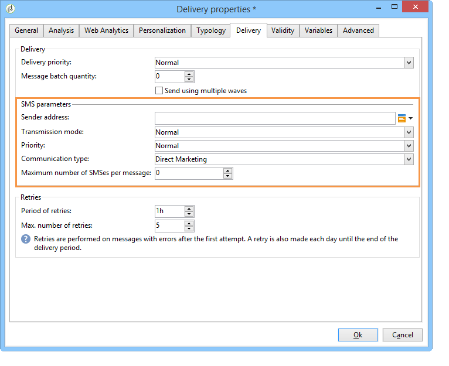

# Inviare, monitorare e tenere traccia delle consegne SMS{#sms-properties}


## Inviare messaggi SMS {#sending-sms-messages}

Per approvare il messaggio e inviarlo ai destinatari della consegna in fase di creazione, fai clic su **[!UICONTROL Send]**.

Il processo dettagliato di convalida e invio di una consegna è presentato nelle sezioni seguenti:

* [Convalidare la consegna](steps-validating-the-delivery.md)
* [Inviare la consegna](steps-sending-the-delivery.md)

## Parametri avanzati {#advanced-parameters}

La **[!UICONTROL Properties]** consente di accedere al parametro di consegna avanzato. I parametri specifici delle consegne SMS si trovano nella **[!UICONTROL SMS parameters]** della sezione **[!UICONTROL Delivery]** scheda .

Sono disponibili le seguenti opzioni:

* **Indirizzo mittente**: ti consente di personalizzare il nome del mittente della consegna utilizzando una stringa di caratteri alfanumerici limitati a undici caratteri. Il campo non deve essere costituito esclusivamente da cifre. È possibile definire una condizione per visualizzare, ad esempio, nomi diversi in base al codice dell’area del destinatario:

   ```
   <% if( String(recipient.mobilePhone).indexOf("+1") == 0){ %>NeoShopUS<%} else %>
   ```

   >[!IMPORTANT]
   >
   >Controlla le leggi del tuo paese riguardo alla modifica dei nomi dei mittenti. È inoltre necessario verificare con l’operatore se offre questa funzionalità.

* **Modalità di trasmissione**: trasmissione di messaggi tramite SMS.
* **Priorità**: livello di importanza assegnato a un messaggio. **[!UICONTROL Normal]** la priorità è selezionata per impostazione predefinita. Chiedi al tuo provider di servizi il costo degli SMS inviati con **[!UICONTROL High]** priorità.
* **Tipo di applicazione**: scegli l’applicazione che desideri assegnare alla consegna SMS. La **[!UICONTROL Direct Marketing]** è selezionata per impostazione predefinita ed è la più comune utilizzata.

**Parametri specifici del connettore NetSize**


* **Utilizza diversi SMS per un singolo messaggio**: questo ti consente di inviare un messaggio lungo più di 160 caratteri tramite diversi messaggi SMS.

**Parametri specifici di un connettore SMPP**



* **Numero massimo di SMS per messaggio**: questa opzione ti consente di impostare il numero di SMS da utilizzare per inviare un messaggio. Se il numero è impostato su 0, puoi utilizzare un SMS per inviare il messaggio. Se il numero di SMS è impostato ad esempio su 1 o 2 e il messaggio supera questa soglia, non verrà inviato.

## Monitorare e monitorare gli SMS {#monitoring-and-tracking-sms-deliveries}

Dopo aver inviato i messaggi, puoi monitorare e tenere traccia delle consegne. Per ulteriori informazioni, consulta queste sezioni:

* [Monitorare una consegna](about-delivery-monitoring.md)
* [Errori di consegna](understanding-delivery-failures.md)
* [Informazioni sul tracciamento dei messaggi](about-message-tracking.md)

## Elabora messaggi in entrata {#processing-inbound-messages}

La **sms nlserver** Il modulo invia query al router SMS a intervalli regolari. Questo consente ad Adobe Campaign di tenere traccia dell’avanzamento delle consegne e di gestire i rapporti sullo stato e le richieste di annullamento dell’abbonamento ai destinatari.

* **Rapporti sullo stato**: visualizza i registri di consegna per controllare lo stato dei messaggi.

   >[!NOTE]
   >
   >Ogni SMS inviato è collegato a un account esterno la sua chiave primaria. In questo modo:
   >
   > * I rapporti di stato da un account SMS esterno eliminato non vengono elaborati correttamente.
   > * Un account SMS può essere collegato solo a un singolo account esterno per garantire che i rapporti di stato siano attribuiti all’account corretto


* **Annullamento dell’abbonamento**: i destinatari che desiderano interrompere la ricezione delle consegne SMS possono restituire un messaggio contenente la parola STOP. Se il tuo provider lo consente ai termini del contratto, puoi recuperare i messaggi tramite il **SMS in entrata** attività del flusso di lavoro e quindi crea una query per abilitare il **Non contatta più questo destinatario** opzione per i beneficiari interessati.

   Fai riferimento a [Flussi di lavoro](../../workflow/using/architecture.md) guida.

## Schema InSMS {#insms-schema}

Lo schema InSMS contiene informazioni relative agli SMS in arrivo. Una descrizione di questi campi è disponibile tramite l’attributo desc .

* **message**: contenuto dell’SMS ricevuto.
* **origine**: numero di cellulare all’origine del messaggio.
* **providerId**: identificatore del messaggio restituito da SMSC (message center).
* **creato**: il messaggio data in arrivo è stato inserito in Adobe Campaign.
* **extAccount**: Account esterno Adobe Campaign.

   >[!IMPORTANT]
   >
   >I campi seguenti sono specifici di NetSize.
   >
   >Se l&#39;operatore in uso non è NetSize, questi campi sono considerati vuoti.

* **alias**: alias del messaggio in arrivo.
* **separatore**: separatore tra l’alias e il corpo del messaggio.
* **messageDate**: data del messaggio fornita dall’operatore.
* **receivalDate**: messaggio data dall&#39;operatore ricevuto da SMSC (message center).
* **deliveryDate**: messaggio data inviato da SMSC (message center).
* **largeAccount**: codice dell’account cliente collegato all’SMS in entrata.
* **countryCode**: codice del paese dell&#39;operatore.
* **operatorCode**: codice di rete dell&#39;operatore.
* **linkedSmsId**: Identificatore Adobe Campaign (broadlogId) collegato all’SMS in uscita, dove questo SMS è la risposta.

## Gestire le risposte automatiche (regolamento americano) {#managing-automatic-replies--american-regulation-}

Quando gli abbonati rispondono a un messaggio SMS loro inviato tramite Adobe Campaign e utilizzano una parola chiave come STOP, HELP o YES, è necessario, nel mercato statunitense, configurare messaggi che vengono restituiti automaticamente.

Ad esempio, se i destinatari inviano la parola chiave STOP, ricevono automaticamente un messaggio di conferma in cui si informa che l’iscrizione è stata annullata.

Il nome del mittente di questo tipo di messaggio è un codice breve solitamente utilizzato per inviare consegne.

>[!IMPORTANT]
>
>La seguente procedura dettagliata è valida solo per i connettori SMPP, ad eccezione del connettore SMPP generico esteso. Per ulteriori informazioni, consulta la sezione [Creare un account esterno SMPP](sms-set-up.md#creating-an-smpp-external-account) sezione .
>
>Essa fa parte del processo di certificazione effettuato dagli operatori americani per le campagne di marketing negli Stati Uniti. Queste risposte ai messaggi SMS degli abbonati contenenti la parola chiave devono essere rimandate all’utente immediatamente dopo aver ricevuto un messaggio da loro.

1. Crea questo tipo di file XML:

   ```
   <autoreply>
     <shortcode name="12345">
       <reply keyword="STOP" text="You will not receive SMS anymore" />
       <reply keyword="HELP" text="Powered by Adobe Campaign" />
     </shortcode>
     <shortcode name="43115">
       <reply keyword="STOP" text="Vous ne recevrez plus de SMS" />
       <reply keyword="HELP" text="Service rendu par Adobe Campaign" />
     </shortcode>
     <shortcode name="*">
       <reply keyword="ADOBE" text="This text is replied when you send ADOBE to any short code" />
     </shortcode>
   </autoreply>
   ```

1. Per **name** dell&#39;attributo **`<shortcode>`** Specifica il codice breve da visualizzare al posto del nome del mittente del messaggio.

   In ciascuno **`<reply>`** , immetti **keyword** attributo con una parola chiave e **text** con il messaggio che desideri inviare per questa parola chiave.

   >[!NOTE]
   >
   >Ogni parola chiave deve essere scritta in lettere maiuscole.

   Se desideri inviare lo stesso messaggio per più parole chiave, duplica la riga corrispondente.

   Ad esempio:

   ```
   <reply keyword="STOP" text="You will not receive SMS anymore" />
   <reply keyword="QUIT" text="You will not receive SMS anymore" />
   ```

1. Una volta completato, salvare il file con il nome **smsAutoReply.xml**.

   Nota che il nome del file è sensibile a maiuscole e minuscole in Linux.

1. Copia questo file nel **conf** in Adobe Campaign, nella stessa posizione del server Web.

>[!IMPORTANT]
>
>Questo tipo di messaggi automatici non mantiene una cronologia. Pertanto, non vengono visualizzate nel dashboard di consegna. [Ulteriori informazioni](delivery-dashboard.md).
>
>Tali messaggi non sono presi in considerazione nelle norme sulla pressione commerciale. [Ulteriori informazioni](../../campaign-opt/using/pressure-rules.md).
