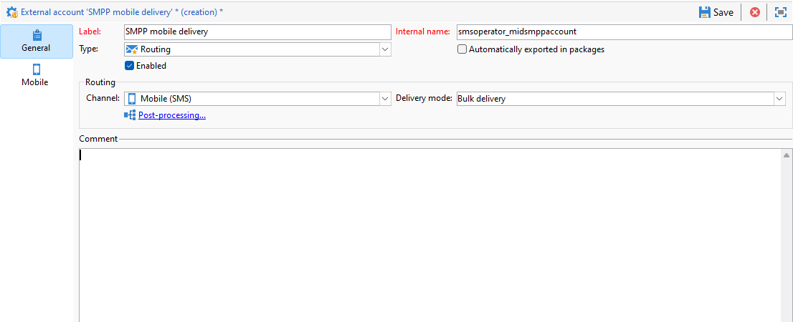

# Configurare il canale SMS su un’infrastruttura mid-sourcing {#setting-up-sms-channel}

Per inviare a un telefono cellulare con server medi, è necessario:

1. Un operatore SMS creato sul server Mid utilizzato per l’account esterno SMS creato sul server Marketing.

1. Un account esterno sul server Marketing, che specifica il canale e la modalità di consegna.

1. Un account esterno sul Mid-server, che descrive il connettore e il tipo di messaggio.

1. Un modello di consegna che fa riferimento all’account esterno per semplificare il processo di invio.

>[!NOTE]
>
> Per le consegne SMS, la tipologia deve utilizzare un&#39;affinità SMS specifica creata in **un** contenitore di Application Server dedicato. [Ulteriori informazioni](../../installation/using/configure-delivery-settings.md#managing-outbound-smtp-traffic-with-affinities)

## Creare l’operatore SMS sul mid-server {#create-sms-operator}

Per avviare il processo di configurazione, devi creare un operatore SMS sul server mid-size specifico per l’account esterno.

>[!IMPORTANT]
>
>Ogni connettore SMS richiede un operatore SMS univoco.

1. Nel nodo **[!UICONTROL Administration]** > **[!UICONTROL Access management]** > **[!UICONTROL Operators node]** della struttura fare clic sull&#39;icona **[!UICONTROL New]**.

   

1. Specificare **[!UICONTROL Identification parameters]** dell&#39;utente, inclusi l&#39;account di accesso, la password e il nome. L’accesso e la password sono necessari affinché l’operatore possa accedere ad Adobe Campaign in modo sicuro.

   In seguito, **[!UICONTROL Name (login)]** verrà utilizzato per denominare l&#39;account esterno SMPP nel mid-server.

   

1. Seleziona le autorizzazioni concesse all’operatore nella sezione Diritti di accesso dell’operatore.

   Per allocare i diritti all&#39;operatore, fare clic sul pulsante **[!UICONTROL Add]** situato sopra l&#39;elenco dei diritti. Selezionare quindi **[!UICONTROL Operator group]** o **[!UICONTROL Named rights]** dall&#39;elenco dei gruppi disponibili.

   

1. Fare clic su **[!UICONTROL Save]** per completare la creazione dell&#39;operatore. Il profilo è ora incluso nell’elenco degli operatori esistenti.

## Creare un account esterno SMS sul server di marketing {#create-accound-mkt}

Per inviare un SMS a un telefono cellulare con server intermedi, devi innanzitutto creare l’account esterno SMS sul server di marketing.

1. Nel nodo **[!UICONTROL Platform]** > **[!UICONTROL External accounts]** della struttura fare clic sull&#39;icona **[!UICONTROL New]**.

   

1. Digitare **[!UICONTROL Label]** e **[!UICONTROL Internal name]**. In seguito verrà utilizzato il nome Internal per denominare l’account esterno SMPP nel mid-server.

1. Definisci il tipo di account come **[!UICONTROL Routing]**, il canale come **[!UICONTROL Mobile (SMS)]** e la modalità di consegna come **[!UICONTROL Mid-sourcing]**.

   

1. Nella scheda **[!UICONTROL Mid-Sourcing]**, specifica i parametri di connessione al server di mid-sourcing.

   Immettere i dettagli del [connettore SMS creato in precedenza](#create-sms-operator) nei campi **[!UICONTROL Account]** e **[!UICONTROL Password]**.

   

1. Confermare la configurazione facendo clic su **[!UICONTROL Test the connection]**.

1. Fai clic su **[!UICONTROL Save]**.

## Creare un account esterno SMPP sul mid-server {#creating-smpp-mid}

>[!IMPORTANT]
>
>L’utilizzo dello stesso account e della stessa password per più account SMS esterni può causare conflitti e sovrapposizioni tra gli account. Consulta la [pagina per la risoluzione dei problemi SMS](troubleshooting-sms.md#external-account-conflict).

Dopo aver configurato correttamente l’account esterno SMS sul server Marketing, il passaggio successivo consiste nel stabilire l’account esterno SMPP sul server mid-server.

Per ulteriori informazioni sul protocollo e sulle impostazioni di SMS, consulta questa [pagina](sms-protocol.md).

A questo scopo, segui la procedura indicata di seguito:

1. Nel nodo **[!UICONTROL Platform]** > **[!UICONTROL External accounts]** della struttura fare clic sull&#39;icona **[!UICONTROL New]**.

1. Digitare **[!UICONTROL Label]** e **[!UICONTROL Internal name]**.

   >[!WARNING]
   >
   >Quando si assegna un **[!UICONTROL Internal name]**, assicurarsi di seguire la convenzione di denominazione specificata:
   >  `SMS Operator Name_Internal Name of the Marketing SMS external account`

   

1. Definisci il tipo di account come **Indirizzamento**, il canale come **Mobile (SMS)** e la modalità di consegna come **Consegna in blocco**.

   

1. Selezionare la casella **[!UICONTROL Enabled]**.

1. Nella scheda **[!UICONTROL Mobile]**, selezionare **[!UICONTROL Extended generic SMPP]** dall&#39;elenco a discesa **[!UICONTROL Connector]**.

   

1. L’opzione **[!UICONTROL Enable verbose SMPP traces in the log file]** consente di scaricare tutto il traffico SMPP nei file di registro. Questa opzione deve essere abilitata solo per la risoluzione dei problemi del connettore e per il confronto con il traffico visualizzato dal provider.

1. Contattare il provider di servizi SMS che ti spiegherà come completare i diversi campi dell&#39;account esterno dalla scheda **[!UICONTROL Connection settings]**.

   Quindi, contattare il provider, a seconda di quello scelto, che fornirà il valore da immettere nel campo **[!UICONTROL SMSC implementation name]**.

   Puoi definire il numero di connessioni al provider per elemento secondario MTA. Per impostazione predefinita è impostato su 1.

1. Per impostazione predefinita, il numero di caratteri in un SMS soddisfa gli standard GSM.

   I messaggi SMS che utilizzano la codifica GSM sono limitati a 160 caratteri o 153 caratteri per SMS per messaggi inviati in più parti.

   >[!NOTE]
   >
   >Alcuni caratteri contano come due (parentesi graffe, parentesi quadre, il simbolo dell’euro, ecc.).
   >
   >L&#39;elenco dei caratteri GSM disponibili è presentato in [questa sezione](sms-set-up.md#about-character-transliteration).

   Puoi anche autorizzare la traslitterazione di caratteri selezionando la casella corrispondente.

   

1. Nella scheda **[!UICONTROL Throughput and delays]** è possibile specificare la velocità effettiva massima dei messaggi in uscita (&quot;MT&quot;, Mobile Terminated) in MT al secondo. Se inserisci &quot;0&quot; nel campo corrispondente, il throughput effettivo sarà illimitato.

   È necessario completare in secondi i valori di tutti i campi corrispondenti alle durate.

1. Nella scheda **[!UICONTROL Mapping of encodings]** è possibile definire le codifiche.

   Per ulteriori informazioni al riguardo, consulta [questa sezione](sms-set-up.md#about-text-encodings).

1. Nella scheda **[!UICONTROL SMSC specificities]**, l&#39;opzione **[!UICONTROL Send full phone number]** è disabilitata per impostazione predefinita. Non attivarlo se desideri rispettare il protocollo SMPP e trasferire solo le cifre al server del provider SMS (SMSC).

   Tuttavia, dato che alcuni provider richiedono l’uso del prefisso &quot;+&quot;, ti consigliamo di verificare con il provider se è necessario abilitare questa opzione.

   La casella di controllo **[!UICONTROL Enable TLS over SMPP]** consente di crittografare il traffico SMPP. Per ulteriori informazioni, consulta questa [pagina](sms-protocol.md).

1. Se si sta configurando un connettore **[!UICONTROL Extended generic SMPP]**, è possibile impostare le risposte automatiche.

   Per ulteriori informazioni al riguardo, consulta [questa sezione](sms-set-up.md#automatic-reply).

## Modificare il modello di consegna {#changing-the-delivery-template}

Adobe Campaign offre un modello di consegna mobile che si trova nel nodo **[!UICONTROL Resources > Templates > Delivery templates]**. Per ulteriori informazioni, consulta la [documentazione di Campaign v8](https://experienceleague.adobe.com/docs/campaign/campaign-v8/send/create-templates.html){target="_blank"}.

Per inviare messaggi tramite il canale SMS, devi creare un modello che includa un riferimento al connettore del canale.

Per mantenere il modello di consegna nativo, ti consigliamo di duplicarlo e quindi configurarlo.

Nell’esempio seguente viene generato un modello per facilitare la consegna dei messaggi tramite l’account SMPP creato in precedenza. Per eseguire questa operazione:

1. Nel nodo **[!UICONTROL Resources]** > **[!UICONTROL Templates]** > **[!UICONTROL Delivery templates]** della struttura fare clic con il pulsante destro del mouse sul modello **[!UICONTROL Send to mobiles]** e selezionare **[!UICONTROL Duplicate]**.

   

1. Modifica l&#39;etichetta del modello, ad esempio **Inviato a dispositivi mobili (SMPP)**.

   

1. Fai clic su **[!UICONTROL Properties]**.

1. Nella scheda **[!UICONTROL General]**, selezionare una modalità di routing corrispondente all&#39;account esterno creato nella sezione [Creare un account esterno SMS sul server Marketing](#create-accound-mkt).

   

1. Fare clic su **[!UICONTROL Save]** per creare il modello.

   

Ora disponi di un account esterno e di un modello di consegna che ti consente di effettuare la consegna tramite SMS.

## Argomenti correlati {#related-topics}

* [Traslitterazione di caratteri SMS](sms-set-up.md#about-character-transliteration)
* [Codifiche testo](sms-set-up.md#about-text-encodings)
* [Risposta automatica](sms-set-up.md#automatic-reply)
