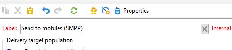
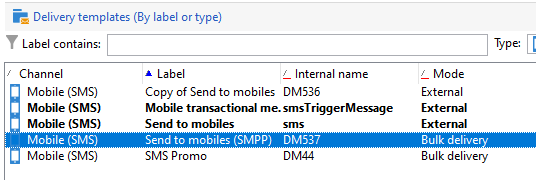

# Configurare il canale SMS in un’istanza autonoma {#setting-up-sms-channel}

Per inviare a un telefono cellulare, è necessario:

1. Un account esterno che specifica un connettore e un tipo di messaggio.

   I connettori legacy sono ora obsoleti. Le funzionalità obsolete sono ancora disponibili, ma non saranno ulteriormente migliorate né supportate. Per ulteriori informazioni, consulta [questa pagina](../../rn/using/deprecated-features.md).

1. Un modello di consegna in cui si fa riferimento a questo account esterno.

>[!NOTE]
>
> Per le consegne di SMS, la tipologia deve utilizzare un’affinità SMS specifica creata in **uno** contenitore server applicazioni dedicato. [Ulteriori informazioni](../../installation/using/configure-delivery-settings.md#managing-outbound-smtp-traffic-with-affinities)

## Creare un account esterno SMPP {#creating-an-smpp-external-account}

>[!IMPORTANT]
>
>L’utilizzo dello stesso account e della stessa password per più account SMS esterni può causare conflitti e sovrapposizioni tra gli account. Consulta la sezione [Pagina Risoluzione dei problemi di SMS](troubleshooting-sms.md#external-account-conflict).

Per inviare un SMS a un telefono cellulare, devi innanzitutto creare l’account esterno SMPP.
Per ulteriori informazioni sul protocollo e sulle impostazioni di SMS, consulta questa [pagina](sms-protocol.md).

A questo scopo, segui la procedura indicata di seguito:

1. In **[!UICONTROL Platform]** > **[!UICONTROL External accounts]** dell&#39;albero, fare clic sul pulsante **[!UICONTROL New]** icona.
1. Definisci il tipo di conto come **Indirizzamento**, il canale come **Dispositivi mobili (SMS)** e la modalità di consegna come **Consegna in blocco**.

   

1. Controlla la **[!UICONTROL Enabled]** casella.
1. In **[!UICONTROL Mobile]** , seleziona **[!UICONTROL Extended generic SMPP]** dal **[!UICONTROL Connector]** elenco a discesa.

   

   >[!CAUTION]
   >
   > A partire dalla versione 20.2, i connettori legacy sono obsoleti e non sono più supportati. È consigliabile utilizzare **[!UICONTROL Extended generic SMPP]** connettore. Per ulteriori informazioni su come eseguire la migrazione al connettore consigliato, consulta questa [pagina](unsupported-connector-migration.md).

1. Il **[!UICONTROL Enable verbose SMPP traces in the log file]** consente di scaricare tutto il traffico SMPP nei file di registro. Devi abilitare questa opzione per risolvere i problemi del connettore e per confrontare il traffico rilevato dal provider.

1. Contatta il provider di servizi SMS che ti spiegherà come completare i diversi campi dell’account esterno dal **[!UICONTROL Connection settings]** scheda.

   Quindi, contatta il provider, a seconda di quello scelto, che ti fornirà il valore da immettere nel **[!UICONTROL SMSC implementation name]** campo.

   Puoi definire il numero di connessioni al provider per elemento secondario MTA. Per impostazione predefinita è impostato su 1.

1. Per impostazione predefinita, il numero di caratteri in un SMS soddisfa gli standard GSM.

   I messaggi SMS che utilizzano la codifica GSM sono limitati a 160 caratteri o 153 caratteri per SMS per messaggi inviati in più parti.

   >[!NOTE]
   >
   >Alcuni caratteri contano come due (parentesi graffe, parentesi quadre, il simbolo dell’euro, ecc.).
   >
   >L’elenco dei caratteri GSM disponibili è presentato di seguito.

   Se lo desideri, puoi autorizzare la traslitterazione di caratteri selezionando la casella corrispondente.

   

   Per ulteriori informazioni al riguardo, consulta [questa sezione](#about-character-transliteration).

1. In **[!UICONTROL Throughput and delays]** , puoi specificare la velocità effettiva massima dei messaggi in uscita (&quot;MT&quot;, Mobile Terminated) in MT al secondo. Se inserisci &quot;0&quot; nel campo corrispondente, il throughput effettivo sarà illimitato.

   È necessario completare in secondi i valori di tutti i campi corrispondenti alle durate.

1. In **[!UICONTROL Mapping of encodings]** , è possibile definire le codifiche.

   Per ulteriori informazioni al riguardo, consulta [questa sezione](#about-text-encodings).

1. In **[!UICONTROL SMSC specificities]** , la scheda **[!UICONTROL Send full phone number]** è disattivata per impostazione predefinita. Non attivarlo se desideri rispettare il protocollo SMPP e trasferire solo le cifre al server del provider SMS (SMSC).

   Tuttavia, dato che alcuni provider richiedono l’uso del prefisso &quot;+&quot;, ti consigliamo di verificare con il provider se è necessario abilitare questa opzione.

   Il **[!UICONTROL Enable TLS over SMPP]** La casella di controllo ti consente di crittografare il traffico SMPP. Per ulteriori informazioni, consulta questa [pagina](sms-protocol.md).

1. Se stai configurando un’ **[!UICONTROL Extended generic SMPP]** connettore, è possibile impostare risposte automatiche.

   Per ulteriori informazioni al riguardo, consulta [questa sezione](#automatic-reply).

## Traslitterazione di caratteri SMS {#about-character-transliteration}

La traslitterazione dei caratteri può essere impostata in un account esterno di consegna mobile SMPP, nella sezione **[!UICONTROL Mobile]** scheda.

La traslitterazione consiste nel sostituire un carattere di un SMS con un altro quando quel carattere non è preso in considerazione dallo standard GSM.

* Se la traslitterazione **[!UICONTROL authorized]**, ogni carattere non preso in considerazione viene sostituito da un carattere GSM al momento dell’invio del messaggio. Ad esempio, la lettera &quot;ë&quot; è sostituita da &quot;e&quot;. Il messaggio viene quindi leggermente modificato, ma il limite di caratteri rimane lo stesso.
* Quando la traslitterazione **[!UICONTROL not authorized]**, ogni messaggio che contiene caratteri non presi in considerazione viene inviato in formato binario (Unicode): tutti i caratteri vengono quindi inviati così come sono. Tuttavia, i messaggi SMS che utilizzano Unicode sono limitati a 70 caratteri (o 67 caratteri per SMS per messaggi inviati in più parti). Se viene superato il numero massimo di caratteri, vengono inviati diversi messaggi, il che potrebbe comportare costi aggiuntivi.

>[!IMPORTANT]
>
>L’inserimento di campi di personalizzazione nel contenuto del messaggio SMS può introdurre caratteri che non vengono presi in considerazione dalla codifica GSM.

Per impostazione predefinita, la traslitterazione di caratteri è disabilitata. Se desideri che tutti i caratteri nei messaggi SMS rimangano invariati, per non modificare ad esempio i nomi propri, ti consigliamo di non abilitare questa opzione.

Tuttavia, se i messaggi SMS contengono molti caratteri che generano messaggi Unicode, puoi abilitare questa opzione per limitare i costi di invio dei messaggi.

La tabella seguente presenta i caratteri presi in considerazione dallo standard GSM. Tutti i caratteri inseriti nel corpo del messaggio, diversi da quelli indicati di seguito, convertono l’intero messaggio in formato binario (Unicode) e quindi lo limitano a 70 caratteri.

**Caratteri base**

<table> 
 <tbody> 
  <tr> 
   <td> @ </td> 
   <td>  </td> 
   <td> SP </td> 
   <td> 0 </td> 
   <td> I </td> 
   <td> P </td> 
   <td> si può </td> 
   <td> p </td> 
  </tr> 
  <tr> 
   <td> £ </td> 
   <td> _ </td> 
   <td> ! </td> 
   <td> 1 </td> 
   <td> A </td> 
   <td> Q </td> 
   <td> a </td> 
   <td> q </td> 
  </tr> 
  <tr> 
   <td> $ </td> 
   <td>  </td> 
   <td> " </td> 
   <td> 2 </td> 
   <td> B </td> 
   <td> R </td> 
   <td> b </td> 
   <td> r </td> 
  </tr> 
  <tr> 
   <td> ¥ </td> 
   <td>  </td> 
   <td> N. </td> 
   <td> 3 </td> 
   <td> C </td> 
   <td> S </td> 
   <td> c </td> 
   <td> s </td> 
  </tr> 
  <tr> 
   <td> è </td> 
   <td>  </td> 
   <td> }Permesso </td> 
   <td> 4 </td> 
   <td> D </td> 
   <td> M </td> 
   <td> g </td> 
   <td> t </td> 
  </tr> 
  <tr> 
   <td> é </td> 
   <td>  </td> 
   <td> % </td> 
   <td> 5 </td> 
   <td> E </td> 
   <td> U </td> 
   <td> e </td> 
   <td> u </td> 
  </tr> 
  <tr> 
   <td> ù </td> 
   <td>  </td> 
   <td> E </td> 
   <td> 6 </td> 
   <td> V </td> 
   <td> V </td> 
   <td> f </td> 
   <td> v </td> 
  </tr> 
  <tr> 
   <td> ì </td> 
   <td>  </td> 
   <td> ' </td> 
   <td> 7 </td> 
   <td> G </td> 
   <td> L </td> 
   <td> g </td> 
   <td> m </td> 
  </tr> 
  <tr> 
   <td> ò </td> 
   <td>  </td> 
   <td> ( </td> 
   <td> 8 </td> 
   <td> H </td> 
   <td> X </td> 
   <td> h </td> 
   <td> x </td> 
  </tr> 
  <tr> 
   <td> Ç </td> 
   <td>  </td> 
   <td> ) </td> 
   <td> 9 </td> 
   <td> I </td> 
   <td> Y </td> 
   <td> i </td> 
   <td> y </td> 
  </tr> 
  <tr> 
   <td> LF </td> 
   <td>  </td> 
   <td> * </td> 
   <td> : </td> 
   <td> J </td> 
   <td> Z </td> 
   <td> j </td> 
   <td> z </td> 
  </tr> 
  <tr> 
   <td> Ø </td> 
   <td> ESC </td> 
   <td> + </td> 
   <td> ; </td> 
   <td> K </td> 
   <td> Ä </td> 
   <td> k </td> 
   <td> ä </td> 
  </tr> 
  <tr> 
   <td> ø </td> 
   <td> AE </td> 
   <td> , </td> 
   <td> &lt; </td> 
   <td> L </td> 
   <td> Ö </td> 
   <td> l </td> 
   <td> ö </td> 
  </tr> 
  <tr> 
   <td> CR </td> 
   <td> æ </td> 
   <td> - </td> 
   <td> = </td> 
   <td> L </td> 
   <td> Ñ </td> 
   <td> m </td> 
   <td> ñ </td> 
  </tr> 
  <tr> 
   <td> Å </td> 
   <td> ß </td> 
   <td> . </td> 
   <td> &gt; </td> 
   <td> N </td> 
   <td> Ü </td> 
   <td> n </td> 
   <td> ü </td> 
  </tr> 
  <tr> 
   <td> å </td> 
   <td> É </td> 
   <td> / </td> 
   <td> ? </td> 
   <td> O </td> 
   <td> § </td> 
   <td> o </td> 
   <td> à </td> 
  </tr> 
 </tbody> 
</table>

SP: Space

ESC: Escape

LF: Line Feed (avanzamento di riga)

CR: Carriage Return (ritorno a capo)

**Caratteri avanzati (contati due volte)**

^ { } `[ ~ ]` | €

## Codifiche testo {#about-text-encodings}

Al momento di inviare un messaggio SMS, Adobe Campaign può utilizzare una o più codifiche di testo. Ogni codifica ha un set di caratteri specifico e determina il numero di caratteri da includere in un messaggio SMS.

Durante la configurazione di un nuovo account esterno di consegna mobile SMPP, puoi definire **[!UICONTROL Mapping of encodings]** nel **[!UICONTROL Mobile]** scheda: **[!UICONTROL data_coding]** consente ad Adobe Campaign di comunicare quale codifica viene utilizzata a SMSC.

>[!NOTE]
>
>La mappatura tra il valore **data_coding** e la codifica effettivamente utilizzata è standardizzata. Tuttavia, alcuni SMSC hanno una mappatura specifica: in questo caso, il tuo **Adobe Campaign** l&#39;amministratore deve dichiarare questa mappatura. Consulta il provider per saperne di più.

È possibile dichiarare **data_codings** e forzare la codifica, se necessario: a questo scopo, specifica una singola codifica nella tabella.

* Quando non è definita alcuna mappatura delle codifiche, il connettore assume un comportamento generico:

   * Prova a utilizzare la codifica GSM a cui assegna il valore **data_coding = 0**.
   * Se non è possibile usare la codifica GSM, utilizza la codifica **UCS2** assegnandole il valore **data_coding = 8**.

* Quando definisci le codifiche da utilizzare e il **[!UICONTROL data_coding]** valori dei campi, Adobe Campaign tenterà di utilizzare la prima codifica nell’elenco, quindi la seguente, se la prima codifica risulta impossibile.

>[!IMPORTANT]
>
>L’ordine di dichiarazione è importante: ti consigliamo di inserire l’elenco in ordine crescente **di costo** per favorire le codifiche che ti consentono di contenere il maggior numero possibile di caratteri in ogni messaggio SMS.
>
>Dichiara solo le codifiche che desideri utilizzare. Se alcune delle codifiche fornite da SMSC non dovessero corrispondere allo scopo di utilizzo, non dichiararle nell’elenco.

## Risposta automatica {#automatic-reply}

Quando imposti un connettore SMPP generico esteso, puoi configurare le risposte automatiche.

Quando un abbonato risponde a un messaggio SMS inviato loro tramite Adobe Campaign e il loro messaggio contiene una parola chiave come &quot;STOP&quot;, puoi configurare i messaggi che vengono automaticamente rimandati loro in **[!UICONTROL Automatic reply sent to the MO]** sezione.

>[!NOTE]
>
>Le parole chiave non fanno distinzione tra maiuscole e minuscole.

Per ogni parola chiave, specifica un codice breve, che è un numero generalmente utilizzato per inviare consegne e che fungerà da nome del mittente, quindi inserisci il messaggio che verrà inviato al destinatario predefinito.

Puoi anche collegare un’azione alla risposta automatica: **[!UICONTROL Send to quarantine]** o **[!UICONTROL Remove from quarantine]**. Ad esempio, se un destinatario invia la parola chiave &quot;STOP&quot;, riceverà automaticamente una conferma di annullamento dell’abbonamento e verrà messo in quarantena.

Se si collega **[!UICONTROL Remove from quarantine]** azione a una risposta automatica, i destinatari che inviano la parola chiave corrispondente vengono automaticamente rimossi dalla quarantena.

I destinatari sono elencati in **[!UICONTROL Non deliverables and addresses]** tabella disponibile tramite **[!UICONTROL Administration]** > **[!UICONTROL Campaign Management]** > **[!UICONTROL Non deliverables Management]** menu.

* Per inviare la stessa risposta indipendentemente dal codice breve, lasciare **[!UICONTROL Short code]** colonna vuota.
* Per inviare la stessa risposta indipendentemente dalla parola chiave, lasciare **[!UICONTROL Keyword]** colonna vuota.
* Per eseguire un’azione senza inviare una risposta, lascia **[!UICONTROL Response]** colonna vuota. Ad esempio, questo consente di rimuovere dalla quarantena un utente che risponde con un messaggio diverso da &quot;STOP&quot;.

Se disponi di più account esterni che utilizzano il connettore SMPP generico esteso con lo stesso account provider, potrebbe verificarsi il seguente problema: quando invii una risposta a un codice breve, questa potrebbe essere ricevuta su una qualsiasi delle connessioni dell’account esterno. Di conseguenza, la risposta automatica inviata non poteva essere il messaggio previsto.
Per evitare questo problema, applica una delle seguenti soluzioni, a seconda del provider in uso:

* Crea un account provider per ogni account esterno.
* Utilizza il **[!UICONTROL System type]** campo da **[!UICONTROL Mobile]** > **[!UICONTROL Connection settings]** per distinguere ciascun codice breve. Chiedi al tuo provider un valore diverso per ogni account.

  

I passaggi per configurare un account esterno utilizzando il connettore SMPP generico esteso sono descritti in [Creare un account esterno SMPP](#creating-an-smpp-external-account) sezione.

## Modificare il modello di consegna {#changing-the-delivery-template}

Adobe Campaign fornisce un modello per la consegna a dispositivi mobili. Questo modello è disponibile nel **[!UICONTROL Resources > Templates > Delivery templates]** nodo. Per ulteriori informazioni, consulta [Informazioni sui modelli](about-templates.md) sezione.

Per distribuire tramite un canale SMS, devi creare un modello in cui si fa riferimento al connettore del canale.

Per mantenere il modello di consegna nativo, ti consigliamo di duplicarlo e quindi configurarlo.

Nell’esempio seguente, creiamo un modello per inviare messaggi tramite l’account SMPP abilitato in precedenza. Per eseguire questa operazione:

1. Vai a **[!UICONTROL Delivery templates]** nodo.
1. Fare clic con il pulsante destro del mouse **[!UICONTROL Send to mobiles]** e selezionare **[!UICONTROL Duplicate]**.

   

1. Cambia l’etichetta del modello, ad esempio **Inviato a dispositivi mobili (SMPP)**.

   

1. Fai clic su **[!UICONTROL Properties]**.
1. In **[!UICONTROL General]** , selezionare una modalità di instradamento corrispondente all&#39;account esterno creato nei passaggi precedenti.

   

1. Clic **[!UICONTROL Save]** per creare il modello.

   

Ora disponi di un account esterno e di un modello di consegna che ti consente di effettuare la consegna tramite SMS.
