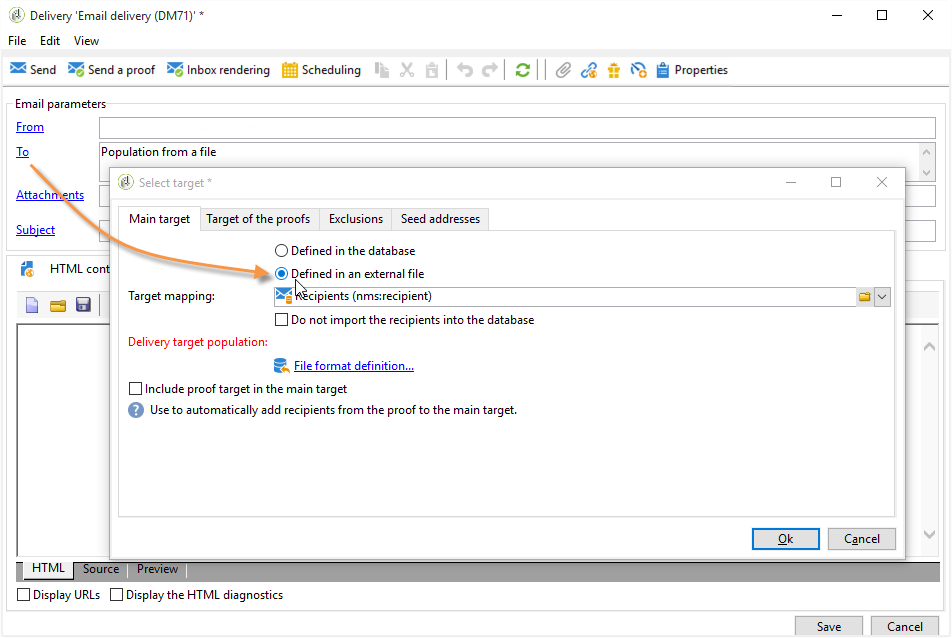

# Definizione della popolazione target {#defining-the-target-population}

## Informazioni sulle popolazioni target {#about-target-populations}

Per ogni consegna, puoi definire diversi tipi di popolazioni target:

* **Pubblico principale**: i profili che riceveranno i messaggi. [Ulteriori informazioni](steps-defining-the-target-population.md#selecting-the-main-target)
* **Prova**: destinatari di messaggi di prova, coinvolti nel ciclo di convalida. [Ulteriori informazioni](steps-defining-the-target-population.md#defining-a-specific-proof-target)
* **Indirizzi di seed**: destinatari che non rientrano nel target di consegna ma lo riceveranno (solo nel contesto di una campagna di marketing). [Ulteriori informazioni](about-seed-addresses.md)
* **Gruppi di controllo**: popolazione che non riceverà la consegna, utilizzata per monitorare il comportamento e l’impatto della campagna (solo nel contesto di una campagna di marketing). [Ulteriori informazioni](../../campaign/using/marketing-campaign-target.md#defining-a-control-group).

## Selezione dei destinatari principali della consegna {#selecting-the-main-target}

Nella maggior parte dei casi, la destinazione principale viene estratta dal database Adobe Campaign (modalità predefinita). Tuttavia, i destinatari possono anche essere memorizzati in un file esterno. Ulteriori informazioni in [questa sezione](steps-defining-the-target-population.md#selecting-external-recipients).

Per selezionare i destinatari di una consegna, effettua le seguenti operazioni:

1. Nell’editor di consegna, seleziona **[!UICONTROL To]**.
1. Se i destinatari sono memorizzati nel database, scegli la prima opzione.

   

1. Seleziona la mappatura target nel **[!UICONTROL Target mapping]** elenco a discesa. La mappatura di destinazione predefinita di Adobe Campaign è **[!UICONTROL Recipients]** sulla base **nms:recipient** schema.

   Sono disponibili altre mappature di destinazione e alcune possono essere correlate alla configurazione specifica. Per ulteriori informazioni sulle mappature target, consulta [Selezione di una mappatura target](selecting-a-target-mapping.md).

1. Fai clic sul pulsante **[!UICONTROL Add]** per definire i filtri di restrizione.

   Puoi quindi selezionare il tipo di filtro da applicare:

   

   Puoi selezionare i destinatari utilizzando i tipi di targeting definiti nel database. Per utilizzare un tipo di destinazione, selezionalo e fai clic su **[!UICONTROL Next]**. Per ogni target, puoi visualizzare i destinatari interessati facendo clic sul pulsante **[!UICONTROL Preview]** scheda . Per alcuni tipi di target, il **[!UICONTROL Refine target]** consente di combinare diversi criteri di targeting.

   I seguenti tipi di target sono offerti per impostazione predefinita:

   * **[!UICONTROL Filtering conditions]** : questa opzione consente di definire una query e visualizzare il risultato. Il metodo per la definizione delle query è presentato in [questa sezione](../../platform/using/creating-filters.md#creating-an-advanced-filter).
   * **[!UICONTROL Subscribers of an information service]** : questa opzione ti consente di selezionare una newsletter a cui i destinatari devono effettuare l’abbonamento per essere indirizzati dalla consegna che stai creando.

      

   * **[!UICONTROL Recipients of a delivery]** : questa opzione ti consente di definire come criterio di targeting i destinatari di una consegna esistente. Seleziona quindi la consegna nell’elenco:

      

   * **[!UICONTROL Delivery recipients belonging to a folder]** : questa opzione ti consente di selezionare una cartella di consegna ed eseguire il targeting dei destinatari delle consegne in tale cartella.

      

      Puoi filtrare il comportamento dei destinatari selezionandolo dall’elenco a discesa:

      

      >[!NOTE]
      >
      >La **[!UICONTROL Include sub-folders]** consente inoltre di eseguire il targeting delle consegne contenute in cartelle situate nella struttura ad albero sotto il nodo selezionato.

   * **[!UICONTROL Recipients included in a folder]** : questa opzione consente di eseguire il targeting dei profili contenuti in una cartella specifica della struttura.
   * **[!UICONTROL A recipient]** : questa opzione ti consente di selezionare un destinatario specifico dai profili nel database.
   * **[!UICONTROL A list of recipients]** : questa opzione ti consente di eseguire il targeting di un elenco di destinatari. Gli elenchi sono presentati nella [questa sezione](../../platform/using/creating-and-managing-lists.md).
   * **[!UICONTROL User filters]** : questa opzione ti consente di accedere ai filtri preconfigurati per utilizzarli come criteri di filtro per i profili nel database. I filtri preconfigurati vengono presentati in [questa sezione](../../platform/using/creating-filters.md#saving-a-filter).
   * Opzione **[!UICONTROL Exclude recipients corresponding to this segment]** ti consente di eseguire il targeting per i destinatari che non soddisfano i criteri di destinazione definiti. Per utilizzare questa opzione, seleziona la casella appropriata e quindi applica il targeting, come definito in precedenza, per escludere i profili risultanti.

      

1. Immetti un nome per il targeting nel **[!UICONTROL Label]** campo . Per impostazione predefinita, l’etichetta è l’etichetta del primo criterio di targeting. Per una combinazione, è preferibile utilizzare un nome esplicito.
1. Fai clic su **[!UICONTROL Finish]** per convalidare il targeting configurato.

   I criteri di targeting definiti sono riepilogati nella sezione centrale della scheda di configurazione del target principale. Fai clic su un criterio per visualizzarne il contenuto (configurazione e anteprima). Per eliminare un criterio, fate clic sulla croce situata dopo l’etichetta.

   

### Selezione di destinatari esterni {#selecting-external-recipients}

Puoi avviare una consegna su destinatari che non vengono salvati nel database, ma che sono memorizzati in un file esterno. Ad esempio, verrà inviata una consegna ai destinatari importati da un file di testo.

Per eseguire questa operazione:

1. Fai clic sul pulsante **[!UICONTROL To]** per selezionare i destinatari della consegna.
1. Seleziona la **[!UICONTROL Defined in an external file]** opzione .

   

1. Per impostazione predefinita, i destinatari vengono importati nel database. È necessario selezionare la **[!UICONTROL Target mapping]**. Per ulteriori informazioni sulle mappature target, consulta [Selezione di una mappatura target](selecting-a-target-mapping.md)

   Puoi anche scegliere **[!UICONTROL Do not import the recipients into the database]**.

1. Durante l’importazione dei destinatari, fai clic sul pulsante **[!UICONTROL File format definition...]** per selezionare e configurare il file esterno.

   Per ulteriori informazioni sull’importazione dei dati, consulta [questa sezione](../../platform/using/executing-import-jobs.md#step-2---source-file-selection).

1. Fai clic su **[!UICONTROL Finish]** e configura la consegna come consegna standard.

>[!CAUTION]
>
>Quando definisci il contenuto del messaggio per la consegna e-mail, non includere il collegamento alla pagina speculare; non può essere generato in questa modalità di consegna.

### Impostazione delle impostazioni di esclusione {#customizing-exclusion-settings}

Gli errori di indirizzo e le valutazioni di qualità sono forniti dal fornitore di servizi (IAP). Queste informazioni vengono aggiornate automaticamente nel profilo del destinatario dopo le azioni di consegna e con i file restituiti dai provider di servizi. Può essere visualizzato nel profilo in sola lettura.

È possibile scegliere di escludere gli indirizzi che hanno raggiunto un certo numero di errori consecutivi o il cui punteggio di qualità è inferiore a una soglia specificata in questa finestra. Puoi anche scegliere se autorizzare o meno indirizzi non qualificati per i quali non sono stati restituiti dati.

>[!NOTE]
>
>Se due destinatari hanno lo stesso nome, cognome, codice postale e città in una consegna direct mailing, si verificherà un doppio errore e il duplicato non verrà preso in considerazione.

La **[!UICONTROL Exclusions]** viene utilizzata per limitare il numero di messaggi.

>[!NOTE]
>
>I parametri predefiniti sono consigliati, ma puoi adattare le impostazioni in base alle tue esigenze. Tuttavia, queste opzioni devono essere modificate solo da un utente esperto per evitare errori e abusi.

Fai clic sul pulsante **[!UICONTROL Edit...]** per modificare la configurazione predefinita.

Sono disponibili le seguenti opzioni:

* **[!UICONTROL Exclude duplicate addresses during delivery]**. Questa opzione è attiva per impostazione predefinita: ti consente di eliminare gli indirizzi e-mail duplicati durante la consegna. La strategia applicata può variare a seconda del modo in cui viene utilizzato Adobe Campaign e del tipo di dati nel database.

   Il valore predefinito dell’opzione può essere configurato per ogni modello di consegna.

   Ad esempio:

   * Consegna di una newsletter o di un documento elettronico. Nessuna esclusione dei duplicati in alcuni casi se i dati non dispongono di duplicati nativi. Una coppia che si abbona con lo stesso indirizzo e-mail può aspettarsi di ricevere due messaggi e-mail personalizzati specifici: uno indirizzato a ogni individuo per nome. In questo caso, questa opzione può essere deselezionata.
   * Consegna di una campagna di marketing: l’esclusione duplicata è essenziale per evitare di inviare troppi messaggi allo stesso destinatario. In questo caso, è possibile selezionare questa opzione.

      Se deselezioni questa opzione, puoi accedere a un’opzione aggiuntiva: **[!UICONTROL Keep duplicate records (same identifier)]**. Ti consente di autorizzare più consegne a destinatari che soddisfano più criteri di targeting.

      

* **[!UICONTROL Exclude recipients who no longer want to be contacted]** , ovvero i destinatari i cui indirizzi e-mail sono elenco Bloccati (&quot;rinuncia&quot;). Questa opzione deve rimanere selezionata per rispettare l&#39;etica professionale dell&#39;e-marketing e le leggi che disciplinano l&#39;e-commerce.
* **[!UICONTROL Exclude quarantined recipients]**. Questa opzione ti consente di escludere dal target qualsiasi profilo con un indirizzo che non risponde. Si consiglia vivamente di mantenere selezionata questa opzione.

   >[!NOTE]
   >
   >Per ulteriori informazioni sulla gestione della quarantena, consulta [Informazioni sulla gestione della quarantena](understanding-quarantine-management.md).

* **[!UICONTROL Limit delivery]** a un determinato numero di messaggi. Questa opzione ti consente di immettere il numero massimo di messaggi da inviare. Se il contenuto del target supera il numero di messaggi indicati, al target viene applicata una selezione casuale.

### Ridurre le dimensioni della popolazione bersaglio {#reducing-the-size-of-the-target-population}

È possibile ridurre le dimensioni della popolazione target. A questo scopo, specifica il numero di destinatari da esportare nella **[!UICONTROL Requested quantity]** campo .

## Selezione dei destinatari dei messaggi di bozza {#selecting-the-proof-target}

La bozza è un messaggio speciale che ti consente di verificare una consegna prima di inviarla al target principale. I destinatari della bozza sono responsabili dell’approvazione sia del modulo che del contenuto del messaggio.

 [Scopri questa funzione nel video](#seeds-and-proofs-video)

Per selezionare il target delle bozze, segui i passaggi seguenti:

1. Fai clic sul collegamento **[!UICONTROL To]**.
1. Fai clic sul pulsante **[!UICONTROL Target of the proofs]** scheda .
1. Fai clic sul pulsante **[!UICONTROL Targeting mode]** campo per scegliere il metodo da applicare: **[!UICONTROL Definition of a specific proof target]** , **[!UICONTROL Substitution of the address]** , **[!UICONTROL Seed addresses]** o **[!UICONTROL Specific target and seed addresses]**.

>[!NOTE]
>
>Di solito, il target per la bozza può essere aggiunto al target principale. A questo scopo, seleziona l’opzione appropriata nella sezione inferiore della sezione **[!UICONTROL Main target]** scheda .

## Definizione di un target di bozza specifico {#defining-a-specific-proof-target}

Quando selezioni la destinazione della bozza, la **[!UICONTROL Definition of a specific proof target]** consente di selezionare i destinatari della bozza dai profili nel database.

Seleziona questa opzione per scegliere i destinatari utilizzando la **[!UICONTROL Add]** , come nel caso di definizione del target principale. Vedi [Selezione del target principale](steps-defining-the-target-population.md#selecting-the-main-target).

Per ulteriori informazioni sull’invio della bozza, consulta [questa sezione](steps-validating-the-delivery.md#sending-a-proof).

### Utilizzo della sostituzione dell’indirizzo nella bozza {#using-address-substitution-in-proof}

Invece di selezionare i destinatari dedicati nel database, puoi utilizzare il **[!UICONTROL Substitution of the address]** opzione .

Questa opzione ti consente di utilizzare i profili dei destinatari della consegna e sostituire i loro indirizzi e-mail con uno o più altri indirizzi che riceveranno la bozza.

Quando questa opzione è selezionata, gli indirizzi di bozza vengono compilati tramite un editor speciale che consente di configurare le sostituzioni.

La configurazione viene eseguita come segue:

1. Fai clic sul pulsante **[!UICONTROL Add]** per definire una sostituzione.
1. Immettere l&#39;indirizzo del destinatario da utilizzare oppure selezionarlo dall&#39;elenco.
1. Seleziona il profilo da utilizzare nella bozza: salva **[!UICONTROL Random]** nel **[!UICONTROL Profile to use]** per utilizzare i dati di qualsiasi profilo del target nella bozza.

   

1. Fai clic sul pulsante **[!UICONTROL Detail]** per selezionare un profilo dalla destinazione principale, come nell’esempio seguente:

   

   È possibile definire tutti gli indirizzi di sostituzione necessari.

## Utilizzo degli indirizzi di seed come prova {#using-seed-addresses-as-proof}

È possibile utilizzare **[!UICONTROL Seed addresses]** come obiettivo delle bozze: questa opzione ti consente di utilizzare o importare un elenco di indirizzi di seed esistenti.

>[!NOTE]
>
>Gli indirizzi di seed sono presentati in [Informazioni sugli indirizzi di seed](about-seed-addresses.md).

Puoi combinare la definizione di un target di prova specifico e l’utilizzo di indirizzi di seed utilizzando **[!UICONTROL Specific target and Seed addresses]** opzione . Le configurazioni correlate vengono quindi definite in due schede secondarie separate.

Vedi anche:

* [Selezione della destinazione della bozza](#selecting-the-proof-target)
* [Informazioni sugli indirizzi seed](about-seed-addresses.md)
* [Caso di utilizzo: selezione degli indirizzi di seed in base ai criteri](use-case--selecting-seed-addresses-on-criteria.md)

## Video tutorial {#seeds-and-proofs-video}

Questo video illustra come aggiungere sementi e bozze a un’e-mail esistente e come inviarla.

>[!VIDEO](https://video.tv.adobe.com/v/25606?quality=12)

Sono disponibili ulteriori video dimostrativi su Campaign Classic [qui](https://experienceleague.adobe.com/docs/campaign-classic-learn/tutorials/overview.html?lang=it).
