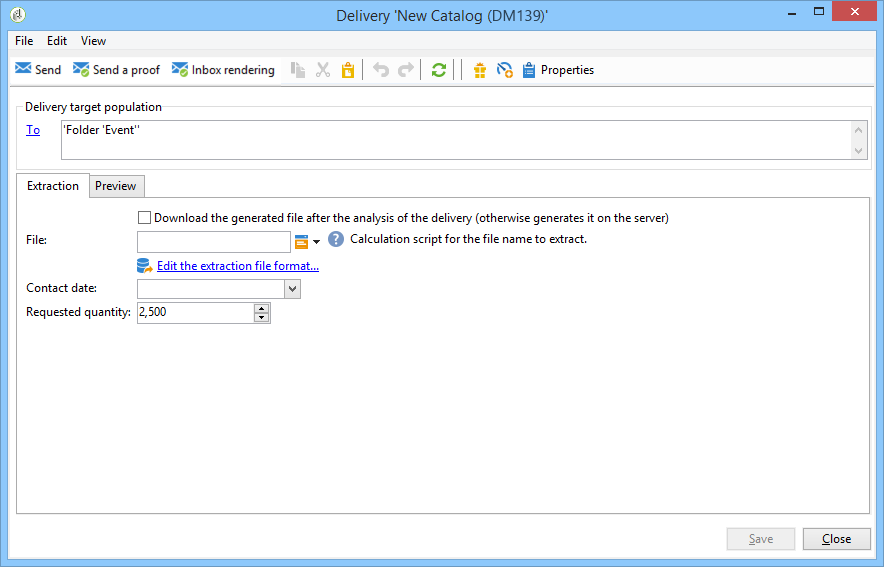

# Definizione della popolazione di destinazione {#defining-the-target-population}

## Informazioni sulle popolazioni target {#about-target-populations}

Per ogni consegna, potete definire diversi tipi di popolazioni target. La sezione seguente fornisce ulteriori informazioni su come selezionare:

* I principali destinatari della consegna. [Ulteriori informazioni](../../delivery/using/steps-defining-the-target-population.md#selecting-the-main-target)
* Destinatari di messaggi di prova, al fine di impostare un ciclo di convalida. [Ulteriori informazioni](../../delivery/using/steps-defining-the-target-population.md#defining-a-specific-proof-target)

Inoltre, se la consegna è inclusa in una campagna di marketing, puoi anche definire indirizzi iniziali e gruppi [di](../../campaign/using/marketing-campaign-deliveries.md#defining-a-control-group)controllo.

## Selezione dei principali destinatari della consegna {#selecting-the-main-target}

Nella maggior parte dei casi, la destinazione principale viene estratta  database Adobe Campaign (modalità predefinita). Tuttavia, i destinatari possono anche essere memorizzati in un file esterno. Ulteriori informazioni in [questa sezione](../../delivery/using/steps-defining-the-target-population.md#selecting-external-recipients).

Per selezionare i destinatari di una consegna, effettuate le seguenti operazioni:

1. Nell&#39;editor di distribuzione, selezionate **[!UICONTROL To]**.
1. Se i destinatari sono memorizzati nel database, scegliete la prima opzione.

   

1. Selezionate la mappatura della destinazione nell&#39;elenco a **[!UICONTROL Target mapping]** discesa.  Mappatura destinazione predefinita Adobe Campaign è **[!UICONTROL Recipients]**, basata sullo schema **nms:destinatario** .

   Sono disponibili altre mappature di destinazione, alcune delle quali possono essere correlate alla configurazione specifica. Per ulteriori informazioni sulle mappature di destinazione, vedere [Selezione di una mappatura](../../delivery/using/selecting-a-target-mapping.md)di destinazione.

1. Fate clic sul **[!UICONTROL Add]** pulsante per definire i filtri di restrizione.

   Potete quindi selezionare il tipo di filtro da applicare:

   

   Potete selezionare i destinatari utilizzando i tipi di targeting definiti nel database. Per utilizzare un tipo di destinazione, selezionatelo e fate clic su **[!UICONTROL Next]**. Per ogni destinazione, è possibile visualizzare i destinatari in questione facendo clic sulla **[!UICONTROL Preview]** scheda. Per alcuni tipi di target, il **[!UICONTROL Refine target]** pulsante consente di combinare diversi criteri di targeting.

   I seguenti tipi di target sono disponibili per impostazione predefinita:

   * **[!UICONTROL Filtering conditions]** : questa opzione consente di definire una query e visualizzare il risultato. Il metodo per la definizione delle query è presentato in [questa sezione](../../platform/using/creating-filters.md#creating-an-advanced-filter).
   * **[!UICONTROL Subscribers of an information service]** : questa opzione consente di selezionare una newsletter a cui iscrivere i destinatari affinché siano interessati dalla consegna in fase di creazione.

      

   * **[!UICONTROL Recipients of a delivery]** : questa opzione consente di definire i destinatari di una consegna esistente come criterio di targeting. È quindi necessario selezionare la consegna nell&#39;elenco:

      

   * **[!UICONTROL Delivery recipients belonging to a folder]** : questa opzione consente di selezionare una cartella di consegna e di eseguire il targeting dei destinatari delle consegne in tale cartella.

      

      Puoi filtrare il comportamento dei destinatari selezionando dall’elenco a discesa:

      

      >[!NOTE]
      >
      >L&#39; **[!UICONTROL Include sub-folders]** opzione consente inoltre di eseguire il targeting delle consegne contenute nelle cartelle che si trovano nella struttura ad albero sotto il nodo selezionato.

   * **[!UICONTROL Recipients included in a folder]** : questa opzione consente di eseguire il targeting dei profili contenuti in una specifica cartella della struttura.
   * **[!UICONTROL A recipient]** : questa opzione consente di selezionare un destinatario specifico dai profili nel database.
   * **[!UICONTROL A list of recipients]** : questa opzione consente di eseguire il targeting di un elenco di destinatari. Gli elenchi sono presentati in [questa sezione](../../platform/using/creating-and-managing-lists.md).
   * **[!UICONTROL User filters]** : questa opzione consente di accedere ai filtri preconfigurati per utilizzarli come criteri di filtro per i profili nel database. I filtri preconfigurati vengono presentati in [questa sezione](../../platform/using/creating-filters.md#saving-a-filter).
   * L’opzione **[!UICONTROL Exclude recipients corresponding to this segment]** consente di eseguire il targeting per i destinatari che non soddisfano i criteri di destinazione definiti. Per utilizzare questa opzione, selezionate la casella appropriata, quindi applicate il targeting, come definito in precedenza, per escludere i profili risultanti.

      

1. Immettete un nome per il targeting nel **[!UICONTROL Label]** campo. Per impostazione predefinita, l&#39;etichetta sarà l&#39;etichetta del primo criterio di targeting. Per una combinazione, è meglio utilizzare un nome esplicito.
1. Fate clic **[!UICONTROL Finish]** per convalidare il targeting configurato.

   I criteri di targeting definiti sono riepilogati nella sezione centrale della scheda di configurazione della destinazione principale. Fate clic su un criterio per visualizzarne il contenuto (configurazione e anteprima). Per eliminare un criterio, fate clic sulla croce che si trova dopo l’etichetta.

   

### Selezione di destinatari esterni {#selecting-external-recipients}

È possibile avviare una consegna sui destinatari che non vengono salvati nel database, ma che sono memorizzati in un file esterno. Ad esempio, verrà inviata una consegna ai destinatari importati da un file di testo.

Per eseguire questa operazione:

1. Fate clic sul **[!UICONTROL To]** collegamento per selezionare i destinatari della consegna.
1. Selezionate l’ **[!UICONTROL Defined in an external file]** opzione.

   

1. Per impostazione predefinita, i destinatari vengono importati nel database. È necessario selezionare il **[!UICONTROL Target mapping]**. Per ulteriori informazioni sulle mappature di destinazione, vedere [Selezione di una mappatura di destinazione](../../delivery/using/selecting-a-target-mapping.md)

   Potete anche scegliere **[!UICONTROL Do not import the recipients into the database]**.

1. Quando importate i destinatari, fate clic sul **[!UICONTROL File format definition...]** collegamento per selezionare e configurare il file esterno.

   For more information on data import, refer to [this section](../../platform/using/importing-data.md#step-2---source-file-selection).

1. Fai clic su **[!UICONTROL Finish]** e configura la consegna come consegna standard.

>[!CAUTION]
>
>Quando definite il contenuto del messaggio per la consegna tramite e-mail, non includete il collegamento alla pagina mirror; non può essere generato in questa modalità di consegna.

### Impostazione delle impostazioni di esclusione {#customizing-exclusion-settings}

Gli errori di indirizzo e le valutazioni di qualità vengono forniti dal provider di servizi (IAP). Queste informazioni vengono aggiornate automaticamente nel profilo del destinatario in seguito alle azioni di consegna e con i file restituiti dai provider di servizi. Può essere visualizzato nel profilo in sola lettura.

Potete scegliere di escludere gli indirizzi che hanno raggiunto un certo numero di errori consecutivi, o il cui punteggio di qualità è inferiore a una soglia specificata in questa finestra. È inoltre possibile scegliere se autorizzare o meno indirizzi non qualificati per i quali non sono stati restituiti dati.

>[!NOTE]
>
>Se due destinatari hanno lo stesso nome, cognome, codice postale e città in una consegna diretta per posta, si verificherà un doppio errore e il duplicato non verrà preso in considerazione.

La **[!UICONTROL Exclusions]** scheda viene utilizzata per limitare il numero di messaggi.

>[!NOTE]
>
>I parametri predefiniti sono consigliati, ma potete adattare le impostazioni in base alle vostre esigenze. Tuttavia, queste opzioni devono essere modificate solo da un utente esperto per evitare errori e abusi.

Fate clic sul **[!UICONTROL Edit...]** collegamento per modificare la configurazione predefinita.

Sono disponibili le seguenti opzioni:

* **[!UICONTROL Exclude duplicate addresses during delivery]**. Questa opzione è attiva per impostazione predefinita: consente di eliminare gli indirizzi e-mail duplicati durante la consegna. La strategia applicata può variare a seconda di come viene utilizzato  Adobe Campaign e del tipo di dati nel database.

   Il valore predefinito dell&#39;opzione può essere configurato per ogni modello di consegna.

   Ad esempio:

   * Consegna di una newsletter o di un documento elettronico. Nessuna esclusione di duplicati in alcuni casi se i dati non presentano duplicati nativi. Un paio di abbonati con lo stesso indirizzo e-mail può ricevere due messaggi e-mail personalizzati specifici: uno indirizzato a ciascun individuo per nome. In questo caso, questa opzione può essere deselezionata.
   * Consegna di una campagna di marketing: l&#39;esclusione duplicata è essenziale per evitare di inviare troppi messaggi allo stesso destinatario. In questo caso, è possibile selezionare questa opzione.

      Se deselezionate questa opzione, potete accedere a un’ulteriore opzione: **[!UICONTROL Keep duplicate records (same identifier)]**. Consente di autorizzare più consegne ai destinatari che soddisfano più criteri di targeting.

      

* **[!UICONTROL Exclude recipients who no longer want to be contacted]** , ovvero i destinatari i cui indirizzi e-mail si trovano in un elenco Bloccati  (&quot;rinuncia&quot;). Questa opzione deve rimanere selezionata per rispettare l&#39;etica professionale dell&#39;e-marketing e le leggi che disciplinano il commercio elettronico.
* **[!UICONTROL Exclude quarantined recipients]**. Questa opzione consente di escludere dalla destinazione qualsiasi profilo con un indirizzo che non risponde. È consigliabile mantenere selezionata questa opzione.

   >[!NOTE]
   >
   >Per ulteriori informazioni sulla gestione della quarantena, vedere [Informazioni sulla gestione](../../delivery/using/understanding-quarantine-management.md)della quarantena.

* **[!UICONTROL Limit delivery]** a un determinato numero di messaggi. Questa opzione consente di specificare il numero massimo di messaggi da inviare. Se il contenuto della destinazione supera il numero di messaggi indicato, alla destinazione viene applicata una selezione casuale.

### Ridurre le dimensioni della popolazione bersaglio {#reducing-the-size-of-the-target-population}

Potete ridurre la dimensione della popolazione di destinazione. A tal fine, specificate il numero di destinatari da esportare nel **[!UICONTROL Requested quantity]** campo.

## Selezione dei destinatari dei messaggi di prova {#selecting-the-proof-target}

La prova è un messaggio speciale che consente di verificare la consegna prima di inviarla alla destinazione principale. I destinatari della prova sono responsabili dell&#39;approvazione sia del modulo che del contenuto del messaggio.

Per selezionare la destinazione delle prove, effettuate le seguenti operazioni:

1. Fate clic sul **[!UICONTROL To]** collegamento.
1. Fate clic sulla **[!UICONTROL Target of the proofs]** scheda.
1. Fate clic sul **[!UICONTROL Targeting mode]** campo per scegliere il metodo da applicare: **[!UICONTROL Definition of a specific proof target]** , **[!UICONTROL Substitution of the address]** , **[!UICONTROL Seed addresses]** o **[!UICONTROL Specific target and seed addresses]**.

>[!NOTE]
>
>Di solito, l&#39;obiettivo per la prova può essere aggiunto alla destinazione principale. A questo scopo, selezionare l&#39;opzione appropriata nella sezione inferiore della **[!UICONTROL Main target]** scheda.

## Definizione di un target di prova specifico {#defining-a-specific-proof-target}

Quando si seleziona la destinazione della prova, l&#39; **[!UICONTROL Definition of a specific proof target]** opzione consente di selezionare i destinatari della prova dai profili nel database.

Selezionate questa opzione per scegliere i destinatari mediante il **[!UICONTROL Add]** pulsante, come nel caso di definizione della destinazione principale. Consultate [Selezione della destinazione](../../delivery/using/steps-defining-the-target-population.md#selecting-the-main-target)principale.

For more on proof sending, refer to [this section](../../delivery/using/steps-validating-the-delivery.md#sending-a-proof).

### Utilizzo della sostituzione dell&#39;indirizzo nella prova {#using-address-substitution-in-proof}

Invece di selezionare i destinatari dedicati nel database, potete utilizzare l&#39; **[!UICONTROL Substitution of the address]** opzione.

Questa opzione consente di utilizzare i profili dei destinatari della consegna e sostituire i loro indirizzi e-mail con uno o più altri indirizzi che riceveranno la prova.

Quando questa opzione è selezionata, gli indirizzi di prova verranno compilati tramite un editor speciale che consente di configurare le sostituzioni.

La configurazione viene eseguita come segue:

1. Fare clic sull&#39; **[!UICONTROL Add]** icona per definire una sostituzione.
1. Immettere l&#39;indirizzo del destinatario da utilizzare o selezionarlo dall&#39;elenco.
1. Selezionare il profilo da utilizzare nella prova: salvare il **[!UICONTROL Random]** valore nella **[!UICONTROL Profile to use]** colonna per utilizzare i dati di qualsiasi profilo della destinazione nella prova.

   

1. Fate clic sull&#39; **[!UICONTROL Detail]** icona per selezionare un profilo dalla destinazione principale, come nell&#39;esempio seguente:

   

   È possibile definire tutti gli indirizzi di sostituzione necessari.

## Utilizzo degli indirizzi seed come prova {#using-seed-addresses-as-proof}

Potete utilizzare **[!UICONTROL Seed addresses]** come destinazione le prove: questa opzione consente di utilizzare o importare un elenco di indirizzi iniziali esistenti.

>[!NOTE]
>
>Gli indirizzi dei semi sono presentati in [Informazioni sugli indirizzi](../../delivery/using/about-seed-addresses.md)iniziali.

È possibile combinare la definizione di una destinazione di prova specifica e l&#39;uso di indirizzi di prova utilizzando l&#39; **[!UICONTROL Specific target and Seed addresses]** opzione. Le configurazioni correlate vengono quindi definite in due sottoschede separate.

## Come gestire sementi e prove in un&#39;e-mail

Questo video illustra come aggiungere sementi e prove a un&#39;e-mail esistente e come inviarla.

>[!VIDEO](https://video.tv.adobe.com/v/25606?quality=12)
Vedi anche:
* [Selezione della destinazione di prova](#selecting-the-proof-target)

* [Informazioni sugli indirizzi iniziali](../../delivery/using/about-seed-addresses.md)

* [Caso di utilizzo: selezione degli indirizzi di base sui criteri](../../delivery/using/use-case--selecting-seed-addresses-on-criteria.md)
