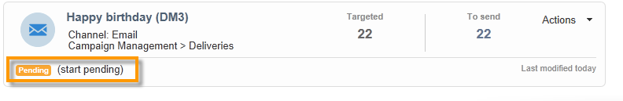
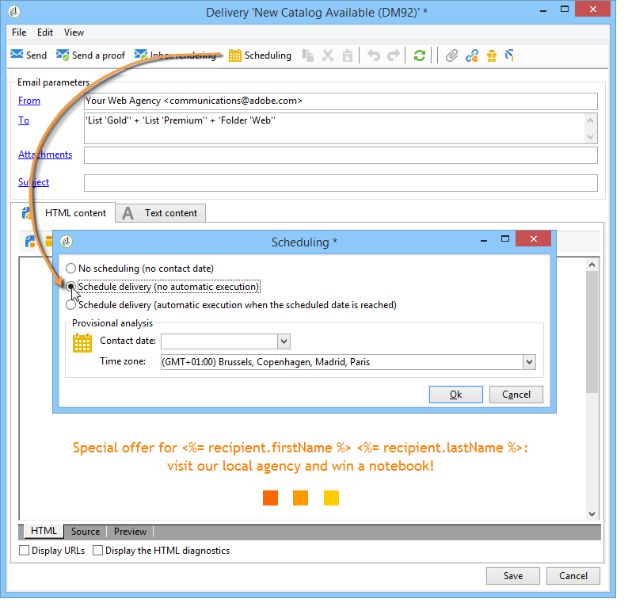

# Configurare e inviare la consegna {#configuring-and-sending-the-delivery}

## Autorizzazioni{#delivery-permissions}

Solo il proprietario della consegna può avviare una consegna. Per consentire ad altri operatori (o gruppi di operatori) di avviare una consegna, aggiungerli come revisori nel campo **[!UICONTROL Delivery start:]**. [Ulteriori informazioni](../../campaign/using/marketing-campaign-approval.md#selecting-reviewers).

## Parametri aggiuntivi della consegna {#delivery-additiona-parameters}

Prima di inviare la consegna, puoi definire i parametri di invio nelle proprietà di consegna tramite la scheda **[!UICONTROL Delivery]**.

* **[!UICONTROL Delivery priority]**: utilizza questa opzione per modificare l&#39;ordine di invio delle consegne impostandone il livello di priorità: normale, alto o basso.

* **[!UICONTROL Message batch quantity]**: utilizzare questa opzione per definire il numero di messaggi raggruppati nello stesso pacchetto di consegna XML. Se il parametro è impostato su 0, i messaggi vengono raggruppati automaticamente. La dimensione del pacchetto è definita dal calcolo `<delivery size>/1024`, con un minimo di 8 e un massimo di 256 messaggi per pacchetto.

  >[!IMPORTANT]
  >
  >Quando la consegna viene creata duplicandone una esistente, questo parametro viene reimpostato.

* **[!UICONTROL Send using multiple waves]**: utilizza questa opzione per inviare i messaggi in batch anziché a tutto il pubblico contemporaneamente. [Ulteriori informazioni](#sending-using-multiple-waves).

* **[!UICONTROL Test SMTP delivery]**: utilizzare questa opzione per verificare l&#39;invio tramite SMTP. La consegna viene elaborata fino alla connessione al server SMTP, ma non viene inviata: per ogni destinatario della consegna, Campaign si connette al server del provider SMTP, esegue il comando SMTP RCPT TO e chiude la connessione prima del comando SMTP DATA.

  >[!NOTE]
  >
  >* Questa opzione non deve essere impostata nel mid-sourcing.
  >
  >* Ulteriori informazioni sulla configurazione del server SMTP, in [questa sezione](../../installation/using/configure-delivery-settings.md).

* **[!UICONTROL Email BCC]**: utilizzare questa opzione per memorizzare le e-mail su un sistema esterno tramite Ccn semplicemente aggiungendo un indirizzo e-mail Ccn alla destinazione del messaggio. [Ulteriori informazioni](sending-messages.md#archiving-emails).

## Conferma consegna {#confirming-delivery}

Quando la consegna è configurata e pronta per essere inviata, esegui l’analisi della consegna.

A tale scopo, fare clic su **[!UICONTROL Send]**, selezionare l&#39;azione desiderata e fare clic su **[!UICONTROL Analyze]**. [Ulteriori informazioni](steps-validating-the-delivery.md#analyzing-the-delivery).

Al termine, fai clic su **[!UICONTROL Confirm delivery]** per avviare la consegna dei messaggi.

È quindi possibile chiudere l&#39;assistente alla consegna e tenere traccia dell&#39;esecuzione della consegna dalla scheda **[!UICONTROL Delivery]**, accessibile tramite i dettagli della consegna o tramite l&#39;elenco delle consegne.

Dopo aver inviato i messaggi, puoi monitorare e tenere traccia delle consegne. Per ulteriori informazioni, consulta queste sezioni:

* [Monitorare una consegna](about-delivery-monitoring.md)
* [Errori di consegna](understanding-delivery-failures.md)
* [Informazioni sul tracciamento dei messaggi](about-message-tracking.md)

## Pianificare l’invio della consegna {#scheduling-the-delivery-sending}

Puoi posticipare l’invio del messaggio pianificando la consegna.

1. Fare clic sul pulsante **[!UICONTROL Send]** e selezionare l&#39;opzione **[!UICONTROL Postpone delivery]**.

1. Specificare una data di inizio nel campo **[!UICONTROL Contact date]**.

1. Puoi quindi avviare l’analisi della consegna e confermare l’invio. Tuttavia, l’invio della consegna non inizierà fino alla data specificata nel campo **[!UICONTROL Contact date]**.

>[!IMPORTANT]
>
>Dopo aver avviato l&#39;analisi, la data di contatto definita viene corretta. Se modifichi questa data, devi riavviare l’analisi in modo da tenere conto delle modifiche apportate.

Nell’elenco di consegna, la consegna verrà visualizzata con lo stato **[!UICONTROL Pending]**.

La pianificazione può essere configurata anche a monte tramite il pulsante **[!UICONTROL Scheduling]** della consegna.

Ti consente di posticipare la consegna a una data successiva o di salvarla nel calendario provvisorio.

* L&#39;opzione **[!UICONTROL Schedule delivery (no automatic execution)]** consente di pianificare un&#39;analisi provvisoria della consegna.

  Quando questa configurazione viene salvata, la consegna diventa **[!UICONTROL Targeting pending]**. L’analisi verrà avviata alla data specificata.

* L&#39;opzione **[!UICONTROL Schedule delivery (automatic execution on planned date)]** consente di specificare la data di consegna.

  Fai clic su **[!UICONTROL Send]** e seleziona **[!UICONTROL Postpone delivery]**, quindi avvia l&#39;analisi e conferma la consegna. Al termine dell’analisi, il target della consegna è pronto e i messaggi vengono inviati automaticamente alla data specificata.

Le date e le ore sono espresse nel fuso orario dell&#39;operatore corrente. L&#39;elenco a discesa **[!UICONTROL Time zone]** che si trova sotto il campo di immissione della data di contatto consente di convertire automaticamente la data e l&#39;ora immesse nel fuso orario selezionato.

Ad esempio, se pianifichi una consegna da eseguire automaticamente alle 8 (ora di Londra), l’ora viene automaticamente convertita nel fuso orario selezionato:

## Inviare in più scaglioni {#sending-using-multiple-waves}

Per bilanciare il carico, puoi dividere le consegne in più batch. Configura il numero di batch e la loro proporzione rispetto all’intera consegna.

>[!NOTE]
>
>Puoi definire solo la dimensione e il ritardo tra due scaglioni consecutivi. Non è possibile configurare i criteri di selezione dei destinatari per ogni ondata.

1. Apri la finestra delle proprietà di consegna e fai clic sulla scheda **[!UICONTROL Delivery]**.
1. Selezionare l&#39;opzione **[!UICONTROL Send using multiple waves]** e fare clic sul collegamento **[!UICONTROL Define waves...]**.

   

1. Per configurare le ondate, puoi effettuare le seguenti operazioni:

   * Definite le dimensioni per ogni scaglione. Ad esempio, se immetti **[!UICONTROL 30%]** nel campo corrispondente, ogni ondata rappresenterà il 30% dei messaggi inclusi nella consegna, ad eccezione dell&#39;ultimo, che rappresenterà il 10% dei messaggi.

     Nel campo **[!UICONTROL Period]** specificare il ritardo tra l&#39;inizio di due scaglioni consecutivi. Se ad esempio si immette **[!UICONTROL 2d]**, la prima ondata inizierà immediatamente, la seconda ondata inizierà tra due giorni, la terza ondata tra quattro giorni e così via.

     

   * Definisci un calendario per l&#39;invio di ogni scaglione.

     Nella colonna **[!UICONTROL Start]** specificare il ritardo tra l&#39;inizio di due ondate consecutive. Nella colonna **[!UICONTROL Size]** immettere un numero fisso o una percentuale.

     Nell’esempio seguente, la prima ondata rappresenta il 25% del numero totale di messaggi inclusi nella consegna e inizierà immediatamente. Le due fasi successive completano la consegna e sono impostate per iniziare a intervalli di sei ore.

     

   Una regola di tipologia specifica, **[!UICONTROL Wave scheduling check]**, garantisce che l&#39;ultimo scaglione sia pianificato prima del limite di validità della consegna. Le tipologie di campagne e le relative regole, configurate nella scheda **[!UICONTROL Typology]** delle proprietà di consegna, sono presentate in [Processo di convalida con tipologie](steps-validating-the-delivery.md#validation-process-with-typologies).

   >[!IMPORTANT]
   >
   >Assicurarsi che gli ultimi scaglioni non superino la scadenza della consegna, definita nella scheda **[!UICONTROL Validity]**. In caso contrario, alcuni messaggi potrebbero non essere inviati.
   >
   >È inoltre necessario concedere tempo sufficiente per i nuovi tentativi durante la configurazione degli ultimi scaglioni. Consulta [questa sezione](steps-sending-the-delivery.md#configuring-retries).

1. Per monitorare gli invii, passa ai registri di consegna. Consulta [questa pagina](delivery-dashboard.md#delivery-logs-and-history).

   È possibile visualizzare le consegne già inviate negli scaglioni elaborati (**[!UICONTROL Sent]** stato) e le consegne da inviare negli scaglioni rimanenti (**[!UICONTROL Pending]** stato).

I due esempi seguenti sono i casi d’uso più comuni per l’utilizzo di più scaglioni.

* **Durante il processo di incremento**

  Quando le e-mail vengono inviate utilizzando una nuova piattaforma, i provider di servizi Internet (ISP) sospettano che gli indirizzi IP non siano riconosciuti. Se grandi quantità di e-mail vengono inviate improvvisamente, gli ISP spesso le contrassegnano come spam.

  Per evitare di essere contrassegnati come spam, puoi aumentare progressivamente il volume inviato scaglionando. Ciò dovrebbe garantire un regolare sviluppo della fase di avvio e consentirti di ridurre il tasso complessivo di indirizzi non validi.

  A tale scopo, utilizzare l&#39;opzione **[!UICONTROL Schedule waves according to a calendar]**. Ad esempio, imposta la prima ondata su 10%, la seconda su 15% e così via.

  

* **Campagne che coinvolgono un call center**

  Quando gestisci una campagna fedeltà telefonicamente, la tua organizzazione ha una capacità limitata di elaborare il numero di chiamate per contattare gli abbonati.

  Utilizzando le ondate, puoi limitare il numero di messaggi a 20 al giorno, ad esempio, considerando la capacità di elaborazione giornaliera di un call center.

  A tale scopo, selezionare l&#39;opzione **[!UICONTROL Schedule multiple waves of the same size]**. Immetti **[!UICONTROL 20]** come dimensione dell&#39;ondata e **[!UICONTROL 1d]** nel campo **[!UICONTROL Period]**.

  

## Configurare nuovi tentativi {#configuring-retries}

I messaggi temporaneamente non recapitati a causa di un errore **Morbido** o **Ignorato** sono soggetti a un nuovo tentativo automatico. I tipi e i motivi degli errori di consegna sono presentati in questa [sezione](understanding-delivery-failures.md#delivery-failure-types-and-reasons).

>[!IMPORTANT]
>
>Per le installazioni in hosting o ibride, se hai eseguito l&#39;aggiornamento all&#39;[MTA avanzato](sending-with-enhanced-mta.md), le impostazioni dei nuovi tentativi nella consegna non vengono più utilizzate da Campaign. I nuovi tentativi di mancato recapito non permanenti e il periodo di tempo che intercorre tra di essi sono determinati dall’MTA avanzato in base al tipo e alla gravità delle risposte di mancato recapito provenienti dal dominio e-mail del messaggio.

Per le installazioni on-premise e le installazioni in hosting/ibride che utilizzano l’MTA di Campaign legacy, la sezione centrale della scheda **[!UICONTROL Delivery]** per i parametri di consegna indica quanti tentativi devono essere eseguiti il giorno successivo alla consegna e il ritardo minimo tra i nuovi tentativi.

Per impostazione predefinita, sono pianificati cinque nuovi tentativi per il primo giorno della consegna con un intervallo minimo di un’ora suddiviso nelle 24 ore del giorno. Un nuovo tentativo al giorno è programmato dopo tale e fino alla scadenza della consegna, definita nella scheda **[!UICONTROL Validity]**. Consulta [Definire il periodo di validità](#defining-validity-period).

## Definire il periodo di validità {#defining-validity-period}

Una volta avviata la consegna, i messaggi (ed eventuali nuovi tentativi) possono essere inviati fino alla scadenza della consegna. Questo è indicato nelle proprietà di consegna tramite la scheda **[!UICONTROL Validity]**.

* Il campo **[!UICONTROL Delivery duration]** consente di immettere il limite per i nuovi tentativi di consegna globali. Questo significa che Adobe Campaign invia i messaggi a partire dalla data di inizio e quindi, per i messaggi che restituiscono un errore, vengono eseguiti nuovi tentativi regolari e configurabili fino al raggiungimento del limite di validità.

  Puoi anche scegliere di specificare le date. A tale scopo, selezionare **[!UICONTROL Explicitly set validity dates]**. In questo caso, per le date di consegna e del limite validità puoi anche specificare l’ora. Per impostazione predefinita viene utilizzata l’ora corrente, ma puoi modificarla direttamente nel campo di input.

  >[!IMPORTANT]
  >
  >Per le installazioni in hosting o ibride, se hai effettuato l&#39;aggiornamento all&#39;[MTA avanzato](sending-with-enhanced-mta.md), l&#39;impostazione **[!UICONTROL Delivery duration]** nelle consegne e-mail di Campaign verrà utilizzata solo se impostata su **3,5 giorni o meno**. Se definisci un valore superiore a 3,5 giorni, questo non verrà preso in considerazione.

* **Limite di validità delle risorse**: il campo **[!UICONTROL Validity limit]** viene utilizzato per le risorse caricate, principalmente per la pagina speculare e per le immagini. Le risorse presenti in questa pagina sono valide per un periodo di tempo limitato (per risparmiare spazio su disco).

  I valori in questo campo possono essere espressi nelle unità elencate in [questa sezione](../../platform/using/adobe-campaign-workspace.md#default-units).
