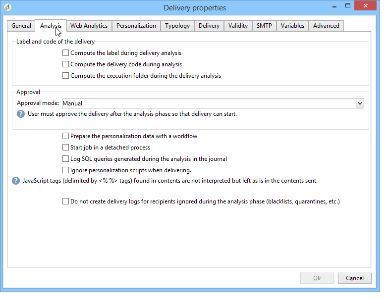
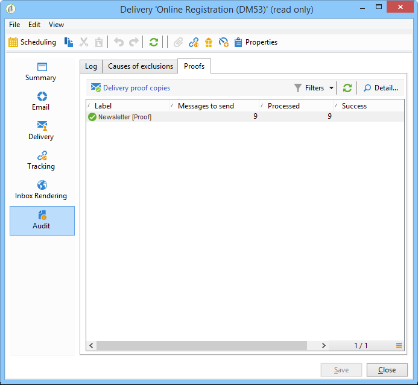

# Convalidare la consegna {#validating-the-delivery}

Quando una consegna è stata creata e configurata, devi convalidarla prima di inviarla al target principale.

Per eseguire questa operazione:

1. **Analizza la consegna**: questo passaggio consente di preparare i messaggi da consegnare. [Ulteriori informazioni](#analyzing-the-delivery).

   Le regole applicate durante l&#39;analisi sono presentate in [questa sezione](#validation-process-with-typologies). Le modalità di convalida disponibili sono descritte in dettaglio nella sezione [Modificare la modalità di approvazione](#changing-the-approval-mode).

1. **Invia bozze**: questo passaggio consente di verificare i contenuti, l’URL, la personalizzazione ecc. Ulteriori informazioni in [Inviare una bozza](steps-validating-the-delivery.md#sending-a-proof) e [Definire una destinazione specifica per la bozza](steps-defining-the-target-population.md#defining-a-specific-proof-target).

>[!IMPORTANT]
>
>I due passaggi precedenti DEVONO ESSERE eseguiti dopo ogni modifica sul contenuto del messaggio.

## Analizzare la consegna {#analyzing-the-delivery}

L’analisi è la fase in cui viene calcolata la popolazione target e viene preparato il contenuto della consegna. Una volta completata, la consegna è pronta per essere inviata.

### Avviare l’analisi {#launching-the-analysis}

1. Per avviare l&#39;analisi della consegna, fare clic su **[!UICONTROL Send]**.
1. Seleziona **[!UICONTROL Deliver as soon as possible]**.

   

1. Fare clic su **[!UICONTROL Analyze]** per avviare l&#39;analisi manualmente.

   La barra di avanzamento mostra lo stato di avanzamento dell’analisi.

   

   >[!NOTE]
   >
   >Le regole di convalida utilizzate durante l&#39;analisi sono descritte nella sezione [Processo di convalida con tipologie](steps-validating-the-delivery.md#validation-process-with-typologies).

1. È possibile interrompere l&#39;analisi in qualsiasi momento facendo clic su **[!UICONTROL Stop]**.

   

   Durante la fase di preparazione non vengono inviati messaggi. È quindi possibile avviare o annullare l’analisi senza rischi.

   >[!IMPORTANT]
   >
   >Durante l’esecuzione, l’analisi blocca la consegna (o la bozza). Eventuali modifiche alla consegna (o alla prova) devono essere seguite da un’altra analisi prima di diventare applicabili.

1. Attendere il completamento dell&#39;analisi.

   Al termine dell’analisi, la sezione superiore della finestra indica se la preparazione della consegna è completa o se si sono verificati errori. Vengono elencati tutti i passaggi, le avvertenze e gli errori di convalida. Le icone colorate mostrano il tipo di messaggio:
   * L’icona blu indica un messaggio informativo.
   * L’icona gialla indica un errore di elaborazione non critico.
   * L’icona rossa indica un errore critico che impedisce l’invio della consegna.

   

1. Fare clic su **[!UICONTROL Close]** per correggere gli eventuali errori.

1. Dopo aver apportato le modifiche, riavviare l&#39;analisi facendo clic su **[!UICONTROL Analyze]**.

Dopo aver verificato il risultato dell&#39;analisi, sarà possibile fare clic su **[!UICONTROL Confirm delivery]** per inviare il messaggio alla destinazione specificata. Un messaggio di conferma ti consente di avviare la consegna.

>[!NOTE]
>
>Se il numero di messaggi da inviare non corrisponde alla configurazione, fare clic sul collegamento **[!UICONTROL Change the main delivery target]**. Questo consente di modificare la definizione della popolazione target e riavviare l’analisi.

### Impostazioni analisi {#analysis-parameters}

La scheda **[!UICONTROL Analysis]** delle proprietà di consegna ti consente di definire un set di informazioni relative alla preparazione dei messaggi durante la fase di analisi.

Questa scheda consente di accedere alle seguenti opzioni:

* **[!UICONTROL Label and code of the delivery]** : le opzioni in questa sezione vengono utilizzate per calcolare i valori di questi campi durante la fase di analisi della consegna. Il campo **[!UICONTROL Compute the execution folder during the delivery analysis]** calcola il nome della cartella che conterrà questa azione di consegna durante la fase di analisi.
* **[!UICONTROL Approval mode]** : questo campo consente di definire la consegna manuale o automatica una volta completata l&#39;analisi. Le modalità di convalida sono presentate nella sezione [Modifica la modalità di approvazione](#changing-the-approval-mode).
* **[!UICONTROL Prepare the delivery parts in the database]** : questa opzione consente di migliorare le prestazioni di analisi della consegna. Per ulteriori informazioni, consulta [questa sezione](#improving-delivery-analysis).
* **[!UICONTROL Prepare the personalization data with a workflow]** : questa opzione consente di preparare i dati di personalizzazione contenuti nella consegna in un flusso di lavoro automatico, che può farti raggiungere un aumento significativo delle prestazioni per l&#39;esecuzione della personalizzazione. Per ulteriori informazioni, consulta [Ottimizzare la personalizzazione](personalization-fields.md#optimizing-personalization).
* **[!UICONTROL Start job in a detached process]** : questa opzione consente di avviare l&#39;analisi della consegna in un processo separato. Per impostazione predefinita, la funzione di analisi utilizza il processo del server applicazioni di Adobe Campaign (web nlserver). Selezionando questa opzione, l&#39;analisi verrà completata anche in caso di errore del server applicazioni.
* **[!UICONTROL Log SQL queries generated during the analysis in the journal]** : questa opzione aggiunge i registri di query SQL al giornale di registrazione di consegna durante la fase di analisi.
* **[!UICONTROL Ignore personalization scripts during sending]** : questa opzione consente di ignorare l&#39;interpretazione delle direttive di JavaScript presenti nel contenuto di HTML. Vengono visualizzati così come sono nel contenuto consegnato. Queste direttive sono state introdotte con il tag **&lt;%=**).

### Migliorare le prestazioni di analisi della consegna {#improving-delivery-analysis}

Per accelerare la preparazione della consegna, è possibile selezionare l&#39;opzione **[!UICONTROL Prepare the delivery parts in the database]** prima di avviare l&#39;analisi.

Quando questa opzione è abilitata, la preparazione della consegna viene eseguita direttamente all’interno del database, il che può accelerare notevolmente l’analisi.

Attualmente, questa opzione è disponibile solo quando sono soddisfatte le seguenti condizioni:

* La consegna deve essere un’e-mail. Al momento gli altri canali non sono supportati.
* Non utilizzare il mid-sourcing o il ciclo esterno, ma solo il tipo di ciclo di consegna in blocco. È possibile controllare il routing utilizzato nella scheda **[!UICONTROL General]** di **[!UICONTROL Delivery properties]**.
* Non è possibile eseguire il targeting di una popolazione proveniente da un file esterno. Per una singola consegna, fare clic sul collegamento **[!UICONTROL To]** da **[!UICONTROL Email parameters]** e verificare che l&#39;opzione **[!UICONTROL Defined in the database]** sia selezionata. Per una consegna utilizzata in un flusso di lavoro, verifica che i destinatari siano **[!UICONTROL Specified by the inbound event(s)]** nella scheda **[!UICONTROL Delivery]**.
* Utilizzare un database PostgreSQL.

### Configurare la priorità di analisi {#analysis-priority-}

Quando la consegna fa parte di una campagna, la scheda **[!UICONTROL Advanced]** offre un&#39;opzione aggiuntiva. Questo consente di organizzare l’ordine di elaborazione per le consegne nella stessa campagna.

Prima dell’invio, ogni consegna viene analizzata. La durata dell’analisi dipende dal file di estrazione della consegna. Maggiore è la dimensione del file, più lunga sarà l’analisi, più attenderanno le consegne seguenti.

Le opzioni per **[!UICONTROL Message preparation by the scheduler]** ti consentono di assegnare la priorità all&#39;analisi della consegna in un flusso di lavoro della campagna.

Se una consegna è troppo grande, è meglio assegnarvi una priorità bassa per evitare di rallentare l’analisi delle altre consegne del flusso di lavoro.

>[!NOTE]
>
>Per evitare che le analisi di consegna più grandi rallentino l&#39;avanzamento dei flussi di lavoro, puoi pianificare le loro esecuzioni facendo clic su **[!UICONTROL Schedule execution for a time of low activity]**.

## Inviare una bozza {#sending-a-proof}

Per rilevare eventuali errori nella configurazione dei messaggi, Adobe consiglia vivamente di impostare un ciclo di convalida della consegna. Accertati che il contenuto sia approvato con la frequenza necessaria inviando delle prove a destinatari di test. Per approvare il contenuto, deve essere inviata una prova ogni volta che viene apportata una modifica.

>[!NOTE]
>
>Le modalità di convalida disponibili sono descritte in dettaglio in [Modificare la modalità di approvazione](steps-validating-the-delivery.md#changing-the-approval-mode).

Per inviare una bozza, effettua le seguenti operazioni:

1. Assicurarsi che la destinazione della bozza sia stata configurata come descritto in [Definire una destinazione specifica per la bozza](steps-defining-the-target-population.md#defining-a-specific-proof-target).

1. Fai clic su **[!UICONTROL Send a proof]** nella barra superiore dell’assistente alla consegna.

   

1. Avvia l’analisi dei messaggi. Vedi [Analizzare la consegna](steps-validating-the-delivery.md#analyzing-the-delivery).
1. Ora puoi inviare la consegna (vedi [Invia la consegna](steps-sending-the-delivery.md)).

   Una volta inviata la consegna, la bozza viene visualizzata nell’elenco di consegna e viene creata e numerata automaticamente. Può essere modificato se desideri accedervi al contenuto e alle proprietà. Per ulteriori informazioni, consulta questa [pagina](about-delivery-monitoring.md).

   

   >[!NOTE]
   >
   >Se sono stati creati diversi formati per la consegna (HTML e Testo), puoi scegliere il formato dei messaggi da inviare ai destinatari della bozza nella sezione inferiore della finestra.

   

Puoi modificare il contenuto della consegna in seguito a eventuali commenti del gruppo di convalida che riceve la bozza. Dopo aver apportato le modifiche, è necessario riavviare l’analisi e quindi inviare un’altra bozza. Ogni nuova bozza viene numerata e registrata nel giornale di registrazione di consegna.

Una volta analizzata la consegna, puoi visualizzare le varie bozze inviate tramite la sotto-scheda **[!UICONTROL Proofs]** del registro (**[!UICONTROL Audit]** scheda).

Devi inviare tutte le bozze necessarie fino a quando il contenuto della consegna non è finalizzato. Successivamente, puoi inviare la consegna al target principale e chiudere il ciclo di convalida.

La scheda **[!UICONTROL Advanced]** delle proprietà di consegna ti consente di definire le proprietà della bozza. Se necessario, puoi sovrascrivere le regole di esclusione dei destinatari.

Sono disponibili le seguenti opzioni:

* La prima opzione ti consente di mantenere la bozza doppia.
* Entrambe le opzioni seguenti consentono di mantenere in quarantena i destinatari che si trovano in fase di elenco Bloccati e gli indirizzi. Vedere la descrizione di queste opzioni per la destinazione principale in [Personalizzare le impostazioni di esclusione](steps-defining-the-target-population.md#customizing-exclusion-settings). A differenza del target di una consegna, in cui questi indirizzi sono esclusi per impostazione predefinita, vengono conservati per impostazione predefinita per il target di una bozza.
* L&#39;opzione **[!UICONTROL Keep the delivery code for the proof]** consente di assegnare alla bozza lo stesso codice di consegna definito per la consegna a cui si riferisce. Questo codice è specificato nel primo passaggio dell’assistente alla consegna.
* Per impostazione predefinita, l’oggetto della bozza è preceduto dal prefisso &quot;N. bozza&quot;, dove # è il numero della bozza. È possibile modificare questo prefisso nel campo **[!UICONTROL Label prefix]**.

## Processo di convalida con tipologie {#validation-process-with-typologies}

Prima di inviare qualsiasi messaggio, è necessario analizzare la campagna per approvarne il contenuto e la configurazione. Le regole di controllo applicate durante la fase di analisi sono definite in una **tipologia**. Per impostazione predefinita, per le e-mail, l’analisi tratta i seguenti punti:

* Approvazione dell&#39;oggetto
* Approvazione di URL e immagini
* Approvazione delle etichette URL
* Approvazione del collegamento di annullamento dell’abbonamento
* Controllo della dimensione delle bozze
* Verifica del periodo di validità
* Controllo della programmazione delle ondate

La tipologia da applicare per ogni consegna è selezionata nella scheda **[!UICONTROL Typologies]** dei parametri di consegna.

Puoi visualizzare e modificare le regole di approvazione, il loro contenuto, l&#39;ordine di esecuzione e la descrizione completa tramite il nodo **[!UICONTROL Administration > Campaign execution > Typology management > Typology rules]**.

Da questo nodo puoi creare nuove regole e definire nuove tipologie. Queste attività sono tuttavia riservate agli utenti esperti che conoscono JavaScript.

Per ulteriori informazioni sulle regole di tipologia, consulta [questa pagina](../../campaign-opt/using/about-campaign-typologies.md).

Per modificare la tipologia corrente, fare clic sull&#39;icona **[!UICONTROL Edit link]** a destra del campo **[!UICONTROL Typology]**.

La scheda **[!UICONTROL Rule]** fornisce un elenco delle regole di tipologia da applicare. Selezionare una regola e fare clic sull&#39;icona **[!UICONTROL Detail...]** per visualizzarne la configurazione:

>[!NOTE]
>
>Le tipologie di tipo **[!UICONTROL Arbitration]** vengono utilizzate nel quadro della gestione della pressione di vendita. Per ulteriori informazioni al riguardo, consulta [questa sezione](../../mrm/using/about-marketing-resource-management.md).

## Modificare la modalità di approvazione {#changing-the-approval-mode}

La scheda **[!UICONTROL Analysis]** per le proprietà di consegna consente di selezionare la modalità di convalida. Se durante l’analisi vengono generati avvisi (ad esempio, se determinati caratteri sono accentuati nell’oggetto della consegna, ecc.), puoi configurare la consegna per definire se deve ancora essere eseguita. Per impostazione predefinita, l’utente deve confermare l’invio di messaggi al termine della fase di analisi: si tratta di convalida **manuale**.

Seleziona un’altra modalità di approvazione dall’elenco a discesa nel campo appropriato.

Sono disponibili le seguenti modalità di approvazione:

* **[!UICONTROL Manual]**: al termine della fase di analisi, l&#39;utente deve confermare la consegna per iniziare l&#39;invio. A tale scopo, fare clic sul pulsante **[!UICONTROL Start]** per avviare la consegna.
* **[!UICONTROL Semi-automatic]**: l&#39;invio inizia automaticamente se la fase di analisi non genera messaggi di avviso.
* **[!UICONTROL Automatic]**: l&#39;invio inizia automaticamente alla fine della fase di analisi indipendentemente dal risultato.
