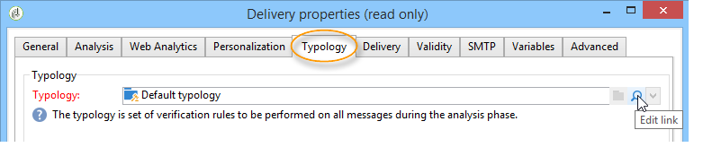

# Convalida della consegna {#validating-the-delivery}

Quando una consegna è stata creata e configurata, è necessario convalidarla prima di inviarla alla destinazione principale.

Per eseguire questa operazione:

1. **Analizzare la consegna**: questo passaggio consente di preparare i messaggi da inviare. Fare riferimento a [Analisi della consegna](#analyzing-the-delivery).

   Le regole applicate durante l&#39;analisi sono presentate in [questa sezione](#validation-process-with-typologies) . Le modalità di convalida disponibili sono descritte in dettaglio nella sezione [Modifica della modalità](#changing-the-approval-mode) di approvazione.

1. **Invia prove**: questo passaggio consente di approvare contenuti, URL, campi di personalizzazione, ecc. Fare riferimento a [Invio di una prova](../../delivery/using/steps-validating-the-delivery.md#sending-a-proof) e [Definizione di una destinazione](../../delivery/using/steps-defining-the-target-population.md#defining-a-specific-proof-target)di prova specifica.

>[!IMPORTANT]
>
>Entrambi questi passaggi devono necessariamente essere eseguiti dopo ogni modifica apportata al contenuto del messaggio.

## Analisi della consegna {#analyzing-the-delivery}

L&#39;analisi è la fase in cui viene calcolata la popolazione di destinazione e preparato il contenuto di consegna. Una volta completato, la consegna è pronta per essere inviata.

### Avvio dell&#39;analisi {#launching-the-analysis}

1. Per avviare l&#39;analisi di consegna, fai clic su **[!UICONTROL Send]**.
1. Seleziona **[!UICONTROL Deliver as soon as possible]**.

   

1. Fate clic **[!UICONTROL Analyze]** per avviare l&#39;analisi manualmente.

   La barra di avanzamento mostra l’avanzamento dell’analisi.

   

   >[!NOTE]
   >
   >Le regole di convalida utilizzate durante l&#39;analisi sono descritte nella sezione Processo di [convalida con tipologie](../../delivery/using/steps-validating-the-delivery.md#validation-process-with-typologies) .

1. Puoi interrompere l’analisi in qualsiasi momento facendo clic su **[!UICONTROL Stop]**.

   

   Durante la fase di preparazione non vengono inviati messaggi. È quindi possibile avviare o annullare l&#39;analisi senza rischi.

   >[!IMPORTANT]
   >
   >Durante l&#39;esecuzione, l&#39;analisi blocca la consegna (o la prova). Qualsiasi modifica alla consegna (o prova) deve essere seguita da un&#39;altra analisi prima di diventare applicabile.

1. Attendere il completamento dell&#39;analisi.

   Al termine dell&#39;analisi, la parte superiore della finestra indica se la preparazione della consegna è completa o se si sono verificati degli errori. Vengono elencati tutti i passaggi, gli avvisi e gli errori di convalida. Le icone colorate mostrano il tipo di messaggio:
   * L’icona blu indica un messaggio informativo.
   * L’icona gialla indica un errore di elaborazione non critico.
   * L&#39;icona rossa indica un errore critico che impedisce l&#39;invio del messaggio.

   

1. Fate clic **[!UICONTROL Close]** per correggere gli eventuali errori.

1. Dopo aver apportato le modifiche, riavviate l’analisi facendo clic **[!UICONTROL Analyze]**.

Dopo aver controllato il risultato dell&#39;analisi, potrai fare clic **[!UICONTROL Confirm delivery]** per inviare il messaggio alla destinazione specificata. Un messaggio di conferma consente di avviare la consegna.

>[!NOTE]
>
>Fai clic sul **[!UICONTROL Change the main delivery target]** collegamento se il numero di messaggi da inviare non corrisponde alla configurazione. Questo consente di modificare la definizione della popolazione di destinazione e di riavviare l&#39;analisi.

### Parametri di analisi {#analysis-parameters}

La **[!UICONTROL Analysis]** scheda delle proprietà di consegna consente di definire un insieme di informazioni relative alla preparazione dei messaggi durante la fase di analisi.

Questa scheda consente di accedere alle seguenti opzioni:

* **[!UICONTROL Label and code of the delivery]** : le opzioni di questa sezione sono utilizzate per calcolare i valori di questi campi durante la fase di analisi del recapito. Il **[!UICONTROL Compute the execution folder during the delivery analysis]** campo calcola il nome della cartella che conterrà l’azione di consegna durante la fase di analisi.
* **[!UICONTROL Approval mode]** : questo campo consente di definire la consegna manuale o automatica una volta completata l&#39;analisi. Le modalità di convalida vengono presentate nella sezione [Modifica della modalità](#changing-the-approval-mode) di approvazione.
* **[!UICONTROL Prepare the delivery parts in the database]** : questa opzione consente di migliorare le prestazioni dell&#39;analisi della distribuzione. Per ulteriori informazioni, consulta [questa sezione](#improving-delivery-analysis).
* **[!UICONTROL Prepare the personalization data with a workflow]** : questa opzione consente di preparare i dati di personalizzazione contenuti nella distribuzione in un flusso di lavoro automatico, che può consentirvi di ottenere un significativo aumento delle prestazioni per l&#39;esecuzione della personalizzazione. Per ulteriori informazioni, consulta [Ottimizzazione della personalizzazione](../../delivery/using/personalization-fields.md#optimizing-personalization).
* **[!UICONTROL Start job in a detached process]** : questa opzione consente di avviare l&#39;analisi della consegna in un processo separato. Per impostazione predefinita, la funzione di analisi utilizza il processo del server applicazione Adobe Campaign  (web nlserver). Selezionando questa opzione, l&#39;analisi verrà completata anche in caso di errore del server applicazione.
* **[!UICONTROL Log SQL queries generated during the analysis in the journal]** : questa opzione aggiunge i registri query SQL al giornale di registrazione consegna durante la fase di analisi.
* **[!UICONTROL Ignore personalization scripts during sending]** : questa opzione consente di bypassare l&#39;interpretazione delle direttive JavaScript presenti nel contenuto HTML. Vengono visualizzati così come sono nei contenuti consegnati. Queste direttive vengono introdotte con il tag **&lt;%=** ).

### Miglioramento delle prestazioni dell&#39;analisi dei risultati {#improving-delivery-analysis}

Per accelerare la preparazione della consegna, potete selezionare l&#39; **[!UICONTROL Prepare the delivery parts in the database]** opzione prima di avviare l&#39;analisi.

Quando questa opzione è attivata, la preparazione della consegna viene eseguita direttamente all&#39;interno del database, il che può accelerare notevolmente l&#39;analisi.

Al momento, questa opzione è disponibile solo se sono soddisfatte le seguenti condizioni:
* La consegna deve essere un&#39;e-mail. Per il momento, gli altri canali non sono supportati.
* Non è necessario utilizzare il routing mid-sourcing o esterno, ma solo il tipo di routing della consegna in blocco. È possibile controllare il ciclo utilizzato nella **[!UICONTROL General]** scheda del **[!UICONTROL Delivery properties]**.
* Non è possibile eseguire il targeting di una popolazione proveniente da un file esterno. Per una singola consegna, fate clic sul **[!UICONTROL To]** collegamento dal menu **[!UICONTROL Email parameters]** e verificate che l&#39; **[!UICONTROL Defined in the database]** opzione sia selezionata. Per una consegna utilizzata in un flusso di lavoro, verificate che i destinatari siano **[!UICONTROL Specified by the inbound event(s)]** nella **[!UICONTROL Delivery]** scheda.
* È necessario utilizzare un database PostgreSQL.

### Configurazione della priorità di analisi {#analysis-priority-}

Quando la consegna fa parte di una campagna, nella **[!UICONTROL Advanced]** scheda è disponibile un&#39;opzione aggiuntiva. Questo consente di organizzare l&#39;ordine di elaborazione per le consegne nella stessa campagna.

Prima dell&#39;invio, ogni consegna viene analizzata. La durata dell&#39;analisi dipende dal file di estrazione del recapito. Maggiore è la dimensione del file, maggiore sarà il tempo necessario per l&#39;analisi, con l&#39;attesa delle seguenti consegne.

Le opzioni per il flusso di lavoro della campagna **[!UICONTROL Message preparation by the scheduler]** consentono di assegnare priorità all&#39;analisi della distribuzione.

Se la consegna è troppo grande, è meglio assegnarvi una priorità bassa per evitare di rallentare l&#39;analisi di altre consegne di workflow.

>[!NOTE]
>
>Per fare in modo che le analisi di distribuzione più grandi non rallentino l&#39;avanzamento dei flussi di lavoro, puoi pianificare le loro esecuzioni scegliendo il **[!UICONTROL Schedule execution for a time of low activity]** pulsante.

## Invio di una bozza {#sending-a-proof}

Per rilevare eventuali errori nella configurazione dei messaggi, Adobe consiglia vivamente di impostare un ciclo di convalida della consegna. Accertati che il contenuto sia approvato con la frequenza necessaria inviando delle prove a destinatari di test. Per approvare il contenuto, deve essere inviata una prova ogni volta che viene apportata una modifica.

>[!NOTE]
>
>* Le modalità di convalida disponibili sono descritte in [Modifica della modalità](../../delivery/using/steps-validating-the-delivery.md#changing-the-approval-mode)di approvazione.
>* La configurazione della destinazione della prova è spiegata in [Definizione di una destinazione](../../delivery/using/steps-defining-the-target-population.md#defining-a-specific-proof-target)della prova specifica.

>

Per inviare una prova, effettuate le seguenti operazioni:

1. Verificate che la destinazione della prova sia stata configurata come descritto in [Definizione di una destinazione](../../delivery/using/steps-defining-the-target-population.md#defining-a-specific-proof-target)di prova specifica.
1. Fate clic **[!UICONTROL Send a proof]** sulla barra superiore della procedura guidata di consegna.

   

1. Avvia l&#39;analisi dei messaggi. Consultate [Analisi della consegna](../../delivery/using/steps-validating-the-delivery.md#analyzing-the-delivery).
1. Ora puoi inviare la consegna (vedi [Invio della consegna](../../delivery/using/steps-sending-the-delivery.md)).

   Una volta inviata la consegna, la prova verrà visualizzata nell&#39;elenco di consegna e verrà automaticamente creata e numerata. Può essere modificato se desiderate accedere al contenuto e alle proprietà. Per ulteriori informazioni, consulta questa [pagina](../../delivery/using/monitoring-a-delivery.md#delivery-dashboard).

   

   >[!NOTE]
   >
   >Se per la consegna sono stati creati diversi formati (HTML e testo), potete scegliere il formato dei messaggi da inviare ai destinatari della prova nella sezione inferiore della finestra.

   

È possibile modificare il contenuto della consegna a seguito di eventuali commenti del gruppo di convalida che riceve la prova. Dopo aver apportato le modifiche, è necessario riavviare l&#39;analisi e inviare un&#39;altra prova. Ogni nuova prova è numerata e registrata nel giornale di registrazione consegna.

Una volta analizzata la consegna, potete visualizzare le varie prove inviate tramite la **[!UICONTROL Proofs]** sottoscheda del registro (**[!UICONTROL Audit]** scheda).

È necessario inviare tutte le prove necessarie fino al completamento del contenuto della consegna. Successivamente, è possibile inviare la consegna alla destinazione principale e chiudere il ciclo di convalida.

La **[!UICONTROL Advanced]** scheda delle proprietà di consegna consente di definire le proprietà della prova. Se necessario, puoi ignorare le regole di esclusione dei destinatari.

Sono disponibili le seguenti opzioni:

* La prima opzione consente di mantenere raddoppiata la prova.
* Entrambe le opzioni seguenti consentono di mantenere in quarantena i destinatari che si trovano sul elenco Bloccati  e gli indirizzi. Consultate la descrizione di queste opzioni per la destinazione principale in [Personalizzazione delle impostazioni](../../delivery/using/steps-defining-the-target-population.md#customizing-exclusion-settings)di esclusione. A differenza del target di una consegna, in cui questi indirizzi sono esclusi per impostazione predefinita, vengono mantenuti per impostazione predefinita per la destinazione di una prova.
* L&#39; **[!UICONTROL Keep the delivery code for the proof]** opzione consente di assegnare alla prova lo stesso codice di consegna definito per la consegna cui si riferisce. Questo codice è specificato nel primo passaggio della procedura guidata di consegna.
* Per impostazione predefinita, l&#39;oggetto della prova ha il prefisso &quot;Proof #&quot;, dove # è il numero della prova. È possibile modificare questo prefisso nel **[!UICONTROL Label prefix]** campo.

## Processo di convalida con tipologie {#validation-process-with-typologies}

Prima di inviare qualsiasi messaggio, è necessario analizzare la campagna per approvarne il contenuto e la configurazione. The checking rules applied during the analysis phase are defined in a **typology**. Per impostazione predefinita, per le e-mail l&#39;analisi copre i seguenti punti:

* Approvazione dell&#39;oggetto
* Approvazione di URL e immagini
* Approvazione delle etichette URL
* Approvazione del collegamento di annullamento della sottoscrizione
* Controllo delle dimensioni delle prove
* Controllo del periodo di validità
* Controllo della programmazione delle onde

La tipologia da applicare per ogni consegna è selezionata nella **[!UICONTROL Typologies]** scheda dei parametri di consegna.

È possibile visualizzare e modificare le regole di approvazione, il relativo contenuto, l&#39;ordine di esecuzione e la descrizione completa attraverso il **[!UICONTROL Administration > Campaign execution > Typology management > Typology rules]** nodo.

È possibile creare nuove regole e definire nuove tipologie da questo nodo. Tali attività sono tuttavia riservate agli utenti esperti che conoscono JavaScript.

Per ulteriori informazioni sulle regole di tipologia, vedere [Informazioni sulle tipologie](../../campaign/using/about-campaign-typologies.md)delle campagne.

Per modificare la tipologia corrente, fare clic sull&#39; **[!UICONTROL Edit link]** icona a destra del **[!UICONTROL Typology]** campo.

Nella **[!UICONTROL Rule]** scheda è riportato un elenco delle regole di tipologia da applicare. Selezionate una regola e fate clic sull&#39; **[!UICONTROL Detail...]** icona per visualizzarne la configurazione:

>[!NOTE]
>
>**[!UICONTROL Arbitration]** le tipologie sono utilizzate nel quadro della gestione della pressione di vendita. Per ulteriori informazioni al riguardo, consulta [questa sezione](../../campaign/using/about-marketing-resource-management.md).

## Modifica della modalità di approvazione {#changing-the-approval-mode}

La **[!UICONTROL Analysis]** scheda delle proprietà di consegna consente di selezionare la modalità di convalida. Se durante l&#39;analisi vengono generati avvisi (ad esempio, se alcuni caratteri vengono accentuati nell&#39;oggetto della consegna, ecc.), è possibile configurare la consegna per definire se deve essere ancora eseguita o meno. Per impostazione predefinita, l&#39;utente deve confermare l&#39;invio di messaggi alla fine della fase di analisi: si tratta di convalida **manuale** .

Selezionare un&#39;altra modalità di approvazione dall&#39;elenco a discesa nel campo appropriato.

Sono disponibili le seguenti modalità di approvazione:

* **[!UICONTROL Manual]**: Al termine della fase di analisi, l&#39;utente deve confermare la consegna per iniziare l&#39;invio. A questo scopo, fate clic sul **[!UICONTROL Start]** pulsante per avviare la consegna.
* **[!UICONTROL Semi-automatic]**: L&#39;invio inizia automaticamente se la fase di analisi non genera messaggi di avviso.
* **[!UICONTROL Automatic]**: L&#39;invio inizia automaticamente alla fine della fase di analisi, indipendentemente dal risultato.
