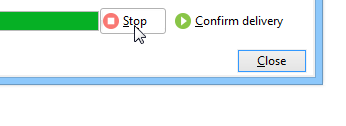

# Convalidare la consegna {#validating-the-delivery}

Quando una consegna è stata creata e configurata, devi convalidarla prima di inviarla al target principale.

Per eseguire questa operazione:

1. **Analizzare la consegna**: questo passaggio ti consente di preparare i messaggi da inviare. [Ulteriori informazioni](#analyzing-the-delivery).

   Le regole applicate durante l&#39;analisi sono presentate in [questa sezione](#validation-process-with-typologies). Le modalità di convalida disponibili sono descritte in dettaglio nella sezione [Modifica della modalità di approvazione](#changing-the-approval-mode) .

1. **Invia bozze**: questo passaggio ti consente di controllare contenuti, URL, personalizzazione, ecc. Ulteriori informazioni in [Invia una bozza](steps-validating-the-delivery.md#sending-a-proof) e [Definisci un target di bozza specifico](steps-defining-the-target-population.md#defining-a-specific-proof-target).

>[!IMPORTANT]
>
>I due passaggi di cui sopra DEVONO ESSERE eseguiti dopo ogni modifica sul contenuto del messaggio.

## Analizzare la consegna {#analyzing-the-delivery}

L’analisi è la fase in cui viene calcolata la popolazione target e il contenuto della consegna viene preparato. Una volta completata, la consegna è pronta per essere inviata.

### Avvia l’analisi {#launching-the-analysis}

1. Per avviare l’analisi della consegna, fai clic su **[!UICONTROL Send]**.
1. Seleziona **[!UICONTROL Deliver as soon as possible]**.

   

1. Fai clic su **[!UICONTROL Analyze]** per avviare l’analisi manualmente.

   La barra di avanzamento mostra l’avanzamento dell’analisi.

   

   >[!NOTE]
   >
   >Le regole di convalida utilizzate durante l&#39;analisi sono descritte nella sezione [Processo di convalida con tipologie](steps-validating-the-delivery.md#validation-process-with-typologies) .

1. Puoi interrompere l’analisi in qualsiasi momento facendo clic su **[!UICONTROL Stop]**.

   

   Non vengono inviati messaggi durante la fase di preparazione. È quindi possibile avviare o annullare l’analisi senza rischi.

   >[!IMPORTANT]
   >
   >Quando viene eseguita, l’analisi blocca la consegna (o bozza). Ogni modifica della consegna (o prova) deve essere seguita da un&#39;altra analisi prima di diventare applicabile.

1. Attendi il completamento dell’analisi.

   Al termine dell’analisi, la sezione superiore della finestra indica se la preparazione della consegna è completa o se si sono verificati degli errori. Vengono elencati tutti i passaggi, gli avvisi e gli errori di convalida. Le icone colorate mostrano il tipo di messaggio:
   * L’icona blu indica un messaggio informativo.
   * L’icona gialla indica un errore di elaborazione non critico.
   * L’icona rossa indica un errore critico che impedisce l’invio della consegna.

   

1. Fai clic su **[!UICONTROL Close]** per correggere gli eventuali errori.

1. Dopo aver apportato le modifiche, riavvia l&#39;analisi facendo clic su **[!UICONTROL Analyze]**.

Dopo aver controllato il risultato dell’analisi, potrai fare clic su **[!UICONTROL Confirm delivery]** per inviare il messaggio al target specificato. Un messaggio di conferma consente di avviare la consegna.

>[!NOTE]
>
>Fai clic sul collegamento **[!UICONTROL Change the main delivery target]** se il numero di messaggi da inviare non corrisponde alla configurazione. Ciò ti consente di modificare la definizione della popolazione target e di riavviare l’analisi.

### Impostazioni di analisi {#analysis-parameters}

La scheda **[!UICONTROL Analysis]** delle proprietà di consegna ti consente di definire un set di informazioni relative alla preparazione dei messaggi durante la fase di analisi.

Questa scheda consente di accedere alle seguenti opzioni:

* **[!UICONTROL Label and code of the delivery]** : le opzioni di questa sezione vengono utilizzate per calcolare i valori di questi campi durante la fase di analisi della consegna. Il campo **[!UICONTROL Compute the execution folder during the delivery analysis]** calcola il nome della cartella che conterrà questa azione di consegna durante la fase di analisi.
* **[!UICONTROL Approval mode]** : questo campo ti consente di definire la consegna manuale o automatica una volta completata l’analisi. Le modalità di convalida sono presentate nella sezione [Cambia la modalità di approvazione](#changing-the-approval-mode) .
* **[!UICONTROL Prepare the delivery parts in the database]** : questa opzione ti consente di migliorare le prestazioni dell’analisi della consegna. Per ulteriori informazioni, consulta [questa sezione](#improving-delivery-analysis).
* **[!UICONTROL Prepare the personalization data with a workflow]** : questa opzione consente di preparare i dati di personalizzazione contenuti nella consegna in un flusso di lavoro automatico, che può consentirti di ottenere un aumento significativo delle prestazioni per l’esecuzione della personalizzazione. Per ulteriori informazioni, consulta [Ottimizzare la personalizzazione](personalization-fields.md#optimizing-personalization).
* **[!UICONTROL Start job in a detached process]** : questa opzione ti consente di avviare l’analisi della consegna in un processo separato. Per impostazione predefinita, la funzione di analisi utilizza il processo dell’application server (web nlserver) di Adobe Campaign. Selezionando questa opzione, assicurati che l’analisi venga completata anche in caso di errore dell’application server.
* **[!UICONTROL Log SQL queries generated during the analysis in the journal]** : questa opzione aggiunge i registri di query SQL al giornale di registrazione consegne durante la fase di analisi.
* **[!UICONTROL Ignore personalization scripts during sending]** : questa opzione ti consente di ignorare l’interpretazione delle direttive JavaScript presenti nel contenuto HTML. Saranno visualizzati così come sono nel contenuto consegnato. Queste direttive sono introdotte con il tag **&lt;%=** .

### Migliorare le prestazioni dell’analisi della consegna {#improving-delivery-analysis}

Per accelerare la preparazione della consegna, puoi selezionare l’opzione **[!UICONTROL Prepare the delivery parts in the database]** prima di avviare l’analisi.

Quando questa opzione è abilitata, la preparazione della consegna viene eseguita direttamente all’interno del database, il che può accelerare notevolmente l’analisi.

Attualmente, questa opzione è disponibile solo quando sono soddisfatte le seguenti condizioni:
* La consegna deve essere un’e-mail. Per il momento gli altri canali non sono supportati.
* Non è necessario utilizzare il routing di mid-sourcing o esterno, solo il tipo di indirizzamento di consegna in serie. Puoi controllare il ciclo di produzione utilizzato nella scheda **[!UICONTROL General]** di **[!UICONTROL Delivery properties]**.
* Non è possibile eseguire il targeting di una popolazione proveniente da un file esterno. Per una singola consegna, fai clic sul collegamento **[!UICONTROL To]** da **[!UICONTROL Email parameters]** e verifica che l’opzione **[!UICONTROL Defined in the database]** sia selezionata. Per una consegna utilizzata in un flusso di lavoro, controlla che i destinatari siano **[!UICONTROL Specified by the inbound event(s)]** nella scheda **[!UICONTROL Delivery]** .
* È necessario utilizzare un database PostgreSQL.

### Configura la priorità dell’analisi {#analysis-priority-}

Quando la consegna fa parte di una campagna, la scheda **[!UICONTROL Advanced]** offre un’opzione aggiuntiva. In questo modo puoi organizzare l’ordine di elaborazione delle consegne nella stessa campagna.

Prima dell’invio, ogni consegna viene analizzata. La durata dell’analisi dipende dal file di estrazione della consegna. Maggiore è la dimensione del file, più lunga sarà l’analisi, con l’attesa delle seguenti consegne.

Le opzioni per **[!UICONTROL Message preparation by the scheduler]** ti consentono di assegnare priorità all’analisi della consegna in un flusso di lavoro della campagna.

Se una consegna è troppo grande, è meglio assegnargli una priorità bassa in modo da evitare di rallentare l’analisi delle altre consegne del flusso di lavoro.

>[!NOTE]
>
>Per evitare che le analisi di consegna più grandi rallentino l’avanzamento dei flussi di lavoro, puoi pianificare le esecuzioni selezionando **[!UICONTROL Schedule execution for a time of low activity]**.

## Inviare una bozza {#sending-a-proof}

Per rilevare eventuali errori nella configurazione dei messaggi, Adobe consiglia vivamente di impostare un ciclo di convalida della consegna. Accertati che il contenuto sia approvato con la frequenza necessaria inviando delle prove a destinatari di test. Per approvare il contenuto, deve essere inviata una prova ogni volta che viene apportata una modifica.

>[!NOTE]
>
>* Le modalità di convalida disponibili sono descritte in [Modificare la modalità di approvazione](steps-validating-the-delivery.md#changing-the-approval-mode).
>* La configurazione del target della bozza è spiegata in [Definire un target della bozza specifico](steps-defining-the-target-population.md#defining-a-specific-proof-target).

>

Per inviare una bozza, effettua le seguenti operazioni:

1. Assicurati che il target della bozza sia stato configurato come descritto in [Definire un target della bozza specifico](steps-defining-the-target-population.md#defining-a-specific-proof-target).
1. Fai clic su **[!UICONTROL Send a proof]** nella barra superiore della procedura guidata di consegna.

   

1. Avvia l’analisi dei messaggi. Consulta [Analizzare la consegna](steps-validating-the-delivery.md#analyzing-the-delivery).
1. Ora puoi inviare la consegna (consulta [Invia la consegna](steps-sending-the-delivery.md)).

   Una volta inviata la consegna, la bozza viene visualizzata nell’elenco di consegna e viene creata e numerata automaticamente. Può essere modificato se desideri accedere al relativo contenuto e alle relative proprietà. Per ulteriori informazioni, consulta questa [pagina](about-delivery-monitoring.md).

   

   >[!NOTE]
   >
   >Se sono stati creati diversi formati per la consegna (HTML e testo), puoi scegliere il formato dei messaggi da inviare ai destinatari della bozza nella sezione inferiore della finestra.

   

È possibile modificare il contenuto della consegna in seguito a eventuali commenti del gruppo di convalida che riceve la bozza. Dopo aver apportato le modifiche, devi riavviare l’analisi e quindi inviare un’altra bozza. Ogni nuova bozza viene numerata e registrata nel giornale di registrazione consegne.

Una volta analizzata la consegna, puoi visualizzare le varie bozze inviate tramite la sottoscheda **[!UICONTROL Proofs]** del registro (**[!UICONTROL Audit]** scheda ).

Devi inviare tutte le bozze necessarie fino al completamento del contenuto della consegna. Successivamente, puoi inviare la consegna al target principale e chiudere il ciclo di convalida.

La scheda **[!UICONTROL Advanced]** delle proprietà di consegna ti consente di definire le proprietà della bozza. Se necessario, puoi sovrascrivere le regole di esclusione dei destinatari.

Sono disponibili le seguenti opzioni:

* La prima opzione consente di mantenere doppia la bozza.
* Entrambe le opzioni seguenti consentono di tenere in quarantena i destinatari che sono elenco Bloccati e gli indirizzi. Vedi la descrizione di queste opzioni per la destinazione principale in [Personalizza impostazioni di esclusione](steps-defining-the-target-population.md#customizing-exclusion-settings). A differenza del target di una consegna, in cui questi indirizzi sono esclusi per impostazione predefinita, vengono mantenuti per impostazione predefinita per il target di una bozza.
* L’opzione **[!UICONTROL Keep the delivery code for the proof]** ti consente di assegnare alla bozza lo stesso codice di consegna di quello definito per la consegna a cui si riferisce. Questo codice è specificato nel primo passaggio della procedura guidata di consegna.
* Per impostazione predefinita, l’oggetto della bozza è preceduto da &quot;Proof #&quot;, dove # è il numero della bozza. Puoi modificare questo prefisso nel campo **[!UICONTROL Label prefix]** .

## Processo di convalida con tipologie {#validation-process-with-typologies}

Prima di inviare qualsiasi messaggio, è necessario analizzare la campagna per approvarne il contenuto e la configurazione. Le regole di controllo applicate durante la fase di analisi sono definite in una **tipologia**. Per impostazione predefinita, per le e-mail l’analisi riguarda i seguenti punti:

* Approvazione dell’oggetto
* Approvazione di URL e immagini
* Approvazione delle etichette URL
* Approvazione del collegamento di annullamento dell’abbonamento
* Controllo delle dimensioni delle bozze
* Controllo del periodo di validità
* Controllo della programmazione delle onde

La tipologia da applicare per ogni consegna è selezionata nella scheda **[!UICONTROL Typologies]** nei parametri di consegna.

Puoi visualizzare e modificare le regole di approvazione, il loro contenuto, l’ordine di esecuzione e la descrizione completa tramite il nodo **[!UICONTROL Administration > Campaign execution > Typology management > Typology rules]** .

Puoi creare nuove regole e definire nuove tipologie da questo nodo. Queste attività sono tuttavia riservate agli utenti esperti che conoscono JavaScript.

Per ulteriori informazioni sulle regole di tipologia, consulta [questa pagina](../../campaign-opt/using/about-campaign-typologies.md).

Per modificare la tipologia corrente, fai clic sull&#39;icona **[!UICONTROL Edit link]** a destra del campo **[!UICONTROL Typology]** .

La scheda **[!UICONTROL Rule]** fornisce un elenco delle regole di tipologia da applicare. Seleziona una regola e fai clic sull&#39;icona **[!UICONTROL Detail...]** per visualizzarne la configurazione:

>[!NOTE]
>
>**[!UICONTROL Arbitration]** le tipologie sono utilizzate nel quadro della gestione della pressione di vendita. Per ulteriori informazioni al riguardo, consulta [questa sezione](../../mrm/using/about-marketing-resource-management.md).

## Modificare la modalità di approvazione {#changing-the-approval-mode}

La scheda **[!UICONTROL Analysis]** per le proprietà di consegna ti consente di selezionare la modalità di convalida. Se durante l’analisi vengono generati avvisi (ad esempio, se alcuni caratteri vengono accentuati nell’oggetto della consegna, ecc.), puoi configurare la consegna per definire se deve ancora essere eseguita o meno. Per impostazione predefinita, l’utente deve confermare l’invio di messaggi al termine della fase di analisi: convalida **manuale**.

Seleziona un’altra modalità di approvazione dall’elenco a discesa nel campo appropriato.

Sono disponibili le seguenti modalità di omologazione:

* **[!UICONTROL Manual]**: Al termine della fase di analisi, l’utente deve confermare la consegna per iniziare l’invio. A questo scopo, fai clic sul pulsante **[!UICONTROL Start]** per avviare la consegna.
* **[!UICONTROL Semi-automatic]**: L’invio inizia automaticamente se la fase di analisi non genera messaggi di avviso.
* **[!UICONTROL Automatic]**: L’invio inizia automaticamente al termine della fase di analisi, indipendentemente dal risultato.
