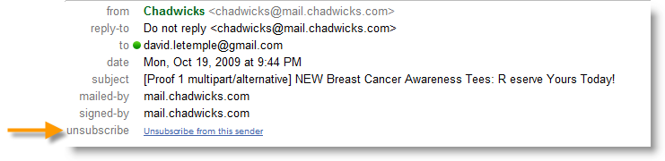

# Raccomandazioni tecniche{#technical-recommendations}

Di seguito sono elencate diverse tecniche, configurazioni e strumenti utilizzabili per migliorare il tasso di recapito.

## Configurazione {#configuration}

### Inverti DNS {#reverse-dns}

 Adobe Campaign verifica se per un indirizzo IP viene fornito un DNS inverso e che questo indichi correttamente l&#39;IP.

Un punto importante nella configurazione di rete è assicurarsi che sia definito un DNS inverso corretto per ciascuno degli indirizzi IP per i messaggi in uscita. Ciò significa che per un dato indirizzo IP, esiste un record DNS inverso (record PTR) con un corrispondente loop DNS (record A) all&#39;indirizzo IP iniziale.

La scelta del dominio per un DNS inverso ha un impatto quando si tratta di alcuni ISP. AOL, in particolare, accetta solo cicli di feedback con un indirizzo nello stesso dominio del DNS inverso (vedere Ciclo [di](#feedback-loop)feedback).

È disponibile uno strumento per verificare la configurazione di un dominio: [https://mxtoolbox.com/SuperTool.aspx](https://mxtoolbox.com/SuperTool.aspx).

### Regole MX {#mx-rules}

Le regole MX (Mail eXchanger) sono regole che gestiscono la comunicazione tra un server di invio e un server di ricezione.

Più precisamente, vengono utilizzati per controllare la velocità alla quale Campaign MTA (Message Transfer Agent) invia e-mail a ogni singolo dominio e-mail o ISP (ad es. hotmail.com, comcast.net). Tali regole si basano in genere sui limiti pubblicati dagli ISP (ad esempio, non includono più di 20 messaggi per ogni connessione SMTP).

For more on MX management, refer to [this section](../../installation/using/email-deliverability.md#mx-configuration).

### TLS {#tls}

TLS (Transport Layer Security) è un protocollo di cifratura che può essere utilizzato per proteggere la connessione tra due server e-mail e proteggere il contenuto di un&#39;e-mail dalla lettura da parte di altri destinatari.

## Autenticazione {#authentication}

### SPF {#spf}

SPF (Sender Policy Framework) è uno standard di autenticazione tramite e-mail che consente al proprietario di un dominio di specificare quali server e-mail possono inviare e-mail per conto di tale dominio. Questo standard utilizza il dominio nell&#39;intestazione &quot;Return-Path&quot; dell&#39;e-mail (detto anche indirizzo &quot;Envelope From&quot;).

È disponibile uno strumento per verificare un record SPF: [https://www.kitterman.com/spf/validate.html](https://www.kitterman.com/spf/validate.html)

SPF è una tecnica che, in una certa misura, consente di verificare che il nome di dominio utilizzato in un&#39;e-mail non sia forgiato. Quando un messaggio viene ricevuto da un dominio, viene interrogato il server DNS del dominio. La risposta è un breve record (il record SPF) che indica quali server sono autorizzati a inviare e-mail da questo dominio. Se si presuppone che solo il proprietario del dominio abbia i mezzi per cambiare questo record, si può considerare che questa tecnica non consente di forgiare l&#39;indirizzo del mittente, almeno non la parte dal diritto del &quot;@&quot;.

Nella specifica [](https://www.rfc-editor.org/info/rfc4408)RFC 4408 finale, vengono utilizzati due elementi del messaggio per determinare il dominio considerato come mittente: Il dominio specificato dal comando SMTP &quot;HELO&quot; (o &quot;EHLO&quot;) e il dominio specificato dall&#39;indirizzo dell&#39;intestazione &quot;Return-Path&quot; (o &quot;MAIL FROM&quot;), che è anche l&#39;indirizzo di rimbalzo. Considerazioni diverse consentono di tenere conto solo di uno di questi valori; è consigliabile assicurarsi che entrambe le origini specifichino lo stesso dominio.

Il controllo dell&#39;SPF fornisce una valutazione della validità del dominio del mittente:

* **Nessuno**: Non è stato possibile effettuare alcuna valutazione,
* **Neutro**: Il dominio interrogato non abilita la valutazione,
* **Passa**: Il dominio è considerato autentico,
* **Errore**: Il dominio è forged e il messaggio deve essere rifiutato,
* **SoftFail**: Il dominio è probabilmente forgiato, ma il messaggio non deve essere rifiutato solo sulla base di tale risultato,
* **TempError**: Un errore temporaneo ha interrotto la valutazione. Il messaggio può essere rifiutato,
* **PermError**: I record SPF del dominio non sono validi.

Va notato che i record effettuati a livello dei server DNS possono richiedere fino a 48 ore per essere presi in considerazione. Questo ritardo dipende dalla frequenza con cui vengono aggiornate le cache DNS dei server riceventi.

### DKIM {#dkim}

L&#39;autenticazione DKIM (DomainKeys Identified Mail) è un successore di SPF e utilizza la crittografia a chiave pubblica che consente al server di posta elettronica ricevente di verificare che un messaggio sia stato effettivamente inviato dalla persona o dall&#39;entità da cui sostiene di essere stato inviato e se il contenuto del messaggio sia stato alterato tra il momento in cui è stato inviato originariamente (e DKIM &quot;firmato&quot;) e l&#39;ora in cui è stato ricevuto. In genere, questo standard utilizza il dominio nell’intestazione &quot;Da&quot; o &quot;Mittente&quot;. Per garantire il livello di protezione del DKIM, il formato 1024b è la dimensione consigliata per le best practice di cifratura. Le chiavi DKIM inferiori non saranno considerate valide dalla maggior parte dei provider di accesso.

DKIM proviene da una combinazione di DomainKeys, Yahoo! e Cisco Identificato principi di autenticazione della posta Internet e viene utilizzato per verificare l&#39;autenticità del dominio del mittente e garantire l&#39;integrità del messaggio.

DKIM ha sostituito l&#39;autenticazione **DomainKeys** .

L’utilizzo di DKIM richiede alcuni prerequisiti:

* **Protezione**: La cifratura è un elemento chiave del DKIM e per assicurare il livello di sicurezza del DKIM dalla primavera 2013, 1024b è la dimensione consigliata per le best practice di cifratura. Le chiavi DKIM inferiori non saranno considerate valide dalla maggior parte dei provider di accesso.
* **Reputazione**: la reputazione si basa sull&#39;IP e/o sul dominio, ma anche il selettore DKIM meno trasparente è un elemento chiave da prendere in considerazione. La scelta del selettore è importante: evitare di mantenere il &quot;default&quot; che potrebbe essere utilizzato da chiunque e quindi ha una reputazione molto debole. È necessario implementare un selettore diverso per le comunicazioni **di** conservazione e acquisizione e per l&#39;autenticazione.
* **dichiarazione** opzione Adobe Campaign: in  campagna di Adobe la chiave privata DKIM è basata su un selettore DKIM e un dominio. Al momento non è possibile creare più chiavi private per lo stesso dominio/sottodominio con diversi selettori. Non è possibile definire il dominio o il sottodominio del selettore da utilizzare per l&#39;autenticazione nella piattaforma o nell&#39;e-mail. In alternativa, la piattaforma selezionerà una delle chiavi private, il che significa che l&#39;autenticazione ha una probabilità elevata di errore.

>[!NOTE]
>
>* Se hai configurato DomainKeys per la tua istanza  Adobe Campaign, devi solo selezionare **dkim** nelle regole [di gestione del](../../delivery/using/understanding-delivery-failures.md#domain-management)dominio. In caso contrario, seguire gli stessi passaggi di configurazione (chiave pubblica/privata) di DomainKeys.
>* Non è necessario abilitare sia DomainKeys che DKIM per lo stesso dominio di DKIM è una versione migliorata di DomainKeys.
>* I seguenti domini convalidano attualmente DKIM: AOL, Gmail.


>[!IMPORTANT]
>
>Per le installazioni ospitate o ibride, se avete effettuato l’aggiornamento all’MTA [](https://helpx.adobe.com/it/campaign/kb/acc-campaign-enhanced-mta.html)avanzata, la firma dell’autenticazione tramite e-mail DKIM viene fatta dall’MTA avanzata per tutti i messaggi con tutti i domini.

### DMARC {#dmarc}

DMARC (Domain-based Message Authentication, Reporting and Conformance) è la forma più recente di autenticazione tramite e-mail e si basa sull&#39;autenticazione SPF e DKIM per determinare se un&#39;e-mail viene passata o meno. DMARC è unico e potente in due modi molto importanti:

* Conformità: consente al mittente di indicare agli ISP cosa fare con qualsiasi messaggio che non riesce ad autenticarsi (ad es. non accettarlo).
* Reporting: fornisce al mittente un rapporto dettagliato che mostra tutti i messaggi che non hanno superato l&#39;autenticazione DMARC, insieme al dominio &quot;Da&quot; e all&#39;indirizzo IP utilizzati per ciascuno di essi. Questo consente a un&#39;azienda di identificare e-mail legittime che non ottengono l&#39;autenticazione e che necessitano di alcuni tipi di &quot;correzione&quot; (ad esempio, l&#39;aggiunta di indirizzi IP al proprio record SPF), nonché le fonti e la prevalenza dei tentativi di phishing nei propri domini e-mail.

DMARC può sfruttare i report generati da [250ok](https://250ok.com/).

<!--#### Configuring the application {#configuring-the-application}

To define the domain used for the HELO command, edit the instance's configuration file (conf/config-instance.xml) and define a "localDomain" attribute as follows:

```
<serverConf>
  <shared>
    <dnsConfig localDomain="mydomain.net"/>
  </shared>
</serverConf>
```

The MAIL FROM domain is the domain used in technical bounce messages. This address is defined in the deployment wizard or via the NmsEmail_DefaultErrorAddr option.

#### DNS configuration {#dns-configuration}

An SPF record can currently be defined on a DNS server as a TXT type record (code 16) or an SPF type record (code 99). An SPF record takes the form of a character string. For example:

```
v=spf1 ip4:12.34.56.78/32 ip4:12.34.56.79/32 ~all
```

defines the 2 IP addresses 12.34.56.78 and 12.34.56.79 as authorized to send emails for the domain. **~all** means that any other address should be interpreted as a SoftFail.

Recommendations for defining an SPF record:

* Add **~all** (SoftFail) or **-all** (Fail) at the end to reject all servers other than those defined. Without this, servers will be able to forge this domain (with a Neutral evaluation).
* Do not add **ptr** (openspf.org recommends against this as costly and unreliable).-->

## Ciclo di feedback {#feedback-loop}

Un ciclo di feedback funziona dichiarando a livello di ISP un indirizzo e-mail specificato per una serie di indirizzi IP utilizzati per inviare i messaggi. L&#39;ISP invierà a questa cassetta postale, in modo simile a quello che viene fatto per i messaggi di rimbalzo, quei messaggi che vengono segnalati dai destinatari come spam. La piattaforma deve essere configurata per bloccare le consegne future agli utenti che hanno inoltrato reclamo. È importante non contattarli più anche se non hanno utilizzato il collegamento di rinuncia corretto. È sulla base di questi reclami che un ISP aggiungerà un indirizzo IP al suo elenco Bloccati. A seconda dell&#39;ISP, un tasso di reclamo di circa l&#39;1% bloccherà un indirizzo IP.

È in corso di elaborazione uno standard per definire il formato dei messaggi del ciclo di feedback: il formato ARF ( [Abuse Feedback Reporting Format)](https://tools.ietf.org/html/rfc6650).

L&#39;implementazione di un ciclo di feedback per un&#39;istanza richiede:

* Una cassetta postale dedicata all&#39;istanza, che può essere la cassetta postale di rimbalzo
* Indirizzi di invio IP dedicati all&#39;istanza

L’implementazione di un semplice ciclo di feedback in  Adobe Campaign utilizza la funzionalità dei messaggi di rimbalzo. La cassetta postale del ciclo di feedback viene utilizzata come casella di posta rimbalzata e viene definita una regola per rilevare tali messaggi. Gli indirizzi e-mail dei destinatari che hanno segnalato il messaggio come spam verranno aggiunti all&#39;elenco di quarantena.

* Create o modificate una regola di posta **rimbalzata, Feedback_loop**, in **[!UICONTROL Administration > Campaign Management > Non deliverables Management > Mail rule sets]** base al motivo **Rifiutato** e al tipo **Rigido**.
* Se una cassetta postale è stata definita appositamente per il ciclo di feedback, definire i parametri per accedervi creando un nuovo account Bounce Mails esterno in **[!UICONTROL Administration > Platform > External accounts]**.

Il meccanismo è immediatamente operativo per l&#39;elaborazione delle notifiche di reclamo. Per assicurarsi che questa regola funzioni correttamente, è possibile disattivare temporaneamente gli account in modo che non raccolgano questi messaggi, quindi controllare manualmente il contenuto della cassetta postale del ciclo di feedback. Sul server, eseguite i seguenti comandi:

```
nlserver stop inMail@instance,
nlserver inMail -instance:instance -verbose.
```

Se dovete utilizzare un unico indirizzo del ciclo di feedback per più istanze, dovete:

* Replicare i messaggi ricevuti su un numero illimitato di caselle di posta elettronica,
* Far sì che ogni cassetta postale venga prelevata da un&#39;unica istanza,
* Configurate le istanze in modo che elaborino solo i messaggi che le riguardano: le informazioni sull’istanza sono incluse nell’intestazione Message-ID dei messaggi inviati da  Adobe Campaign e quindi si trovano anche nei messaggi del ciclo di feedback. È sufficiente specificare il parametro **checkInstanceName** nel file di configurazione dell’istanza (per impostazione predefinita, l’istanza non viene verificata e questo potrebbe causare una quarantena errata per alcuni indirizzi):

   ```
   <serverConf>
     <inMail checkInstanceName="true"/>
   </serverConf>
   ```

 servizio di distribuzione Adobe Campaign gestisce la sottoscrizione a servizi di loop di feedback per i seguenti ISP: AOL, BlueTie, Comcast, Cox, EarthLink, FastMail, Gmail, Hotmail, HostedEmail, Libero, Mail.ru, MailTrust, OpenSRS, QQ, RoadRunner, Synacor, Telenor, Terra, UnitedOnline, USA, XS4ALL, Yahoo, Yandex, Zoho.

## Elenco-Annulla sottoscrizione {#list-unsubscribe}

### Informazioni su List-Unsubscription {#about-list-unsubscribe}

L&#39;aggiunta di un&#39;intestazione SMTP denominata **List-Unsubscription** è obbligatoria per garantire una gestione ottimale della recapito.

Questa intestazione può essere utilizzata come alternativa all’icona &quot;Report as SPAM&quot; (Report as SPAM). Viene visualizzato come collegamento di annullamento dell’iscrizione nell’interfaccia e-mail.

Questa funzionalità consente di proteggere la reputazione e i commenti verranno eseguiti come annullamento dell’iscrizione.

>[!NOTE]
>
>Questa funzionalità è disponibile dalla build 6831.

Per utilizzare List-Annulla sottoscrizione, è necessario immettere una riga di comando simile alla seguente:

```
List-Unsubscribe: mailto: client@newsletter.example.com?subject=unsubscribe?body=unsubscribe
```

>[!IMPORTANT]
>
>L&#39;esempio precedente è basato sulla tabella del destinatario. Se l&#39;implementazione del database viene eseguita da un&#39;altra tabella, assicurarsi di ripetere la riga di comando con le informazioni corrette.

Per creare una **sottoscrizione** elenco dinamica è possibile utilizzare la seguente riga di comando:

```
List-Unsubscribe: mailto: %=errorAddress%?subject=unsubscribe%=message.mimeMessageId%
```

Gmail, Outlook.com e Microsoft Outlook supportano questo metodo e un pulsante di annullamento della sottoscrizione è disponibile direttamente nella loro interfaccia. Questa tecnica riduce i tassi di reclamo.




Puoi implementare **List-Unsubscription** tramite:

* aggiungere direttamente la riga di comando nel modello di consegna; vedete [questa sezione](#adding-a-command-line-in-a-delivery-template),
* oppure, creare una regola di tipologia - vedere [questa sezione](#creating-a-typology-rule).

### Aggiunta di una riga di comando in un modello di consegna {#adding-a-command-line-in-a-delivery-template}

La riga di comando deve essere aggiunta nella sezione aggiuntiva dell&#39;intestazione SMTP dell&#39;e-mail.

Questa aggiunta può essere effettuata in ogni e-mail o in modelli di consegna esistenti. Potete anche creare un nuovo modello di consegna che includa questa funzionalità.

### Creazione di una regola di tipologia {#creating-a-typology-rule}

La regola deve contenere lo script che genera la riga di comando e deve essere inclusa nell&#39;intestazione dell&#39;e-mail.

>[!NOTE]
>
>È consigliabile creare una regola di tipologia: la funzionalità Elenco sottoscrizioni verrà aggiunta automaticamente in ogni e-mail.

1. Annulla sottoscrizione elenco: &lt;mailto:unsubscribe@domain.com>

   Facendo clic sul collegamento di **annullamento della sottoscrizione** , si apre il client e-mail predefinito per l’utente. Questa regola di tipologia deve essere aggiunta in una tipologia utilizzata per creare e-mail.

1. Annulla sottoscrizione elenco: `<https://domain.com/unsubscribe.jsp>`

   Facendo clic sul collegamento di **annullamento della sottoscrizione** , l’utente viene reindirizzato al modulo di annullamento della sottoscrizione.

   Esempio:

   

## Ottimizzazione e-mail {#email-optimization}

### SMTP {#smtp}

SMTP (Simple Mail Transfer Protocol) è uno standard Internet per la trasmissione di e-mail.

Gli errori SMTP non controllati da una regola sono elencati nella cartella **[!UICONTROL Administration]** > **[!UICONTROL Campaign Management]** > **[!UICONTROL Non deliverables Management]** > **[!UICONTROL Delivery log qualification]** . Questi messaggi di errore vengono interpretati per impostazione predefinita come errori non raggiungibili. Gli errori più comuni devono essere identificati e una regola corrispondente aggiunta in **[!UICONTROL Administration]** > **[!UICONTROL Campaign Management]** > **[!UICONTROL Non deliverables Management]** > **[!UICONTROL Mail rule sets]** se si desidera qualificare correttamente il feedback dai server SMTP. In caso contrario, la piattaforma eseguirà tentativi non necessari (caso di utenti sconosciuti) o metterà erroneamente in quarantena alcuni destinatari dopo un determinato numero di test.

### IP dedicati {#dedicated-ips}

 Adobe offre una strategia IP dedicata a ciascun cliente con un IP di espansione per costruire una reputazione e ottimizzare le prestazioni di distribuzione.

## Certificazione IP {#ip-certification}

La certificazione IP è un programma di invio di best practice che aiuta a garantire che le e-mail vengano ricevute senza essere bloccate da filtri antispam o altri sistemi di blocco delle e-mail.

Attualmente due provider offrono la certificazione IP: Return Path e Certified Senders Alliance.

I mittenti certificati vengono aggiunti ai inserire nell&#39;elenco Consentiti di  e-mail utilizzati dai provider di cassette postali globali e dalle società di sicurezza e-mail. Questi inserire nell&#39;elenco Consentiti commerciali si basano su un sistema che consente al mittente di bypassare completamente i filtri antispam o di ricevere punti incrementali al momento dell&#39;ingresso nel sistema.

Il programma [Return Path Certification](https://www.validity.com/products/returnpath/certification/) offre una serie di vantaggi, tra cui:

* Un aumento misurabile del posizionamento delle caselle di posta in entrata nei principali fornitori di cassette postali come Microsoft, AOL, Yahoo, Gmail, Comcast, Orange, Mail.ru e altro ancora
* Buona reputazione e trattamento a filtri critici come Cloudmark, SpamAssassin e Cisco Ironport
* Un team dedicato al monitoraggio 24 ore su 24, con avvisi di sicurezza e collaborazione con voi attraverso la risoluzione di eventuali compromessi
* Dati del provider di cassette postali che forniscono informazioni dettagliate su KPI, posizionamento e prestazioni di certificazione
* Riscaldamento IP semplificato e più veloce, inclusa una maggiore reputazione e riconoscimento durante la migrazione o l&#39;ottenimento di un nuovo indirizzo IP

La Certificazione [Certified Senders Alliance](https://certified-senders.org/certification-process/) offre, tra gli altri, i seguenti vantaggi:

* Certificazione dei mittenti di e-mail commerciali in grado di soddisfare standard di qualità elevati
* Miglioramento della consegna e della recapito delle e-mail commerciali per aumentare il tasso di posizionamento delle inbox e ridurre il filtraggio dello spam
* Tutela dai rischi giuridici e finanziari rispettando pienamente le norme giuridiche
* Proteggere la reputazione mediante avvertenze anticipate da parte dell&#39;Ufficio di denuncia CSA e resoconti giornalieri sulle intercettazioni di spam

Gli ISP sono liberi di utilizzare questi servizi e il numero di ISP può variare a seconda del inserire nell&#39;elenco Consentiti di .

Tuttavia, poiché sempre più ISP generano i propri filtri antispam in base al comportamento del proprietario della inbox anziché analizzare il contenuto del messaggio stesso, l&#39;utilizzo della certificazione IP non può essere una garanzia di posizionamento della inbox o addirittura di consegna.
