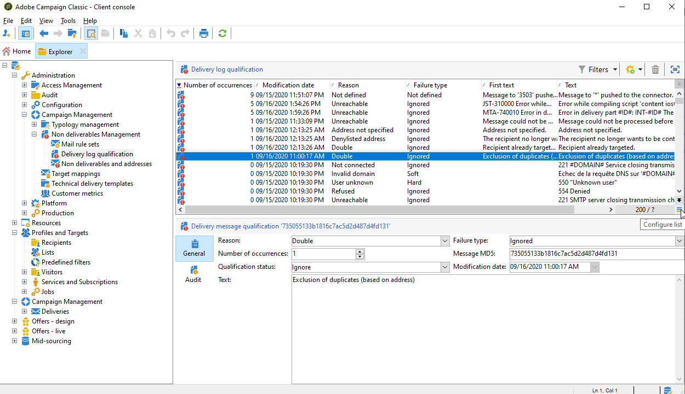
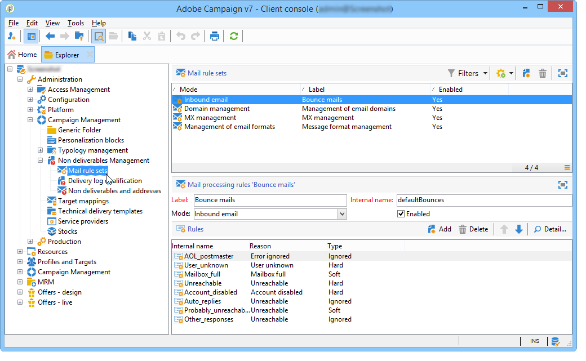

# Errori di consegna{#understanding-delivery-failures}

## Informazioni sugli errori di consegna {#about-delivery-failures}

Quando un messaggio (e-mail, SMS, notifica push) non può essere inviato a un profilo, il server remoto invia automaticamente un messaggio di errore, raccolto dalla piattaforma Adobe Campaign e qualificato per determinare se l’indirizzo e-mail o il numero di telefono devono essere posti in quarantena o meno. Consulta [Gestione della posta non recapitata](#bounce-mail-management).

>[!NOTE]
>
>I messaggi di errore **E-mail** (o &quot;mancati recapiti&quot;) sono qualificati dall’MTA avanzato (mancati recapiti sincroni) o dal processo inMail (mancati recapiti asincroni).
>
>I messaggi di errore **SMS** (o &quot;SR&quot; per &quot;Report di stato&quot;) sono qualificati dal processo MTA.

Dopo l’invio del messaggio, i registri di consegna ti consentono di visualizzare lo stato di consegna per ciascun profilo e il tipo e il motivo dell’errore associati.

I messaggi possono essere esclusi anche durante la preparazione della consegna se un indirizzo è messo in quarantena o se un profilo è in fase di inserisce nell&#39;elenco Bloccati di un’. I messaggi esclusi sono elencati nel dashboard di consegna.

**Argomenti correlati:**

* [Registri e cronologia delle consegne](delivery-dashboard.md#delivery-logs-and-history)
* [Stato non riuscito](delivery-performances.md#failed-status)
* [Tipi e motivi di errori di consegna](#delivery-failure-types-and-reasons)

## Tipi e motivi di errori di consegna {#delivery-failure-types-and-reasons}

Quando un messaggio non riesce, sono disponibili tre tipi di errore. Ogni tipo di errore determina se un indirizzo viene inviato alle quarantene. Per ulteriori informazioni, consulta [Condizioni per l&#39;invio di un indirizzo in quarantena](understanding-quarantine-management.md#conditions-for-sending-an-address-to-quarantine)

* **Rigido**: un errore &quot;rigido&quot; indica un indirizzo non valido. Ciò comporta un messaggio di errore che indica esplicitamente che l’indirizzo non è valido, ad esempio: &quot;Utente sconosciuto&quot;.
* **Morbido**: potrebbe trattarsi di un errore temporaneo o di un errore che non è stato possibile classificare, ad esempio: &quot;Dominio non valido&quot; o &quot;Casella in entrata piena&quot;.
* **Ignorato**: si tratta di un errore che è noto come temporaneo, ad esempio &quot;Fuori sede&quot;, o di un errore tecnico, ad esempio se il tipo di mittente è &quot;postmaster&quot;.

I possibili motivi di un errore di consegna sono:

<table> 
 <tbody> 
  <tr> 
   <td> Etichetta errore </td> 
   <td> Tipo di errore </td> 
   <td> Valore tecnico </td> 
   <td> Descrizione </td> 
  </tr> 
  <tr> 
   <td> Account disabilitato </td> 
   <td> Morbido/rigido </td> 
   <td> 4 </td> 
   <td> L’account collegato all’indirizzo non è più attivo. Quando il provider di accesso a Internet (IAP) rileva un periodo prolungato di inattività, può chiudere l'account dell'utente. Le consegne all’indirizzo dell’utente saranno quindi impossibili. Se l’account è temporaneamente disabilitato a causa di sei mesi di inattività e può ancora essere attivato, verrà assegnato lo stato Con errori e l’account verrà ritentato fino a quando il contatore degli errori non raggiunge 5. Se l'errore segnala che l'account è disattivato in modo permanente, verrà impostato direttamente su Quarantena.  </td> 
  </tr> 
  <tr> 
   <td> Indirizzo in quarantena </td> 
   <td> Rigido </td> 
   <td> 9 </td> 
   <td> L'indirizzo è stato messo in quarantena.  </td> 
  </tr> 
  <tr> 
   <td> Indirizzo non specificato </td> 
   <td> Rigido </td> 
   <td> 7 </td> 
   <td> Nessun indirizzo specificato per il destinatario.  </td> 
  </tr> 
  <tr> 
   <td> Indirizzo di qualità scadente </td> 
   <td> Ignorato </td> 
   <td> 14 </td> 
   <td> La valutazione della qualità per questo indirizzo è troppo bassa.  </td> 
  </tr> 
  <tr> 
   <td> Indirizzo inserito nell’elenco bloccati </td> 
   <td> Rigido </td> 
   <td> 8 </td> 
   <td> L’indirizzo è stato aggiunto al inserisco nell'elenco Bloccati di invio dell’. Questo stato viene utilizzato per importare dati da elenchi esterni e sistemi esterni nell'elenco di quarantena di Adobe Campaign.  </td> 
  </tr> 
  <tr> 
   <td> Indirizzo di controllo </td> 
   <td> Ignorato </td> 
   <td> 127 </td> 
   <td> L'indirizzo del destinatario fa parte del gruppo di controllo.  </td> 
  </tr> 
  <tr> 
   <td> Doppio </td> 
   <td> Ignorato </td> 
   <td> 10 </td> 
   <td> L'indirizzo del destinatario era già in questa consegna.  </td> 
  </tr> 
  <tr> 
   <td> Errore ignorato </td> 
   <td> Ignorato </td> 
   <td> 25 </td> 
   <td> L'indirizzo è sul elenco Consentiti di. L'errore viene quindi ignorato e verrà inviato un messaggio e-mail.  </td> 
  </tr> 
  <tr> 
   <td> Escluso dopo arbitrato </td> 
   <td> Ignorato </td> 
   <td> 12 </td> 
   <td> Il destinatario è stato escluso da una regola di tipologia della campagna di tipo "arbitrato".  </td> 
  </tr> 
  <tr> 
   <td> Escluso da una regola SQL </td> 
   <td> Ignorato </td> 
   <td> 11 </td> 
   <td> Il destinatario è stato escluso da una regola di tipologia di campagna di tipo 'SQL'.  </td> 
  </tr> 
  <tr> 
   <td> Dominio non valido </td> 
   <td> Morbido </td> 
   <td> 2 </td> 
   <td> Il dominio dell’indirizzo e-mail non è corretto o non esiste più. Questo profilo sarà nuovamente oggetto di targeting fino a raggiungere 5 errori. In seguito, il record verrà impostato sullo stato di quarantena e non verrà eseguito alcun nuovo tentativo.  </td> 
  </tr> 
  <tr> 
   <td> Cassetta postale piena </td> 
   <td> Morbido </td> 
   <td> 5 </td> 
   <td> La cassetta postale dell'utente è piena e non può accettare altri messaggi. Questo profilo sarà nuovamente oggetto di targeting fino a raggiungere 5 errori. Successivamente, il record verrà impostato sullo stato di quarantena e non verrà eseguito alcun nuovo tentativo.  Questo tipo di errore è gestito da un processo di pulizia. L'indirizzo viene impostato su uno stato valido dopo 30 giorni.  Avviso: per consentire la rimozione automatica dell'indirizzo dall'elenco degli indirizzi in quarantena, è necessario avviare il flusso di lavoro tecnico Database cleanup.  </td> 
  </tr> 
  <tr> 
   <td> Non connesso </td> 
   <td> Ignorato </td> 
   <td> 6 </td> 
   <td> Il telefono cellulare del destinatario è spento o non è connesso alla rete quando il messaggio viene inviato.  </td> 
  </tr> 
  <tr> 
   <td> Non definito </td> 
   <td> Non definito </td> 
   <td> 0 </td> 
   <td> L’indirizzo è in qualificazione perché l’errore non è stato ancora incrementato. Questo tipo di errore si verifica quando un nuovo messaggio di errore viene inviato dal server: può essere un errore isolato, ma se si verifica di nuovo, il contatore degli errori aumenta, avvisando i team tecnici. Possono quindi eseguire l'analisi dei messaggi e qualificare questo errore tramite il nodo Amministrazione / Campaign Management / Gestione non deliverables nella struttura ad albero.  </td> 
  </tr> 
  <tr> 
   <td> Non idoneo per le offerte </td> 
   <td> Ignorato </td> 
   <td> 16 </td> 
   <td> Il destinatario non era idoneo per le offerte nella consegna.  </td> 
  </tr> 
  <tr> 
   <td> Rifiutato </td> 
   <td> Morbido/rigido </td> 
   <td> 20 </td> 
   <td> L’indirizzo è stato messo in quarantena a causa di un feedback di sicurezza come segnalazione di spam. In base all'errore, l'indirizzo verrà ritentato fino a quando il contatore degli errori non raggiunge il valore 5 oppure verrà inviato direttamente alle quarantene.  </td> 
  </tr> 
  <tr> 
   <td> Target di dimensioni limitate </td> 
   <td> Ignorato </td> 
   <td> 17 </td> 
   <td> È stata raggiunta la dimensione massima di consegna per il destinatario.  </td> 
  </tr> 
  <tr> 
   <td> Indirizzo non qualificato </td> 
   <td> Ignorato </td> 
   <td> 15 </td> 
   <td> L'indirizzo postale non è stato qualificato.  </td> 
  </tr> 
  <tr> 
   <td> Non raggiungibile </td> 
   <td> Morbido/rigido </td> 
   <td> 3 </td> 
   <td> Si è verificato un errore nella catena di consegna del messaggio. Potrebbe trattarsi di un problema nell’inoltro SMTP, un dominio temporaneamente non raggiungibile, ecc. In base all'errore, l'indirizzo verrà ritentato fino a quando il contatore degli errori non raggiunge il valore 5 oppure verrà inviato direttamente alle quarantene.  </td> 
  </tr> 
  <tr> 
   <td> Utente sconosciuto </td> 
   <td> Rigido </td> 
   <td> 1 </td> 
   <td> L'indirizzo non esiste. Non verranno tentate ulteriori consegne per questo profilo.  </td> 
  </tr> 
 </tbody> 
</table>

## Tentativi dopo un errore temporaneo di consegna {#retries-after-a-delivery-temporary-failure}

Se un messaggio non riesce a causa di un errore **Morbido** o **Ignorato** temporaneo, verranno eseguiti nuovi tentativi per la durata della consegna.

>[!NOTE]
>
>I messaggi temporaneamente non recapitati possono essere correlati solo a un errore **morbido** o **ignorato**, ma non a un errore **rigido** (vedi [Tipi e motivi di errori di recapito](#delivery-failure-types-and-reasons)).

>[!IMPORTANT]
>
>Per le installazioni in hosting o ibride, se hai eseguito l&#39;aggiornamento all&#39;[MTA avanzato](sending-with-enhanced-mta.md), le impostazioni dei nuovi tentativi nella consegna non vengono più utilizzate da Campaign. I nuovi tentativi di mancato recapito non permanenti e il periodo di tempo che intercorre tra di essi sono determinati dall’MTA avanzato in base al tipo e alla gravità delle risposte di mancato recapito provenienti dal dominio e-mail del messaggio.

Per le installazioni on-premise e le installazioni in hosting/ibride che utilizzano l’MTA di Campaign legacy, per modificare la durata di una consegna, passa ai parametri avanzati della consegna o del modello di consegna e specifica la durata desiderata nel campo corrispondente. Vedere [Definizione del periodo di validità](steps-sending-the-delivery.md#defining-validity-period).

La configurazione predefinita consente cinque tentativi a intervalli di un’ora, seguiti da un nuovo tentativo al giorno per quattro giorni. Il numero di tentativi può essere modificato a livello globale (contatta l’amministratore tecnico Adobe) o per ogni modello di consegna o consegna. Consulta [Configurare nuovi tentativi](steps-sending-the-delivery.md#configuring-retries).

## Errori sincroni e asincroni {#synchronous-and-asynchronous-errors}

Un messaggio può non riuscire immediatamente (errore sincrono) o in seguito, dopo che è stato inviato (errore asincrono).

* Errore sincrono: il server di posta remota contattato dal server di consegna Adobe Campaign ha restituito immediatamente un messaggio di errore. La consegna non può essere inviata al server del profilo. Adobe Campaign qualifica ogni errore per determinare se gli indirizzi e-mail interessati devono essere posti in quarantena o meno. Consulta [Qualificazione di mail non recapitate](#bounce-mail-qualification).
* Errore asincrono: una mail non recapitata o un SR è stato inviato in seguito dal server ricevente. Il messaggio viene caricato in una cassetta postale tecnica utilizzata dall&#39;applicazione per etichettare i messaggi con un errore. Gli errori asincroni possono verificarsi fino a una settimana dopo l’invio di una consegna.

  >[!NOTE]
  >
  >La configurazione della cassetta postale di mancato recapito è descritta in [questa sezione](../../installation/using/deploying-an-instance.md#managing-bounced-emails).

  Il [ciclo di feedback](https://experienceleague.adobe.com/docs/deliverability-learn/deliverability-best-practice-guide/transition-process/infrastructure.html?lang=it#feedback-loops) funziona come messaggi e-mail non recapitati. Quando un utente qualifica un’e-mail come spam, puoi configurare le regole e-mail in Adobe Campaign per bloccare tutte le consegne a questo utente. I messaggi inviati agli utenti che hanno qualificato un’e-mail come spam vengono automaticamente reindirizzati verso una casella e-mail creata appositamente a tale scopo. Gli indirizzi di questi utenti si trovano in modalità di inserisce nell&#39;elenco Bloccati di anche se non hanno fatto clic sul collegamento di annullamento dell’abbonamento. Gli indirizzi sono in elenco Bloccati di nella tabella di quarantena (**NmsAddress**) e non nella tabella dei destinatari (**NmsRecipient**).

  >[!NOTE]
  >
  >La gestione dei reclami è descritta nella sezione [Gestione del recapito messaggi](about-deliverability.md).

## Gestione posta non recapitata {#bounce-mail-management}

La piattaforma Adobe Campaign consente di gestire gli errori di consegna e-mail tramite la funzionalità di mail non recapitate.

Quando un messaggio e-mail non può essere recapitato a un destinatario, il server di messaggistica remota restituisce automaticamente un messaggio di errore (messaggio non recapitato) a una casella in entrata tecnica progettata a tale scopo.

Per le installazioni on-premise e le installazioni in hosting/ibride che utilizzano l’MTA di Campaign legacy, i messaggi di errore vengono raccolti dalla piattaforma Adobe Campaign e qualificati dal processo inMail per arricchire l’elenco delle regole di gestione e-mail.

>[!IMPORTANT]
>
>Per le installazioni in hosting o ibride, se hai effettuato l&#39;aggiornamento a [MTA avanzato](sending-with-enhanced-mta.md), la maggior parte delle regole di gestione e-mail non viene più utilizzata. Per ulteriori informazioni, consulta [questa sezione](#email-management-rules).

### Qualificazione di mail non recapitate {#bounce-mail-qualification}

>[!IMPORTANT]
>
>Per le installazioni in hosting o ibride, se hai effettuato l&#39;aggiornamento a [MTA avanzato](sending-with-enhanced-mta.md):
>
>* Le qualifiche di mancato recapito nella tabella **[!UICONTROL Delivery log qualification]** non vengono più utilizzate per **messaggi di errore di recapito sincroni**. L’MTA avanzato determina il tipo e la qualifica di mancato recapito e invia nuovamente tali informazioni a Campaign.
>
>* Le mancate consegne **asincrone** sono ancora qualificate dal processo inMail tramite le regole **[!UICONTROL Inbound email]**. Per ulteriori informazioni, consulta [Regole di gestione e-mail](#email-management-rules).
>
>* Per le istanze che utilizzano l&#39;MTA avanzato **senza webhook**, le regole **[!UICONTROL Inbound email]** verranno utilizzate anche per elaborare le e-mail non recapitate sincrone provenienti dall&#39;MTA avanzato, utilizzando lo stesso indirizzo e-mail utilizzato per le e-mail non recapitate asincrone.

Per le installazioni on-premise e in hosting/ibride utilizzando l’MTA di Campaign legacy, quando la consegna di un’e-mail non riesce, il server di consegna Adobe Campaign riceve un messaggio di errore dal server di messaggistica o dal server DNS remoto. L&#39;elenco degli errori è costituito dalle stringhe contenute nel messaggio restituito dal server remoto. A ogni messaggio di errore vengono assegnati tipi e motivi di errore.

Questo elenco è disponibile tramite il nodo **[!UICONTROL Administration > Campaign Management > Non deliverables Management > Delivery log qualification]**. Contiene tutte le regole utilizzate da Adobe Campaign per qualificare gli errori di consegna. Non è esaustivo, è regolarmente aggiornato da Adobe Campaign e può anche essere gestito dall’utente.

Il messaggio restituito dal server remoto alla prima occorrenza di questo tipo di errore viene visualizzato nella colonna **[!UICONTROL First text]** della tabella **[!UICONTROL Delivery log qualification]**. Se questa colonna non è visualizzata, fare clic sul pulsante **[!UICONTROL Configure list]** nella parte inferiore destra dell&#39;elenco per selezionarla.

Adobe Campaign filtra questo messaggio per eliminare il contenuto della variabile (ad esempio ID, date, indirizzi e-mail, numeri di telefono, ecc.) e visualizza il risultato filtrato nella colonna **[!UICONTROL Text]**. Le variabili vengono sostituite con **`#xxx#`**, ad eccezione degli indirizzi sostituiti con **`*`**.

Questo processo consente di riunire tutti gli errori dello stesso tipo ed evitare più voci per errori simili nella tabella Qualificazione del registro di consegna.

>[!NOTE]
>
>Nel campo **[!UICONTROL Number of occurrences]** viene visualizzato il numero di occorrenze del messaggio nell&#39;elenco. Tale numero è limitato a 100 000. È possibile modificare il campo, ad esempio per reimpostarlo.

I messaggi non recapitati possono avere il seguente stato di qualifica:

* **[!UICONTROL To qualify]**: impossibile qualificare la posta non recapitata. È necessario assegnare la qualifica al team Deliverability per garantire un recapito della piattaforma efficiente. Se non è qualificata, la posta non recapitata non viene utilizzata per arricchire l’elenco delle regole di gestione e-mail.
* **[!UICONTROL Keep]**: la posta non recapitata è stata qualificata e verrà utilizzata dal flusso di lavoro **Aggiorna per il recapito messaggi** per essere confrontata con le regole di gestione e-mail esistenti e arricchire l&#39;elenco.
* **[!UICONTROL Ignore]**: la posta non recapitata viene ignorata dall&#39;MTA della campagna, il che significa che non verrà mai messa in quarantena l&#39;indirizzo del destinatario. Non verrà utilizzato dal flusso di lavoro **Aggiorna per il recapito messaggi** e non verrà inviato alle istanze client.

>[!NOTE]
>
>In caso di interruzione di un ISP, le e-mail inviate tramite Campaign verranno contrassegnate erroneamente come messaggi non recapitati. Per risolvere questo problema, devi aggiornare la qualifica di mancato recapito. Per ulteriori informazioni, consulta [questa pagina](update-bounce-qualification.md).

### Regole di gestione e-mail {#email-management-rules}

>[!IMPORTANT]
>
>Per le installazioni in hosting o ibride, se hai effettuato l&#39;aggiornamento a [MTA avanzato](sending-with-enhanced-mta.md), la maggior parte delle regole di gestione e-mail non viene più utilizzata. Per ulteriori dettagli, consulta le sezioni seguenti.

Le regole di posta sono accessibili tramite il nodo **[!UICONTROL Administration > Campaign Management > Non deliverables Management > Mail rule sets]**. Le regole di gestione delle e-mail sono visualizzate nella parte inferiore della finestra.

>[!NOTE]
>
>I parametri predefiniti della piattaforma sono configurati nella procedura guidata di distribuzione. Per ulteriori informazioni, consultare [questa sezione](../../installation/using/deploying-an-instance.md).

Le regole predefinite sono le seguenti.

>[!IMPORTANT]
>
>* Se i parametri sono stati modificati, il server di consegna (MTA) deve essere riavviato.
>* La modifica o la creazione di regole di gestione è riservata agli utenti esperti.

#### E-mail in entrata {#inbound-email}

<!--
STATEMENT ONLY TRUE with Momentum and EFS+:
For hosted or hybrid installations, if you have upgraded to the [Enhanced MTA](sending-with-enhanced-mta.md), and if your instance has **Webhooks** functionality, the **[!UICONTROL Inbound email]** rules are no longer used for synchronous delivery failure error messages. For more on this, see [this section](#bounce-mail-qualification).

For on-premise installations and hosted/hybrid installations using the legacy Campaign MTA, these rules contain the list of character strings which can be returned by remote servers and which let you qualify the error (**Hard**, **Soft** or **Ignored**).-->

Le regole **[!UICONTROL Inbound email]** contengono l&#39;elenco di stringhe di caratteri che possono essere restituite dai server remoti e che ti consentono di qualificare l&#39;errore (**Rigido**, **Morbido** o **Ignorato**).

Quando un&#39;e-mail non riesce, il server remoto restituisce un messaggio di mancato recapito all&#39;indirizzo specificato nei [parametri della piattaforma](../../installation/using/deploying-an-instance.md). Adobe Campaign confronta il contenuto di ogni e-mail non recapitata con le stringhe nell&#39;elenco delle regole, quindi assegna a ogni e-mail uno dei tre [tipi di errore](#delivery-failure-types-and-reasons).

>[!NOTE]
>
>L’utente può creare le proprie regole. Quando si importa un pacchetto e si aggiornano i dati tramite il flusso di lavoro **Aggiorna per il recapito messaggi**, le regole create dall&#39;utente vengono sovrascritte.

Per ulteriori informazioni sulla qualifica della posta non recapitata, consulta [questa sezione](#bounce-mail-qualification).

#### Gestione del dominio {#domain-management}

>[!IMPORTANT]
>
>Per le installazioni in hosting o ibride, se hai effettuato l&#39;aggiornamento a [MTA avanzato](sending-with-enhanced-mta.md), le regole **[!UICONTROL Domain management]** non vengono più utilizzate. La firma di autenticazione dell’e-mail **DKIM (DomainKeys Identified Mail)** viene eseguita dall’MTA avanzato per tutti i messaggi di tutti i domini. La firma non viene eseguita con **ID mittente**, **DomainKeys** o **S/MIME**, a meno che non venga specificato diversamente a livello di MTA avanzato.

Per le installazioni on-premise e le installazioni in hosting/ibride che utilizzano l’MTA di Campaign legacy, il server di messaggistica Adobe Campaign applica una singola regola di **gestione del dominio** a tutti i domini.

<!---->

* Puoi scegliere se attivare o meno alcuni standard di identificazione e chiavi di crittografia per controllare il nome di dominio, ad esempio **ID mittente**, **Chiavi di dominio**, **DKIM** e **S/MIME**.
* I parametri **Inoltro SMTP** consentono di configurare l&#39;indirizzo IP e la porta di un server di inoltro per un dominio specifico. Per ulteriori informazioni, consulta [questa sezione](../../installation/using/configuring-campaign-server.md#smtp-relay).

Se i messaggi vengono visualizzati in Outlook con **[!UICONTROL on behalf of]** nell&#39;indirizzo del mittente, assicurati di non firmare le e-mail con **ID mittente**, che è lo standard obsoleto di autenticazione delle e-mail proprietarie di Microsoft. Se l&#39;opzione **[!UICONTROL Sender ID]** è abilitata, deseleziona la casella corrispondente e contatta [l&#39;Assistenza clienti Adobe](https://helpx.adobe.com/it/enterprise/admin-guide.html/enterprise/using/support-for-experience-cloud.ug.html). Il recapito messaggi non sarà influenzato.

#### Gestione MX {#mx-management}

>[!IMPORTANT]
>
>Per le installazioni in hosting o ibride, se hai effettuato l&#39;aggiornamento a [MTA avanzato](sending-with-enhanced-mta.md), le regole di velocità effettiva di consegna **[!UICONTROL MX management]** non vengono più utilizzate. L’MTA avanzato utilizza le proprie regole MX, che gli consentono di personalizzare la velocità effettiva per dominio in base alla reputazione cronologica dell’e-mail e al feedback in tempo reale proveniente dai domini in cui invii le e-mail.

Per le installazioni on-premise e le installazioni in hosting/ibride che utilizzano l’MTA di Campaign legacy:

* Le regole di gestione MX vengono utilizzate per regolare il flusso delle e-mail in uscita per un dominio specifico. Campionano i messaggi di mancato recapito e bloccano l’invio dove appropriato.

* Il server di messaggistica Adobe Campaign applica regole specifiche ai domini, quindi le regole per il caso generale rappresentato da un asterisco nell’elenco delle regole.

* Per configurare le regole di gestione MX, è sufficiente impostare una soglia e selezionare alcuni parametri SMTP. Una **soglia** è un limite calcolato come percentuale di errore oltre la quale tutti i messaggi verso un dominio specifico vengono bloccati. Ad esempio, nel caso generale, per un minimo di 300 messaggi, l’invio di e-mail viene bloccato per tre ore se il tasso di errore raggiunge il 90%.

Per ulteriori informazioni sulla gestione MX, consulta [questa sezione](../../installation/using/email-deliverability.md#mx-configuration).
