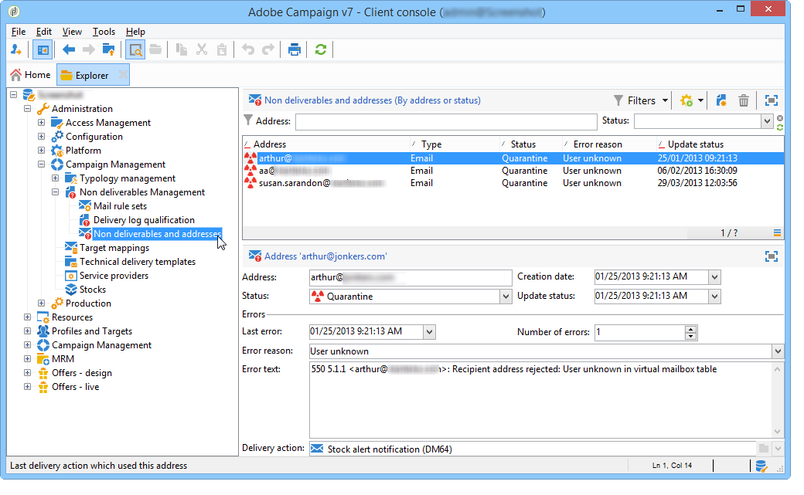

# Informazioni sulla gestione della quarantena{#understanding-quarantine-management}

 Adobe Campaign gestisce un elenco di indirizzi in quarantena. I destinatari il cui indirizzo è stato messo in quarantena sono esclusi per impostazione predefinita durante l’analisi della consegna e non saranno oggetto di targeting. Un indirizzo e-mail può essere messo in quarantena, ad esempio, quando la casella di posta è piena o se l’indirizzo non esiste. In ogni caso, la procedura di quarantena è conforme alle norme specifiche descritte di seguito.

>[!NOTE]
>
>Questa sezione si applica ai canali online: e-mail, SMS, notifiche push.

## Ottimizzazione della consegna attraverso la gestione della quarantena {#optimizing-your-delivery-through-quarantines}

I profili con indirizzi e-mail o numeri di telefono in quarantena vengono automaticamente esclusi durante la preparazione dei messaggi (vedi [Identificare gli indirizzi messi in quarantena per una consegna](#identifying-quarantined-addresses-for-a-delivery)). In questo modo le consegne sono più rapide, poiché il tasso di errore ha un effetto significativo sulla velocità di consegna.

Alcuni provider di accesso a Internet considerano automaticamente le e-mail come spam se il tasso di indirizzi non validi è troppo alto. La quarantena consente quindi di evitare di essere aggiunti al elenco Bloccati da parte di questi provider.

Inoltre, le quarantene contribuiscono a ridurre i costi di invio degli SMS escludendo numeri di telefono errati dalle consegne.

Per ulteriori informazioni sulle best practice per proteggere e ottimizzare le consegne, consulta [questa pagina](delivery-best-practices.md).

### Quarantena e inserisco nell&#39;elenco Bloccati di {#quarantine-vs-denylist}

Inserire nell&#39;elenco Bloccati La quarantena e il non si applicano allo stesso oggetto:

* **Quarantena** si applica solo a un **indirizzo** (o numero di telefono, ecc.), non al profilo stesso. Ad esempio, un profilo con un indirizzo e-mail messo in quarantena può aggiornare il profilo e immettere un nuovo indirizzo, per poi essere nuovamente indirizzato mediante azioni di consegna. Allo stesso modo, se due profili hanno lo stesso numero di telefono, saranno entrambi interessati se il numero viene messo in quarantena.

  Gli indirizzi o i numeri di telefono in quarantena vengono visualizzati nel [registri di esclusione](#identifying-quarantined-addresses-for-a-delivery) (per una consegna) o nella [elenco di quarantena](#identifying-quarantined-addresses-for-the-entire-platform) (per l’intera piattaforma).

* Essere sul **inserisco nell&#39;elenco Bloccati**, dall&#39;altro, darà luogo al **profilo** non sono più oggetto della consegna, ad esempio dopo l’annullamento dell’abbonamento (rinuncia) per un determinato canale. Ad esempio, se un profilo nella inserisce nell&#39;elenco Bloccati di invio del canale e-mail presenta due indirizzi e-mail, entrambi gli indirizzi verranno esclusi dalla consegna.

  Puoi verificare se un profilo si trova nel inserisco nell&#39;elenco Bloccati di per uno o più canali nel **[!UICONTROL No longer contact]** sezione del profilo di **[!UICONTROL General]** scheda. Consulta [questa sezione](../../platform/using/editing-a-profile.md#general-tab).

>[!NOTE]
>
>La quarantena include **[!UICONTROL Denylisted]** stato, che si applica quando i destinatari segnalano il messaggio come spam o rispondono a un messaggio SMS con una parola chiave come &quot;STOP&quot;. In tal caso, l’indirizzo o il numero di telefono del profilo viene messo in quarantena con il **[!UICONTROL Denylisted]** stato. Per ulteriori informazioni sulla gestione dei messaggi STOP SMS, consulta [questa sezione](../../delivery/using/sms-send.md#processing-inbound-messages).

## Identificare gli indirizzi messi in quarantena {#identifying-quarantined-addresses}

È possibile elencare gli indirizzi messi in quarantena per una consegna specifica o per l’intera piattaforma.

### Identificare gli indirizzi messi in quarantena per una consegna {#identifying-quarantined-addresses-for-a-delivery}

Gli indirizzi in quarantena per una consegna specifica vengono elencati durante la fase di preparazione della consegna, nei registri di consegna del dashboard di consegna (vedi [Registri e cronologia delle consegne](delivery-dashboard.md#delivery-logs-and-history)).

### Identificare gli indirizzi messi in quarantena per l’intera piattaforma {#identifying-quarantined-addresses-for-the-entire-platform}

Gli amministratori possono elencare gli indirizzi messi in quarantena per l’intera piattaforma dall’ **[!UICONTROL Administration > Campaign Management > Non deliverables Management > Non deliverables and addresses]** nodo.

>[!NOTE]
>
>Questo menu elenca gli elementi messi in quarantena per i canali **e-mail**, **SMS** e di **notifiche push**.

Per ogni indirizzo sono disponibili le seguenti informazioni:


>[!NOTE]
>
>L’aumento del numero di quarantene è un effetto normale, legato all’&quot;usura&quot; del database. Ad esempio, se la durata di un indirizzo e-mail è considerata di tre anni e la tabella dei destinatari aumenta del 50% ogni anno, l’aumento delle quarantene può essere calcolato come segue:
>
>Fine anno 1: (1&#42;0,33)/(1+0,5)=22%.
>
Fine anno 2: ((1,22&#42;0,33)+0,33)/(1,5+0,75)=32,5%.

### Identificare gli indirizzi messi in quarantena nei rapporti di consegna {#identifying-quarantined-addresses-in-delivery-reports}

I seguenti rapporti forniscono informazioni sugli indirizzi in quarantena:

* Per ogni consegna, il **[!UICONTROL Delivery summary]** rapporto mostra il numero di indirizzi in quarantena nel target di consegna. Vengono visualizzati i seguenti elementi:

   * Il numero di indirizzi messi in quarantena durante l’analisi della consegna,

   * Il numero di indirizzi messi in quarantena dopo l’azione di consegna.

* Il **[!UICONTROL Non-deliverables and bounces]** Il report visualizza informazioni sugli indirizzi messi in quarantena, sui tipi di errore riscontrati e così via, nonché un raggruppamento degli errori per dominio.

Puoi cercare queste informazioni per tutte le consegne della piattaforma (**[!UICONTROL Home page > Reports]**) o per una consegna specifica. Puoi anche creare rapporti personalizzati e selezionare le informazioni da visualizzare.

### Identificare gli indirizzi messi in quarantena per un destinatario {#identifying-quarantined-addresses-for-a-recipient}

Puoi cercare lo stato dell’indirizzo e-mail di qualsiasi destinatario. A questo scopo, seleziona il profilo del destinatario e fai clic sul pulsante **[!UICONTROL Deliveries]** scheda. Per tutte le consegne a quel destinatario, puoi scoprire se l’indirizzo non è riuscito, è stato messo in quarantena durante l’analisi, ecc. Per ogni cartella, puoi visualizzare solo i destinatari il cui indirizzo e-mail è in quarantena. A tale scopo, utilizza **[!UICONTROL Quarantined email address]** filtro applicazione.


## Condizioni per la messa in quarantena di un indirizzo {#conditions-for-sending-an-address-to-quarantine}

Adobe Campaign gestisce la quarantena in base al tipo di consegna non riuscita e al motivo assegnato durante la qualifica dei messaggi di errore (vedi [Qualificazione di mail non recapitate](understanding-delivery-failures.md#bounce-mail-qualification) e [Tipi e motivi di errori di consegna](understanding-delivery-failures.md#delivery-failure-types-and-reasons)).

* **Errore ignorato**: gli errori ignorati non mettono un indirizzo in quarantena.
* **Errore rigido**: l’indirizzo e-mail corrispondente viene messo immediatamente in quarantena.
* **Errore morbido**: gli errori morbidi non mettono immediatamente un indirizzo in quarantena, ma incrementano un contatore di errori. Per ulteriori informazioni, consulta [Gestione degli errori morbidi](#soft-error-management).

Se un utente qualifica un’e-mail come spam ([ciclo di feedback](https://experienceleague.adobe.com/docs/deliverability-learn/deliverability-best-practice-guide/transition-process/infrastructure.html#feedback-loops)), il messaggio viene automaticamente reindirizzato a una casella di posta tecnica gestita da Adobe. L’indirizzo e-mail dell’utente viene quindi messo automaticamente in quarantena con lo stato **[!UICONTROL Denylisted]**. Questo stato si riferisce solo all’indirizzo, il profilo non è nel inserisco nell&#39;elenco Bloccati di, in modo che l’utente continui a ricevere messaggi SMS e notifiche push.

>[!NOTE]
>
In Adobe Campaign la quarantena distingue tra maiuscole e minuscole. Accertati di importare gli indirizzi e-mail in lettere minuscole, in modo che non vengano reindirizzate in un secondo momento.

Nell’elenco degli indirizzi messi in quarantena (vedi [Identificazione degli indirizzi messi in quarantena per l’intera piattaforma](#identifying-quarantined-addresses-for-the-entire-platform)), il **[!UICONTROL Error reason]** indica il motivo per cui l’indirizzo selezionato è stato messo in quarantena.



### Gestione degli errori morbidi {#soft-error-management}

Al contrario degli errori rigidi, gli errori morbidi non mettono immediatamente un indirizzo in quarantena, ma incrementano un contatore di errori.

I tentativi verranno eseguiti durante il [durata della consegna](../../delivery/using/steps-sending-the-delivery.md#defining-validity-period). Quando il contatore di errori raggiunge la soglia limite, l’indirizzo viene messo in quarantena. Per ulteriori informazioni, consulta [Tentativi dopo un errore temporaneo di consegna](understanding-delivery-failures.md#retries-after-a-delivery-temporary-failure).

Il contatore degli errori viene reinizializzato se l&#39;ultimo errore significativo si è verificato più di 10 giorni fa. Lo stato dell’indirizzo diventa quindi **Valido** e viene cancellato dall’elenco delle quarantene dal [Database cleanup](../../production/using/database-cleanup-workflow.md) flusso di lavoro.


Per le installazioni in hosting o ibride, se hai effettuato l’aggiornamento al [MTA avanzato](sending-with-enhanced-mta.md), il numero massimo di tentativi da eseguire in caso di **[!UICONTROL Erroneous]** Lo stato e il ritardo minimo tra i nuovi tentativi si basano ora sulle prestazioni di un IP sia storicamente che attualmente in un determinato dominio.

Per le installazioni on-premise e le installazioni in hosting/ibride che utilizzano l’MTA di Campaign legacy, puoi modificare il numero di errori e il periodo tra due errori. A questo scopo, modifica le impostazioni corrispondenti nella sezione [procedura guidata di distribuzione](../../installation/using/deploying-an-instance.md) (**[!UICONTROL Email channel]** > **[!UICONTROL Advanced parameters]**) o [a livello di consegna](../../delivery/using/steps-sending-the-delivery.md#configuring-retries).


## Rimuovere un indirizzo dalla quarantena {#removing-a-quarantined-address}

### Aggiornamenti automatici {#unquarantine-auto}

Gli indirizzi che soddisfano condizioni specifiche vengono automaticamente eliminati dall’elenco di quarantena da [Database cleanup](../../production/using/database-cleanup-workflow.md) flusso di lavoro.

Gli indirizzi vengono rimossi automaticamente dall’elenco di quarantena nei seguenti casi:

* Indirizzi in una **[!UICONTROL With errors]** Lo stato verrà rimosso dall’elenco di quarantena dopo una consegna riuscita.
* Indirizzi in una **[!UICONTROL With errors]** Lo stato verrà rimosso dall’elenco di quarantena se l’ultimo messaggio non recapitato si è verificato più di 10 giorni fa. Per ulteriori informazioni sulla gestione degli errori soft, consulta [questa sezione](#soft-error-management).
* Indirizzi in una **[!UICONTROL With errors]** stato non restituito con **[!UICONTROL Mailbox full]** L’errore verrà rimosso dall’elenco di quarantena dopo 30 giorni.

Il loro stato diventa quindi **[!UICONTROL Valid]**.

>[!IMPORTANT]
>
Destinatari con un indirizzo in una **[!UICONTROL Quarantine]** o **[!UICONTROL Denylisted]** non vengono mai rimossi, anche se ricevono un’e-mail.

### Aggiornamenti manuali {#unquarantine-manual}

È inoltre possibile rimuovere manualmente la quarantena di un indirizzo. Per rimuovere manualmente un indirizzo dall’elenco di quarantena, modificane lo stato in **[!UICONTROL Valid]** dal **[!UICONTROL Administration > Campaign Management > Non deliverables Management > Non deliverables and addresses]** nodo.


### Aggiornamenti in blocco {#unquarantine-bulk}

Potrebbe essere necessario eseguire aggiornamenti in blocco sull’elenco di quarantena, ad esempio in caso di interruzione del servizio dell’ISP. In questo caso, le e-mail vengono erroneamente contrassegnate come mancate consegne perché non possono essere consegnate correttamente al destinatario. Questi indirizzi devono essere rimossi dall’elenco di quarantena.

Per eseguire questa operazione, crea un flusso di lavoro e aggiungi un **[!UICONTROL Query]** attività nella tabella di quarantena per filtrare tutti i destinatari interessati. Una volta identificate, possono essere rimosse dall’elenco di quarantena e incluse nelle consegne e-mail future di Campaign.

Di seguito sono riportate le linee guida consigliate per questa query:

* Per gli ambienti Campaign Classic v7 con informazioni sulle regole e-mail in entrata nel **[!UICONTROL Error text]** campo dell’elenco di quarantena:

   * **Testo di errore (testo di quarantena)** contiene &quot;Momen_Code10_InvalidRecipient&quot;
   * **Dominio e-mail (@domain)** uguale a domain1.com OR **Dominio e-mail (@domain)** uguale a domain2.com OR **Dominio e-mail (@domain)** uguale a domain3.com
   * **Stato aggiornamento (@lastModified)** il o dopo il `MM/DD/YYYY HH:MM:SS AM`
   * **Stato aggiornamento (@lastModified)** il o prima del `MM/DD/YYYY HH:MM:SS PM`

* Per le istanze di Campaign Classic v7 con informazioni di risposta SMTP non recapitate in **[!UICONTROL Error text]** campo dell’elenco di quarantena:

   * **Testo di errore (testo di quarantena)** contiene &quot;550-5.1.1&quot; E **Testo di errore (testo di quarantena)** contiene &quot;support.ISP.com&quot;

  dove &quot;support.ISP.com&quot; può essere: &quot;support.apple.com&quot; o &quot;support.google.com&quot;, ad esempio

   * **Stato aggiornamento (@lastModified)** il o dopo il `MM/DD/YYYY HH:MM:SS AM`
   * **Stato aggiornamento (@lastModified)** il o prima del  `MM/DD/YYYY HH:MM:SS PM`

Dopo aver visualizzato l’elenco dei destinatari interessati, aggiungi un **[!UICONTROL Update data]** per impostare lo stato del loro indirizzo e-mail su **[!UICONTROL Valid]** in modo che vengano rimossi dall’elenco di quarantena dal **[!UICONTROL Database cleanup]** flusso di lavoro. Puoi anche semplicemente eliminarli dalla tabella di quarantena.

## Quarantene di notifica push {#push-notification-quarantines}

Il meccanismo di quarantena per le notifiche push è globalmente lo stesso del processo generale. Tuttavia, alcuni errori vengono gestiti in modo diverso per le notifiche push. Ad esempio, per alcuni errori soft, non vengono eseguiti nuovi tentativi all’interno della stessa consegna. Le specificità per le notifiche push sono elencate di seguito. Il meccanismo di esecuzione dei nuovi tentativi (numero di tentativi, frequenza) è lo stesso utilizzato per le e-mail.

Gli elementi messi in quarantena sono token del dispositivo.

### quarantena di iOS {#ios-quarantine}

Il protocollo HTTP/V2 consente un feedback diretto e uno stato per ogni consegna push. Se si utilizza il connettore del protocollo HTTP/V2, il servizio di feedback non viene più chiamato dal **[!UICONTROL mobileAppOptOutMgt]** flusso di lavoro. Un token viene considerato non registrato quando un’app mobile viene disinstallata o reinstallata.

In modo sincrono, se il servizio APN restituisce lo stato &quot;unregistered&quot; per un messaggio, il token di destinazione verrà messo immediatamente in quarantena.

<table> 
 <tbody> 
  <tr> 
   <td> <strong>Scenario</strong><br /> </td> 
   <td> <strong>Stato</strong><br /> </td> 
   <td> <strong>Messaggio di errore</strong><br /> </td> 
   <td> <strong>Tipo di errore</strong><br /> </td> 
   <td> <strong>Motivo dell’errore</strong><br /> </td> 
   <td> <strong>Riprova</strong><br /> </td> 
  </tr> 
  <tr> 
   <td> Dispositivo di destinazione acceso<br /> </td> 
   <td> OK<br /> </td> 
   <td> </td> 
   <td> </td> 
   <td> </td> 
   <td> </td> 
  </tr> 
  <tr> 
   <td> Dispositivo di destinazione spento<br /> </td> 
   <td> OK<br /> </td> 
   <td> </td> 
   <td> </td> 
   <td> </td> 
   <td> </td> 
  </tr> 
  <tr> 
   <td> L'utente disabilita le notifiche per l'applicazione<br /> </td> 
   <td> OK<br /> </td> 
   <td> </td> 
   <td> </td> 
   <td> </td> 
   <td> </td> 
  </tr> 
  <tr> 
   <td> Fase di creazione/analisi dei messaggi - Payload troppo grande<br /> </td> 
   <td> Errore<br /> </td> 
   <td> Payload troppo lungo<br /> </td> 
   <td> Morbido<br /> </td> 
   <td> Rifiutato<br /> </td> 
   <td> No<br /> </td> 
  </tr> 
  <tr> 
   <td> Fase di creazione/analisi dei messaggi - problema di formato del contenuto imprevisto<br /> </td> 
   <td> Errore<br /> </td> 
   <td> Vari messaggi di errore in base all’errore<br /> </td> 
   <td> Morbido<br /> </td> 
   <td> Non definito<br /> </td> 
   <td> No<br /> </td> 
  </tr> 
  <tr> 
   <td> Problema del certificato (password, danneggiamento, ecc.) e verifica la connessione al problema APN<br /> </td> 
   <td> Errore<br /> </td> 
   <td> Vari messaggi di errore in base all’errore<br /> </td> 
   <td> Morbido<br /> </td> 
   <td> Rifiutato<br /> </td> 
   <td> No<br /> </td> 
  </tr> 
  <tr> 
   <td> Connessione di rete persa durante l'invio<br /> </td> 
   <td> Errore<br /> </td> 
   <td> Errore di connessione<br /> </td> 
   <td> Non definito<br /> </td> 
   <td> Non raggiungibile<br /> </td> 
   <td> Sì<br /> </td> 
  </tr> 
  <tr> 
   <td> Messaggio APNs rifiutato: annullamento registrazione<br /> l’utente ha rimosso l’applicazione o il token è scaduto<br /> </td> 
   <td> Errore<br /> </td> 
   <td> Non registrato<br /> </td> 
   <td> Rigido<br /> </td> 
   <td> Utente sconosciuto<br /> </td> 
   <td> No<br /> </td> 
  </tr> 
  <tr> 
   <td> Rifiuto messaggio APNs: tutti gli altri errori<br /> </td> 
   <td> Errore<br /> </td> 
   <td> La causa del rifiuto dell’errore sarà presente nel messaggio di errore<br /> </td> 
   <td> Morbido<br /> </td> 
   <td> Rifiutato<br /> </td> 
   <td> No<br /> </td> 
  </tr> 
 </tbody> 
</table>

### Quarantena Android {#android-quarantine}

**Per Android V1**

Per ogni notifica, Adobe Campaign riceve gli errori sincroni direttamente dal server FCM. Adobe campaign li gestisce al volo e genera errori rigidi o morbidi in base alla gravità dell’errore. È possibile eseguire nuovi tentativi:

* Lunghezza del payload superata, problema di connessione, problema di disponibilità del servizio: nuovo tentativo eseguito, errore morbido, motivo dell’errore **[!UICONTROL Refused]**.
* Quota dispositivo superata: nessun nuovo tentativo, errore morbido, motivo errore **[!UICONTROL Refused]**.
* Token non valido o non registrato, errore imprevisto, problema dell’account del mittente: nessun nuovo tentativo, errore rigido, motivo dell’errore: **[!UICONTROL Refused]**.

Il **[!UICONTROL mobileAppOptOutMgt]** viene eseguito ogni 6 ore per aggiornare **AppSubscriptionRcp** tabella. Per i token dichiarati non registrati o non più validi, il campo **Disabilitato** è impostato su **Vero** e l’abbonamento collegato a tale token dispositivo verrà automaticamente escluso dalle consegne future.

Durante l’analisi della consegna, tutti i dispositivi esclusi dalla destinazione vengono aggiunti automaticamente alla **excludeLogAppSubRcp** tabella.

>[!NOTE]
>
Per i clienti che utilizzano il connettore Baidu, di seguito sono riportati i diversi tipi di errori:
>
* Problema di connessione all’inizio della consegna: tipo di errore **[!UICONTROL Undefined]**, motivo dell’errore **[!UICONTROL Unreachable]**, viene eseguito un nuovo tentativo.
* Connessione persa durante una consegna: errore morbido, motivo dell’errore **[!UICONTROL Refused]**, viene eseguito un nuovo tentativo.
* Errore sincrono restituito da Baidu durante l’invio: errore rigido, motivo dell’errore **[!UICONTROL Refused]**, non viene eseguito alcun nuovo tentativo.
>
Adobe Campaign contatta il server Baidu ogni 10 minuti per recuperare lo stato del messaggio inviato e aggiorna i broadLog. Se un messaggio viene dichiarato come inviato, lo stato del messaggio nei broadLog viene impostato su **[!UICONTROL Received]**. Se Baidu dichiara un errore, lo stato viene impostato su **[!UICONTROL Failed]**.

**Per Android V2**

Il meccanismo di quarantena di Android V2 utilizza lo stesso processo di Android V1, lo stesso si applica all’aggiornamento delle sottoscrizioni e delle esclusioni. Per ulteriori informazioni, consulta [Android V1](#android-quarantine) sezione.

<table> 
 <tbody> 
  <tr> 
   <td> <strong>Scenario</strong><br /> </td> 
   <td> <strong>Stato</strong><br /> </td> 
   <td> <strong>Messaggio di errore</strong><br /> </td> 
   <td> <strong>Tipo di errore</strong><br /> </td> 
   <td> <strong>Motivo dell’errore</strong><br /> </td> 
   <td> <strong>Riprova</strong><br /> </td> 
  </tr> 
  <tr> 
   <td> Fase di creazione/analisi del messaggio: utilizzo di parole chiave non valide nei campi personalizzati<br /> </td> 
   <td> Errore<br /> </td> 
   <td> Impossibile utilizzare le seguenti parole chiave: {1}<br /> </td> 
   <td> Morbido<br /> </td> 
   <td> </td> 
   <td> No<br /> </td> 
  </tr> 
  <tr> 
   <td> Fase di creazione/analisi del messaggio: payload troppo grande<br /> </td> 
   <td> Errore<br /> </td> 
   <td> Notifica troppo pesante: {1} bit, mentre solo {2} sono autorizzati<br /> </td> 
   <td> Morbido<br /> </td> 
   <td> Rifiutato<br /> </td> 
   <td> No<br /> </td> 
  </tr> 
  <tr> 
   <td> Connessione di rete persa durante l'invio<br /> </td> 
   <td> Errore<br /> </td> 
   <td> Nessuna risposta dal servizio Firebase Cloud Messaging sull'indirizzo: {1}<br /> </td> 
   <td> Morbido<br /> </td> 
   <td> Non raggiungibile<br /> </td> 
   <td> Sì<br /> </td> 
  </tr> 
  <tr> 
   <td> Rifiuto del messaggio FCM: il server FCM è temporaneamente non disponibile (ad esempio con timeout). <br /> </td> 
   <td> Errore<br /> </td> 
   <td> Il servizio Firebase Cloud Messaging non è al momento disponibile<br /> </td> 
   <td> Morbido<br /> </td> 
   <td> Non raggiungibile<br /> </td> 
   <td> Sì<br /> </td> 
  </tr> 
  <tr> 
   <td> Messaggio FCM rifiutato: errore durante l'autenticazione dell'account mittente<br /> </td> 
   <td> Errore<br /> </td> 
   <td> Impossibile identificare l'account sviluppatore, verifica ID e password<br /> </td> 
   <td> Morbido<br /> </td> 
   <td> Rifiutato<br /> </td> 
   <td> No<br /> </td> 
  </tr> 
  <tr> 
   <td> Messaggio FCM rifiutato: quota dispositivo superata<br /> </td> 
   <td> Errore<br /> </td> 
   <td> </td> 
   <td> Morbido<br /> </td> 
   <td> Rifiutato<br /> </td> 
   <td> Sì<br /> </td> 
  </tr> 
  <tr> 
   <td> Messaggio FCM rifiutato: registrazione non valida / non registrata<br /> </td> 
   <td> Errore<br /> </td> 
   <td> </td> 
   <td> Rigido<br /> </td> 
   <td> Utente sconosciuto<br /> </td> 
   <td> No<br /> </td> 
  </tr> 
  <tr> 
   <td> Messaggio FCM rifiutato: tutti gli altri errori<br /> </td> 
   <td> Errore<br /> </td> 
   <td> Il server Firebase Cloud Messaging ha restituito un codice di errore imprevisto: {1} </td> 
   <td> </td> 
   <td> Rifiutato<br /> </td> 
   <td> No<br /> </td> 
  </tr> 
    <tr> 
   <td> Messaggio FCM rifiutato: argomento non valido<br /> </td> 
   <td> Errore<br /> </td> 
   <td> ARGOMENTO_NON VALIDO </td> 
   <td> Ignorato</td> 
   <td> Non definito<br /> </td> 
   <td> No<br /> </td> 
  </tr>
    <tr> 
   <td> Messaggio FCM rifiutato: errore di autenticazione di terze parti<br /> </td> 
   <td> Errore<br /> </td> 
   <td> ERRORE_AUTH_TERZE PARTI </td> 
   <td> Ignorato</td>
   <td> Rifiutato<br /> </td> 
   <td> Sì<br /> </td> 
  </tr>
    <tr> 
   <td> Messaggio FCM rifiutato: mancata corrispondenza ID mittente<br /> </td> 
   <td> Errore<br /> </td> 
   <td> SENDER_ID_MISMATCH </td> 
   <td> Morbido</td>
   <td> Utente sconosciuto<br /> </td> 
   <td> No<br /> </td> 
  </tr>
    <tr> 
   <td> Messaggio FCM rifiutato: non registrato<br /> </td> 
   <td> Errore<br /> </td>
   <td> NON REGISTRATO </td> 
   <td> Rigido</td> 
   <td> Utente sconosciuto<br /> </td> 
   <td> No<br /> </td> 
  </tr>
    <tr> 
   <td> Messaggio FCM rifiutato: interno<br /> </td> 
   <td> Errore<br /> </td> 
   <td> INTERNO </td> 
   <td> Ignorato</td> 
   <td> Rifiutato<br /> </td> 
   <td> Sì<br /> </td> 
  </tr>
    <tr> 
   <td> Messaggio FCM rifiutato: non disponibile<br /> </td> 
   <td> Errore<br /> </td> 
   <td> NON DISPONIBILE</td> 
   <td> Ignorato</td> 
   <td> Rifiutato<br /> </td> 
   <td> Sì<br /> </td> 
  </tr>
    <tr> 
   <td> Messaggio FCM rifiutato: codice di errore imprevisto<br /> </td> 
   <td> Errore<br /> </td> 
   <td> codice di errore imprevisto</td> 
   <td> Ignorato</td> 
   <td> Rifiutato<br /> </td> 
   <td> No<br /> </td> 
  </tr>
  <tr> 
   <td> Autenticazione: problema di connessione<br /> </td> 
   <td> Errore<br /> </td> 
   <td> Impossibile connettersi al server di autenticazione </td> 
   <td> Ignorato</td>
   <td> Rifiutato<br /> </td> 
   <td> Sì<br /> </td> 
  </tr>
    <tr> 
   <td> Autenticazione: client o ambito non autorizzato nella richiesta.<br /> </td> 
   <td> Errore<br /> </td> 
   <td> unauthorized_client </td> 
   <td> Ignorato</td>
   <td> Rifiutato<br /> </td> 
   <td> No<br /> </td> 
  </tr>
    <tr> 
   <td> Autenticazione: il client non è autorizzato a recuperare i token di accesso utilizzando questo metodo oppure non è autorizzato per nessuno degli ambiti richiesti.<br /> </td> 
   <td> Errore<br /> </td> 
   <td> unauthorized_client </td> 
   <td> Ignorato</td>
   <td> Rifiutato<br /> </td> 
   <td> No<br /> </td> 
  </tr>
    <tr> 
   <td> Autenticazione: accesso negato<br /> </td> 
   <td> Errore<br /> </td>
   <td> accesso negato</td> 
   <td> Ignorato</td>
   <td> Rifiutato<br /> </td> 
   <td> No<br /> </td> 
  </tr>
    <tr> 
   <td> Autenticazione: e-mail non valida<br /> </td> 
   <td> Errore<br /> </td> 
   <td> invalid_grant </td> 
   <td> Ignorato</td> 
   <td> Rifiutato<br /> </td> 
   <td> No<br /> </td> 
  </tr>
    <tr> 
   <td> Autenticazione: JWT non valido<br /> </td> 
   <td> Errore<br /> </td> 
   <td> invalid_grant </td> 
   <td> Ignorato</td> 
   <td> Rifiutato<br /> </td> 
   <td> No<br /> </td> 
  </tr>
    <tr> 
   <td> Autenticazione: firma JWT non valida<br /> </td> 
   <td> Errore<br /> </td> 
   <td> invalid_grant </td> 
   <td> Ignorato</td> 
   <td> Rifiutato<br /> </td> 
   <td> No<br /> </td> 
  </tr>
    <tr> 
   <td> Autenticazione: il pubblico specificato per l’ambito OAuth o il token ID non è valido<br /> </td> 
   <td> Errore<br /> </td> 
   <td> unauthorized_client</td> 
   <td> Ignorato</td> 
   <td> Rifiutato<br /> </td> 
   <td> No<br /> </td> 
  </tr>
    <tr> 
   <td> Autenticazione: client OAuth disabilitato<br /> </td> 
   <td> Errore<br /> </td> 
   <td> disabled_client</td> 
   <td> Ignorato</td> 
   <td> Rifiutato<br /> </td> 
   <td> No<br /> </td> 
  </tr>
 </tbody> 
</table>

## Quarantene SMS {#sms-quarantines}

**Per connettori standard**

Il meccanismo di quarantena per i messaggi SMS è globalmente lo stesso del processo generale. Consulta [Informazioni sulla quarantena](#about-quarantines). Le specificità per gli SMS sono elencate di seguito.

>[!NOTE]
>
Il **[!UICONTROL Delivery log qualification]** la tabella non si applica **SMPP generico esteso** connettore.

<table> 
 <tbody> 
  <tr> 
   <td> <strong>Scenario</strong><br /> </td> 
   <td> <strong>Stato</strong><br /> </td> 
   <td> <strong>Messaggio di errore</strong><br /> </td> 
   <td> <strong>Tipo di errore</strong><br /> </td> 
   <td> <strong>Motivo dell’errore</strong><br /> </td> 
  </tr> 
  <tr> 
   <td> Inviato al provider<br /> </td> 
   <td> Inviato<br /> </td> 
   <td> </td> 
   <td> </td> 
   <td> </td> 
  </tr> 
  <tr> 
   <td> Ricevuto sul dispositivo mobile<br /> </td> 
   <td> Ricevuto<br /> </td> 
   <td> </td> 
   <td> </td> 
   <td> </td> 
  </tr> 
  <tr> 
   <td> Errore restituito dal provider<br /> </td> 
   <td> Errore<br /> </td> 
   <td> Errore durante la ricezione dei dati (SR o MO)<br /> </td> 
   <td> Morbido<br /> </td> 
   <td> Non raggiungibile<br /> </td> 
  </tr> 
  <tr> 
   <td> Conferma MT non valida<br /> </td> 
   <td> Errore<br /> </td> 
   <td> Errore '{1}' durante l'elaborazione del frame di conferma per la query di invio<br /> </td> 
   <td> Morbido<br /> </td> 
   <td> Non raggiungibile<br /> </td> 
  </tr> 
  <tr> 
   <td> Errore durante l’invio del messaggio MT<br /> </td> 
   <td> Errore<br /> </td> 
   <td> Errore durante l’invio dei messaggi<br /> </td> 
   <td> Morbido<br /> </td> 
   <td> Non raggiungibile<br /> </td> 
  </tr> 
 </tbody> 
</table>

**Per il connettore SMPP generico esteso**

Quando si utilizza il protocollo SMPP per inviare messaggi SMS, la gestione degli errori viene gestita in modo diverso. Per ulteriori informazioni sul connettore SMPP generico esteso, consulta [questa pagina](sms-set-up.md#creating-an-smpp-external-account).

Il connettore SMPP recupera i dati dal messaggio SR (Status Report) restituito utilizzando espressioni regolari (regex) per filtrarne il contenuto. Questi dati vengono quindi confrontati con le informazioni presenti nella **[!UICONTROL Delivery log qualification]** (disponibile tramite il **[!UICONTROL Administration]** > **[!UICONTROL Campaign Management]** > **[!UICONTROL Non deliverables Management]** menu).

Prima di qualificare un nuovo tipo di errore, il motivo dell’errore è sempre impostato su **Rifiutato** per impostazione predefinita.

>[!NOTE]
>
I tipi di errore e i motivi dell’errore sono gli stessi delle e-mail. Consulta [Tipi e motivi di errori di consegna](understanding-delivery-failures.md#delivery-failure-types-and-reasons).
>
Chiedi al provider un elenco di stati e codici di errore per impostare i tipi di errore e i motivi dell’errore nella tabella Qualificazione del registro di consegna.

Esempio di messaggio generato:

```
SR Generic DELIVRD 000|#MESSAGE#
```

* Tutti i messaggi di errore iniziano con **SR** per distinguere i codici di errore SMS dai codici di errore e-mail.
* La seconda parte (**Generico** in questo esempio) del messaggio di errore si riferisce al nome dell’implementazione SMSC, come definito nella **[!UICONTROL SMSC implementation name]** campo dell’account esterno SMS. Consulta [questa pagina](sms-set-up.md#creating-an-smpp-external-account).

  Poiché lo stesso codice di errore può avere un significato diverso per ogni provider, questo campo consente di sapere quale provider ha generato il codice di errore. L’errore è quindi disponibile nella documentazione del provider pertinente.

* La terza parte (**CONSEGNA** in questo esempio) del messaggio di errore corrisponde al codice di stato recuperato dall’SR utilizzando il regex di estrazione dello stato definito nell’account esterno SMS.

  Questo regex è specificato nel **[!UICONTROL SMSC specificities]** dell’account esterno. Consulta [questa pagina](sms-set-up.md#creating-an-smpp-external-account).

  

  Per impostazione predefinita, il codice regex estrae **stat:** campo definito dalla **Appendice B** sezione del **Specifiche SMPP 3.4**.

* La quarta parte (**000** in questo esempio) del messaggio di errore corrisponde al codice di errore estratto dall’SR utilizzando l’estrazione del codice di errore regex definita nell’account esterno SMS.

  Questo regex è specificato nel **[!UICONTROL SMSC specificities]** dell’account esterno. Consulta [questa pagina](sms-set-up.md#creating-an-smpp-external-account).

  Per impostazione predefinita, il codice regex estrae **errore:** campo definito dalla **Appendice B** sezione del **Specifiche SMPP 3.4**.

* Tutto ciò che segue il simbolo di barra verticale (|) viene visualizzato solo nel **[!UICONTROL First text]** colonna del **[!UICONTROL Delivery log qualification]** tabella. Questo contenuto viene sempre sostituito da **#MESSAGE#** dopo la normalizzazione del messaggio. Questo processo evita di inserire più voci per errori simili ed è lo stesso delle e-mail. Per ulteriori informazioni, consulta [Qualificazione di mail non recapitate](understanding-delivery-failures.md#bounce-mail-qualification).

Il connettore SMPP generico esteso applica un’euristica per trovare valori predefiniti sensibili: se lo stato inizia con **DELIV**, viene considerato un successo perché corrisponde agli stati comuni **CONSEGNA** o **CONSEGNATO** utilizzato dalla maggior parte dei provider. Qualsiasi altro stato comporta un errore grave.
