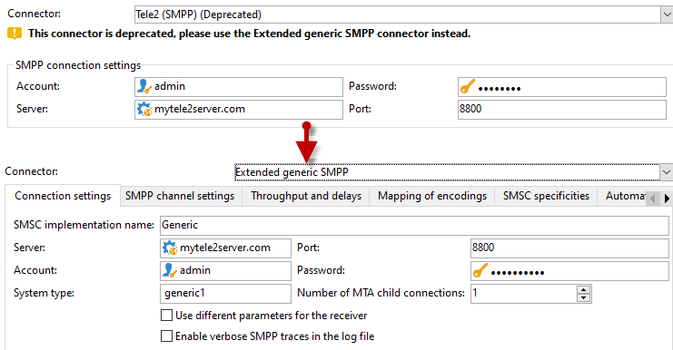

# Migrare un connettore SMS non supportato al connettore SMPP generico esteso{#unsupported-connector-migration}

A partire dalla versione 20.2, i connettori legacy sono diventati obsoleti. Questo documento ti aiuterà a migrare i connettori ancora in esecuzione sul vecchio sistema al connettore SMPP consigliato.

>[!CAUTION]
>
>Questa migrazione non è obbligatoria ma consigliata dall’Adobe e assicurerà di essere in esecuzione sull’ultima versione supportata del software.

## Informazioni sui connettori SMS {#about-sms-connectors}

I seguenti connettori sono obsoleti a partire dalla versione 20.2:

* **[!UICONTROL Generic SMPP]** (SMPP versione 3.4 che supporta la modalità binaria)
* **[!UICONTROL Sybase365]** (SAP SMS 365)
* **[!UICONTROL CLX Communications]**
* **[!UICONTROL Tele2]**
* **[!UICONTROL O2]**
* **[!UICONTROL iOS]**

Le funzionalità obsolete sono ancora disponibili e supportate, ma non saranno ulteriormente migliorate. Si consiglia di utilizzare **[!UICONTROL Extended generic SMPP]** connettore.

Per ulteriori informazioni sulle funzioni obsolete e rimosse, consulta questo [page](../../rn/using/deprecated-features.md).

I vecchi connettori SMS utilizzano il connettore SMS Java che sovraccarica il processo web. Migrazione al nuovo **[!UICONTROL Extended Generic SMPP]** il connettore sposterà questo carico nell’MTA che può supportarlo.

## Migrazione al connettore SMPP generico esteso {#migrating-extended-generic-smpp}

>[!CAUTION]
>
>Anche se puoi trasporre i parametri, configura il **[!UICONTROL Extended Generic SMPP]** connettore richiede di parlare con il provider che ti fornirà le informazioni necessarie per compilare il resto dei parametri. Per ulteriori informazioni, consulta questa [pagina](sms-protocol.md).

Innanzitutto, devi creare una nuova **[!UICONTROL Extended Generic SMPP]** account esterno e quindi potresti essere in grado di trasporre alcuni dei parametri. Puoi trovare i passaggi dettagliati in questo [page](sms-set-up.md#creating-an-smpp-external-account).

È ora necessario compilare i parametri dalla **[!UICONTROL Mobile]** scheda della nuova creazione **[!UICONTROL Extended Generic SMPP]** account esterno a seconda del connettore precedente.

### Dal connettore generico {#from-generic-connector}

Quando scegli la **[!UICONTROL Generic]** connettore, è necessario disporre di un connettore JavaScript personalizzato che si adatta a ogni situazione.

Se sai che questo connettore sta già utilizzando il protocollo SMPP, puoi effettuare la migrazione al **[!UICONTROL Extended Generic SMPP]** connettore. In caso contrario, verifica con il tuo provider se supporta il protocollo SMPP e configura un nuovo connettore con l’aiuto di un consulente.

Dal tuo **[!UICONTROL Generic]** è possibile trasporre al connettore appena creato **[!UICONTROL Extended SMPP]** account:

In **[!UICONTROL Connection Settings]** scheda:

* **[!UICONTROL Account]**
* **[!UICONTROL Password]**
* **[!UICONTROL Server]**
* **[!UICONTROL Port]**

### Dal connettore SMPP generico {#from-generic-smpp-connector}

Dal tuo **[!UICONTROL Generic SMPP]** è possibile trasporre al connettore appena creato **[!UICONTROL Extended SMPP]** account:

In **[!UICONTROL Connection Settings]** scheda:

* **[!UICONTROL Account]**
* **[!UICONTROL Password]**
* **[!UICONTROL Server]**
* **[!UICONTROL Port]**
* **[!UICONTROL System Type]**

In **[!UICONTROL SMPP Channel Settings]** scheda:

* **[!UICONTROL Source number]**
* **[!UICONTROL Source NPI]**
* **[!UICONTROL Destination NPI]**
* **[!UICONTROL Source TON]**
* **[!UICONTROL Destination TON]**

In **[!UICONTROL Mapping of Encoding]** scheda:

* **[!UICONTROL Outbound SMS coding]**

In **[!UICONTROL SMSC specificities]** scheda:

* **[!UICONTROL Coding when sending]** corrisponde a **[!UICONTROL ID Format in MT acknowledgement]**
* **[!UICONTROL Coding when receiving]** corrisponde a **[!UICONTROL ID Format in the SR]**

### Dal connettore Sybase365 {#from-sybase}

Dal tuo **[!UICONTROL Sybase365]** è possibile trasporre al connettore appena creato **[!UICONTROL Extended SMPP]** account:

In **[!UICONTROL Connection Settings]** scheda:

* **[!UICONTROL Account]**
* **[!UICONTROL Password]**
* **[!UICONTROL Server]**
* **[!UICONTROL Port]**
* **[!UICONTROL System Type]**

### Da connettore CLX {#from-clx}

Dal tuo **[!UICONTROL CLX]** è possibile trasporre al connettore appena creato **[!UICONTROL Extended SMPP]** account:

In **[!UICONTROL Connection Settings]** scheda:

* **[!UICONTROL Account]**
* **[!UICONTROL Password]**
* **[!UICONTROL Server]**
* **[!UICONTROL Port]**
* **[!UICONTROL System Type]**

In **[!UICONTROL SMPP Channel Settings]** scheda:

* **[!UICONTROL Source number]**

In **[!UICONTROL SMSC specificities]** scheda:

* **[!UICONTROL Coding when sending]** corrisponde a **[!UICONTROL ID Format in MT acknowledgement]**
* **[!UICONTROL Coding when receiving]** corrisponde a **[!UICONTROL ID Format in the SR]**

### Dal connettore Tele2 {#from-tele2}

Dal tuo **[!UICONTROL Tele2]** è possibile trasporre al connettore appena creato **[!UICONTROL Extended SMPP]** account:

In **[!UICONTROL Connection Settings]** scheda:

* **[!UICONTROL Account]**
* **[!UICONTROL Password]**
* **[!UICONTROL Server]**
* **[!UICONTROL Port]**
* **[!UICONTROL System Type]**

In **[!UICONTROL SMPP Channel Settings]** scheda:

* **[!UICONTROL Source number]**
* **[!UICONTROL Source NPI]**
* **[!UICONTROL Destination NPI]**
* **[!UICONTROL Source TON]**

In **[!UICONTROL Mapping of Encoding]** scheda:

* **[!UICONTROL Outbound SMS coding]**

### Dal connettore O2 {#from-O2}

Dal tuo **[!UICONTROL O2]** è possibile trasporre al connettore appena creato **[!UICONTROL Extended SMPP]** account:

In **[!UICONTROL Connection Settings]** scheda:

* **[!UICONTROL Account]**
* **[!UICONTROL Password]**
* **[!UICONTROL Server]**
* **[!UICONTROL Port]**
* **[!UICONTROL System Type]**

In **[!UICONTROL SMPP Channel Settings]** scheda:

* **[!UICONTROL Source number]**
* **[!UICONTROL Source NPI]**
* **[!UICONTROL Destination NPI]**
* **[!UICONTROL Source TON]**
* **[!UICONTROL Destination TON]**
