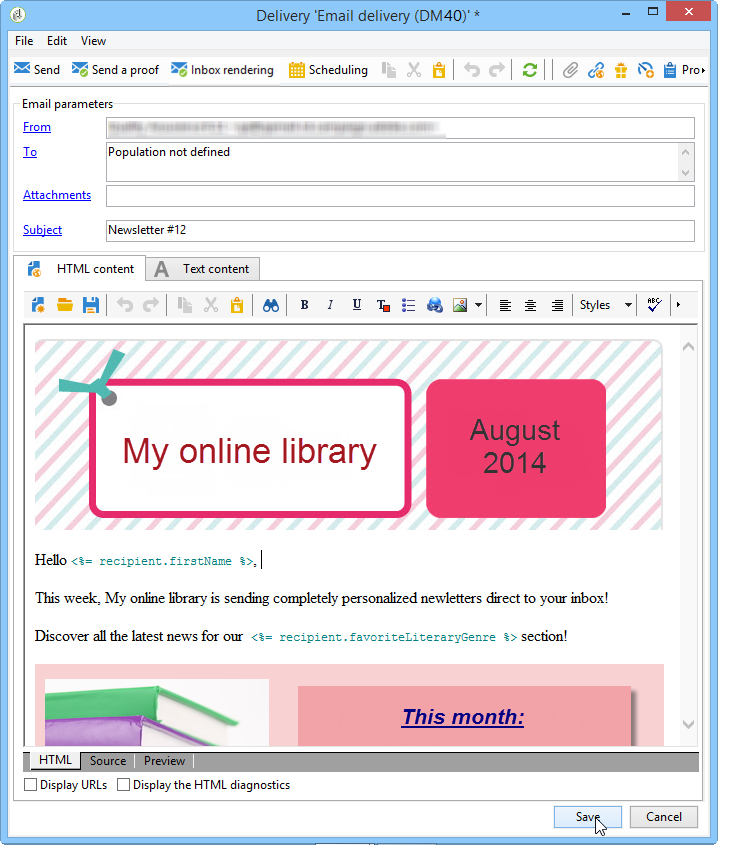

# Caso di utilizzo: configurazione della sostituzione del campo{#use-case-configuring-the-field-substitution}


La sostituzione del campo casuale consente di attribuire un valore dall’elenco dei destinatari agli indirizzi di seed vuoti quando l’utente utilizza questo valore in una consegna (ad esempio: nome, città, ecc.).

Questa sostituzione consente di risparmiare tempo durante la creazione della consegna: invece di aggiungere manualmente il valore desiderato agli indirizzi di seed, la sostituzione recupera casualmente questo valore nell’elenco dei destinatari interessati dalla consegna e lo applica agli indirizzi di seed.

## Contesto {#context}

In questo caso d’uso, il sito **Raccolta online personale** Vorrei inviare uno sconto ai suoi clienti, sulla base del loro genere letterario preferito.

Il responsabile della consegna ha integrato nella sua e-mail un campo di personalizzazione collegato con il genere preferito. L&#39;obiettivo è quello di utilizzare alcuni indirizzi di seed: questi indirizzi di seed presentano il campo di personalizzazione nella tabella, ma non vi è alcun valore salvato.

Per utilizzare la sostituzione casuale dei campi, è necessario disporre di:

* una consegna con uno o più campi di personalizzazione,
* indirizzi di sementi **schema dati** viene modificato in base ai campi di personalizzazione utilizzati nella consegna.

## Creazione di una consegna {#step-1---creating-a-delivery}

I passaggi per la creazione di una consegna sono descritti in [Creazione di una consegna e-mail](creating-an-email-delivery.md) sezione .

In questo esempio, il gestore consegne ha creato la newsletter.



## Modifica dello schema dati degli indirizzi di seed {#editing-the-seed-addresses-data-schema}

Le istruzioni su come modificare uno schema di dati sono descritte in dettaglio nella sezione .

In questo esempio, lo schema dati degli indirizzi di seed prende un valore creato dallo schema dati dei destinatari:

```
 <attribute label="Favorite literary genre" length="80" name="favoriteLiteraryGenre"
               type="string" userEnum="favoriteLiteraryGenre"/>
```

Questa enumerazione consente all’utente di specificare il genere letterario preferito dei propri client.

Affinché questa modifica dello schema dati sia visualizzabile negli indirizzi di seed **Modulo di input**, devi aggiornarlo. Fai riferimento a [Aggiornamento del modulo di input](use-case--selecting-seed-addresses-on-criteria.md#updating-the-input-form) sezione .

## Configurazione della personalizzazione {#configuring-personalization}

1. Apri una consegna.

   In questo esempio, la consegna ha due campi di personalizzazione: del destinatario **nome** e del destinatario **genere letterario preferito**.

   

1. Configura l’elenco di consegna e gli indirizzi di seed. Fai riferimento a [Identificazione delle popolazioni target](steps-defining-the-target-population.md).

   In questo esempio, l&#39;utente seleziona gli utenti di cui **genere letterario preferito** è Sci-Fi come la popolazione target principale.

   

   L’utente aggiunge gli indirizzi di seed alla consegna.

   

   >[!NOTE]
   >
   >Per ulteriori informazioni sulla **[!UICONTROL Edit the dynamic condition...]** link, fai riferimento a [Caso di utilizzo: selezione degli indirizzi di seed in base ai criteri](use-case--selecting-seed-addresses-on-criteria.md).

1. Fai clic sul pulsante **[!UICONTROL Preview]** seleziona quindi un indirizzo di seed per testare la personalizzazione.

   

   Come puoi vedere, uno dei campi di personalizzazione è vuoto. Poiché l’indirizzo di seed non dispone di dati per questo campo, l’anteprima del contenuto di HTML non può visualizzare un valore.

   Viene eseguita la sostituzione casuale dei campi **al momento della consegna**.

1. Fai clic sul pulsante **[!UICONTROL Send]**.
1. Analizza la consegna quindi **conferma consegna**.

   Gli indirizzi di seed ricevono la consegna nella loro casella in entrata.

   La personalizzazione dei campi è efficace.

   
