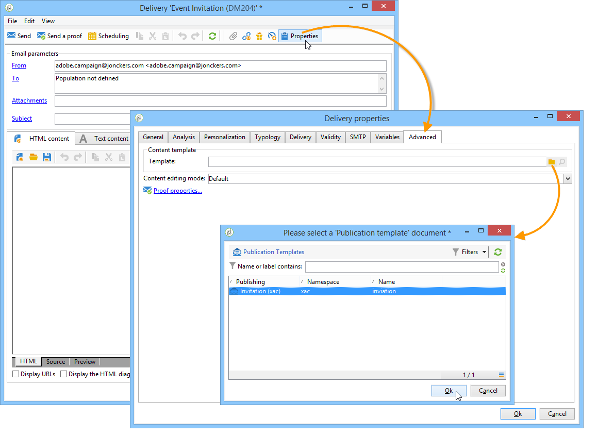

# Caso di utilizzo: creazione di gestione dei contenuti{#use-case-creating-content-management}

Per creare la gestione dei contenuti in  Adobe Campaign, sono necessari i seguenti passaggi:

* [Fase 1 - Analisi del contenuto da produrre](#step-1---analyzing-the-content-to-be-produced),
* [Passaggio 2 - Creazione dello schema](#step-2---creating-the-data-schema)dati,
* [Passaggio 3 - Creazione del modulo](#step-3---creating-the-input-form)di input,
* [Passo 4 - Creazione del modello](#step-4---creating-the-construction-template)di costruzione,
* [Passaggio 5 - Creazione del modello](#step-5---creating-the-publication-template)di pubblicazione
* [Passaggio 6 - Creazione di contenuti](#step-6---creating-contents).

## Fase 1 - Analisi del contenuto da produrre {#step-1---analyzing-the-content-to-be-produced}

Prima di iniziare, è necessario eseguire un&#39;analisi precisa del contenuto da produrre: identificare gli elementi da visualizzare, studiare i vincoli ad essi associati, definire un tipo per ciascun elemento, ecc. È inoltre necessario distinguere gli elementi statici da quelli variabili.

Ad esempio, per creare una newsletter in HTML con il seguente tipo di contenuto:


Questa newsletter contiene tre tipi di elementi:

1. Elementi variabili, il cui contenuto viene immesso o selezionato dall&#39;utente tramite un modulo di input durante la creazione della consegna.

   

1. Campi di personalizzazione immessi in modo dinamico in base alle informazioni salvate nel database (in questo caso il nome e il cognome del destinatario).

   

1. Elementi statici, identici per tutte le newsletter.

   

I vari elementi di questa newsletter vengono assemblati in base alle regole definite in un modello JavaScript che fa riferimento a tutti gli elementi da inserire e ne concettualizza il layout.

Questi elementi vengono creati tramite uno schema dedicato che specifica gli elementi seguenti per ogni contenuto: nome, etichetta, tipo, dimensione e qualsiasi altra informazione pertinente alla sua elaborazione in  Adobe Campaign.

## Step 2 - Creating the data schema {#step-2---creating-the-data-schema}

Uno schema dati è un documento XML associato al contenuto. Descrive la struttura XML dei dati in questo contenuto.

>[!NOTE]
>
>Per ulteriori informazioni sulla creazione e la configurazione di schemi di dati in  Adobe Campaign, consultare [questa sezione](../../configuration/using/about-schema-edition.md).
>
>Gli elementi di configurazione specifici per la gestione del contenuto sono descritti dettagliatamente negli schemi [di](../../delivery/using/data-schemas.md)dati.

Per creare uno schema dati, procedere come segue:

1. Aprire  Adobe Campaign Explorer e selezionare il **[!UICONTROL Administration > Configuration > Data schemas]** nodo.

   Fare clic sull&#39; **[!UICONTROL New]** icona situata sopra l&#39;elenco degli schemi di dati.

1. Selezionate l&#39; **[!UICONTROL Create a schema]** opzione per la gestione del contenuto, quindi fate clic su **[!UICONTROL Next]**.

   

1. Immettere il nome e l&#39;etichetta dello schema nei campi appropriati. Se necessario, potete aggiungere una descrizione e collegare un’immagine specifica.

   

   Fare clic **[!UICONTROL Next]** per eseguire la convalida.

1. Immettere il contenuto dello schema nella **[!UICONTROL Edit schema]** finestra.

   Utilizzare il **[!UICONTROL Insert]** pulsante per creare il contenuto dello schema.

   

   For more on this, refer to [Editing schemas](../../delivery/using/data-schemas.md#editing-schemas).

   Per ogni elemento a cui si fa riferimento nel contenuto, dovete selezionare un tipo corrispondente.

   In questo esempio, il contenuto identificato, il formato e il tipo sono:

<table> 
 <thead> 
  <tr> 
   <th> <strong>Contenuto</strong> <br /> </th> 
   <th> <strong>Formato</strong> <br /> </th> 
   <th> <strong>Tipo</strong> <br /> </th> 
   <th> <strong>Etichetta</strong> <br /> </th> 
  </tr> 
 </thead> 
 <tbody> 
  <tr> 
   <td> Titolo<br /> </td> 
   <td> Attributo<br /> </td> 
   <td> Stringa<br /> </td> 
   <td> Titolo<br /> </td> 
  </tr> 
  <tr> 
   <td> Sottotitolo<br /> </td> 
   <td> Attributo<br /> </td> 
   <td> Stringa<br /> </td> 
   <td> Nome<br /> </td> 
  </tr> 
  <tr> 
   <td> Data evento<br /> </td> 
   <td> Attributo<br /> </td> 
   <td> Data<br /> </td> 
   <td> Data<br /> </td> 
  </tr> 
  <tr> 
   <td> Introduzione, paragrafo<br /> </td> 
   <td> Elemento<br /> </td> 
   <td> HTML<br /> </td> 
   <td> Panoramica<br /> </td> 
  </tr> 
  <tr> 
   <td> Foto dell'autore<br /> </td> 
   <td> Attributo<br /> </td> 
   <td> Stringa<br /> </td> 
   <td> URL<br /> </td> 
  </tr> 
  <tr> 
   <td> Autore<br /> </td> 
   <td> Elemento<br /> </td> 
   <td> Memo<br /> </td> 
   <td> Autore<br /> </td> 
  </tr> 
  <tr> 
   <td> Logo intestazione (memorizzato  risorse pubbliche Adobe Campaign)<br /> </td> 
   <td> Attributo<br /> </td> 
   <td> Collegamento<br /> </td> 
   <td> Immagine<br /> </td> 
  </tr> 
 </tbody> 
</table>

Lo schema conterrà le seguenti informazioni:

```
<element label="Invitation" name="invitation" template="ncm:content" xmlChildren="true">
    <compute-string expr="@name"/>
    <attribute label="Title" length="40" name="title" type="string"/>
    <element label="Presentation" name="presentation" type="html"/>
    <attribute label="Date" name="date" type="date"/>
    <attribute label="Name" length="10" name="name" type="string"/>
    <attribute label="URL" name="url" type="string"/>
    <element label="Author" name="author" type="memo"/>
    <element label="Image" name="image" target="xtk:fileRes" type="link"/>
  </element>
```

1. Fare clic **[!UICONTROL Save]** per creare lo schema dati.

## Passaggio 3 - Creazione del modulo di input {#step-3---creating-the-input-form}

Il modulo di input consente di modificare un&#39;istanza di contenuto tramite un&#39;interfaccia di input dalla console client Adobe Campaign .

La descrizione di un modulo è un documento XML strutturato che osserva la grammatica dello schema del modulo &quot;xtk:form&quot;.

>[!NOTE]
>
>Per ulteriori informazioni sulla creazione e la configurazione di moduli in  Adobe Campaign, consultare [questa sezione](../../configuration/using/identifying-a-form.md).
>
>Gli elementi di configurazione specifici per la gestione del contenuto sono descritti nei moduli [di](../../delivery/using/input-forms.md)input.

Per creare un modulo di input per la gestione del contenuto, procedere come segue:

1. Aprire  Adobe Campaign Explorer e selezionare il **[!UICONTROL Administration > Configuration > Input forms]** nodo.

   Fare clic sull&#39; **[!UICONTROL New]** icona sopra l&#39;elenco dei moduli.

1. Immettere il nome del modulo e l&#39;etichetta collegata al modulo, quindi selezionare il **[!UICONTROL Content management]** tipo.

   

   >[!NOTE]
   >
   >Per abilitare la corrispondenza automatica di entrambi gli elementi, è consigliabile utilizzare lo stesso nome dello schema dati collegato. Utilizzare il **[!UICONTROL Insert]** pulsante sopra la zona di input per aggiungere campi dallo schema collegato al modulo.

   

1. Nella sezione centrale dell&#39;editor, specificare i campi che si desidera visualizzare nel modulo di input.

   In questo esempio, verranno fornite le seguenti informazioni:

   ```
    <input xpath="@title"/>
     <input xpath="@date"/>
     <input xpath="presentation"/>
     <input xpath="@name"/>
     <input xpath="@url"/>
     <input xpath="author"/>
     <input img="nl:sryimage.png" newEntityFormChoice="true" xpath="image">
       <sysFilter>
         <condition expr="@isImage = true"/>
       </sysFilter>
     </input>
   ```

   La **[!UICONTROL Preview]** scheda consente di controllare il rendering del modulo mentre lo si sta modificando:

   

1. Fare clic **[!UICONTROL Save]** per creare il modulo di input.

## Passaggio 4 - Creazione del modello di costruzione {#step-4---creating-the-construction-template}

Il linguaggio XSLT consente di trasformare un documento XML in un altro documento di output. Questa trasformazione è descritta in XML in un documento denominato foglio di stile.

In questo esempio, desideriamo utilizzare un modello JavaScript per definire la costruzione dei dati e la modalità di layout nel documento generato.

>[!NOTE]
>
>I vincoli collegati alla creazione di documenti (modello JavaScript o XSL) sono descritti in [Formattazione](../../delivery/using/formatting.md).

Per utilizzare un modello JavaScript in  Adobe Campaign, eseguire i seguenti passaggi:

1. Aprire  Adobe Campaign Explorer e selezionare il **[!UICONTROL Administration > Configuration > JavaScript Templates]** nodo.

   Fate clic sull’ **[!UICONTROL New]** icona sopra l’elenco dei modelli.

1. Immettete un nome per il modello e selezionate lo schema creato per la gestione del contenuto.
1. Importa il contenuto del set che desideri visualizzare nel messaggio.

   Aggiungete gli elementi variabili rispettando la sintassi dettagliata nei modelli [](../../delivery/using/formatting.md#javascript-templates)JavaScript.

   Per visualizzare il contenuto mostrato nel nostro esempio, il modello JavaScript deve contenere i seguenti elementi:

   ```
   <html>
   <% eval(xtk.javascript.load("xac:perso").data); %>
   <head>
     <title>Invitation to an exceptional dedication session</title>
   </head>
   <body link="#0E59AE" vlink="#0E59AE" alink="#0E59AE" style="background-color:white;">
       <table width="546" border="0" align="center" cellpadding="0" cellspacing="0" style="border-left: solid 1px gray;border-top: solid 1px gray;border-right: solid 1px gray;">
         <tr>
           <td colspan="3">
             <%= generateImgTag(content.@["image-id"]) %>
           </td>
         </tr>
       </table>
       <table width="546" border="0" align="center" cellpadding="0" cellspacing="0" style="border-left: solid 1px gray;border-right: solid 1px gray;">
         <tr>
           <td>
             <table border="0" cellspacing="0" cellpadding="5">
               <tr>
                 <td width="10"> </td>
                 <td style="padding-top:2em; padding-bottom:2em;" width="730" align="middle">
                   <b>
                     <font style="font-family:Verdana, Arial, Helvetica, sans-serif; font-size:14px; color:#800080;">
                       <span style="FONT-VARIANT: small-caps"><%= content.@title %> - <%= content.@name %></span>
                     </font>
                   </b>
                 </td>
                 <td width="10"> </td>
               </tr>
               <tr>
                 <td width="10"> </td>
                 <td style="padding-top:1em; padding-bottom:1em;" width="730">
                   <font style="font-family:Verdana, Arial, Helvetica, sans-serif; font-size:11px; color:#666666;">
                     Hello <%= perso('recipient.firstName') %> <%= perso('recipient.lastName') %>,
                     <p>
                       <%= content.presentation %>
                     </p>               
                     <center>
                       <b><%= formatDate(content.@date, "%2D %Bl %4Y") %></b> come to our Book Fair and meet our favorite authors and illustrators.<br>
                       <br>
                       <a href="https://www.site.web.com/registration" target="_blank"><b>REGISTER</b></a>
                     </center>
                   </font>
                 </td>
                 <td width="10"> </td>
               </tr>
               <tr>
                 <td width="10"> </td>
                 <td style="padding-top:1em; padding-bottom:1em;" width="730">
                   <font style="font-family:Verdana, Arial, Helvetica, sans-serif; font-size:11px; color:#666666;">
                    " width="70" height="70">
                     <b><%= content.author %></b>, will be signing their book between 2
   and 5:30PM.
                   </font>
                 </td>
                 <td width="10"> </td>
               </tr>            
                   <tr>
                 <td width="10"> </td>
                 <td width="730">
                   <font style="font-family:Verdana, Arial, Helvetica, sans-serif; font-size:11px; color:#666666;">                  
                 </td>
                 <td width="10"> </td>
               </tr>           
               <tr>
                 <td width="10"> </td>
                 <td>
                   <font style="font-family:Verdana, Arial, Helvetica, sans-serif; font-size:11px; color:#666666;">
                     <center>
                       <p>
                         <a href="https://www.site.web.com/program" target="_blank"><span style="FONT-VARIANT: small-caps"><b>Program</b></span></a>
                          | 
                         <a href="https://www.site.web.com/information" target="_blank"><span style="FONT-VARIANT: small-caps"><b>Useful information</b></span></a>
                          | 
                       <a href="https://www.site.web.com/registration" target="_blank"><span style="FONT-VARIANT: small-caps"><b>Register</b></span></a></p>
                       </center>
                     </font>
                   </td>
                   <td width="10"> </td>
                 </tr>
               </table>
               <br>
             </td>
           </tr>
         </table>
   </body>
   </html>
   ```

   La chiamata di una funzione all&#39;inizio di un modello consente di impostare una chiamata ai dati di personalizzazione provenienti dal database Adobe Campaign  (in questo caso: Recipients.firstName e Recipiente.lastName), in modo che possa essere interpretato quando utilizzato in una consegna. Per ulteriori informazioni, vedere [Inclusione di un modello](../../delivery/using/formatting.md#including-a-javascript-template)JavaScript.

   In questo esempio, la funzione conterrà il seguente codice:

   ```
   function perso(strPerso)
   {
     var strStart = '<' + '%' + '=';
     var strEnd = '%' + '>';
     return strStart + strPerso + strEnd;
   }
     function bloc(strPerso)
   {
     var strStart = '<' + '%' + '@ include view="';
     var strEnd = '" %' + '>';
     return strStart + strPerso + strEnd;
   }
   ```

   Per rendere valido il modello JavaScript, è necessario creare questa funzione prima dal **[!UICONTROL JavaScript codes]** nodo nella struttura ad albero, come segue:

   

## Passaggio 5 - Creazione del modello di pubblicazione {#step-5---creating-the-publication-template}

Il passaggio successivo prevede la creazione di un modello di pubblicazione di contenuto per collegare lo schema, il modulo e il modello di costruzione del contenuto. Questo modello di pubblicazione può avere diversi formati di output.

>[!NOTE]
>
>Per ulteriori informazioni sui modelli di pubblicazione dei contenuti, consulta Modelli [di](../../delivery/using/publication-templates.md)pubblicazione.

In questo esempio, la procedura è la seguente:

1. Crea un nuovo modello di pubblicazione tramite il **[!UICONTROL Administration > Configuration > Publication templates]** nodo.
1. Immettere un nome e un&#39;etichetta, quindi selezionare lo schema e il modulo da utilizzare.
1. Quindi immettete il nome del modello e scegliete la modalità di rendering da applicare. Qui è disponibile un rendering di **[!UICONTROL JavaScript]** tipo basato sul modello creato sopra.

   

   >[!NOTE]
   >
   >L&#39; **[!UICONTROL DOM interface]** opzione è selezionata per impostazione predefinita, pertanto il documento non sarà accessibile se si utilizza la sintassi E4X. L&#39;interfaccia DOM deve essere utilizzata quando questa opzione è selezionata ed è la sintassi consigliata.
   >
   >È comunque possibile utilizzare la sintassi E4X. In tal caso, deselezionare questa opzione.

   Utilizzare il **[!UICONTROL Add]** pulsante per creare altri modelli di trasformazione.

1. Fate clic **[!UICONTROL Save]** per creare il modello di pubblicazione.

## Passaggio 6 - Creazione di contenuti {#step-6---creating-contents}

È ora possibile creare contenuto basato su questo modello di pubblicazione.

>[!NOTE]
>
>Per ulteriori informazioni sulla creazione di contenuti, consultate [Utilizzo di un modello](../../delivery/using/using-a-content-template.md)di contenuto.

### Creazione di contenuti nella procedura guidata di consegna {#creating-content-in-the-delivery-wizard}

Per creare contenuti direttamente nelle consegne, effettuate le seguenti operazioni:

1. Per iniziare, fate riferimento al modello di pubblicazione tramite la **[!UICONTROL Advanced]** scheda delle proprietà di consegna.

   

   Alla procedura guidata di distribuzione viene aggiunta una scheda aggiuntiva per definire il contenuto tramite il modulo di gestione del contenuto.

1. Inserite le informazioni variabili della newsletter.

   

1. Fate clic sulla **[!UICONTROL HTML preview]** scheda per visualizzare il rendering. Devi selezionare un destinatario per testare la personalizzazione.

   
