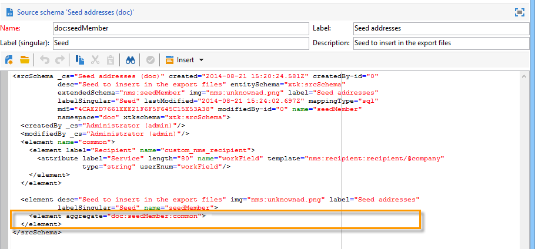

# Caso di utilizzo: selezione degli indirizzi di seed in base ai criteri{#use-case-selecting-seed-addresses-on-criteria}

Nel quadro di una consegna o di una campagna, il collegamento **[!UICONTROL Edit the dynamic condition...]** consente di scegliere gli indirizzi iniziali in base a criteri di selezione specifici.

In questo caso d&#39;uso, il sito **My online library** vorrebbe personalizzare le sue newsletter in base ai gusti letterari dei suoi clienti.

Insieme al reparto acquisti, l&#39;utente responsabile delle consegne ha creato una newsletter per gli abbonati che hanno acquistato i romanzi della polizia.

Per condividere il risultato finale della loro collaborazione con loro, il responsabile consegna decide di aggiungere i suoi colleghi del reparto acquisti alla consegna come indirizzi di partenza. L&#39;utilizzo di una condizione dinamica consente di risparmiare tempo sulla configurazione e l&#39;aggiornamento degli indirizzi.

Per utilizzare la condizione dinamica, è necessario disporre di:

* una consegna pronta per essere inviata,
* indirizzi seed con un valore comune. Questo valore può essere un campo già esistente in  Adobe Campaign. In questo esempio, gli indirizzi iniziali condividono il valore &quot;Purchasing&quot; nel campo &quot;Dipartimento&quot;, che per impostazione predefinita non è presente nell&#39;applicazione.

## Passaggio 1 - Creazione di una consegna {#step-1---creating-a-delivery}

I passaggi per la creazione di una consegna sono descritti nella sezione [Creazione di una consegna per e-mail](../../delivery/using/creating-an-email-delivery.md).

In questo esempio, il manager consegna ha creato la newsletter e selezionato i destinatari.


## Passaggio 2 - Creazione di un valore comune {#step-2---creating-a-common-value}

Per creare un valore comune come quello nel nostro esempio (reparto Acquisti), è necessario estendere il **schema di dati** degli indirizzi iniziali e modificare il modulo di input associato.

### Estensione dello schema di dati {#extending-the-data-schema}

Per ulteriori dettagli sulle estensioni dello schema, fare riferimento alla [Guida alla configurazione](../../configuration/using/data-schemas.md).

1. Nel nodo **[!UICONTROL Administration > Configuration > Data schemas]** fare clic sull&#39;icona **[!UICONTROL New]**.
1. Nella finestra **[!UICONTROL Creation of a data schema]**, selezionare l&#39;opzione **[!UICONTROL Extension of a schema]** e fare clic su **[!UICONTROL Next]**.

   

1. Selezionare lo schema di origine **[!UICONTROL Seed addresses]**, immettere **doc** come **[!UICONTROL Namespace]** e fare clic su **[!UICONTROL Ok]**.

   

1. Fai clic su **[!UICONTROL Save]**.
1. Nella finestra di modifica dello schema, copiare le righe sottostanti e incollarle nell&#39;area indicata nello screenshot.

   ```
     <element name="common">
       <element label="Recipient" name="custom_nms_recipient">
         <attribute label="Department" length="80" name="workField" template="nms:recipient:recipient/@company"
                    type="string" userEnum="workField"/>
       </element>
     </element>
   ```

   

   Copiate quindi le seguenti righe e incollatele sotto l&#39;elemento **[!UICONTROL Seed to insert in the export files]**.

   ```
       <element aggregate="doc:seedMember:common">
     </element>
   ```

   

   In questo caso, si sta specificando che una nuova enumerazione denominata **[!UICONTROL Department]** è stata creata nella tabella degli indirizzi iniziali, e si basa sul modello di enumerazione standard **[!UICONTROL @company]** (etichettato con il nome **Company** nel modulo degli indirizzi iniziali).

1. Fai clic su **[!UICONTROL Save]**.
1. Nel menu **[!UICONTROL Tools > Advanced]**, selezionare l&#39;opzione **[!UICONTROL Update database structure]**.

   

1. Quando viene visualizzata la procedura guidata di aggiornamento, fate clic sul pulsante **[!UICONTROL Next]** per accedere alla finestra Modifica tabelle: le modifiche effettuate nello schema di dati dell&#39;indirizzo di base richiedono un aggiornamento della struttura.

   

1. Seguite la procedura guidata fino a visualizzare la pagina per eseguire l&#39;aggiornamento. Fai clic sul pulsante **[!UICONTROL Start]**.

   

   Al termine dell&#39;aggiornamento, è possibile chiudere la procedura guidata.

1. Disconnettetevi quindi di nuovo a  Adobe Campaign. Le modifiche apportate nello schema di dati dell&#39;indirizzo di base ora sono effettive. Affinché siano visibili dalla schermata dell&#39;indirizzo di base, è necessario aggiornare la **[!UICONTROL Input form]** associata. Fare riferimento alla sezione [Aggiornamento del modulo di input](#updating-the-input-form).

#### Estensione dello schema di dati da una tabella collegata {#extending-the-data-schema-from-a-linked-table}

Lo schema di dati degli indirizzi iniziali può utilizzare valori provenienti da una tabella collegata allo schema di dati del destinatario - Recipient (nms).

Ad esempio, l&#39;utente desidera integrare la **[!UICONTROL Internet Extension]** trovata nella tabella **[!UICONTROL Country]** collegata allo schema dei destinatari.


Devono pertanto estendere lo schema di dati degli indirizzi iniziali come descritto nella sezione. Tuttavia, le righe di codice da integrare al **passaggio 4** sono le seguenti:

```
<element name="country">
      <attribute label="Internet Extension" length="2" name="iana" type="string"/>
      <attribute label="Country ISO" length="2" name="countryIsoA2" type="string"/>
    </element>
```


Esse indicano:

* che l&#39;utente desideri creare un nuovo elemento denominato **[!UICONTROL Internet Extension]**,
* che questo elemento proviene dalla tabella **[!UICONTROL Country]**.

>[!CAUTION]
>
>Nel nome della tabella collegata, è necessario specificare la **xpath-dst** di tale tabella collegata.
>
>Questo si trova nell&#39;elemento **[!UICONTROL Country]** nella tabella dei destinatari.


L&#39;utente può quindi seguire il **passaggio 5** della sezione e aggiornare gli **[!UICONTROL Input form]** degli indirizzi iniziali.

Fare riferimento alla sezione [Aggiornamento del modulo di input](#updating-the-input-form).

#### Aggiornamento del modulo di input {#updating-the-input-form}

1. Nel nodo **[!UICONTROL Administration > Configuration > Input forms]**, individuare il modulo di immissione degli indirizzi iniziali.

   

1. Modificare il modulo e inserire la riga seguente nel contenitore **[!UICONTROL Recipient]**.

   ```
   <input xpath="@workField"/>
   ```

   

1. Salva le modifiche.
1. Aprite un indirizzo seed. Il campo **[!UICONTROL Department]** viene visualizzato nella tabella **[!UICONTROL Recipient]**.

   

1. Modificate gli indirizzi iniziali che desiderate utilizzare per la consegna e immettete **Purchasing** come valore nel campo **[!UICONTROL Department]**.

## Passaggio 3 - Definizione della condizione {#step-3---defining-the-condition}

È ora possibile specificare la condizione dinamica degli indirizzi iniziali per la consegna. Per eseguire questa operazione:

1. Aprite una consegna.

   

1. Fare clic sul collegamento **[!UICONTROL To]**, quindi sulla scheda **[!UICONTROL Seed addresses]** per accedere al collegamento **[!UICONTROL Edit the dynamic condition...]**.

   

1. Selezionare l&#39;espressione che consente di scegliere gli indirizzi iniziali desiderati. Qui l&#39;utente seleziona l&#39;espressione **[!UICONTROL Department (@workField)]**.

   

1. Selezionare il valore desiderato. In questo esempio l&#39;utente seleziona il reparto **Purchasing** dall&#39;elenco a discesa dei valori.

   

   >[!NOTE]
   >
   >L&#39;estensione dello schema creata in precedenza proviene dallo schema **destinatario**. I valori visualizzati nella schermata qui sopra provengono da un&#39;enumerazione dello schema **destinatario**.

1. Fai clic su **[!UICONTROL Ok]**.

   La query viene visualizzata nella finestra **[!UICONTROL Select target]**.

   

1. Fare clic su **[!UICONTROL Ok]** per approvare la query.
1. Analizzare la consegna, quindi fare clic sulla scheda **[!UICONTROL Delivery]** per accedere ai log di consegna.

   Gli indirizzi iniziali del reparto acquisti vengono visualizzati come consegna in sospeso, come quelli dei destinatari o di altri indirizzi iniziali.

   

1. Fare clic sul pulsante **[!UICONTROL Send]** per avviare la consegna.

   I membri del reparto acquisti fanno parte dei vostri indirizzi di base che riceveranno la consegna nella loro casella in entrata e-mail.

   
