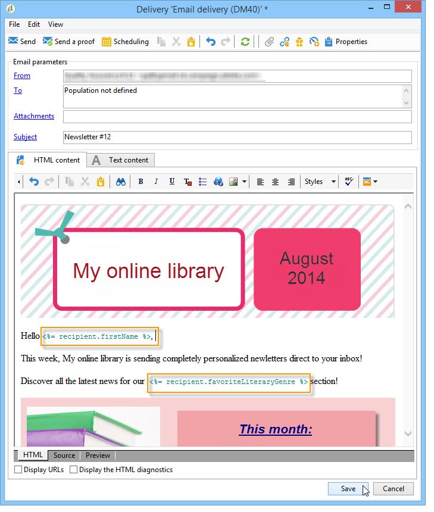

# Caso d’uso: configurare la sostituzione del campo{#use-case-configuring-the-field-substitution}


La sostituzione casuale dei campi consente di attribuire un valore dall’elenco dei destinatari agli indirizzi iniziali vuoti quando l’utente utilizza tale valore in una consegna (ad esempio: nome, città, ecc.).

Questa sostituzione consente di risparmiare tempo durante la creazione della consegna: anziché aggiungere manualmente il valore desiderato agli indirizzi di seed, la sostituzione recupera in modo casuale questo valore nell’elenco dei destinatari interessati dalla consegna e lo applica agli indirizzi di seed.

## Contesto {#context}

In questo caso d&#39;uso, il sito **La mia libreria online** desidera inviare uno sconto ai propri clienti, in base al genere letterario preferito.

Il responsabile della consegna ha integrato nell’e-mail un campo di personalizzazione collegato al genere preferito. Lo scopo è quello di utilizzare alcuni indirizzi di seed: questi indirizzi di seed hanno il campo di personalizzazione nella loro tabella, ma non viene salvato alcun valore.

Per utilizzare la sostituzione casuale dei campi, è necessario disporre di:

* una consegna con uno o più campi di personalizzazione,
* indirizzi seed il cui **schema dati** è stato modificato in base ai campi di personalizzazione utilizzati nella consegna.

## Creare una consegna {#step-1---creating-a-delivery}

I passaggi per la creazione di una consegna sono descritti nella [documentazione di Campaign v8](https://experienceleague.adobe.com/docs/campaign/campaign-v8/send/emails/email.html?lang=it){target="_blank"}.

In questo esempio, il responsabile della consegna ha creato la newsletter.


## Modifica dello schema dei dati degli indirizzi di seed {#editing-the-seed-addresses-data-schema}

Le istruzioni su come modificare uno schema di dati sono descritte in dettaglio nella sezione.

In questo esempio, lo schema dei dati degli indirizzi di seed accetta un valore creato dallo schema dei dati dei destinatari:

```
 <attribute label="Favorite literary genre" length="80" name="favoriteLiteraryGenre"
               type="string" userEnum="favoriteLiteraryGenre"/>
```

Questa enumerazione consente all’utente di specificare il genere letterario preferito dei suoi clienti.

Affinché la modifica dello schema dati possa essere visualizzata negli indirizzi seed **Modulo di input**, è necessario aggiornarla. Consulta la sezione [Aggiornare il modulo di input](use-case-selecting-seed-addresses-on-criteria.md#updating-the-input-form).

## Configurazione della personalizzazione {#configuring-personalization}

1. Apri una consegna.

   In questo esempio, la consegna ha due campi di personalizzazione: il **nome** del destinatario e il **genere letterario preferito** del destinatario.

   

1. Configura l’elenco di consegna e gli indirizzi seed. Fare riferimento a [Identificare le popolazioni target](steps-defining-the-target-population.md).

   In questo esempio, l&#39;utente seleziona come gruppo target principale gli utenti il cui **genere letterario preferito** è Sci-Fi.

   

   L’utente aggiunge indirizzi seed alla consegna.

   

   >[!NOTE]
   >
   >Per ulteriori informazioni sul collegamento **[!UICONTROL Edit the dynamic condition...]**, consulta [Caso d&#39;uso: selezionare gli indirizzi seed in base ai criteri](use-case-selecting-seed-addresses-on-criteria.md).

1. Fai clic sulla scheda **[!UICONTROL Preview]**, quindi seleziona un indirizzo di seed per testare la personalizzazione.

   

   Puoi notare che uno dei campi di personalizzazione è vuoto. Poiché l’indirizzo di seed non dispone di dati per questo campo, l’anteprima del contenuto di HTML non può visualizzare un valore.

   La sostituzione casuale dei campi viene eseguita **al momento della consegna**.

1. Fai clic sul pulsante **[!UICONTROL Send]**.
1. Analizza la consegna, quindi **conferma la consegna**.

   Gli indirizzi seed ricevono la consegna nella propria casella in entrata.

   La personalizzazione dei campi è efficace.

   
