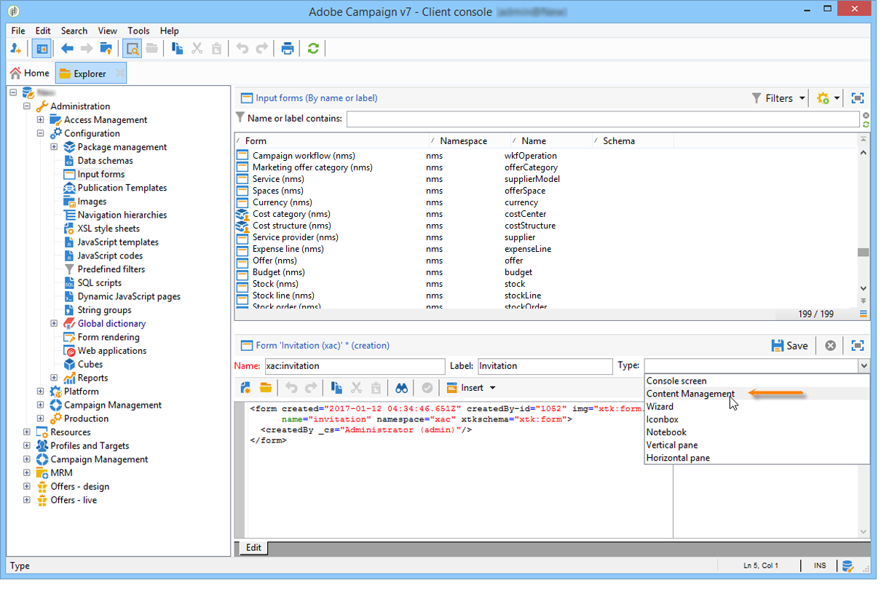

# Caso d’uso: creare gestione dei contenuti{#use-case-creating-content-management}


Per creare la gestione dei contenuti in Adobe Campaign, sono necessari i seguenti passaggi:

* [Passaggio 1: analizzare il contenuto da produrre](#step-1---analyzing-the-content-to-be-produced),
* [Passaggio 2: creare lo schema dati](#step-2---creating-the-data-schema),
* [Passaggio 3: creare il modulo di input](#step-3---creating-the-input-form),
* [Passaggio 4: creare la maschera di costruzione](#step-4---creating-the-construction-template),
* [Passaggio 5: creare il modello di pubblicazione](#step-5---creating-the-publication-template),
* [Passaggio 6: creare il contenuto](#step-6---creating-contents).

## Passaggio 1: analizzare il contenuto da produrre {#step-1---analyzing-the-content-to-be-produced}

Prima di iniziare, è necessario eseguire un’analisi precisa del contenuto da produrre: identificare gli elementi da visualizzare, studiare i vincoli ad essi collegati, definire un tipo per ciascun elemento, ecc. È inoltre necessario distinguere gli elementi statici da quelli variabili.

Ad esempio, per creare una newsletter in HTML con il seguente tipo di contenuto:


Questa newsletter contiene tre tipi di elementi:

1. Elementi variabili il cui contenuto viene immesso o selezionato dall’utente tramite un modulo di input durante la creazione della consegna.

   

1. Campi di personalizzazione immessi in modo dinamico in base alle informazioni salvate nel database (in questo caso, il nome e il cognome del destinatario).

   

1. Elementi statici, che sono gli stessi per tutte le newsletter.

   

I vari elementi di questa newsletter sono messi insieme in base alle regole definite in un modello JavaScript che fa riferimento a tutti gli elementi da inserire e ne concettualizza il layout.

Questi elementi vengono creati tramite uno schema dedicato che specifica i seguenti elementi per ciascun contenuto: nome, etichetta, tipo, dimensione e qualsiasi altra informazione rilevante per la sua elaborazione in Adobe Campaign.

## Passaggio 2: creare lo schema dati {#step-2---creating-the-data-schema}

Uno schema di dati è un documento XML associato al contenuto. Descrive la struttura XML dei dati in questo contenuto.

>[!NOTE]
>
>Per ulteriori informazioni sulla creazione e la configurazione di schemi di dati in Adobe Campaign, consulta [questa sezione](../../configuration/using/about-schema-edition.md).
>
>Gli elementi di configurazione specifici per la gestione dei contenuti sono descritti in dettaglio in [Schemi di dati](data-schemas.md).

Per creare uno schema di dati, effettua le seguenti operazioni:

1. Apri Adobe Campaign Explorer e seleziona la **[!UICONTROL Administration > Configuration > Data schemas]** nodo.

   Fai clic su **[!UICONTROL New]** si trova sopra l’elenco degli schemi di dati.

1. Seleziona la **[!UICONTROL Create a schema]** per la gestione dei contenuti, quindi fai clic su **[!UICONTROL Next]**.

   

1. Immetti il nome e l’etichetta dello schema nei campi appropriati. Se necessario, puoi aggiungere una descrizione e collegare un’immagine specifica.

   

   Clic **[!UICONTROL Next]** da convalidare.

1. Immetti il contenuto dello schema in **[!UICONTROL Edit schema]** finestra.

   Utilizza il **[!UICONTROL Insert]** per creare il contenuto dello schema.

   

   Per ulteriori informazioni, consulta [Modifica degli schemi](data-schemas.md#editing-schemas).

   Per ogni elemento a cui si fa riferimento nel contenuto, devi selezionare un tipo corrispondente.

   In questo esempio i contenuti identificati, il loro formato e il loro tipo sono:

<table> 
 <thead> 
  <tr> 
   <th> <strong>Contenuto</strong> <br /> </th> 
   <th> <strong>Formato</strong> <br /> </th> 
   <th> <strong>Tipo</strong> <br /> </th> 
   <th> <strong>Etichetta</strong> <br /> </th> 
  </tr> 
 </thead> 
 <tbody> 
  <tr> 
   <td> Titolo<br /> </td> 
   <td> Attributo<br /> </td> 
   <td> Stringa<br /> </td> 
   <td> Titolo<br /> </td> 
  </tr> 
  <tr> 
   <td> Sottotitolo<br /> </td> 
   <td> Attributo<br /> </td> 
   <td> Stringa<br /> </td> 
   <td> Nome<br /> </td> 
  </tr> 
  <tr> 
   <td> Data evento<br /> </td> 
   <td> Attributo<br /> </td> 
   <td> Data<br /> </td> 
   <td> Data<br /> </td> 
  </tr> 
  <tr> 
   <td> Paragrafo introduttivo<br /> </td> 
   <td> Elemento<br /> </td> 
   <td> HTML<br /> </td> 
   <td> Panoramica<br /> </td> 
  </tr> 
  <tr> 
   <td> Foto dell'autore<br /> </td> 
   <td> Attributo<br /> </td> 
   <td> Stringa<br /> </td> 
   <td> URL<br /> </td> 
  </tr> 
  <tr> 
   <td> Autore<br /> </td> 
   <td> Elemento<br /> </td> 
   <td> Per memoria<br /> </td> 
   <td> Autore<br /> </td> 
  </tr> 
  <tr> 
   <td> Logo intestazione (memorizzato nelle risorse pubbliche di Adobe Campaign)<br /> </td> 
   <td> Attributo<br /> </td> 
   <td> Collegamento<br /> </td> 
   <td> Immagine<br /> </td> 
  </tr> 
 </tbody> 
</table>

Lo schema conterrà le seguenti informazioni:

```
<element label="Invitation" name="invitation" template="ncm:content" xmlChildren="true">
    <compute-string expr="@name"/>
    <attribute label="Title" length="40" name="title" type="string"/>
    <element label="Presentation" name="presentation" type="html"/>
    <attribute label="Date" name="date" type="date"/>
    <attribute label="Name" length="10" name="name" type="string"/>
    <attribute label="URL" name="url" type="string"/>
    <element label="Author" name="author" type="memo"/>
    <element label="Image" name="image" target="xtk:fileRes" type="link"/>
  </element>
```

1. Clic **[!UICONTROL Save]** per creare lo schema dati.

## Passaggio 3: creare il modulo di input {#step-3---creating-the-input-form}

Il modulo di input consente di modificare un’istanza di contenuto tramite un’interfaccia di input dalla console client di Adobe Campaign.

La descrizione di un modulo è un documento XML strutturato che osserva la grammatica dello schema del modulo &quot;xtk:form&quot;.

>[!NOTE]
>
>Per ulteriori informazioni sulla creazione e la configurazione di moduli in Adobe Campaign, consulta [questa sezione](../../configuration/using/identifying-a-form.md).
>
>Gli elementi di configurazione specifici per la gestione dei contenuti sono descritti in dettaglio in [Moduli di input](input-forms.md).

Per creare un modulo di input per la gestione dei contenuti, attieniti alla seguente procedura:

1. Apri Adobe Campaign Explorer e seleziona la **[!UICONTROL Administration > Configuration > Input forms]** nodo.

   Fai clic su **[!UICONTROL New]** sopra l’elenco dei moduli.

1. Inserisci il nome del modulo e l’etichetta collegata al modulo, quindi seleziona la **[!UICONTROL Content management]** tipo.

   

   >[!NOTE]
   >
   >Per consentire a entrambi gli elementi di corrispondere automaticamente, si consiglia di utilizzare lo stesso nome dello schema di dati collegato. Utilizza il **[!UICONTROL Insert]** sopra l’area di input per aggiungere campi dallo schema collegato al modulo.

   

1. Nella sezione centrale dell&#39;editor specificare i campi che si desidera visualizzare nel modulo di input.

   In questo esempio, avremo il seguente tipo di informazioni:

   ```
    <input xpath="@title"/>
     <input xpath="@date"/>
     <input xpath="presentation"/>
     <input xpath="@name"/>
     <input xpath="@url"/>
     <input xpath="author"/>
     <input img="nl:sryimage.png" newEntityFormChoice="true" xpath="image">
       <sysFilter>
         <condition expr="@isImage = true"/>
       </sysFilter>
     </input>
   ```

   Il **[!UICONTROL Preview]** Questa scheda consente di controllare il rendering del modulo durante la modifica:

   

1. Clic **[!UICONTROL Save]** per creare il modulo di input.

## Passaggio 4: creare la maschera di costruzione {#step-4---creating-the-construction-template}

Il linguaggio XSLT consente di trasformare un documento XML in un altro documento di output. Questa trasformazione è descritta in XML in un documento denominato foglio di stile.

In questo esempio, si desidera utilizzare un modello JavaScript per definire la modalità di costruzione e layout dei dati nel documento generato.

>[!NOTE]
>
>I vincoli collegati alla creazione di documenti (modello JavaScript o XSL) sono descritti in [Formattazione](formatting.md).

Per utilizzare un modello JavaScript in Adobe Campaign, effettua le seguenti operazioni:

1. Apri Adobe Campaign Explorer e seleziona la **[!UICONTROL Administration > Configuration > JavaScript Templates]** nodo.

   Fai clic su **[!UICONTROL New]** sopra l’elenco dei modelli.

1. Immetti un nome per il modello e seleziona lo schema creato per la gestione dei contenuti.
1. Importa il contenuto del set che desideri visualizzare nel messaggio.

   Aggiungi gli elementi variabili rispettando la sintassi descritta in [Modelli JavaScript](formatting.md#javascript-templates).

   Per visualizzare il contenuto mostrato nel nostro esempio, il modello JavaScript deve contenere i seguenti elementi:

   ```
   <html>
   <% eval(xtk.javascript.load("xac:perso").data); %>
   <head>
     <title>Invitation to an exceptional dedication session</title>
   </head>
   <body link="#0E59AE" vlink="#0E59AE" alink="#0E59AE" style="background-color:white;">
       <table width="546" border="0" align="center" cellpadding="0" cellspacing="0" style="border-left: solid 1px gray;border-top: solid 1px gray;border-right: solid 1px gray;">
         <tr>
           <td colspan="3">
             <%= generateImgTag(content.@["image-id"]) %>
           </td>
         </tr>
       </table>
       <table width="546" border="0" align="center" cellpadding="0" cellspacing="0" style="border-left: solid 1px gray;border-right: solid 1px gray;">
         <tr>
           <td>
             <table border="0" cellspacing="0" cellpadding="5">
               <tr>
                 <td width="10"> </td>
                 <td style="padding-top:2em; padding-bottom:2em;" width="730" align="middle">
                   <b>
                     <font style="font-family:Verdana, Arial, Helvetica, sans-serif; font-size:14px; color:#800080;">
                       <span style="FONT-VARIANT: small-caps"><%= content.@title %> - <%= content.@name %></span>
                     </font>
                   </b>
                 </td>
                 <td width="10"> </td>
               </tr>
               <tr>
                 <td width="10"> </td>
                 <td style="padding-top:1em; padding-bottom:1em;" width="730">
                   <font style="font-family:Verdana, Arial, Helvetica, sans-serif; font-size:11px; color:#666666;">
                     Hello <%= perso('recipient.firstName') %> <%= perso('recipient.lastName') %>,
                     <p>
                       <%= content.presentation %>
                     </p>               
                     <center>
                       <b><%= formatDate(content.@date, "%2D %Bl %4Y") %></b> come to our Book Fair and meet our favorite authors and illustrators.<br>
                       <br>
                       <a href="https://www.site.web.com/registration" target="_blank"><b>REGISTER</b></a>
                     </center>
                   </font>
                 </td>
                 <td width="10"> </td>
               </tr>
               <tr>
                 <td width="10"> </td>
                 <td style="padding-top:1em; padding-bottom:1em;" width="730">
                   <font style="font-family:Verdana, Arial, Helvetica, sans-serif; font-size:11px; color:#666666;">
                    " width="70" height="70">
                     <b><%= content.author %></b>, will be signing their book between 2
   and 5:30PM.
                   </font>
                 </td>
                 <td width="10"> </td>
               </tr>            
                   <tr>
                 <td width="10"> </td>
                 <td width="730">
                   <font style="font-family:Verdana, Arial, Helvetica, sans-serif; font-size:11px; color:#666666;">                  
                 </td>
                 <td width="10"> </td>
               </tr>           
               <tr>
                 <td width="10"> </td>
                 <td>
                   <font style="font-family:Verdana, Arial, Helvetica, sans-serif; font-size:11px; color:#666666;">
                     <center>
                       <p>
                         <a href="https://www.site.web.com/program" target="_blank"><span style="FONT-VARIANT: small-caps"><b>Program</b></span></a>
                          | 
                         <a href="https://www.site.web.com/information" target="_blank"><span style="FONT-VARIANT: small-caps"><b>Useful information</b></span></a>
                          | 
                       <a href="https://www.site.web.com/registration" target="_blank"><span style="FONT-VARIANT: small-caps"><b>Register</b></span></a></p>
                       </center>
                     </font>
                   </td>
                   <td width="10"> </td>
                 </tr>
               </table>
               <br>
             </td>
           </tr>
         </table>
   </body>
   </html>
   ```

   La chiamata di una funzione all’inizio di un modello consente di impostare una chiamata ai dati di personalizzazione estratti dal database di Adobe Campaign (in questo caso: recipient.firstName e recipient.lastName), in modo che possano essere interpretati quando vengono utilizzati in una consegna. Per ulteriori informazioni, consulta [Includi un modello JavaScript](formatting.md#including-a-javascript-template).

   In questo esempio, la funzione conterrà il seguente codice:

   ```
   function perso(strPerso)
   {
     var strStart = '<' + '%' + '=';
     var strEnd = '%' + '>';
     return strStart + strPerso + strEnd;
   }
     function bloc(strPerso)
   {
     var strStart = '<' + '%' + '@ include view="';
     var strEnd = '" %' + '>';
     return strStart + strPerso + strEnd;
   }
   ```

   Affinché il modello JavaScript sia valido, questa funzione deve essere creata in anticipo dal **[!UICONTROL JavaScript codes]** nella struttura ad albero, come indicato di seguito:

   

## Passaggio 5: creare il modello di pubblicazione {#step-5---creating-the-publication-template}

Il passaggio successivo prevede la creazione di un modello di pubblicazione del contenuto per collegare lo schema, il modulo e il modello di costruzione del contenuto. Questo modello di pubblicazione può avere diversi formati di output.

>[!NOTE]
>
>Per ulteriori informazioni sui modelli di pubblicazione dei contenuti, consulta [Modelli di pubblicazione](publication-templates.md).

In questo esempio, i passaggi sono i seguenti:

1. Creare un nuovo modello di pubblicazione tramite **[!UICONTROL Administration > Configuration > Publication templates]** nodo.
1. Inserisci un nome e un’etichetta, quindi seleziona lo schema e il modulo da utilizzare.
1. Quindi immettete il nome del modello e scegliete la modalità di rendering da applicare. Ecco, abbiamo un **[!UICONTROL JavaScript]** digita il rendering in base al modello creato in precedenza.

   

   >[!NOTE]
   >
   >Il **[!UICONTROL DOM interface]** L&#39;opzione è selezionata per impostazione predefinita, pertanto il documento non sarà accessibile se si utilizza la sintassi E4X. Quando questa opzione è selezionata ed è la sintassi consigliata, deve essere utilizzata l’interfaccia DOM.
   >
   >È comunque possibile utilizzare la sintassi E4X. In tal caso, deseleziona questa opzione.

   Utilizza il **[!UICONTROL Add]** per creare altri modelli di trasformazione.

1. Clic **[!UICONTROL Save]** per creare il modello di pubblicazione.

## Passaggio 6: creare il contenuto {#step-6---creating-contents}

È ora possibile creare contenuti basati su questo modello di pubblicazione.

>[!NOTE]
>
>Per ulteriori informazioni sulla creazione dei contenuti, consulta [Utilizzare un modello di contenuto](using-a-content-template.md).

### Creare contenuti nella consegna guidata {#creating-content-in-the-delivery-wizard}

Per creare il contenuto direttamente nelle consegne, effettua le seguenti operazioni:

1. Per iniziare, fai riferimento al modello di pubblicazione tramite **[!UICONTROL Advanced]** delle proprietà di consegna.

   

   Alla procedura guidata di consegna viene aggiunta una scheda aggiuntiva per definire il contenuto tramite il modulo di gestione dei contenuti.

1. Inserisci le informazioni sulla variabile della newsletter.

   

1. Fai clic su **[!UICONTROL HTML preview]** per visualizzare il rendering. Devi selezionare un destinatario per testare la personalizzazione.

   
