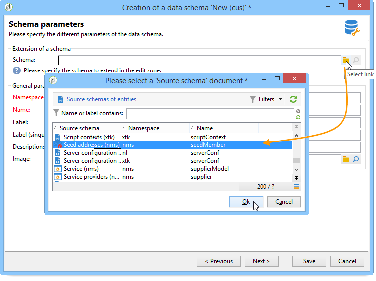

# Caso d’uso: selezionare gli indirizzi seed in base ai criteri{#use-case-selecting-seed-addresses-on-criteria}


Nel framework di una consegna o di una campagna, il collegamento **[!UICONTROL Edit the dynamic condition...]** consente di scegliere gli indirizzi seed in base a criteri di selezione specifici.

In questo caso d&#39;uso, il sito **La mia libreria online** desidera personalizzare le newsletter in base ai gusti letterari dei propri clienti.

In collaborazione con il reparto acquisti, l’utente responsabile delle consegne ha creato una newsletter per gli abbonati che hanno acquistato romanzi della polizia.

Per condividere il risultato finale della loro collaborazione con loro, il responsabile della consegna decide di aggiungere i colleghi del reparto acquisti alla consegna come indirizzi seed. L’utilizzo di una condizione dinamica consente di risparmiare tempo nella configurazione e nell’aggiornamento degli indirizzi.

Per utilizzare la condizione dinamica, è necessario disporre di:

* una consegna pronta per essere inviata,
* indirizzi seed con un valore comune. Questo valore può essere un campo già esistente in Adobe Campaign. In questo esempio, gli indirizzi seed condividono il valore &quot;Purchasing&quot; nel campo &quot;Department&quot;, che non è presente nell’applicazione per impostazione predefinita.

## Passaggio 1: creare una consegna {#step-1---creating-a-delivery}

I passaggi per creare una consegna sono descritti nella sezione [Creare una consegna e-mail](creating-an-email-delivery.md).

In questo esempio, il responsabile della consegna ha creato la newsletter e selezionato i destinatari.


## Passaggio 2: creare un valore comune {#step-2---creating-a-common-value}

Per creare un valore comune come quello del nostro esempio (reparto Acquisti), devi prima estendere lo **schema dati** degli indirizzi seed e modificare il modulo di input associato.

### Estendere lo schema dati {#extending-the-data-schema}

Per ulteriori dettagli sulle estensioni dello schema, consulta [questa sezione](../../configuration/using/data-schemas.md).

1. Nel nodo **[!UICONTROL Administration > Configuration > Data schemas]** fare clic sull&#39;icona **[!UICONTROL New]**.
1. Nella finestra **[!UICONTROL Creation of a data schema]**, selezionare l&#39;opzione **[!UICONTROL Extension of a schema]** e fare clic su **[!UICONTROL Next]**.

   

1. Seleziona lo schema di origine **[!UICONTROL Seed addresses]**, immetti **doc** come **[!UICONTROL Namespace]** e fai clic su **[!UICONTROL Ok]**.

   

1. Fai clic su **[!UICONTROL Save]**.
1. Nella finestra di modifica dello schema, copia le righe sottostanti e incollale nell’area indicata nella schermata.

   ```
     <element name="common">
       <element label="Recipient" name="custom_nms_recipient">
         <attribute label="Department" length="80" name="workField" template="nms:recipient:recipient/@company"
                    type="string" userEnum="workField"/>
       </element>
     </element>
   ```

   

   Copiare quindi le righe seguenti e incollarle nell&#39;elemento **[!UICONTROL Seed to insert in the export files]**.

   ```
       <element aggregate="doc:seedMember:common">
     </element>
   ```

   

   In questo caso, si sta specificando che nella tabella degli indirizzi di seed è stata creata una nuova enumerazione denominata **[!UICONTROL Department]**, basata sul modello di enumerazione standard **[!UICONTROL @company]** (etichettato con il nome **Società** nel modulo degli indirizzi di seed).

1. Fai clic su **[!UICONTROL Save]**.
1. Nel menu **[!UICONTROL Tools > Advanced]**, selezionare l&#39;opzione **[!UICONTROL Update database structure]**.

   

1. Quando viene visualizzato l&#39;Assistente all&#39;aggiornamento, fare clic sul pulsante **[!UICONTROL Next]** per accedere alla finestra Modifica tabelle: le modifiche eseguite nello schema dei dati dell&#39;indirizzo di seed richiedono un aggiornamento della struttura.

   

1. Segui l’assistente fino a quando non arrivi alla pagina per eseguire l’aggiornamento. Fai clic sul pulsante **[!UICONTROL Start]**.

   

   Al termine dell’aggiornamento, puoi chiudere l’assistente.

1. Disconnettiti e riconnettiti ad Adobe Campaign. Le modifiche apportate nello schema dei dati dell’indirizzo di seed ora vengono applicate. Affinché siano visibili dalla schermata dell&#39;indirizzo di seed, è necessario aggiornare **[!UICONTROL Input form]** associato. Consulta la sezione [Aggiornare il modulo di input](#updating-the-input-form).

#### Estendere lo schema dati da una tabella collegata {#extending-the-data-schema-from-a-linked-table}

Lo schema dati degli indirizzi seed può utilizzare valori provenienti da una tabella collegata allo schema dati del destinatario - Destinatario (nms).

L&#39;utente desidera ad esempio integrare **[!UICONTROL Internet Extension]** trovato nella tabella **[!UICONTROL Country]** collegata allo schema dei destinatari.


Pertanto, devono estendere lo schema dati degli indirizzi seed come descritto nella sezione. Tuttavia, le righe di codice da integrare al **passaggio 4** sono le seguenti:

```
<element name="country">
      <attribute label="Internet Extension" length="2" name="iana" type="string"/>
      <attribute label="Country ISO" length="2" name="countryIsoA2" type="string"/>
    </element>
```


Essi indicano:

* l&#39;utente desidera creare un nuovo elemento denominato **[!UICONTROL Internet Extension]**,
* questo elemento proviene dalla tabella **[!UICONTROL Country]**.

>[!CAUTION]
>
>Nel nome della tabella collegata è necessario specificare **xpath-dst** della tabella collegata.
>
>Si trova nell&#39;elemento **[!UICONTROL Country]** nella tabella dei destinatari.


L&#39;utente può quindi seguire dal **passaggio 5** della sezione e aggiornare il **[!UICONTROL Input form]** degli indirizzi di seed.

Consulta la sezione [Aggiornare il modulo di input](#updating-the-input-form).

#### Aggiornare il modulo di input {#updating-the-input-form}

1. Nel nodo **[!UICONTROL Administration > Configuration > Input forms]**, trovare il modulo di input degli indirizzi di seed.

   

1. Modificare il modulo e inserire la riga seguente nel contenitore **[!UICONTROL Recipient]**.

   ```
   <input xpath="@workField"/>
   ```

   

1. Salva le modifiche.
1. Apri un indirizzo di seed. Il campo **[!UICONTROL Department]** viene visualizzato nella tabella **[!UICONTROL Recipient]**.

   

1. Modificare gli indirizzi di seed che si desidera utilizzare per la consegna e immettere **Purchasing** come valore nel campo **[!UICONTROL Department]**.

## Passaggio 3: definire la condizione {#step-3---defining-the-condition}

Ora puoi specificare la condizione dinamica degli indirizzi di seed per la consegna. Per eseguire questa operazione:

1. Apri una consegna.

   

1. Fare clic sul collegamento **[!UICONTROL To]** e quindi sulla scheda **[!UICONTROL Seed addresses]** per accedere al collegamento **[!UICONTROL Edit the dynamic condition...]**.

   

1. Selezionare l&#39;espressione che consente di scegliere gli indirizzi di seed desiderati. In questo punto l&#39;utente seleziona l&#39;espressione **[!UICONTROL Department (@workField)]**.

   

1. Seleziona il valore desiderato. In questo esempio l&#39;utente seleziona il reparto **Purchasing** dall&#39;elenco a discesa dei valori.

   

   >[!NOTE]
   >
   >L&#39;estensione dello schema creata in precedenza proviene dallo schema **recipient**. I valori visualizzati nella schermata precedente provengono da un&#39;enumerazione dello schema **recipient**.

1. Fai clic su **[!UICONTROL Ok]**.

   La query viene visualizzata nella finestra **[!UICONTROL Select target]**.

   

1. Fare clic su **[!UICONTROL Ok]** per approvare la query.
1. Analizza la consegna, quindi fai clic sulla scheda **[!UICONTROL Delivery]** per accedere ai registri di consegna.

   Gli indirizzi seed del reparto acquisti vengono visualizzati come consegna in sospeso, proprio come quelli dei destinatari o altri indirizzi seed.

   

1. Fare clic sul pulsante **[!UICONTROL Send]** per avviare la consegna.

   I membri del reparto acquisti compongono una parte degli indirizzi seed che riceveranno la consegna nella loro casella di posta elettronica.

   
