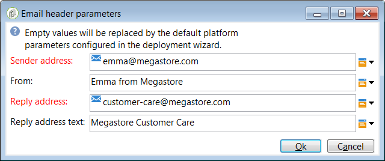

# Utilizzare i modelli {#use-templates}

I modelli di consegna consentono una maggiore efficienza, fornendo scenari pronti per i tipi più comuni di attività. Con i modelli, gli esperti di marketing possono distribuire nuove campagne con una personalizzazione minima in un periodo di tempo più breve.

Ulteriori informazioni sui modelli di consegna in [questa sezione](about-templates.md).

## Introduzione ai modelli di consegna {#gs-templates}

Un [modello di consegna](about-templates.md) ti consente di definire una volta una serie di proprietà tecniche e funzionali che soddisfano le tue esigenze e che possono essere riutilizzate per le consegne future. Potrai quindi risparmiare tempo e standardizzare le consegne quando necessario.

Quando gestisci più marchi in Adobe Campaign, Adobe consiglia di avere un sottodominio per marchio. Ad esempio, una banca può avere diversi sottodomini corrispondenti a ciascuna delle sue agenzie regionali. Se una banca è proprietaria del dominio bluebank.com, i sottodomini possono essere @ny.bluebank.com, @ma.bluebank.com, @ca.bluebank.com, ecc. Disporre di un modello di consegna per sottodominio consente di utilizzare sempre i giusti parametri preconfigurati per ciascun marchio, evitando errori e risparmiando tempo.

**Suggerimento**: per evitare errori di configurazione, è consigliabile duplicare un modello nativo e modificarne le proprietà anziché crearne uno nuovo.

## Configurare gli indirizzi

* L’indirizzo del mittente è obbligatorio per consentire l’invio di un’e-mail.

* Alcuni ISP (provider di servizi Internet) verificano la validità dell’indirizzo del mittente prima di accettare i messaggi.

* Un indirizzo con formato non corretto può comportare il rifiuto da parte del server ricevente. Devi accertarti che sia stato fornito un indirizzo corretto.

* L’indirizzo deve identificare esplicitamente il mittente. Il dominio deve essere di proprietà del mittente e deve essere registrato nel mittente.

* Adobe consiglia di creare account e-mail corrispondenti agli indirizzi specificati per le consegne e le risposte. Rivolgiti all’amministratore del sistema di messaggistica.

Per configurare gli indirizzi nell’interfaccia di Campaign, effettua le seguenti operazioni:

1. Nel [modello di consegna](about-templates.md), fai clic sul collegamento **[!UICONTROL From]**. Nella finestra **[!UICONTROL Email header parameters]**, compila i campi seguenti:

   

1. Nel campo **[!UICONTROL Sender address]**, assicurati che il dominio dell&#39;indirizzo sia lo stesso del sottodominio che hai delegato ad Adobe. È possibile modificare la parte che precede &#39;@&#39; ma non l&#39;indirizzo di dominio.

1. Nel campo **[!UICONTROL From]**, utilizza un nome facilmente identificabile dai destinatari, ad esempio il nome del tuo marchio, per aumentare il tasso di apertura delle consegne. Per migliorare ulteriormente l’esperienza del destinatario, puoi aggiungere il nome di una persona, ad esempio &quot;Emma from Megastore&quot;.

1. Nei campi **[!UICONTROL Reply address text]**, l&#39;indirizzo del mittente viene utilizzato per impostazione predefinita per le risposte. Tuttavia, Adobe consiglia di utilizzare un indirizzo reale esistente, ad esempio l’assistenza clienti del tuo marchio. In questo caso, se un destinatario invia una risposta, l’assistenza clienti sarà in grado di gestirla.

### Configurare un gruppo di controllo

Una volta inviata la consegna, puoi confrontare il comportamento dei destinatari esclusi con quello dei destinatari che l’hanno ricevuta. Puoi quindi misurare l’efficienza delle campagne. Ulteriori informazioni sui gruppi di controllo [in questa sezione](../../campaign/using/marketing-campaign-deliveries.md#defining-a-control-group).

Per impostare un gruppo di controllo, fare clic sul collegamento **[!UICONTROL To]**. Nella finestra **[!UICONTROL Select target]**, selezionare la scheda **[!UICONTROL Control group]**. È possibile estrarre una parte della destinazione, ad esempio un campione casuale del 5%.

## Utilizzare le tipologie per applicare filtri o regole di controllo

Una tipologia contiene regole di controllo applicate durante la fase di analisi, prima di inviare qualsiasi messaggio.

Nella scheda **[!UICONTROL Typology]** delle proprietà del modello, modifica la tipologia predefinita in base alle tue esigenze.

Ad esempio, per controllare meglio il traffico in uscita, puoi definire quali indirizzi IP possono essere utilizzati definendo un’affinità per sottodominio e creando una tipologia per affinità. Le affinità sono definite nel file di configurazione dell’istanza. Contatta il tuo amministratore Adobe Campaign.

Per ulteriori informazioni sulle tipologie, consulta [questa sezione](../../campaign-opt/using/about-campaign-typologies.md).
