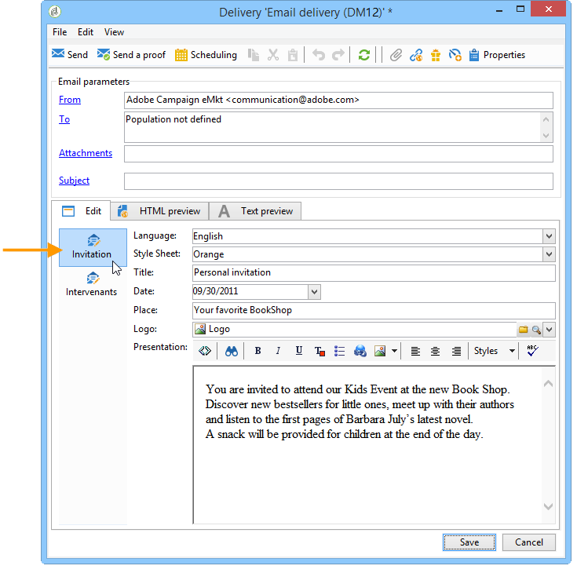
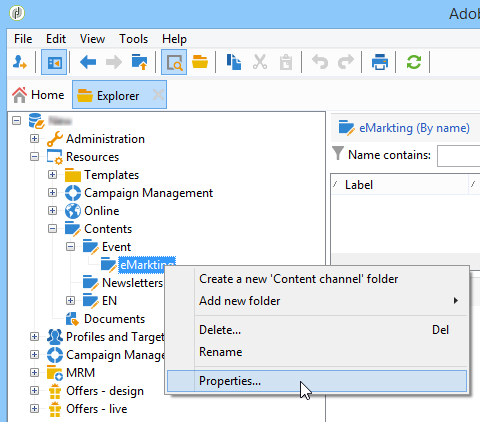

# Utilizzare un modello di contenuto{#using-a-content-template}

## Informazioni sui modelli di contenuto {#about-content-templates}

È possibile fare riferimento ai modelli di contenuto e utilizzarli direttamente nelle consegne. Fai riferimento a [Creazione di una consegna tramite la gestione dei contenuti](#creating-a-delivery-via-content-management)

Possono inoltre essere utilizzati per creare istanze di contenuto. Una volta create, queste istanze sono pronte per essere distribuite (fare riferimento a [Distribuzione di un’istanza di contenuto](#delivering-a-content-instance)) o esportato (fare riferimento a [Creazione di un’istanza di contenuto](#creating-a-content-instance)).

## Creazione di una consegna tramite la gestione dei contenuti {#creating-a-delivery-via-content-management}

È possibile fare riferimento a un modello di contenuto in una consegna in modo da utilizzare i campi di input per immettere il contenuto. Alla procedura guidata di consegna viene aggiunta una scheda aggiuntiva per la definizione del contenuto della consegna.

Il layout viene applicato automaticamente in base alle impostazioni selezionate. Per visualizzarlo, fai clic su **[!UICONTROL HTML preview]** (o **[!UICONTROL Text preview]** ) e seleziona un destinatario per testare gli elementi di personalizzazione.

Per ulteriori informazioni, consulta l’esempio di implementazione completa: [Creazione di contenuti nella consegna guidata](use-case-creating-content-management.md#creating-content-in-the-delivery-wizard).

## Creazione di un’istanza di contenuto {#creating-a-content-instance}

Puoi creare contenuti direttamente nella struttura Adobe Campaign da utilizzare nei flussi di lavoro, esportare o inserire direttamente nelle nuove consegne.

Applica i seguenti passaggi:

1. Seleziona la **[!UICONTROL Resources > Contents]** della struttura, fai clic con il pulsante destro del mouse e scegli **[!UICONTROL Properties]**.

   

1. Selezionare i modelli di pubblicazione che saranno attivi per questa cartella.

   

1. Ora puoi creare nuovi contenuti utilizzando **[!UICONTROL New]** sopra l&#39;elenco dei contenuti.

   

1. Immettere i campi nel modulo.

   

1. Quindi fai clic su **[!UICONTROL HTML preview]** per visualizzare il rendering. In questo caso, i campi di personalizzazione estratti dal database non vengono immessi.

   

1. Una volta creato, il contenuto viene aggiunto all’elenco dei contenuti disponibili. Fai clic su **[!UICONTROL Properties]** per modificarne l’etichetta, lo stato o visualizzarne la cronologia.

   

1. Se necessario, una volta approvato, il contenuto può essere generato utilizzando il pulsante appropriato sulla barra degli strumenti.

   

   >[!NOTE]
   >
   >Puoi autorizzare la generazione di contenuti non approvati. A questo scopo, modifica l’opzione pertinente nel modello di pubblicazione. Per ulteriori informazioni, consulta [Creazione e configurazione del modello](publication-templates.md#creating-and-configuring-the-template).

   Il contenuto di HTML e Testo viene generato per impostazione predefinita nel **pubblicazione** dell’istanza di Adobe Campaign. È possibile modificare la cartella della pubblicazione tramite **NcmPublishingDir** opzione.

## Distribuzione di un’istanza di contenuto {#delivering-a-content-instance}

Per creare un’istanza di contenuto e distribuirla, è necessario collegare un modello di consegna al modello di pubblicazione utilizzato per generare il contenuto. Per ulteriori informazioni, consulta [Consegna](publication-templates.md#delivery).

Inoltre, la cartella di archiviazione del contenuto deve essere dedicata ai contenuti ricavati da questo modello di pubblicazione (quando una cartella di contenuto consente di generare diversi tipi di contenuto, le consegne non possono essere create automaticamente).

Per creare la consegna automaticamente in base al contenuto selezionato, fai clic sul pulsante **[!UICONTROL Delivery]** e scegliere il modello.

Il testo e i contenuti di HTML vengono immessi automaticamente.
