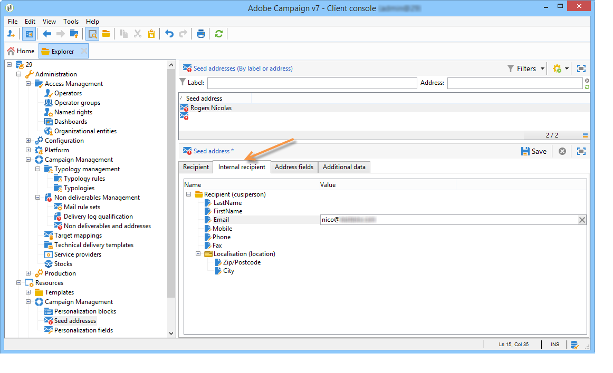

# Utilizzare una tabella dei destinatari esterna{#using-an-external-recipient-table}

Se la tabella di consegna è esterna, dovrai effettuare configurazioni aggiuntive. Lo schema **[!UICONTROL nms:seedmember]** deve essere esteso. Agli indirizzi seed viene aggiunta una scheda per definire i campi appropriati, come illustrato di seguito:

In questo caso, per aggiungere indirizzi di seed alla consegna, inserisci i campi appropriati direttamente nella scheda corrispondente o importa i modelli di indirizzo:

L&#39;estensione dello schema **nms:seedMember** è [questa sezione](../../configuration/using/seed-addresses.md).
