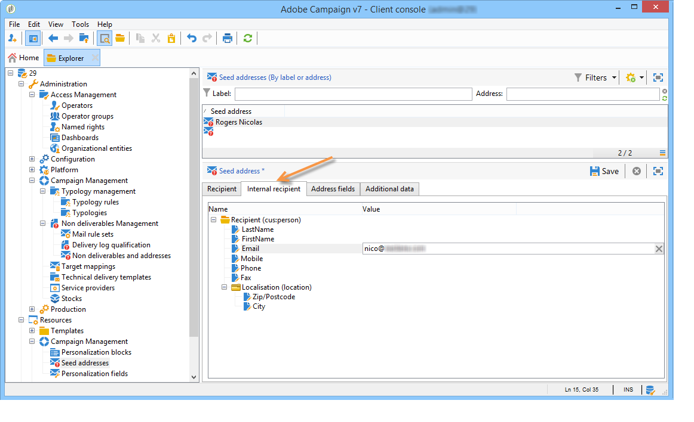

# Utilizzo di una tabella dei destinatari esterna{#using-an-external-recipient-table}

Se la tabella di consegna è una tabella esterna, sarà necessario effettuare configurazioni aggiuntive. Lo **[!UICONTROL nms:seedmember]** schema deve essere esteso. Agli indirizzi iniziali viene aggiunta una scheda per definire i campi adeguati, come illustrato di seguito:

In questo caso, per aggiungere gli indirizzi iniziali alla consegna, immettete i campi adeguati direttamente nella scheda corrispondente, oppure importate i modelli di indirizzo:

L&#39;estensione **dello schema nms:seedMember** è [questa sezione](../../configuration/using/seed-addresses.md).
