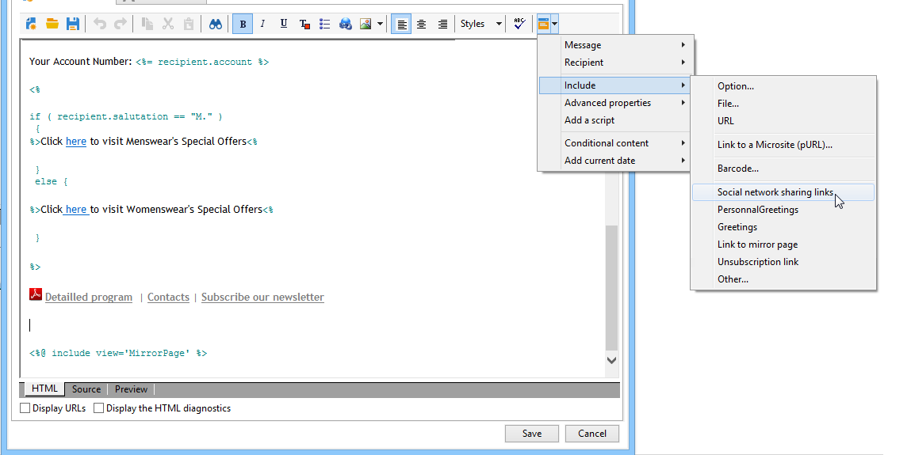
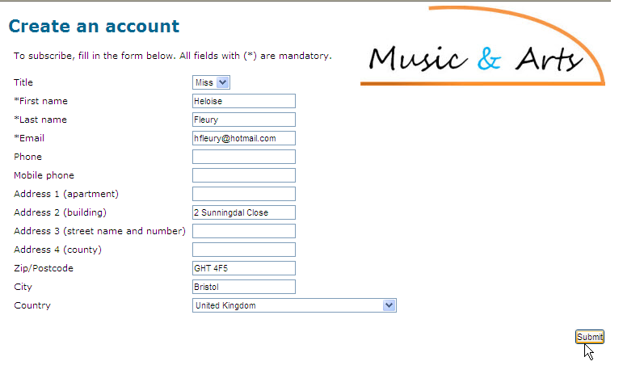
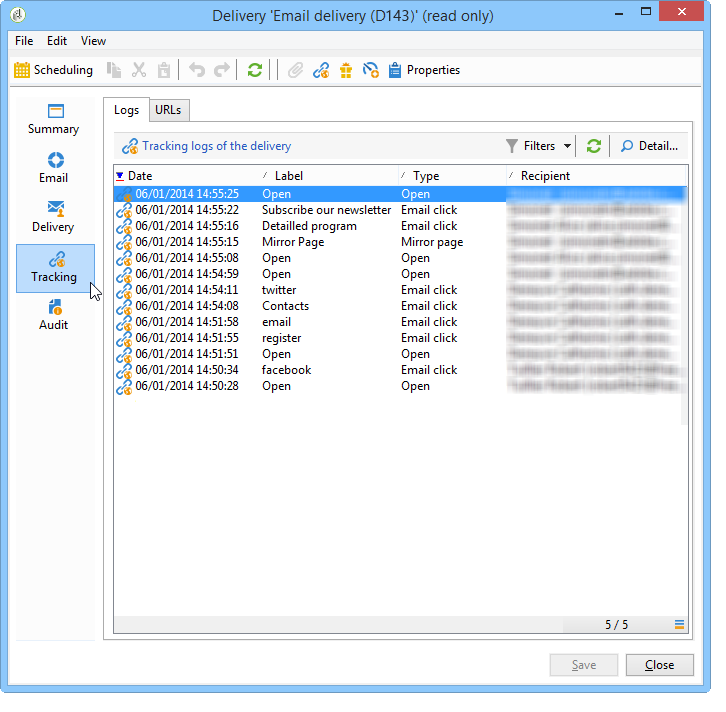

# Marketing virale e social marketing{#viral-and-social-marketing}

Adobe Campaign consente di impostare strumenti per incoraggiare il marketing virale.

Questo consente ai destinatari della consegna o ai visitatori del sito web di condividere informazioni con la loro rete: dall’aggiunta di un collegamento al loro profilo Facebook o X (precedentemente noto come Twitter) all’invio di un messaggio a un amico.

>[!CAUTION]
>
>Per il corretto funzionamento dei collegamenti aggiunti, è necessario che sia disponibile la pagina speculare corrispondente. A questo scopo, includi il collegamento alla pagina speculare nella consegna.

## Social network: condivisione di un collegamento {#social-networks--sharing-a-link}

Per consentire ai destinatari della consegna di condividere il contenuto dei messaggi con i membri della loro rete, devi includere il blocco di personalizzazione corrispondente.

>[!NOTE]
>
>Per impostazione predefinita, questo collegamento non è disponibile nell’elenco dei blocchi. Per accedervi, fai clic su **[!UICONTROL Other...]** e seleziona il blocco **[!UICONTROL Social network sharing links]**.

Il rendering sarà il seguente:

Quando il destinatario fa clic sull’icona di uno dei social network visualizzati, viene automaticamente reindirizzato al proprio account e può condividere il contenuto del messaggio tramite un collegamento. Questo consente ai membri della rete di accedere alla comunicazione.

>[!NOTE]
>
>Questo blocco di personalizzazione contiene tutti i collegamenti (per l’invio e la condivisione di messaggi con tutti i social network). Può essere modificata per soddisfare le tue esigenze. Tuttavia, la configurazione è riservata agli utenti avanzati. Per modificare il blocco di personalizzazione corrispondente, passa al nodo **[!UICONTROL Resources > Campaign management > Personalization blocks]** della struttura Adobe Campaign.

## Marketing virale: inoltro a un amico {#viral-marketing--forward-to-a-friend}

Un servizio virale consente di eseguire azioni di tipo referral: queste azioni ti consentono di inoltrare un messaggio a un amico. Il profilo degli arbitri viene temporaneamente memorizzato nel database (in una tabella dedicata). I messaggi inoltrati includono un collegamento a cui l’arbitro può iscriversi: in tal caso, verranno aggiunti al database di Adobe Campaign.

L’inoltro dei messaggi si basa sugli stessi principi dei collegamenti ai social network.

Applica le seguenti fasi:

1. Aggiungi il blocco di personalizzazione **[!UICONTROL Social network sharing links]** nel corpo del messaggio originale.
1. Il destinatario del messaggio può fare clic sull&#39;icona **[!UICONTROL Email]** per inviare il messaggio a uno o più amici.

   

   Un modulo di riferimento consente di immettere gli indirizzi e-mail degli utenti che hanno inviato il messaggio.

   

   Il messaggio viene inviato quando il destinatario principale fa clic sul pulsante **[!UICONTROL Next]**.

   >[!NOTE]
   >
   >Il contenuto di questo messaggio può essere personalizzato in base alle tue esigenze. Viene creato in base al modello **[!UICONTROL Transfer of original message]**, memorizzato nel nodo **[!UICONTROL Administration > Campaign management > Technical delivery templates]**.
   >
   >È inoltre possibile modificare il modulo di inoltro dei messaggi reso disponibile al referente Per eseguire questa operazione, è necessario modificare l&#39;applicazione Web **Modulo virale** memorizzata nel nodo **[!UICONTROL Resources > Online > Web applications]**.

1. Nel messaggio inoltrato, un collegamento consente all&#39;arbitro di salvare il proprio profilo nel database. A tale scopo è fornito un modulo di iscrizione.

   

   >[!NOTE]
   >
   >Questa configurazione può essere adattata. A tale scopo, è necessario modificare l&#39;applicazione Web **Destinatario sottoscrizione** memorizzata nel nodo **[!UICONTROL Resources > Online > Web applications]**.
   >
   >Per ulteriori informazioni sulle applicazioni Web, consultare [questa sezione](../../web/using/about-web-applications.md).

   Una volta convalidate, viene inviato loro un messaggio di conferma: saranno registrate per sempre solo dopo che avranno attivato il collegamento nel messaggio di conferma. Il messaggio viene creato in base al modello **[!UICONTROL Registration confirmation]**, memorizzato nel nodo **[!UICONTROL Administration > Campaign management > Technical delivery templates]**.

   L&#39;arbitro viene aggiunto alla cartella **Destinatari** del database e sottoscrive (per impostazione predefinita) il servizio informazioni **Newsletter**.

## Tracciamento condivisione social network {#tracking-social-network-sharing}

Viene tenuta traccia della condivisione e dell&#39;accesso alle informazioni condivise. Queste informazioni raccolte da Adobe Campaign sono accessibili in due posizioni:

* nella scheda **[!UICONTROL Tracking]** della consegna (o singolarmente per ogni destinatario):

  

* in un report **[!UICONTROL Sharing to social networks]** dedicato:

  
