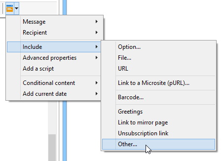
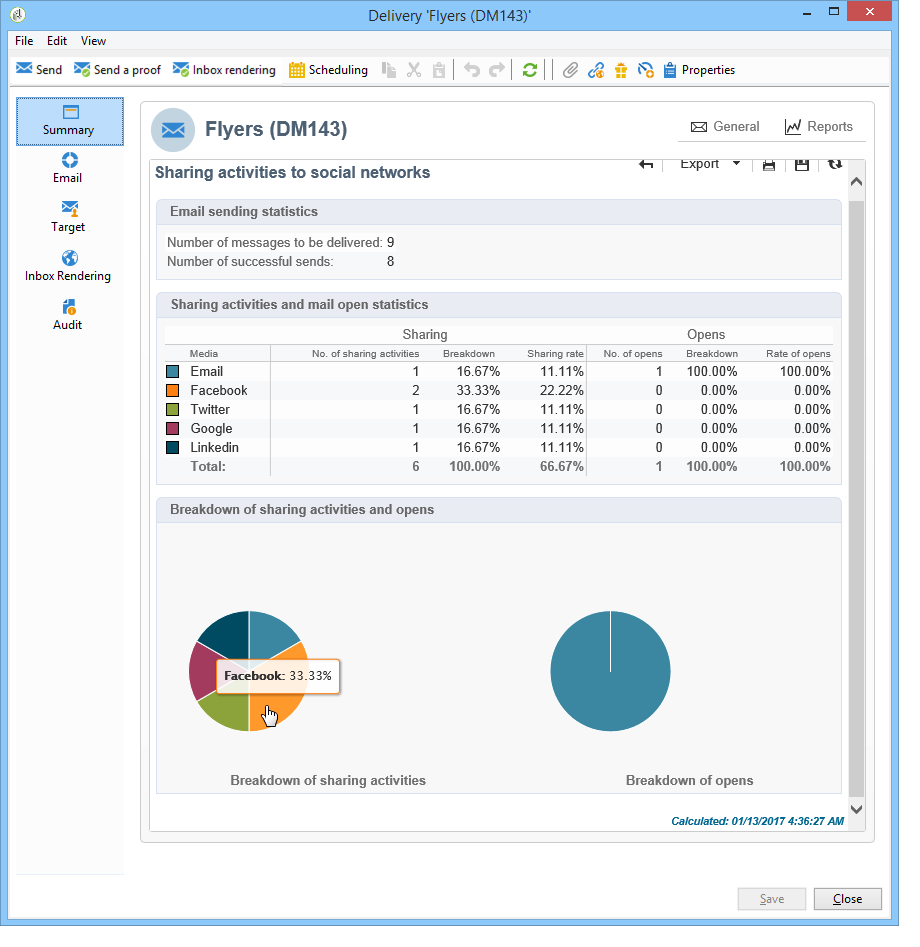

# Marketing virale e social marketing{#viral-and-social-marketing}

## Informazioni sul marketing virale {#about-viral-marketing}

 Adobe Campaign consente di configurare strumenti per incoraggiare il marketing virale.

Questo consente ai destinatari o ai visitatori del sito Web di condividere informazioni con la propria rete: dall&#39;aggiunta di un collegamento al proprio profilo Facebook o Twitter per l&#39;invio di un messaggio a un amico.

>[!CAUTION]
>
>Affinché i collegamenti aggiunti funzionino correttamente, la pagina mirror corrispondente deve essere disponibile. A tal fine, includete il collegamento alla pagina mirror nella consegna.

## Social network: condivisione di un collegamento {#social-networks--sharing-a-link}

Per consentire ai destinatari della distribuzione di condividere il contenuto dei messaggi con i membri della rete, è necessario includere il blocco di personalizzazione corrispondente.

>[!NOTE]
>
>Per impostazione predefinita, questo collegamento non è disponibile nell&#39;elenco dei blocchi. È possibile accedervi facendo clic **[!UICONTROL Other...]** e selezionando il **[!UICONTROL Social network sharing links]** blocco.

Il rendering sarà il seguente:

Quando il destinatario fa clic sull&#39;icona di uno dei social network visualizzati, viene automaticamente reindirizzato al proprio account e può condividere il contenuto del messaggio tramite un collegamento. Questo consente ai membri della loro rete di accedere alla comunicazione.

>[!NOTE]
>
>Questo blocco di personalizzazione contiene tutti i collegamenti (per l&#39;invio e la condivisione di messaggi con tutti i social network). Può essere alterato per soddisfare le vostre esigenze. Tuttavia, la configurazione è riservata agli utenti avanzati. Per modificare il blocco di personalizzazione corrispondente, andate al **[!UICONTROL Resources > Campaign management > Personalization blocks]** nodo della struttura di Adobe Campaign .

## Marketing virtuale: inoltrare a un amico {#viral-marketing--forward-to-a-friend}

Un servizio virale consente di eseguire azioni di tipo referral: queste azioni consentono di inoltrare un messaggio a un amico. Il profilo dell&#39;arbitro viene memorizzato temporaneamente nel database (in una tabella dedicata). I messaggi inoltrati includono un collegamento per l’utente che desidera sottoscrivere: in tal caso, verranno aggiunti al database Adobe Campaign .

L&#39;inoltro dei messaggi si basa sugli stessi principi dei collegamenti dei social network.

Applicate le seguenti fasi:

1. Aggiungi il blocco di **[!UICONTROL Social network sharing links]** personalizzazione nel corpo del messaggio originale.
1. Il destinatario del messaggio può fare clic sull&#39; **[!UICONTROL Email]** icona per inviare il messaggio a uno o più amici.

   

   Un modulo di riferimento consente di inserire gli indirizzi e-mail dei referenti.

   

   Il messaggio viene inviato quando il destinatario principale fa clic sul **[!UICONTROL Next]** pulsante.

   >[!NOTE]
   >
   >Il contenuto di questo messaggio può essere personalizzato per soddisfare le tue esigenze. Viene creato in base al **[!UICONTROL Transfer of original message]** modello, memorizzato nel **[!UICONTROL Administration > Campaign management > Technical delivery templates]** nodo.
   >
   >È inoltre possibile modificare il modulo di inoltro del messaggio reso disponibile al referente. A tal fine, è necessario modificare l&#39;applicazione Web del modulo **** Viral memorizzata nel **[!UICONTROL Resources > Online > Web applications]** nodo.

1. Nel messaggio inoltrato, un collegamento consente al referente di salvare il proprio profilo nel database. A tal fine è previsto un modulo di iscrizione.

   

   >[!NOTE]
   >
   >Questa configurazione può essere adattata. A tal fine, è necessario modificare l&#39;applicazione Web iscrizione **** Destinatario memorizzata nel **[!UICONTROL Resources > Online > Web applications]** nodo.
   >
   >For more information on Web applications, refer to [this section](../../web/using/about-web-applications.md).

   Una volta convalidati, viene loro inviato un messaggio di conferma: verranno registrati per sempre solo dopo aver attivato il collegamento nel messaggio di conferma. Questo messaggio viene creato in base al **[!UICONTROL Registration confirmation]** modello, memorizzato nel **[!UICONTROL Administration > Campaign management > Technical delivery templates]** nodo.

   Il riferimento viene aggiunto alla cartella **Recipients** del database e viene sottoscritto (per impostazione predefinita) al servizio informazioni **Newsletter** .

## Tracciamento della condivisione social network {#tracking-social-network-sharing}

La condivisione e l&#39;accesso alle informazioni condivise vengono tracciati. Queste informazioni raccolte da  Adobe Campaign sono accessibili in due punti:

* nella **[!UICONTROL Tracking]** scheda della consegna (o singolarmente per ciascun destinatario):

   

* in una relazione dedicata **[!UICONTROL Sharing to social networks]** :

   

