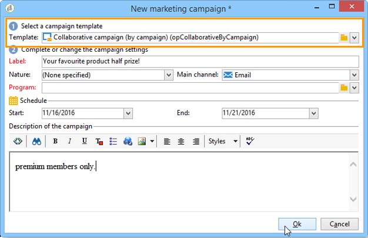
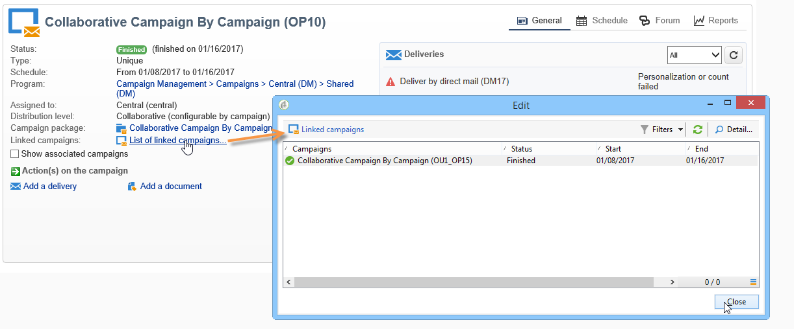
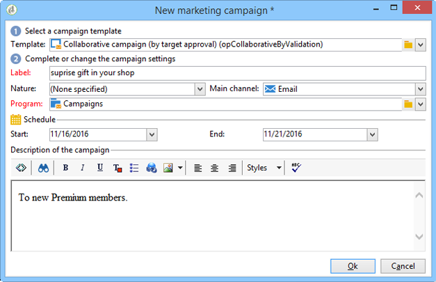
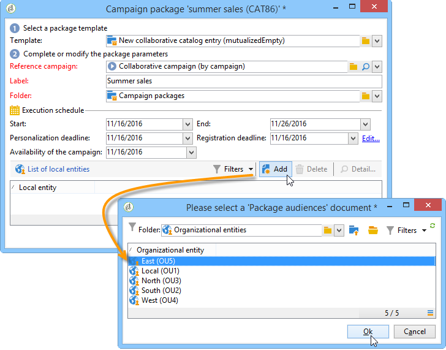
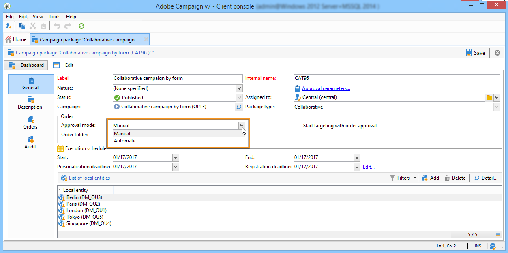

# Creazione di una campagna collaborativa{#creating-a-collaborative-campaign-intro}

L&#39;entità centrale crea campagne collaborative dai modelli di campagne **Distributed Marketing**. Consulta [questa pagina](about-distributed-marketing.md#collaborative-campaign).

## Creazione di una campagna collaborativa {#creating-a-collaborative-campaign}

Per configurare una campagna collaborativa, fai clic sul nodo **[!UICONTROL Campaign management > Campaigns]** , quindi sull&#39;icona **[!UICONTROL New]** .

>[!NOTE]
>
>Oltre a **[!UICONTROL collaborative campaigns (by campaign)]**, queste campagne possono essere configurate ed eseguite tramite un’interfaccia web.

Il processo di configurazione per un database di campagne collaborative è simile a quello di un modello di campagna locale. Di seguito sono illustrate le specifiche dei diversi tipi di campagne collaborative.

### Per modulo {#by-form}

Per creare una campagna collaborativa (per modulo), è necessario selezionare il modello **[!UICONTROL Collaborative campaign (by form)]** .

Nella scheda **[!UICONTROL Edit]** , fai clic sul collegamento **[!UICONTROL Advanced campaign settings...]** per accedere alla scheda **Marketing distribuito** .

Selezionare l&#39;interfaccia Web **By form**. Questo tipo di interfaccia consente di creare campi di personalizzazione che verranno utilizzati dalle entità locali per ordinare una campagna. Consulta [Creazione di una campagna locale (per modulo)](examples.md#creating-a-local-campaign--by-form-).

Salva la campagna. È ora possibile utilizzarlo dalla visualizzazione **Pacchetti campagna** nella scheda **Campagna** , facendo clic sul pulsante **[!UICONTROL Create]** .

La vista **[!UICONTROL Campaign Package]** ti consente di utilizzare modelli di campagna locali (preconfigurati o duplicati), nonché campagne di riferimento per campagne collaborative, allo scopo di creare campagne per diverse entità organizzative.

### Per campagna {#by-campaign}

Per creare una campagna collaborativa (per campagna), è necessario selezionare il modello **[!UICONTROL Collaborative campaign (by campaign) (opCollaborativeByCampaign)]** .

Quando ordinate la campagna, l’entità locale può completare i criteri predefiniti dall’entità centrale e valutare la campagna prima di ordinarla.

Una volta che un ordine per una **campagna collaborativa (per campagna)** viene approvato dall’entità centrale, viene creata una campagna figlio per l’entità locale. Una volta disponibili, l’entità locale può quindi modificare:

* il flusso di lavoro della campagna,
* regole di tipologia,
* e campi di personalizzazione.

L’entità locale esegue la campagna figlio. L’entità centrale esegue la campagna padre.

L’entità centrale può visualizzare tutte le campagne figlie collegate con una **campagna collaborativa (per campagna)** da questo dashboard (tramite il collegamento **[!UICONTROL List of associated campaigns]** ).

### Per approvazione target {#by-target-approval}

Per creare una campagna collaborativa (tramite approvazione target), è necessario selezionare il modello **[!UICONTROL Collaborative campaign (by target approval)]** .

>[!NOTE]
>
>In questa modalità, l’entità centrale non deve specificare le entità locali.

Il flusso di lavoro della campagna deve integrare l’attività di tipo **Approvazione locale** . I parametri dell’attività sono i seguenti:

* **[!UICONTROL Action to perform]** : Notifica di approvazione di Target.
* **[!UICONTROL Distribution context]** : Esplicito.
* **[!UICONTROL Data distribution]** : Distribuzione di entità locale.

**È necessario creare la distribuzione dei dati di tipo** di distribuzione dell&#39;entità locale. Il modello di distribuzione dei dati ti consente di limitare il numero di record da un elenco di valori di raggruppamento. In **[!UICONTROL Resources > Campaign management > Data distribution]**, fai clic sull&#39;icona **[!UICONTROL New]** per creare un nuovo **[!UICONTROL Data distribution]**. Per ulteriori informazioni sulla distribuzione dei dati, consulta la guida [Flussi di lavoro](../../workflow/using/using-the-local-approval-activity.md#step-1--creating-the-data-distribution-template-) .

Seleziona la **Dimensione di targeting** e la **[!UICONTROL Distribution field]**. Per **[!UICONTROL Assignment type]**, selezionare **Entità locale**.

Nella scheda **[!UICONTROL Distribution]** , aggiungi un campo per ogni entità locale e specifica il valore.

Puoi aggiungere una seconda attività **Approvazione di Target** dopo l&#39;attività di tipo **Consegna** per configurare un rapporto su di essa.

Nel messaggio di notifica della creazione della campagna, l’entità locale riceve un elenco di contatti predefinito dai parametri dell’entità centrale.

L’entità locale può eliminare alcuni contatti in base al contenuto della campagna.

### Semplice {#simple}

Per creare una campagna collaborativa semplice, è necessario selezionare il modello **[!UICONTROL Collaborative campaign (simple)]** .

## Creazione di un pacchetto di campagna collaborativo {#creating-a-collaborative-campaign-package}

Per rendere una campagna disponibile alle entità locali, l’entità centrale deve creare un pacchetto della campagna.

Applica i seguenti passaggi:

1. Nella sezione **[!UICONTROL Navigation]** della pagina **Campagne**, fai clic sul collegamento **[!UICONTROL Campaign packages]**.
1. Fai clic sul pulsante **[!UICONTROL Create]**.
1. La sezione nella parte superiore della finestra consente di selezionare il modello **[!UICONTROL New collaborative package (mutualizedEmpty)]**.
1. Seleziona la campagna di riferimento.
1. Specifica l’etichetta, la cartella e la pianificazione di esecuzione per il pacchetto della campagna.

### Date {#dates}

Le date di inizio e di fine definiscono il periodo di visibilità della campagna nell’elenco dei pacchetti della campagna.

Per le **campagne collaborative**, l&#39;entità centrale deve specificare la scadenza per la registrazione e la personalizzazione.

>[!NOTE]
>
>Il **[!UICONTROL Personalization deadline]** consente all&#39;entità centrale di scegliere una scadenza entro la quale le entità locali devono aver consegnato i documenti (fogli di calcolo, immagini) da utilizzare per configurare la campagna. Questa non è un&#39;opzione obbligatoria. L’utilizzo graduale di questa data non influisce sull’implementazione della campagna.

### Pubblico {#audience}

L’entità centrale deve specificare le entità locali coinvolte per campagna non appena viene creata la campagna collaborativa.

>[!CAUTION]
>
>**[!UICONTROL Simple, by form and by campaign collaborative campaign kits]** non possono essere approvati a meno che non siano stati specificati gli enti locali pertinenti.

### Modalità di approvazione {#approval-modes}

Per **campagne collaborative**, puoi specificare la modalità di approvazione dell&#39;ordine.

In modalità manuale, l’entità locale deve sottoscrivere la campagna per partecipare.

In modalità automatica, l’entità locale viene pre-sottoscritta per la campagna. Può annullare la sottoscrizione della campagna o modificare i suoi parametri senza richiedere l’approvazione da parte dell’entità centrale.

### Notifiche {#notifications}

La configurazione per le notifiche è identica alle notifiche per un&#39;entità locale. Fai riferimento a [questa sezione](creating-a-local-campaign.md#notifications).

## Ordinamento di una campagna {#ordering-a-campaign}

Quando una campagna collaborativa viene aggiunta all’elenco dei pacchetti di campagne, le entità locali appartenenti al pubblico definito dall’entità centrale ricevono una notifica (le **campagne collaborative (per approvazione target)** non dispongono di un pubblico predefinito). Il messaggio inviato contiene un collegamento che consente di registrarsi per la campagna, come illustrato di seguito:

Questo messaggio consente anche alle entità locali di visualizzare la descrizione immessa dall’operatore centrale che ha creato il pacchetto, nonché i documenti collegati alla campagna. Questi non appartengono alla campagna stessa, anche se forniscono informazioni aggiuntive al riguardo.

Dopo aver effettuato l’accesso tramite un’interfaccia web, gli operatori locali possono inserire informazioni personalizzate nella campagna collaborativa che desiderano ordinare:

Dopo che un ente locale ha completato la sua registrazione, gli enti centrali ricevono una notifica via e-mail per approvare il loro ordine.

Per ulteriori informazioni, consulta la sezione [Processo di approvazione](creating-a-local-campaign.md#approval-process) .

## Approvazione di un ordine {#approving-an-order}

Il processo per l’approvazione di un ordine di pacchetti di campagna collaborativa è lo stesso di quando lo si fa per una campagna locale. Fai riferimento a [questa sezione](creating-a-local-campaign.md#approving-an-order).
