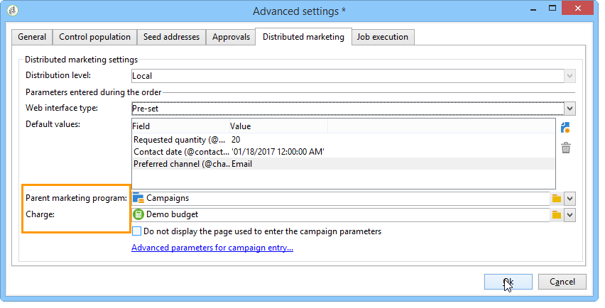
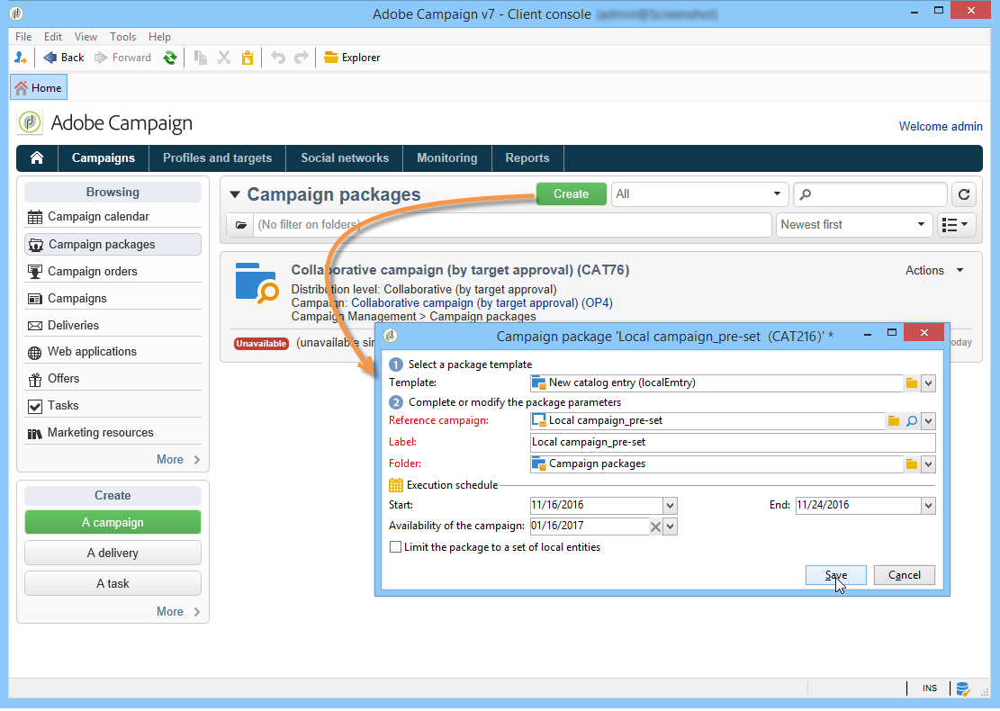
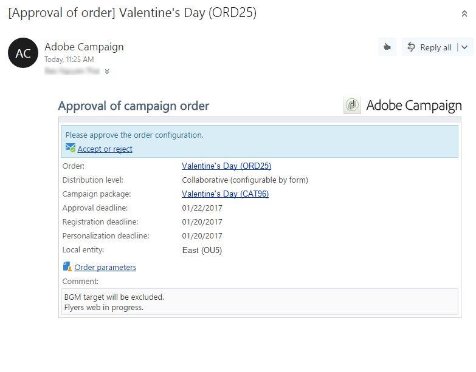
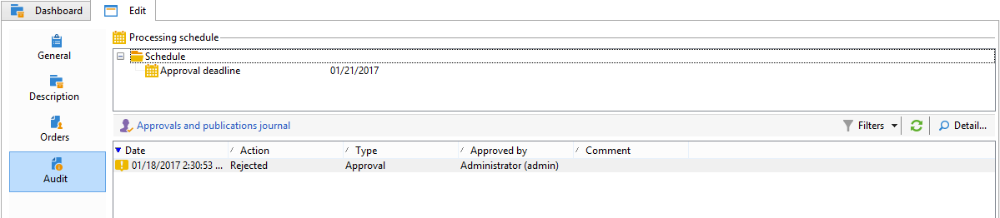

# Creazione di una campagna locale{#creating-a-local-campaign}

Una campagna locale è un&#39;istanza creata da un modello a cui si fa riferimento nell&#39;elenco di **[!UICONTROL campaign packages]** con una **pianificazione di esecuzione specifica**. Il suo obiettivo è soddisfare un&#39;esigenza di comunicazione locale utilizzando un modello di campagna configurato e configurato dall&#39;entità centrale. Le fasi principali per l&#39;attuazione di un&#39;operazione locale sono le seguenti:

**Per l&#39;entità centrale**

1. Creazione di un modello di campagna locale.
1. Creazione di un pacchetto della campagna da un modello.
1. Pubblicazione di un pacchetto della campagna.
1. Approvazione degli ordini.

**Per l&#39;entità locale**

1. Ordinamento della campagna.
1. Esecuzione di campagne.

## Creazione di un modello di campagna locale {#creating-a-local-campaign-template}

Per creare un pacchetto di campagna, devi innanzitutto creare il **modello di campagna** tramite il nodo **[!UICONTROL Resources > Templates]** .

Per creare un nuovo modello locale, duplica il modello **[!UICONTROL Local campaign (opLocal)]** predefinito.

Denomina il modello di campagna e completa i campi disponibili.

Nella finestra della campagna, fai clic sulla scheda **[!UICONTROL Edit]** , quindi sul collegamento **[!UICONTROL Advanced campaign settings...]** .

### Interfaccia web {#web-interface}

Nella scheda **Marketing distribuito** è possibile scegliere il tipo di interfaccia Web e specificare i valori e i parametri predefiniti da immettere quando un&#39;entità locale inserisce un ordine.

L’interfaccia web corrisponde a un modulo che deve essere compilato dall’entità locale durante l’ordinamento della campagna.

Seleziona il tipo di interfaccia web da applicare alle campagne create dal modello:

Sono disponibili quattro tipi di interfacce web:

* **[!UICONTROL By brief]** : l’entità locale deve fornire una descrizione in cui descrive le configurazioni della campagna. Una volta approvato l’ordine, l’entità centrale configura ed esegue la campagna nel suo insieme.

   

* **[!UICONTROL By form]** : l’entità locale ha accesso a un modulo web in cui, a seconda del modello utilizzato, può modificare il contenuto, il target, le dimensioni massime, nonché le date di creazione ed estrazione utilizzando i campi di personalizzazione. L’entità locale può valutare il target e visualizzare in anteprima il contenuto da questo modulo web.

   

   Il modulo offerto è specificato in un&#39;applicazione web che deve essere selezionata in un elenco a discesa dal campo **[!UICONTROL web Interface]** nel collegamento **[!UICONTROL Advanced campaign settings...]** del modello. Consulta [Creazione di una campagna locale (per modulo)](examples.md#creating-a-local-campaign--by-form-).

   >[!NOTE]
   >
   >L&#39;applicazione Web utilizzata in questo esempio è un esempio. Per poter utilizzare un modulo è necessario creare un’app Web specifica. Fai riferimento a [API](../../configuration/using/about-web-services.md).

   

* **[!UICONTROL By external form]** : l&#39;entità locale ha accesso ai parametri della campagna nella sua extranet (non Adobe Campaign). Questi parametri sono identici a quelli di una **campagna locale (per modulo)**.
* **[!UICONTROL Pre-set]** : campagna di ordini di entità locale utilizzando il modulo predefinito, senza localizzarlo.

   

### Valori predefiniti {#default-values}

Selezionare il **[!UICONTROL Default values]** da completare per le entità locali. Ad esempio:

* date di contatto ed estrazione,
* caratteristiche del target (segmento di età, ecc.).

Compila i campi **[!UICONTROL Parent marketing program]** e **[!UICONTROL Charge]** .

### Approvazioni {#approvals}

Dal collegamento **[!UICONTROL Advanced parameters for campaign entry]** puoi specificare il numero massimo di revisori.

I revisori verranno inseriti dall&#39;entità locale al momento dell&#39;ordine della campagna.

Se non desiderate assegnare un nome ai revisori per una campagna, immettete 0.

### Documenti {#documents}

È possibile consentire agli operatori di entità locali di collegare documenti (file di testo, fogli di calcolo, immagini, descrizioni di campagne, ecc.) nella campagna locale durante la creazione dell’ordine. Il collegamento **[!UICONTROL Advanced parameters for campaign entry...]** consente di limitare il numero di documenti. A questo scopo, è sufficiente inserire il numero massimo consentito nel campo **[!UICONTROL Number of documents]** .

Quando si ordina un pacchetto della campagna, il modulo suggerisce di collegare tutti i documenti indicati nel campo corrispondente nel modello.

Se non desideri visualizzare un campo di caricamento del documento, immetti **[!UICONTROL 0]** nel campo **[!UICONTROL Number of documents]** .

>[!NOTE]
>
>È possibile disattivare il **[!UICONTROL Advanced parameters for campaign entry]** selezionando **[!UICONTROL Do not display the page used to enter the campaign parameters]**.

### Flusso di lavoro {#workflow}

Nella scheda **[!UICONTROL Targeting and workflows]** , crea il flusso di lavoro della campagna che raccoglie le **[!UICONTROL Default values]** specificate in **[!UICONTROL Advanced campaign settings...]** e crea le consegne.

Fai doppio clic sull&#39;attività **[!UICONTROL Query]** per configurarla in base al **[!UICONTROL Default values]** specificato.

### Consegna {#delivery}

Nella scheda **[!UICONTROL Audit]** , fai clic sull’icona **[!UICONTROL Detail...]** per visualizzare la **[!UICONTROL Scheduling]** per la consegna selezionata.

L’icona **[!UICONTROL Scheduling]** ti consente di configurare il contatto e la data di esecuzione della consegna.

Se necessario, configura la dimensione massima della consegna:

Individua l’HTML della consegna. Ad esempio, in **[!UICONTROL Delivery > Current order > Additional fields]**, utilizza il campo **[!UICONTROL Age segment]** per individuare la consegna in base all’età della destinazione.

Salva il modello della campagna. È ora possibile utilizzarlo dalla visualizzazione **[!UICONTROL Campaign packages]** nella scheda **[!UICONTROL Campaigns]** facendo clic sul pulsante **[!UICONTROL Create]** .

>[!NOTE]
>
>I modelli di campagna e la relativa configurazione generale sono descritti in [Modelli di campagna](../../campaign/using/marketing-campaign-templates.md#campaign-templates).

## Creazione del pacchetto della campagna {#creating-the-campaign-package}

Affinché il modello di campagna possa essere disponibile per le entità locali, deve essere aggiunto all’elenco. Per fare questo, l&#39;agenzia centrale deve creare un nuovo pacchetto.

Applica i seguenti passaggi:

1. Nella sezione **[!UICONTROL Navigation]** della pagina **Campagne**, fai clic sul collegamento **[!UICONTROL Campaign packages]**.
1. Fai clic sul pulsante **[!UICONTROL Create]**.

   

1. La sezione sopra la finestra ti consente di selezionare il modello di pacchetto della campagna specificato [in precedenza](#creating-a-local-campaign-template).

   Per impostazione predefinita, il modello **[!UICONTROL New local campaign package (localEmpty)]** viene utilizzato per le campagne locali.

1. Specifica l’etichetta, la cartella e la pianificazione di esecuzione per il pacchetto della campagna.

### Date {#dates}

Le date di inizio e di fine definiscono il periodo di visibilità della campagna nell’elenco dei pacchetti della campagna.

La data di disponibilità è la data in cui la campagna diventerà disponibile per le entità locali (su ordine).

>[!CAUTION]
>
>Se un&#39;entità locale non riserva la campagna prima della scadenza, non sarà in grado di utilizzarla.

Queste informazioni si trovano nel messaggio di notifica inviato alle agenzie locali, come mostrato di seguito:

### Pubblico {#audience}

Per una campagna locale, l&#39;entità centrale può specificare le entità locali coinvolte selezionando **[!UICONTROL Limit the package to a set of local entities]**.

### Impostazioni aggiuntive {#additional-settings}

Una volta salvato il pacchetto, l’entità centrale può modificarlo dalla scheda **[!UICONTROL Edit]** .

Dalla scheda **[!UICONTROL General]** , l’entità centrale può:

* configura i revisori dei pacchetti della campagna dal collegamento **[!UICONTROL Approval parameters...]**,
* rivedere il programma di esecuzione,
* aggiungere o eliminare entità locali.

>[!NOTE]
>
>Per impostazione predefinita, ogni entità può ordinare una **campagna locale** una sola volta.
>   
>Seleziona l’opzione **[!UICONTROL Enable multiple creation]** per consentire la creazione di diverse campagne locali dal pacchetto della campagna.

### Notifiche {#notifications}

Quando una campagna diventa disponibile o quando viene raggiunta la scadenza della registrazione, viene inviato un messaggio agli operatori del gruppo di notifica locale. Per ulteriori informazioni, consulta [Entità organizzative](about-distributed-marketing.md#organizational-entities).

## Ordinamento di una campagna {#ordering-a-campaign}

I pacchetti Campaign diventano accessibili alle entità locali dopo che sono stati approvati e il loro periodo di implementazione è iniziato. Le entità locali ricevono un’e-mail che informa la disponibilità di un nuovo pacchetto della campagna (non appena viene raggiunta la data di disponibilità).

>[!NOTE]
>
>Se durante la creazione del pacchetto della campagna sono state specificate alcune entità locali, queste saranno le uniche a ricevere una notifica. Se non è stata specificata alcuna entità locale, tutte le entità locali riceveranno una notifica.

Per utilizzare una campagna offerta dall&#39;entità centrale, l&#39;entità locale deve ordinarla.

Per ordinare una campagna:

1. Fai clic su **[!UICONTROL Order campaign]** nel messaggio di notifica o sul pulsante corrispondente in Adobe Campaign.

   Immetti il tuo ID e password per ordinare la campagna. L’interfaccia è composta da un set di pagine definite in un’applicazione web.

   >[!NOTE]
   >
   >Le applicazioni web sono descritte in [questa sezione](../../web/using/about-web-applications.md).

1. Immetti le informazioni necessarie nella prima pagina (etichetta dell’ordine e commento) e fai clic su **[!UICONTROL Next]**.

   

1. Completa i parametri disponibili e approva l’ordine.

1. Viene inviata una notifica al responsabile dell&#39;entità organizzativa a cui appartiene l&#39;entità locale per approvare questo ordine.

   

1. Le informazioni vengono restituite alle entità locali e centrali. Mentre gli enti locali possono visualizzare solo i propri ordini, l&#39;entità centrale può visualizzare tutti gli ordini da qualsiasi entità locale, come mostrato di seguito:

   

   Gli operatori possono visualizzare i dettagli dell&#39;ordine:

   

   La scheda **[!UICONTROL Edit]** contiene informazioni immesse dall’entità locale durante l’ordinamento della campagna.

   

1. L&#39;ordine deve essere approvato dall&#39;ente centrale per essere finalizzato.

   

   Per ulteriori informazioni, consulta la sezione [Processo di approvazione](#approval-process) .

1. L’operatore locale viene quindi informato della disponibilità della campagna: la disponibilità della campagna si trova nell’elenco dei pacchetti della campagna nella scheda **Campagne** . La campagna può quindi essere utilizzata. Per ulteriori informazioni, consulta [Accesso alle campagne](accessing-campaigns.md).

   L’opzione **[!UICONTROL Start targeting with order approval]** consente all’entità locale di eseguire la campagna non appena l’ordine è stato approvato.

   

## Approvazione di un ordine {#approving-an-order}

Per confermare l’ordine di una campagna, l’entità centrale deve approvarlo.

La panoramica **[!UICONTROL Campaign orders]** accessibile tramite la scheda **Campagne** consente di visualizzare lo stato degli ordini delle campagne e di approvarli.

>[!NOTE]
>
>Le entità locali possono apportare modifiche all&#39;ordine finché non viene approvato.

### Processo di approvazione {#approval-process}

#### Notifica e-mail {#email-notification}

Quando una campagna viene ordinata da un’entità locale, i relativi revisori ricevono una notifica tramite e-mail, come illustrato di seguito:

>[!NOTE]
>
>La selezione dei revisori viene presentata nella sezione [Revisori](#reviewers) . Possono accettare o rifiutare l&#39;ordine.

#### Approvazione tramite la console Adobe Campaign {#approving-via-the-adobe-campaign-console}

L’ordine può anche essere approvato tramite la console, nella panoramica dell’ordine della campagna. Per approvare un ordine, selezionalo e fai clic su **[!UICONTROL Approve the order]**.

>[!NOTE]
>
>La campagna può ancora essere modificata e riconfigurata fino alla data di disponibilità della campagna. Le entità locali possono inoltre rifiutare la campagna facendo clic sul pulsante **[!UICONTROL Cancel]** .

#### Creazione di una campagna {#creating-a-campaign}

Una volta approvato, l’ordine della campagna può essere configurato ed eseguito dall’entità locale.

Per ulteriori informazioni, consulta [Accesso alle campagne](accessing-campaigns.md).

### Rifiuto di un&#39;approvazione {#rejecting-an-approval}

L’operatore incaricato dell’approvazione può rifiutare un ordine o un pacchetto di campagna.

Se il revisore rifiuta un ordine, la notifica pertinente viene inviata automaticamente agli enti locali interessati: visualizza il commento immesso dall’operatore che ha rifiutato l’approvazione.

Le informazioni vengono visualizzate nella pagina dell’elenco dei pacchetti della campagna o nella pagina dell’ordine della campagna. Se hanno accesso alla console Adobe Campaign, le entità locali vengono informate di questo rifiuto.

Possono visualizzare il commento correlato nella scheda **[!UICONTROL Edit]** del pacchetto della campagna.

### Revisori {#reviewers}

Ogni volta che viene richiesta un’approvazione, i revisori ricevono una notifica via e-mail.

Per ogni entità locale, i revisori vengono selezionati per l&#39;approvazione dell&#39;ordine della campagna e per l&#39;approvazione della campagna. Per ulteriori informazioni sulla selezione dei revisori locali, consulta [Entità organizzative](about-distributed-marketing.md#organizational-entities).

>[!NOTE]
>
>Affinché questa selezione sia possibile, l&#39;approvazione dell&#39;ordine non deve ancora essere efficace.

### Annullamento di un ordine {#canceling-an-order}

L&#39;agenzia centrale può annullare un ordine utilizzando il pulsante **[!UICONTROL Delete]**, situato sul dashboard dell&#39;ordine.

In questo modo la campagna viene annullata nella visualizzazione **[!UICONTROL Campaign orders]**.
