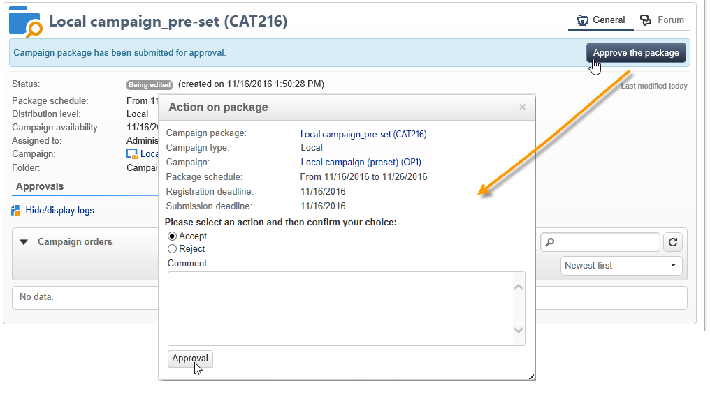

# Pubblicare il pacchetto della campagna{#publishing-the-campaign-package}

Gli operatori di entità centrali pubblicano le campagne che desiderano offrire a enti locali **[!UICONTROL list of campaign packages]**.

Prima di poter essere pubblicati nell’elenco dei pacchetti della campagna, i pacchetti della campagna devono essere approvati dall’entità centrale. A questo scopo, puoi specificare un revisore o un gruppo di revisori tramite il **[!UICONTROL Approval parameters]** nel pacchetto della campagna.

## Assegnazione di un revisore {#assigning-a-reviewer}

Per selezionare il revisore, fai clic sul pulsante **[!UICONTROL Approval parameters]** dal pacchetto della campagna e scegli il revisore pertinente dall&#39;elenco a discesa.

Puoi quindi iniziare il processo di approvazione facendo clic su **[!UICONTROL Submit for approval]**.

Viene quindi inviato un messaggio di notifica al revisore per confermare la disponibilità di questo pacchetto della campagna. Il messaggio contiene un collegamento per accettare o rifiutare l’approvazione tramite accesso web.

>[!NOTE]
>
>A livello di entità organizzativa, è inoltre possibile specificare i revisori per approvare gli ordini. Per ulteriori informazioni, consulta [Entità organizzative](about-distributed-marketing.md#organizational-entities).

## Aggiunta di altri revisori {#adding-other-reviewers}

Puoi aggiungere altri revisori dalla sezione **[!UICONTROL Edit...]** link, trovato nel pacchetto della campagna **[!UICONTROL Approval parameters...]** scheda .

## Periodi di approvazione {#approval-periods}

Per impostazione predefinita, i revisori ricevono tre giorni dalla data di invio per elaborare l’approvazione.

Nella finestra modifica revisori è inoltre possibile impostare i promemoria per l’invio di uno o più messaggi se un pacchetto della campagna non è stato approvato. A questo scopo, fai clic sul pulsante **[!UICONTROL Add reminder]** link, quindi il **[!UICONTROL Add]** pulsante .

I promemoria possono essere inviati in una data determinata e/o **x** giorni successivi alla data di invio. Il tipo di promemoria può essere configurato nella prima colonna della tabella dei promemoria. Nell&#39;esempio seguente, i revisori riceveranno un messaggio di promemoria sul 29/01/2014, ossia due giorni prima della data selezionata nel **[!UICONTROL Date]** e un secondo sollecito un giorno prima della fine del periodo di approvazione, ossia due giorni dopo la data di presentazione dell’approvazione.

Una volta definito e inviato il pacchetto per l&#39;approvazione, il programma di esecuzione viene visualizzato nel **[!UICONTROL Audit]** scheda . Mostra la scadenza di elaborazione calcolata in base alla configurazione precedente, nonché le date di tutti i promemoria configurati.

## Approvazione tramite la console Adobe Campaign {#approving-via-the-adobe-campaign-console}

Se non è stato specificato alcun revisore o se nessuno degli operatori notificati ha approvato il pacchetto, il **[!UICONTROL Approve the package]** consente di passare direttamente all’approvazione dal pacchetto della campagna **[!UICONTROL Dashboard]** o dalla panoramica dei pacchetti.

Dopo l’approvazione, la campagna viene pubblicata, aggiunta all’elenco e, non appena viene raggiunta la data di disponibilità, le entità locali possono utilizzarla. Se durante la creazione della campagna sono state specificate le entità locali, viene inviato un messaggio agli operatori del gruppo di notifiche per informarli che la campagna è disponibile. Se in precedenza non è stata specificata alcuna entità, per impostazione predefinita la campagna è disponibile per tutte le entità locali. Per ulteriori informazioni, consulta [Entità organizzative](about-distributed-marketing.md#organizational-entities).
