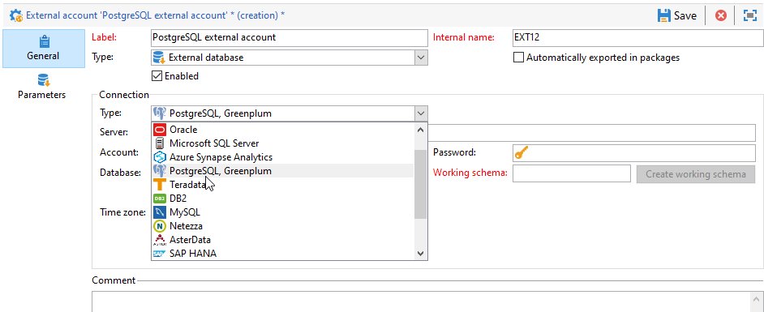

# Configurare l&#39;accesso a PostgreSQL {#configure-fda-postgresql}

Utilizzare Campaign **Federated Data Access** (FDA) opzione per elaborare le informazioni memorizzate in un database PostgreSQL esterno.

## Configurazione PostgreSQL {#postgresql-configuration}

Devi prima installare Libpq. Libpq consente ai programmi client di inviare query al server back-end PostgreSQL e di ricevere i risultati di queste query.

Segui i passaggi seguenti per configurare l’accesso a [!DNL PostgreSQL]:

* Per CentOS, esegui il seguente comando `sudo apt-get -y install libpq-dev`.

* Per Linux, esegui il seguente comando `yum install postgresql-devel`.

* Per Windows, Libpq è implementato tramite `libpq.dll` incluso nell’installazione di Adobe Campaign.

In Adobe Campaign puoi quindi configurare il [!DNL PostgreSQL] conto esterno. Per ulteriori informazioni su come configurare l’account esterno, consulta [questa sezione](#postgresql-external).

## Account esterno PostgreSQL {#postgresql-external}

>[!NOTE]
>
> PostgreSQL è disponibile su CentOS 7 e 6.

È necessario creare un [!DNL PostgreSQL] account esterno per collegare la tua istanza Campaign al tuo [!DNL PostgreSQL] database esterno.

1. Da campagna **[!UICONTROL Explorer]**, fai clic su **[!UICONTROL Administration]** &#39;>&#39; **[!UICONTROL Platform]** &#39;>&#39; **[!UICONTROL External accounts]**.

1. Fai clic su **[!UICONTROL New]**.

1. Seleziona **[!UICONTROL External database]** come account esterno **[!UICONTROL Type]**.

1. Sotto **[!UICONTROL Configuration]**, seleziona [!DNL PostgreSQL, Greenplum] dal **[!UICONTROL Type]** a discesa.

   

1. Configura le **[!UICONTROL PostgreSQL]** autenticazione account esterno:

   * **[!UICONTROL Server]**: URL del [!DNL PostgreSQL] server.

   * **[!UICONTROL Account]**: Nome dell&#39;utente.

   * **[!UICONTROL Password]**: Password dell&#39;account utente.

   * **[!UICONTROL Database]**: Nome del database (facoltativo).

   * **[!UICONTROL Working schema]**: Nome dello schema di lavoro. [Ulteriori informazioni](https://www.postgresql.org/docs/current/ddl-schemas.html)

   * **[!UICONTROL Timezone]**: Fuso orario impostato in [!DNL PostgreSQL]. [Ulteriori informazioni](https://www.postgresql.org/docs/7.2/timezones.html)

1. Fai clic sul pulsante **[!UICONTROL Parameters]** quindi seleziona **[!UICONTROL Deploy functions]** per creare funzioni.

   >[!NOTE]
   >
   >Affinché tutte le funzioni siano disponibili, è necessario creare le funzioni SQL di Adobe Campaign nel database remoto. Per ulteriori informazioni, consulta [page](../../configuration/using/adding-additional-sql-functions.md).

1. Fai clic su **[!UICONTROL Save]** al termine della configurazione.

Il connettore supporta le seguenti opzioni:

| Opzione | Descrizione |
|:-:|:-:|
| PGSQL_CONNECT_TIMEOUT | Attesa massima della connessione, in secondi.  Per ulteriori informazioni, consulta [Documentazione PostgreSQL](https://www.postgresql.org/docs/12/libpq-connect.html#LIBPQ-CONNECT-CONNECT-TIMEOUT). |
| PGSQL_KEEPALIVES_IDLE | Numero di secondi di inattività dopo i quali il TCP deve inviare un messaggio KEepalive al server.  Per ulteriori informazioni, consulta [Documentazione PostgreSQL](https://www.postgresql.org/docs/12/libpq-connect.html#LIBPQ-KEEPALIVES-IDLE). |
| PGSQL_KEEPALIVES_INTVL | Numero di secondi dopo i quali il messaggio TCP keep-alive non riconosciuto dal server deve essere ritrasmesso.   Per ulteriori informazioni, consulta [Documentazione PostgreSQL](https://www.postgresql.org/docs/12/libpq-connect.html#LIBPQ-KEEPALIVES-INTERVAL). |
| PGSQL_KEEPALIVES_CNT | Numero di keepalives TCP che possono essere persi prima che la connessione del client al server sia considerata morta.  Per ulteriori informazioni, consulta [Documentazione PostgreSQL](https://www.postgresql.org/docs/12/libpq-connect.html#LIBPQ-KEEPALIVES-COUNT). |
