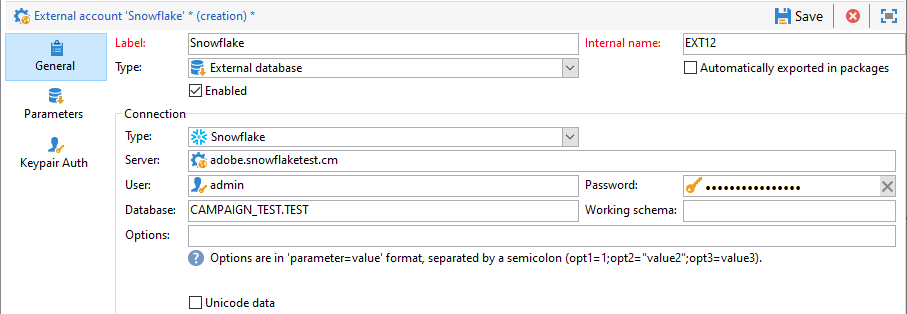

# Configurare l’accesso al Snowflake {#configure-access-to-snowflake}


Utilizzare Campaign **Federated Data Access** (FDA) opzione per elaborare le informazioni memorizzate in un database esterno. Segui i passaggi seguenti per configurare l’accesso a [!DNL Snowflake].

1. Configura [!DNL Snowflake] su [Linux](#snowflake-linux).
1. Configura le [!DNL Snowflake] [account esterno](#snowflake-external) in Campaign

>[!NOTE]
>
>[!DNL Snowflake] è disponibile per le distribuzioni in hosting e on-premise. Per ulteriori informazioni, consulta [questa pagina](../../installation/using/capability-matrix.md).


## Snowflake su Linux {#snowflake-linux}

Per configurare [!DNL Snowflake] su Linux, segui i passaggi seguenti:

1. Prima dell&#39;installazione ODBC, verificare che i seguenti pacchetti siano installati nella distribuzione Linux:

   * Per Red Hat/CentOS:

      ```
      yum update
      yum upgrade
      yum install -y grep sed tar wget perl curl
      ```

   * Per Debian:

      ```
      apt-get update
      apt-get upgrade
      apt-get install -y grep sed tar wget perl curl
      ```

1. Prima di eseguire lo script, è possibile accedere a ulteriori informazioni con `--help` opzione:

   ```
   cd /usr/local/neolane/nl6/bin/fda-setup-scripts/
   ./snowflake_odbc-setup.sh --help
   ```

1. Accedi alla directory in cui si trova lo script ed esegui il seguente script come utente principale:

   ```
   cd /usr/local/neolane/nl6/bin/fda-setup-scripts
   ./snowflake_odbc-setup.sh
   ```

1. Dopo aver installato i driver ODBC, è necessario riavviare Campaign Classic. A questo scopo, esegui il seguente comando:

   ```
   systemctl stop nlserver.service
   systemctl start nlserver.service
   ```

1. In Campaign, puoi quindi configurare il tuo [!DNL Snowflake] conto esterno. Per ulteriori informazioni su come configurare l’account esterno, consulta [questa sezione](#snowflake-external).

## account esterno Snowflake {#snowflake-external}

È necessario creare un [!DNL Snowflake] account esterno per collegare la tua istanza Campaign al tuo [!DNL Snowflake] database esterno.

1. Da campagna **[!UICONTROL Explorer]**, fai clic su **[!UICONTROL Administration]** &#39;>&#39; **[!UICONTROL Platform]** &#39;>&#39; **[!UICONTROL External accounts]**.

1. Fai clic su **[!UICONTROL New]**.

1. Seleziona **[!UICONTROL External database]** come account esterno **[!UICONTROL Type]**.

1. Sotto **[!UICONTROL Configuration]**, seleziona [!DNL Snowflake] dal **[!UICONTROL Type]** a discesa.

   

1. Aggiungi il tuo **[!UICONTROL Server]** URL e **[!UICONTROL Database]**.

1. Configura le **[!UICONTROL Snowflake]** autenticazione account esterno:

   * Per l&#39;autenticazione account/password, devi specificare:

      * **[!UICONTROL Account]**: Nome dell’utente

      * **[!UICONTROL Password]**: Password dell&#39;account utente.

      

   * Per l’autenticazione con coppie chiave, fai clic sul pulsante **[!UICONTROL Keypair Auth]** scheda per utilizzare **[!UICONTROL Private key]** per eseguire l&#39;autenticazione e copiare e incollare **[!UICONTROL Private key]**.

      


1. Fai clic sul pulsante **[!UICONTROL Parameters]** quindi seleziona **[!UICONTROL Deploy functions]** per creare funzioni.

   >[!NOTE]
   >
   >Affinché tutte le funzioni siano disponibili, è necessario creare le funzioni SQL di Adobe Campaign nel database remoto. Per ulteriori informazioni, consulta [page](../../configuration/using/adding-additional-sql-functions.md).

   

1. Fai clic su **[!UICONTROL Save]** al termine della configurazione.

Il connettore supporta le seguenti opzioni:

| Opzione | Descrizione |
|---|---|
| schema di lavoro | Schema di database da utilizzare per le tabelle di lavoro |
| magazzino | Nome del magazzino predefinito da utilizzare. Sostituirà il valore predefinito dell’utente. |
| TimeZoneName | Per impostazione predefinita è vuoto e indica che viene utilizzato il fuso orario del sistema dell’app server Campaign Classic. L’opzione può essere utilizzata per forzare il parametro di sessione TIMEZONE. <br>Per ulteriori informazioni, consulta [questa pagina](https://docs.snowflake.net/manuals/sql-reference/parameters.html#timezone). |
| WeekStart | Parametro di sessione WEEK_START. Per impostazione predefinita, è impostato su 0. <br>Per ulteriori informazioni, consulta [questa pagina](https://docs.snowflake.com/en/sql-reference/parameters.html#week-start). |
| UseCachedResult | Parametro di sessione USE_CACHED_RESULTS . Per impostazione predefinita, è impostato su TRUE. Questa opzione può essere utilizzata per disabilitare i risultati della cache del Snowflake. <br>Per ulteriori informazioni, consulta [questa pagina](https://docs.snowflake.net/manuals/user-guide/querying-persisted-results.html). |
| bulkThreads | Numero di thread da utilizzare per il caricatore di massa del Snowflake, più thread significano prestazioni migliori per carichi di massa più grandi. Per impostazione predefinita, è impostato su 1. Il numero può essere regolato, a seconda del conteggio del thread della macchina. |
| chunkSize | Determina la dimensione del file del blocco del caricamento collettivo. Per impostazione predefinita, è impostato su 128 MB. Può essere modificato per ottenere prestazioni migliori, se utilizzato con bulkThreads. Thread più attivi simultanei significano prestazioni migliori. <br>Per ulteriori informazioni, consulta [Documentazione del Snowflake](https://docs.snowflake.net/manuals/sql-reference/sql/put.html). |
| StageName | Nome dello stadio interno prepredisposto. Sarà utilizzato in modalità di caricamento in serie invece di creare una nuova fase temporanea. |
