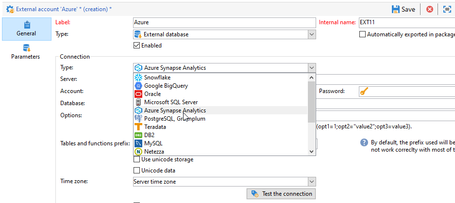

# Configurare l’accesso all’Azure synapse {#configure-access-to-azure-synapse}


Utilizzare Campaign [Federated Data Access](../../installation/using/about-fda.md) (FDA) opzione per elaborare le informazioni memorizzate in database esterni. Segui i passaggi seguenti per configurare l’accesso a **Microsoft Azure synapse Analytics**.

1. Configura Azure synapse su [CentOS](#azure-centos), [Windows](#azure-windows) o [Debian](#azure-debian)
1. Configurare l’Azure synapse [account esterno](#azure-external) in Campaign

## azure synapse su CentOS {#azure-centos}

>[!CAUTION]
>
>* Per installare un driver ODBC, è necessario disporre dei privilegi di radice.
>* I driver ODBC Red Hat Enterprise forniti da Microsoft possono essere utilizzati anche con CentOS per connettersi a SQL Server.
>* La versione 13.0 funzionerà con Red Hat 6 e 7.


Per configurare l’Azure synapse su CentOS, segui i passaggi seguenti:

1. Innanzitutto, installare il driver ODBC. Puoi trovarlo in questo [page](https://www.microsoft.com/en-us/download/details.aspx?id=50420).

   >[!NOTE]
   >
   >Questa versione è esclusiva della versione 13 del driver ODBC.

   ```
   sudo su
   curl https://packages.microsoft.com/config/rhel/6/prod.repo > /etc/yum.repos.d/mssql-release.repo
   exit
   # Uninstall if already installed Unix ODBC driver
   sudo yum remove unixODBC-utf16 unixODBC-utf16-devel #to avoid conflicts
   
   sudo ACCEPT_EULA=Y yum install msodbcsql
   
   sudo ACCEPT_EULA=Y yum install mssql-tools
   echo 'export PATH="$PATH:/opt/mssql-tools/bin"' >> ~/.bash_profile
   echo 'export PATH="$PATH:/opt/mssql-tools/bin"' >> ~/.bashrc
   source ~/.bashrc
   
   # the Microsoft driver expects unixODBC to be here /usr/lib64/libodbc.so.1, so add soft links to the '.so.2' files
   cd /usr/lib64
   sudo ln -s libodbccr.so.2   libodbccr.so.1
   sudo ln -s libodbcinst.so.2 libodbcinst.so.1
   sudo ln -s libodbc.so.2     libodbc.so.1
   
   # Set the path for unixODBC
   export ODBCINI=/usr/local/etc/odbc.ini
   export ODBCSYSINI=/usr/local/etc
   source ~/.bashrc
   
   #Add a DSN information to /etc/odbc.ini
   sudo vi /etc/odbc.ini
   
   #Add the following:
   [Azure Synapse Analytics]
   Driver      = ODBC Driver 13 for SQL Server
   Description = Azure Synapse Analytics DSN
   Trace       = No
   Server      = [insert your server here]
   ```

1. Se necessario, è possibile installare intestazioni di sviluppo unixODBC eseguendo il seguente comando:

   ```
   sudo yum install unixODBC-devel
   ```

1. Dopo aver installato i driver, è possibile testare e verificare il driver ODBC ed eseguire query sul database, se necessario. Esegui il comando seguente:

   ```
   /opt/mssql-tools/bin/sqlcmd -S yourServer -U yourUserName -P yourPassword -q "your query" # for example -q "select 1"
   ```

1. In Campaign, puoi quindi configurare il tuo [!DNL Azure Synapse] conto esterno. Per ulteriori informazioni su come configurare l’account esterno, consulta [questa sezione](#azure-external).

1. Poiché Azure synapse Analytics comunica attraverso la porta TCP 1433, è necessario aprire questa porta sul firewall. Usa il comando seguente:

   ```
   firewall-cmd --permanent --add-rich-rule='rule family="ipv4" source address="[server_ip_here]/32" port port="1433" protocol="tcp" accept'
   # you can ping your hostname and the ping command will translate the hostname to IP address which you can use here
   ```

   >[!NOTE]
   >
   >Per consentire la comunicazione dal lato di Azure synapse Analytics, potrebbe essere necessario aggiungere l’IP pubblico all’inserire nell&#39;elenco Consentiti. A tale scopo, fai riferimento a [Documentazione di Azure](https://docs.microsoft.com/en-us/azure/sql-database/sql-database-firewall-configure#use-the-azure-portal-to-manage-server-level-ip-firewall-rules).

1. In caso di tabelle, esegui il comando seguente:

   ```
   iptables -A OUTPUT -p tcp -d [server_hostname_here] --dport 1433 -j ACCEPT
   ```

## azure synapse su Windows {#azure-windows}

>[!NOTE]
>
>Questa versione è esclusiva della versione 13 del driver ODBC, ma Adobe Campaign Classic può anche utilizzare i driver del client nativo di SQL Server 11.0 e 10.0.

Per configurare l&#39;Azure synapse su Windows:

1. Innanzitutto, installare il driver ODBC Microsoft. Puoi trovarlo in [questa pagina](https://www.microsoft.com/en-us/download/details.aspx?id=50420).

1. Scegliere i file seguenti da installare:

   ```
   your_language\your_architecture\msodbcsql.msi (i.e: English\X64\msodbcsql.msi)
   ```

1. Una volta installato il driver ODBC, è possibile verificarlo se necessario. Per ulteriori informazioni, consulta questa [pagina](https://docs.microsoft.com/en-us/sql/connect/odbc/windows/system-requirements-installation-and-driver-files?view=sql-server-ver15#installing-microsoft-odbc-driver-for-sql-server).

1. In Campaign Classic è quindi possibile configurare il [!DNL Azure Synapse] conto esterno. Per ulteriori informazioni su come configurare l’account esterno, consulta [questa sezione](#azure-external).

1. Poiché Azure synapse Analytics comunica attraverso la porta TCP 1433, è necessario aprire questa porta su Windows Defender Firewall. Per ulteriori informazioni, consulta [Documentazione di Windows](https://docs.microsoft.com/en-us/windows/security/threat-protection/windows-firewall/create-an-outbound-program-or-service-rule).

## azure synapse su Debian {#azure-debian}

**Prerequisiti:**

* Per installare un driver ODBC, è necessario disporre dei privilegi di radice.
* Curl è necessario per installare il pacchetto msobcsql. Se non è installato, esegui il seguente comando:

   ```
   sudo apt-get install curl
   ```

Per configurare l&#39;Azure synapse su Debian:

1. Innanzitutto, installare il driver ODBC Microsoft per SQL Server. Utilizzare i seguenti comandi per installare ODBC Driver 13.1 per SQL Server:

   ```
   sudo su
   curl https://packages.microsoft.com/keys/microsoft.asc | apt-key add -
   curl https://packages.microsoft.com/config/debian/8/prod.list > /etc/apt/sources.list.d/mssql-release.list
   exit
   sudo apt-get update
   sudo ACCEPT_EULA=Y apt-get install msodbcsql
   ```

1. Se ottieni il seguente errore **&quot;Impossibile trovare il driver del metodo /usr/lib/apt/methods/https&quot;** quando si chiama **sudo apt-get update**, esegui il comando:

   ```
   sudo apt-get install apt-transport-https ca-certificates
   ```

1. È ora necessario installare mssql-tools con i seguenti comandi. Gli strumenti Mssq sono necessari per utilizzare l&#39;utilità del programma di copia in serie (o BCP) e per eseguire le query.

   ```
   sudo ACCEPT_EULA=Y apt-get install mssql-tools
   echo 'export PATH="$PATH:/opt/mssql-tools/bin"' >> ~/.bash_profile
   echo 'export PATH="$PATH:/opt/mssql-tools/bin"' >> ~/.bashrc
   source ~/.bashrc
   ```

1. Se necessario, è possibile installare intestazioni di sviluppo unixODBC eseguendo il seguente comando:

   ```
   sudo yum install unixODBC-devel
   ```

1. Dopo aver installato i driver, è possibile testare e verificare il driver ODBC ed eseguire query sul database, se necessario. Esegui il comando seguente:

   ```
   /opt/mssql-tools/bin/sqlcmd -S yourServer -U yourUserName -P yourPassword -q "your query" # for example -q "select 1"
   ```

1. In Campaign Classic è ora possibile configurare il [!DNL Azure Synapse] conto esterno. Per ulteriori informazioni su come configurare l’account esterno, consulta [questa sezione](#azure-external).

1. Per configurare le tabelle IP su Debian per garantire la connessione con Azure synapse Analytics, abilita la porta TCP 1433 in uscita per il tuo nome host con il seguente comando:

   ```
   iptables -A OUTPUT -p tcp -d [server_hostname_here] --dport 1433 -j ACCEPT
   ```

   >[!NOTE]
   >
   >Per consentire la comunicazione dal lato di Azure synapse Analytics, potrebbe essere necessario aggiungere l’IP pubblico all’inserire nell&#39;elenco Consentiti. A tale scopo, fai riferimento a [Documentazione di Azure](https://docs.microsoft.com/en-us/azure/sql-database/sql-database-firewall-configure#use-the-azure-portal-to-manage-server-level-ip-firewall-rules).

## azure synapse account esterno {#azure-external}

La [!DNL Azure Synapse] l’account esterno ti consente di collegare l’istanza Campaign al database esterno dell’Azure synapse.

Per creare [!DNL Azure Synapse] l’account esterno effettua le seguenti operazioni:

1. Da campagna **[!UICONTROL Explorer]**, fai clic su **[!UICONTROL Administration]** &#39;>&#39; **[!UICONTROL Platform]** &#39;>&#39; **[!UICONTROL External accounts]**.

1. Fai clic su **[!UICONTROL New]**.

1. Seleziona **[!UICONTROL External database]** come account esterno **[!UICONTROL Type]**.

   

1. Sotto **[!UICONTROL Configuration]**, seleziona **[!UICONTROL Azure Synapse Analytics]** dal **[!UICONTROL Type]** a discesa.

   

1. Configura le [!DNL Azure Synapse] account esterno:

   * Per l’autenticazione standard, devi specificare:

      * **[!UICONTROL Server]**: URL del server di Azure synapse

      * **[!UICONTROL Account]**: Nome dell’utente

      * **[!UICONTROL Password]**: Password account utente

      * **[!UICONTROL Database]**: Nome del database

      

   * Per l&#39;autenticazione dell&#39;identità gestita assegnata dal sistema, è necessario specificare:

      * **[!UICONTROL Server]**: URL del server di Azure synapse

      * **[!UICONTROL Database]**: Nome del database

      * **[!UICONTROL Options]**: Aggiungi la sintassi seguente `Authentication=ActiveDirectoryMsi`

      


1. Fai clic su **[!UICONTROL Save]**.

Il connettore supporta le seguenti opzioni:

| Opzione | Descrizione |
|---|---|
| Autenticazione | Tipo di autenticazione supportato dal connettore. Valore supportato corrente: ActiveDirectoryMSI. </br>Per ulteriori informazioni, consulta [Documento SQL](https://docs.microsoft.com/en-us/sql/connect/odbc/using-azure-active-directory?view=sql-server-ver15#example-connection-strings) (Esempio di stringhe di connessione n°8). |
