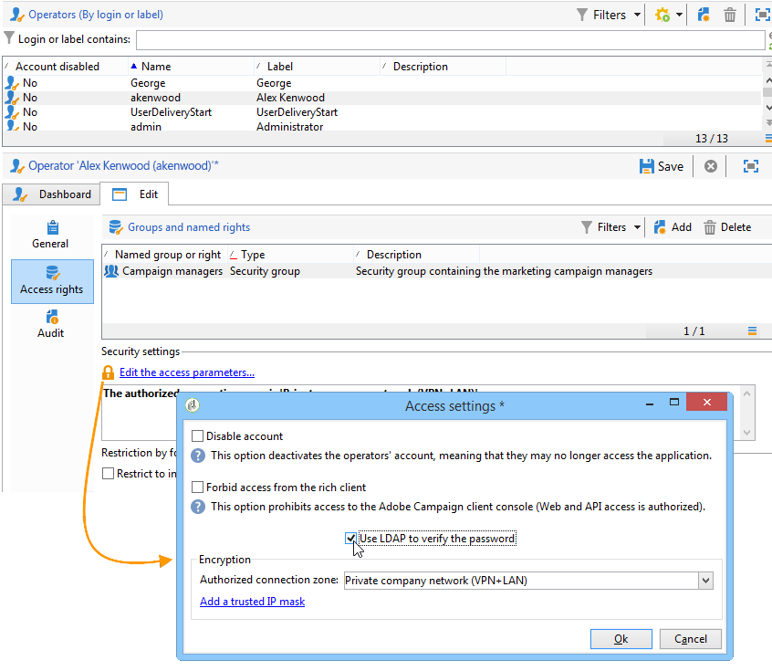

# Connessione tramite LDAP{#connecting-through-ldap}

## Configurazione di Campaign e LDAP {#configuring-campaign-and-ldap}

>[!NOTE]
>
>La configurazione LDAP è possibile solo per le installazioni on-premise o ibride.

La configurazione LDAP viene eseguita nella procedura guidata di distribuzione. Il **[!UICONTROL LDAP integration]** deve essere selezionata durante il primo passaggio di configurazione. Fai riferimento a [Distribuzione guidata](../../installation/using/deploying-an-instance.md#deployment-wizard).

La finestra consente di configurare l’identificazione degli utenti di Adobe Campaign tramite la directory LDAP specificata.

* Specificare l&#39;indirizzo del server LDAP nel **[!UICONTROL LDAP server]** campo. È possibile aggiungere il numero di porta. Per impostazione predefinita, la porta utilizzata è 389.
* Nell’elenco a discesa, seleziona il metodo di autenticazione per gli utenti:

   * Password crittografata (**md5**)

     Modalità predefinita.

   * Password in testo normale + SSL (**TLS**)

     L&#39;intera procedura di autenticazione (password inclusa) è crittografata. La porta sicura 636 non deve essere utilizzata in questa modalità: Adobe Campaign passa automaticamente alla modalità protetta.

     Quando si utilizza questa modalità di autenticazione, in Linux il certificato viene verificato da una libreria client openLDAP. È consigliabile utilizzare un certificato SSL valido in modo che la procedura di autenticazione sia crittografata. In caso contrario, le informazioni saranno in testo normale.

     Il certificato viene verificato anche in Windows.

   * Gestione LAN di Windows NT (**NTLM**)

     Autenticazione Windows proprietaria. Il **[!UICONTROL Unique identifier]** viene utilizzato solo per il nome di dominio.

   * Autenticazione password distribuita (**DPA**)

     Autenticazione Windows proprietaria. Il **[!UICONTROL Unique identifier]** viene utilizzato solo per il nome di dominio (domain.com).

   * Password in testo semplice

     Nessuna crittografia (da utilizzare solo nelle fasi di test).

* Selezionare la modalità di autenticazione utente: **[!UICONTROL Automatically compute the unique user identifier]** (vedere passaggio [Calcolo del nome distinto](#distinguished-name-calculation)) o **[!UICONTROL Search the unique user identifier in the directory]** (vedere passaggio [Ricerca di identificatori](#searching-for-identifiers)).

## Compatibilità {#compatibility}

I sistemi compatibili dipendono dal meccanismo di autenticazione selezionato. Di seguito è riportata una matrice di compatibilità dei sistemi operativi e dei server LDAP.

<table> 
 <thead> 
  <tr> 
   <th> </th> 
   <th> OpenLDAP  </th> 
   <th> Active Directory  </th> 
  </tr> 
 </thead> 
 <tbody> 
  <tr> 
   <td> md5  </td> 
   <td> Windows, Linux  </td> 
   <td> Linux  </td> 
  </tr> 
  <tr> 
   <td> TLS  </td> 
   <td> Linux  </td> 
   <td> Windows, Linux  </td> 
  </tr> 
  <tr> 
   <td> NTLM e DPA  </td> 
   <td> </td> 
   <td> Windows  </td> 
  </tr> 
  <tr> 
   <td> testo normale  </td> 
   <td> Windows, Linux  </td> 
   <td> Windows, Linux  </td> 
  </tr> 
 </tbody> 
</table>

## Calcolo del nome distinto {#distinguished-name-calculation}

Se si desidera calcolare gli identificatori del nome distinto (DN), il passaggio successivo della procedura guidata di distribuzione consente di configurare la modalità di calcolo.

* Specifica l’identificatore univoco dell’utente nella directory (Nome distinto - DN) in **[!UICONTROL Distinguished Name]** campo.

  **[!UICONTROL (login)]** verrà sostituito con l’identificatore dell’operatore Adobe Campaign.

  >[!CAUTION]
  >
  >Il **[!UICONTROL dc]** L&#39;impostazione deve essere in minuscolo.

* Seleziona l’opzione **[!UICONTROL Enable synchronization of user rights from authorizations and groups in the directory]** per sincronizzare le associazioni di gruppi e utenti nella directory LDAP e le associazioni di gruppi e utenti in Adobe Campaign.

  Quando si seleziona questa opzione, la **[!UICONTROL Application level DN used for the search]** e **[!UICONTROL Password of the application login]** sono attivati.

  Se si compilano questi due campi, Adobe Campaign si connette al server LDAP con il proprio login e la propria password. Se sono vuoti, Adobe Campaign si connette al server in modo anonimo.

## Ricerca di identificatori {#searching-for-identifiers}

Se si sceglie di cercare un identificatore, la procedura guidata di distribuzione consente di configurare la ricerca.

* In **[!UICONTROL Application level DN used for the search]** e **[!UICONTROL Password of the application login]** forniscono l’identificatore e la password con cui Adobe Campaign si connette per cercare l’identificatore. Se sono vuoti, Adobe Campaign si connette al server in modo anonimo.
* Specifica la **[!UICONTROL Base identifier]** e **[!UICONTROL Search scope]** per determinare un sottoinsieme della directory LDAP da cui avviare la ricerca.

  Seleziona la modalità desiderata nell’elenco a discesa:

  

   1. **[!UICONTROL Recursive (default mode)]**.

      La ricerca nella directory LDAP viene eseguita completamente, a partire da un determinato livello.

   1. **[!UICONTROL Limited to the base]**.

      Tutti gli attributi sono inclusi nella ricerca.

   1. **[!UICONTROL Limited to the first sub-level of the base]**.

      La ricerca viene eseguita su tutti gli attributi della directory a partire dal primo livello dell&#39;attributo.

* Il **[!UICONTROL Filter]** consente di specificare un elemento per perfezionare l’ambito della ricerca.

## Configurazione delle autorizzazioni LDAP {#configuring-ldap-authorizations}

Questa finestra viene visualizzata quando si seleziona **[!UICONTROL Enable synchronization of user rights from authorizations and groups in the directory]** opzione.

È necessario specificare diversi parametri per trovare il gruppo o i gruppi a cui appartiene l&#39;utente e i diritti corrispondenti, ad esempio:

* il **[!UICONTROL Database identifier]** campo,
* il **[!UICONTROL Search scope]** campo,

  >[!NOTE]
  >
  >Se hai scelto di cercare il DN, puoi selezionare **[!UICONTROL Reuse the DN search parameters]** per riportare i valori selezionati per il DN e l’ambito di ricerca dalla schermata precedente.

* il **[!UICONTROL Rights search filter]** in base al nome di accesso e al nome distinto dell&#39;utente,
* il **[!UICONTROL Attribute containing the group or authorization name]** campo relativo all’utilizzatore,
* il **[!UICONTROL Association mask]** campo che consente l’estrazione del nome del gruppo in Adobe Campaign e dei diritti associati. Puoi utilizzare espressioni regolari per cercare il nome.
* Seleziona **[!UICONTROL Enable the connection of users declared in the LDAP directory if the operator is not declared in Adobe Campaign]** in modo che all&#39;utente vengano concessi automaticamente i diritti di accesso alla connessione.

Clic **[!UICONTROL Save]** per completare la configurazione dell&#39;istanza.

## Gestione degli operatori {#managing-operators}

Dopo aver confermato la configurazione, è necessario definire quali operatori Adobe Campaign vengono gestiti tramite la directory LDAP.

Per utilizzare la directory LDAP per autenticare un operatore, modificare il profilo corrispondente e fare clic su **[!UICONTROL Edit the access parameters]** collegamento. Seleziona la **[!UICONTROL Use LDAP for authentication]** opzione: **[!UICONTROL Password]** il campo è disattivato per questo operatore.

## Casi d’uso {#use-cases}

Questa sezione fornisce alcuni semplici casi d’uso per aiutarti a ottenere le configurazioni più appropriate in base alle tue esigenze.

1. Un utente è stato creato nella directory LDAP ma non in Adobe Campaign.

   Adobe Campaign può essere configurato in modo che l’utente acceda alla piattaforma tramite la propria autenticazione LDAP. Adobe Campaign deve essere in grado di controllare la validità della combinazione ID/password nella directory LDAP, in modo che l’operatore possa essere creato all’istante in Adobe Campaign. A questo scopo, seleziona la **[!UICONTROL Enable the connection of users declared in the LDAP directory if the operator is not declared in Adobe Campaign]** opzione. In questo caso, è necessario configurare anche la sincronizzazione dei gruppi: **[!UICONTROL Enable synchronization of user rights from authorizations and groups in the directory]** deve essere selezionata.

1. L&#39;utente è stato creato in Adobe Campaign ma non nella directory LDAP.

   Non saranno in grado di accedere ad Adobe Campaign.

1. Nella directory LDAP è presente un gruppo che non esiste in Adobe Campaign.

   Questo gruppo non verrà creato in Adobe Campaign. È necessario creare il gruppo e sincronizzarlo per abilitare una corrispondenza tramite **[!UICONTROL Enable synchronization of user rights from authorizations and groups in the directory]** opzione.

1. I gruppi esistono in Adobe Campaign e la directory LDAP viene attivata dopo l’evento: i gruppi di utenti in Adobe Campaign non vengono sostituiti automaticamente con il contenuto dei gruppi LDAP. Analogamente, se un gruppo esiste solo in Adobe Campaign, non è possibile aggiungervi utenti LDAP finché il gruppo non è stato creato e sincronizzato in LDAP.

   I gruppi non vengono mai creati al volo, né da Adobe Campaign né da LDAP. Devono essere create singolarmente, sia in Adobe Campaign che nella directory LDAP.

   I nomi dei gruppi nella directory LDAP devono coincidere con i nomi dei gruppi di Adobe Campaign. La relativa maschera di associazione è definita nell’ultimo passaggio di configurazione della procedura guidata di distribuzione: Adobe Campaign_(.&#42;), ad esempio.
