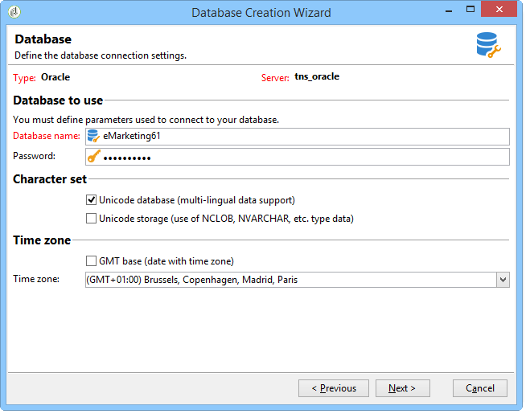

# Creazione e configurazione del database{#creating-and-configuring-the-database}

Quando si crea un database, Adobe Campaign offre due opzioni diverse:

1. Creazione o riciclo di un database: scegliere questa opzione se si desidera creare un nuovo database o riutilizzarne uno esistente. Consulta [Caso 1: creazione/riciclaggio di un database](#case-1--creating-recycling-a-database).
1. Utilizzo di un database esistente: scegliere questa opzione se l&#39;amministratore ha già creato un database vuoto e si desidera utilizzarlo oppure per estendere la struttura di un database esistente. Consulta [Caso 2: utilizzo di un database esistente](#case-2--using-an-existing-database).

I passaggi di configurazione sono descritti di seguito.

>[!CAUTION]
>
>I nomi di database, utenti e schemi non devono iniziare con un numero né includere caratteri speciali.
>
>Solo l&#39;identificatore **internal** può eseguire queste operazioni. Per ulteriori informazioni al riguardo, consulta [questa sezione](../../installation/using/configuring-campaign-server.md#internal-identifier).

## Caso 1: creazione/riciclaggio di un database {#case-1--creating-recycling-a-database}

Di seguito sono riportati i passaggi per la creazione di un database o il riciclaggio di una base esistente. Alcune configurazioni dipendono dal motore di database utilizzato:

Sono previste le seguenti fasi:

* [Passaggio 1 - Selezione del motore di database](#step-1---selecting-the-database-engine),
* [Passaggio 2 - Connessione al server](#step-2---connecting-to-the-server),
* [Passaggio 3 - Connessione e caratteristiche del database](#step-3---connection-and-characteristics-of-the-database),
* [Passaggio 4: pacchetti da installare](#step-4---packages-to-install),
* [Passaggio 5 - Passaggi per la creazione](#step-5---creation-steps),
* [Passaggio 6 - Creazione del database](#step-6---creating-the-database).

### Passaggio 1: selezione del modulo di gestione di database {#step-1---selecting-the-database-engine}

Selezionare il modulo di gestione di database nell&#39;elenco a discesa.


I database supportati sono elencati nella [Matrice di compatibilità](../../rn/using/compatibility-matrix.md) di Campaign.

Identificare il server e scegliere il tipo di operazione da eseguire. In questo caso, **[!UICONTROL Create or recycle a database]**.


A seconda del motore di database selezionato, le informazioni di identificazione del server possono variare.

* Per un motore **Oracle**, compila il **nome TNS** definito per il server applicazioni.
* Per un motore **PostgreSQL**, è necessario specificare il nome DNS (o l&#39;indirizzo IP) definito nel server applicazioni per accedere al server database.
* Per un motore **Microsoft SQL Server**, è necessario definire: il nome DNS (o l&#39;indirizzo IP) definito nel server applicazioni per accedere al server database: **DNS** o **DNS`\<instance>`** (modalità istanza),

  >[!CAUTION]
  >
  > A partire dalla versione 20.3, l&#39;autenticazione di Windows NT viene disattivata. **[!UICONTROL SQL Server authentication]** è ora l&#39;unica modalità di autenticazione disponibile per Microsoft SQL Server. [Ulteriori informazioni](../../rn/using/deprecated-features.md)

  

### Passaggio 2 - Connessione al server {#step-2---connecting-to-the-server}

Nella finestra **[!UICONTROL Server access]**, definire l&#39;accesso al server di database.


A tale scopo, immettere il nome e la password di un **account del sistema di amministrazione** che dispone dell&#39;autorizzazione per accedere ai database, ovvero:

* **system** per un database Oracle,
* **sa** per un database di Microsoft SQL Server,
* **postgres** per un database PostgreSQL,

### Passaggio 3: connessione e caratteristiche del database {#step-3---connection-and-characteristics-of-the-database}

Il passaggio seguente consente di configurare le impostazioni per l&#39;accesso al database.


È necessario definire le seguenti impostazioni:

* Specificare il nome del database da creare.
* Immettere la password dell&#39;account collegato al database.
* Indicare se il database deve trovarsi o meno in Unicode.

  L&#39;opzione **[!UICONTROL Unicode database]** consente di memorizzare tutti i tipi di carattere in Unicode indipendentemente dalla lingua.

  >[!NOTE]
  >
  >Con un database Oracle, l&#39;opzione **[!UICONTROL Unicode storage]** consente di utilizzare i campi di tipo **NCLOB** e **NVARCHAR**.
  > 
  >Se non si seleziona questa opzione, il set di caratteri (charset) del database Oracle deve abilitare la memorizzazione dei dati in tutte le lingue (si consiglia AL32UTF8).

* Scegliere un fuso orario per il database e specificare se si desidera che sia in formato UTC (se disponibile).

  Per ulteriori informazioni, consulta [Gestione del fuso orario](../../installation/using/time-zone-management.md).

### Passaggio 4 - Pacchetti da installare {#step-4---packages-to-install}

Selezionare i pacchetti da installare.

Consulta il contratto di licenza per verificare quali soluzioni e opzioni hai il diritto di installare, ad esempio &quot;Interazione&quot; o &quot;Social Marketing&quot;.


### Passaggio 5: passaggi di creazione {#step-5---creation-steps}

La finestra **[!UICONTROL Creation steps]** consente di visualizzare e modificare lo script SQL utilizzato per creare le tabelle.


* Ad Oracle, un database Microsoft SQL Server o PostgreSQL, l&#39;amministratore può anche definire i **parametri di archiviazione** da utilizzare per la creazione di oggetti di database.

  Questi parametri ricevono i nomi esatti delle tablespace (avvertenza: distinzione maiuscole/minuscole). Vengono archiviati rispettivamente nel nodo **[!UICONTROL Administration > Platform > Options]** nelle seguenti opzioni (vedi [questa sezione](../../installation/using/configuring-campaign-options.md#database)):

   * **WdbcOptions_TableSpaceUser**: tabelle utente basate su uno schema
   * **WdbcOptions_TableSpaceIndex**: indice delle tabelle utente basato su uno schema
   * **WdbcOptions_TableSpaceWork**: tabelle di lavoro senza schema
   * **WdbcOptions_TableSpaceWorkIndex**: indice delle tabelle di lavoro senza schema

* Per un database di Oracle, l&#39;utente di Adobe Campaign deve avere accesso alle librerie di Oracle, in genere come membro del gruppo **oinstall**.
* L&#39;opzione **[!UICONTROL Set or change the administrator password]** consente di immettere la password collegata all&#39;operatore Adobe Campaign con diritti di amministratore.

  Per motivi di sicurezza, è consigliabile definire una password di amministratore dell’account Adobe Campaign.

### Passaggio 6: creazione del database {#step-6---creating-the-database}

La fase finale dell&#39;assistente consente di creare il database. Fai clic su **[!UICONTROL Start]** per confermare.


Una volta creato il database, è possibile riconnettersi per finalizzare la configurazione dell’istanza.

Per completare la configurazione dell’istanza, è ora necessario avviare la procedura guidata di distribuzione. Fare riferimento alla [procedura guidata di distribuzione](../../installation/using/deploying-an-instance.md#deployment-assistant).

Le impostazioni di connessione per il database collegato all&#39;istanza sono memorizzate nel file **`/conf/config-<instance>.xml`** presente nella directory di installazione di Adobe Campaign.

Esempio di configurazione di Microsoft SQL Server nel database base61 collegato all&#39;account &#39;campaign&#39; con la relativa password crittografata:

```
<dbcnx encrypted="1" login="campaign:myBase" password="myPassword" provider="DB" server="dbServer"/>
```

## Caso 2: utilizzo di un database esistente {#case-2--using-an-existing-database}

Il database e l&#39;utente devono essere stati creati dall&#39;amministratore del database e i diritti di accesso devono essere configurati correttamente.

Ad Oracle, per un database i diritti minimi richiesti sono: GRANT CONNECT, RESOURCE e UNLIMITED TABLESPACE.

Per utilizzare un database esistente, effettuare le seguenti operazioni di configurazione:

* [Passaggio 1 - Scelta del motore di database](#step-1---choosing-the-database-engine),
* [Passaggio 2 - Impostazioni connessione database](#step-2---database-connection-settings),
* [Passaggio 3: pacchetti da installare](#step-3---packages-to-install),
* [Passaggio 4 - Passaggi per la creazione](#step-4---creation-steps),
* [Passaggio 5 - Creazione del database](#step-5---creating-the-database).

### Passaggio 1: scelta del motore di database {#step-1---choosing-the-database-engine}

Scegliere il motore di database dall&#39;elenco a discesa.


Identificare il server e scegliere il tipo di operazione che si desidera eseguire. In questo caso, **[!UICONTROL Use an existing database]**.


A seconda del motore di database selezionato, le informazioni di identificazione del server possono variare.

* Per un motore **Oracle**, compila il **nome TNS** definito per il server applicazioni.
* Per un motore **PostgreSQL**, è necessario specificare il nome DNS (o l&#39;indirizzo IP) definito nel server applicazioni per accedere al server database.
* Per un motore **Microsoft SQL Server**, è necessario definire:

   1. il nome DNS (o indirizzo IP) definito nel server applicazioni per accedere al server database,
   1. metodo di protezione utilizzato per accedere a Microsoft SQL Server: **[!UICONTROL SQL Server authentication]** o **[!UICONTROL Windows NT authentication]**.

      

### Passaggio 2: impostazioni della connessione al database {#step-2---database-connection-settings}

Nella finestra **[!UICONTROL Database]**, definire le impostazioni di connessione al database.



È necessario definire le seguenti impostazioni:

* Immettere il nome del database da utilizzare.
* Immettere il nome e la password dell&#39;account associato al database.

  >[!NOTE]
  >
  >Assicurati che il nome dello schema e il nome utente corrispondano. La modalità consigliata per la creazione del database è tramite il client della console di Campaign.
  >Per un database di Oracle, non è necessario immettere il nome dell&#39;account.

* Indicare se il database deve essere Unicode o meno.

### Passaggio 3 - Pacchetti da installare {#step-3---packages-to-install}

Selezionare i pacchetti da installare.

Consulta il contratto di licenza per verificare quali soluzioni e opzioni sei autorizzato a installare, ad esempio &quot;Interazione&quot; o &quot;Lead&quot;.


### Passaggio 4 - Passaggi di creazione {#step-4---creation-steps}

La finestra **[!UICONTROL Creation steps]** consente di visualizzare e modificare lo script SQL utilizzato per creare le tabelle.


* Ad Oracle, i database Microsoft SQL Server o PostgreSQL, l&#39;amministratore può definire i **parametri di archiviazione** da utilizzare per la creazione di oggetti di database.
* Per un database di Oracle, l&#39;utente di Adobe Campaign deve avere accesso alle librerie di Oracle, in genere come membro del gruppo **oinstall**.
* L&#39;opzione **[!UICONTROL Set or change the administrator password]** consente di immettere la password collegata all&#39;operatore Adobe Campaign con diritti di amministratore.

  Per motivi di sicurezza, è consigliabile definire una password di amministratore dell’account Adobe Campaign.

### Passaggio 5: creazione del database {#step-5---creating-the-database}

La fase finale dell&#39;assistente consente di creare il database. Fai clic su **[!UICONTROL Start]** per confermare.


Una volta completata la creazione del database, puoi riconnetterti per finalizzare la configurazione dell’istanza.

Per completare la configurazione dell’istanza, è ora necessario avviare la procedura guidata di distribuzione. Fare riferimento alla [procedura guidata di distribuzione](../../installation/using/deploying-an-instance.md#deployment-assistant).

Le impostazioni di connessione per il database collegato all&#39;istanza sono memorizzate nel file **`/conf/config-<instance>.xml`** presente nella directory di installazione di Adobe Campaign.

Esempio di configurazione di Microsoft SQL Server nel database base61 collegato all&#39;account &#39;campaign&#39; con la relativa password crittografata:

```
<dbcnx encrypted="1" login="campaign:myBase" password="myPassword" provider="DB" server="dbServer"/>
```
