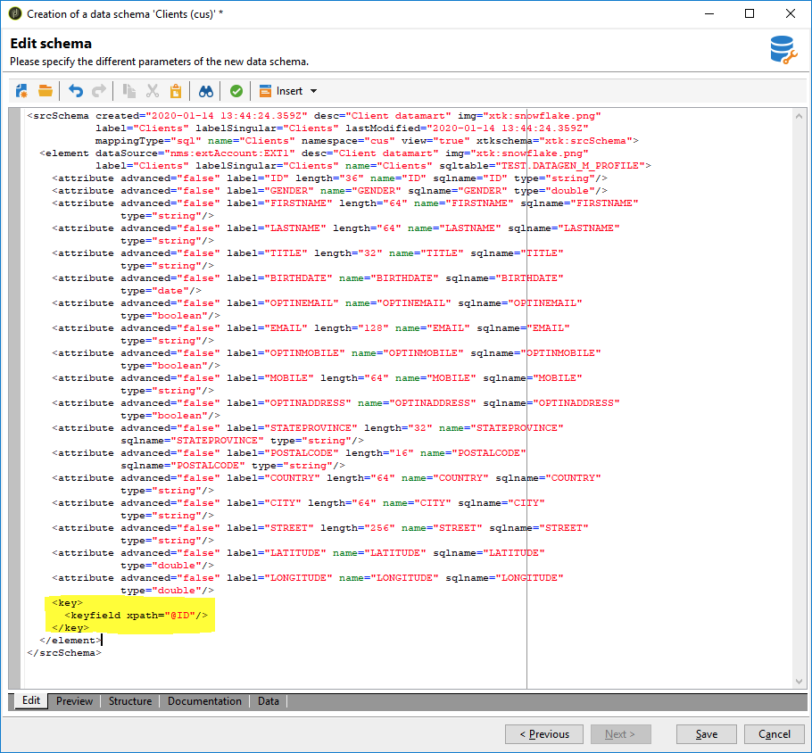

# Creazione dello schema dati {#creating-the-data-schema}

Per creare uno schema su un database esterno:

1. Fai clic su **[!UICONTROL New]** sopra l’elenco degli schemi di dati e scegli **[!UICONTROL Access external data]**.

   

1. Immetti un **[!UICONTROL Namespace]** e  **[!UICONTROL Name]** per lo schema e seleziona la **[!UICONTROL External account]** che abiliterà la connessione al database. Ciò consente di accedere all’elenco di tabelle disponibili nella base esterna.

   

1. Dalla sezione **[!UICONTROL Table name]** scegliere la tabella contenente i dati da raccogliere.

   Con Snowflake, è possibile selezionare qui le viste se all&#39;utente del database sono stati concessi i privilegi corretti. Tieni presente che quando utilizzi le viste, Adobe Campaign non sarà in grado di generare automaticamente lo schema XML, dovrai crearlo tu stesso. Per ulteriori informazioni sulle visualizzazioni, consulta [Documentazione del Snowflake](https://docs.snowflake.com/en/user-guide/views-introduction.html).

   

1. Clic **[!UICONTROL OK]** per confermare. Adobe Campaign rileva automaticamente la struttura della tabella selezionata e genera lo schema logico. Tieni presente che Adobe Campaign non genera collegamenti.

1. Clic **[!UICONTROL Save]** per confermare la creazione.

   >[!CAUTION]
   >
   >Con il Snowflake, una chiave primaria è obbligatoria.

   

Gli indici vengono creati automaticamente durante la mappatura di una tabella (mappatura standard o FDA).
