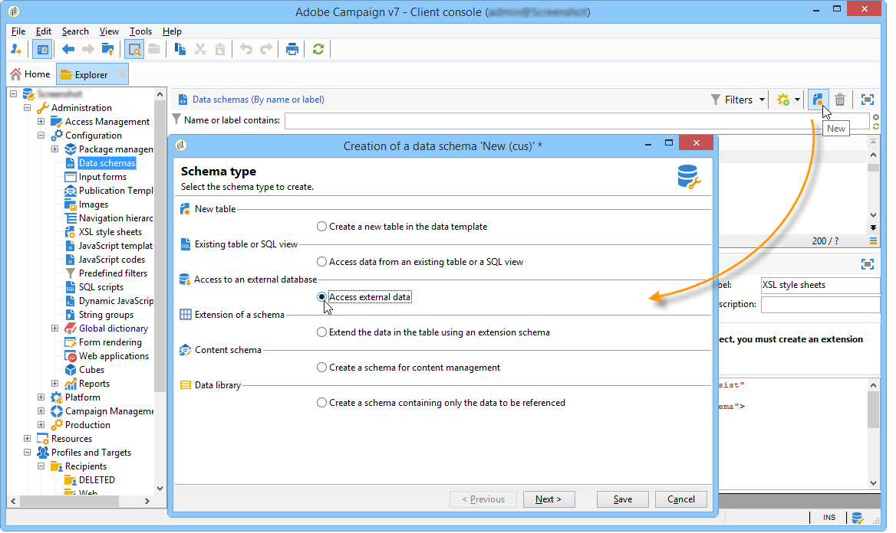

# Creazione dello schema dati {#creating-the-data-schema}

Per creare uno schema su un database esterno:

1. Fare clic sul **[!UICONTROL New]** pulsante sopra l&#39;elenco degli schemi di dati e scegliere **[!UICONTROL Access external data]**.

   

1. Immettete un nome e una descrizione per lo schema e selezionate l&#39;account esterno che consentirà la connessione al database. Questo consente di accedere all&#39;elenco delle tabelle disponibili nella base esterna. Scegliere la tabella che contiene i dati da raccogliere.

   

1. Fate clic **[!UICONTROL OK]** per confermare.  Adobe Campaign rileva automaticamente la struttura della tabella selezionata e genera lo schema logico.  Adobe Campaign non genera collegamenti.

1. Fate clic **[!UICONTROL Save]** per confermare la creazione.

   >[!CAUTION]
   >
   >Ad Snowflake, una chiave primaria è obbligatoria.

   

Gli indici vengono creati automaticamente durante la mappatura di una tabella (mappatura standard o FDA).
