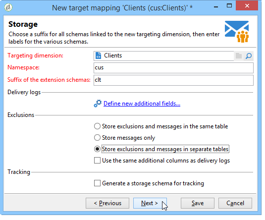

# Definire la mappatura dei dati esterni {#defining-data-mapping}

Adobe Campaign consente di definire la mappatura sui dati in una tabella esterna.

A questo scopo, una volta creato lo schema della tabella esterna, è necessario creare una nuova mappatura di consegna per utilizzare i dati in questa tabella come destinazione di consegna.

A questo scopo, esegui i seguenti passaggi:

1. Crea una nuova mappatura di consegna e scegli la dimensione di targeting, lo schema appena creato, ad esempio.

   

1. Indica i campi in cui sono memorizzate le informazioni di consegna (cognome, nome, e-mail, indirizzo, ecc.).

   

1. Specifica i parametri per l’archiviazione delle informazioni, compreso il suffisso degli schemi di estensione affinché siano facilmente identificabili.

   

   Puoi scegliere se memorizzare le esclusioni (**excludelog**), con i messaggi (**broadlog**) o in una tabella separata.

   Puoi anche scegliere se gestire il tracciamento per questa mappatura di consegna (**trackinglog**).

1. Quindi seleziona le estensioni da prendere in considerazione. Il tipo di estensione dipende dai parametri e dalle opzioni della piattaforma (vedi il contratto di licenza).

   

   Fai clic sul pulsante **[!UICONTROL Save]** per avviare la creazione della mappatura di consegna: tutte le tabelle collegate vengono create automaticamente in base ai parametri selezionati.
