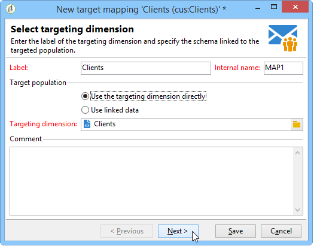

# Definizione della mappatura dei dati {#defining-data-mapping}

 Adobe Campaign consente di definire la mappatura dei dati in una tabella esterna.

A tal fine, una volta creato lo schema della tabella esterna, è necessario creare una nuova mappatura di consegna per utilizzare i dati in questa tabella come destinazione di consegna.

A questo scopo, eseguire i seguenti passaggi:

1. Create una nuova mappatura di consegna e scegliete la dimensione di targeting, lo schema appena creato, ad esempio.

   

1. Indicate i campi in cui sono memorizzate le informazioni di consegna (cognome, nome, e-mail, indirizzo, ecc.).

   

1. Specificate i parametri per l’archiviazione delle informazioni, compreso il suffisso degli schemi di estensione per facilitarne l’identificazione.

   

   Puoi scegliere se memorizzare le esclusioni (**escluso**), con i messaggi (**broadcast**) o in una tabella separata.

   Puoi anche scegliere se gestire il tracciamento per questa mappatura di consegna (**trackinglog**).

1. Selezionare quindi le estensioni da prendere in considerazione. Il tipo di estensione dipende dai parametri e dalle opzioni della piattaforma (visualizzate il contratto di licenza).

   

   Fate clic sul **[!UICONTROL Save]** pulsante per avviare la creazione della mappatura della consegna: tutte le tabelle collegate vengono create automaticamente in base ai parametri selezionati.
