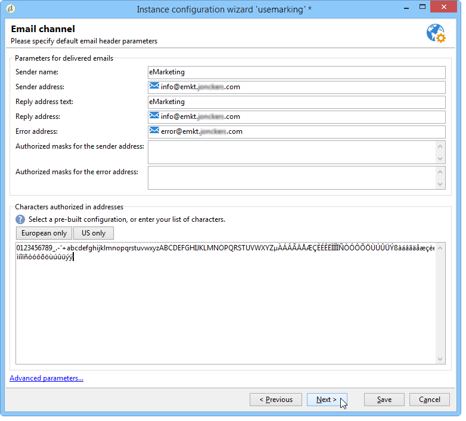
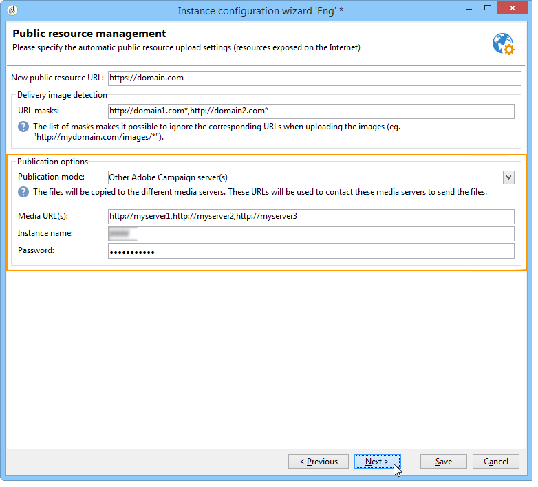

# Distribuzione di un’istanza{#deploying-an-instance}

>[!NOTE]
>
>Le configurazioni lato server possono essere eseguite solo da Adobe per le distribuzioni in hosting da Adobe. Per ulteriori informazioni sulle diverse distribuzioni, consulta la sezione [Modelli di hosting](../../installation/using/hosting-models.md) o [questa pagina](../../installation/using/capability-matrix.md).

## procedura guidata di distribuzione {#deployment-assistant}

Adobe Campaign fornisce un assistente grafico, disponibile nella console client di Adobe Campaign, per definire i parametri dell’istanza a cui stai per connetterti.

Per avviare la procedura guidata di distribuzione, selezionare **Strumenti > Avanzate > procedura guidata di distribuzione**.


I passaggi di configurazione sono i seguenti:

1. [Parametri generali](#general-parameters)
1. [Parametri del canale e-mail](#email-channel-parameters)
1. [Gestione delle e-mail non recapitate](#managing-bounced-emails)
1. [Configurazione di tracciamento](#tracking-configuration)
1. [Parametri del canale mobile](#mobile-channel-parameters)
1. [Impostazioni regionali](#regional-settings)
1. [Accesso da Internet](#access-from-the-internet)
1. [Gestione delle risorse pubbliche](#managing-public-resources)
1. [Eliminazione dei dati](#purging-data)

## Parametri generali {#general-parameters}

Il primo passaggio della procedura guidata di distribuzione consente di immettere informazioni generali sull’istanza.


### Informazioni generali {#general-information}

La sezione inferiore della finestra consente di selezionare le opzioni da attivare.

* **[!UICONTROL Customer identifier used in billing]** : può essere il nome dell&#39;istanza e il numero di versione.
* **[!UICONTROL Common name of the customer]** : immetti una stringa di caratteri con il nome della società. Queste informazioni possono essere utilizzate nei collegamenti di annullamento dell’abbonamento.
* **[!UICONTROL Namespace]** : immetti un identificatore breve in minuscolo. Lo scopo è distinguere tra la configurazione specifica e la configurazione di fabbrica in caso di aggiornamento. Lo spazio dei nomi predefinito è **cus** - per il cliente.

### Opzioni tecniche {#technical-options}

La sezione inferiore della finestra consente di selezionare le opzioni da attivare.

Sono disponibili le seguenti opzioni:

* **[!UICONTROL Email channel]** : per attivare la consegna e-mail. Consulta [Parametri del canale e-mail](#email-channel-parameters).
* **[!UICONTROL Tracking]** : per abilitare il tracciamento della popolazione target (aperture e clic). Consulta [Configurazione di tracciamento](#tracking-configuration).
* **[!UICONTROL Managing bounced emails]** : per definire l&#39;account POP utilizzato per raccogliere le e-mail in arrivo. Consulta [Gestione delle e-mail non recapitate](#managing-bounced-emails).
* **[!UICONTROL LDAP integration]**: per configurare l&#39;autenticazione utente tramite una directory LDAP. Fare riferimento a [Connessione tramite LDAP](../../installation/using/connecting-through-ldap.md).

## Parametri del canale e-mail {#email-channel-parameters}

Il passaggio seguente ti consente di definire le informazioni da visualizzare nelle intestazioni dei messaggi.

Questi parametri possono essere sovraccaricati nei modelli di consegna e singolarmente per ogni consegna (se gli utenti dispongono dei diritti richiesti).

### Parametri per e-mail consegnate {#parameters-for-delivered-emails}



Indicare i seguenti parametri:

* **[!UICONTROL Sender name]** : immetti il nome del mittente.
* **[!UICONTROL Sender address]** : immetti l&#39;indirizzo e-mail del mittente. Quando si inviano e-mail da Adobe Campaign, la cassetta postale **Indirizzo mittente** non viene monitorata e gli utenti marketing non possono accedere a questa cassetta postale. Inoltre, Adobe Campaign non offre la possibilità di rispondere automaticamente o inoltrare automaticamente le e-mail ricevute in questa casella di posta. Ulteriori informazioni sulle best practice per il recapito messaggi [sono disponibili in questa documentazione](https://experienceleague.adobe.com/docs/deliverability-learn/deliverability-best-practice-guide/additional-resources/campaign/ac-starting-new-platform.html){_blank}.

* **[!UICONTROL Reply address text]**: immettere il nome utilizzato quando il destinatario fa clic sul pulsante **[!UICONTROL Reply]**.
* **[!UICONTROL Reply address]**: immettere l&#39;indirizzo di posta elettronica da utilizzare quando il destinatario fa clic sul pulsante **[!UICONTROL Reply]** nel software del client di posta elettronica. Il campo **Indirizzo di risposta** ha lo scopo di indicare che il destinatario deve rispondere a un indirizzo diverso da quello del **Indirizzo mittente**.  Questo indirizzo deve essere un indirizzo e-mail valido, collegato a una cassetta postale monitorata e ospitato dal cliente.  Potrebbe trattarsi di una cassetta postale di supporto, ad esempio `customer-care@customer.com`, in cui le e-mail vengono lette e a cui si risponde.

* **[!UICONTROL Error address]** : immetti l&#39;indirizzo e-mail dei messaggi con errori. Si tratta dell’indirizzo tecnico utilizzato per gestire le e-mail non recapitate, incluse quelle ricevute dal server Adobe Campaign a causa di indirizzi di destinazione inesistenti. Questo indirizzo deve essere un indirizzo e-mail valido, collegato a una cassetta postale monitorata e ospitato dal cliente. Potrebbe essere una cassetta postale di mancato recapito, ad esempio `errors@customer.com`. Questo indirizzo può essere modificato per una consegna o nei modelli di consegna, dalla scheda **SMTP** delle proprietà del modello di consegna/consegna. Ulteriori informazioni sono disponibili nella [documentazione di Campaign v8](https://experienceleague.adobe.com/docs/campaign/campaign-v8/send/emails/email-parameters.html#managing-bounce-emails){target="_blank"}.

Inoltre, puoi specificare le **maschere** autorizzate per l&#39;indirizzo del mittente e l&#39;indirizzo di errore. Se necessario, queste maschere possono essere separate da virgole. Questa configurazione è facoltativa. Quando vengono immessi i campi, Adobe Campaign controlla al momento della consegna (durante l’analisi, se l’indirizzo non include alcuna variabile) che gli indirizzi siano validi. Questa modalità operativa assicura che non vengano utilizzati indirizzi che potrebbero attivare problemi di consegna. Gli indirizzi di consegna devono essere configurati sul server di consegna.

>[!NOTE]
>
>* Queste impostazioni vengono salvate nelle opzioni della piattaforma Campaign. [Ulteriori informazioni](../../installation/using/configuring-campaign-options.md).
> 
>* Per le configurazioni con più marchi, puoi adattare l’indirizzo Error e ignorare questa configurazione dall’account esterno di indirizzamento e-mail. [Ulteriori informazioni](../../installation/using/external-accounts.md#email-routing-external-account).
>


### Caratteri autorizzati negli indirizzi {#characters-authorized-in-addresses}

<!--This window enables you to define, for all email campaigns, the delivery and address-quality management options.-->

Nel database di Adobe Campaign, tutti gli indirizzi e-mail devono essere creati nel modo seguente: `x@y.z`. I caratteri **x**, **y** e **z** non possono essere vuoti e non possono includere caratteri non autorizzati.

Qui puoi definire i caratteri autorizzati (&#39;criteri dati&#39;) nel campo e-mail del database. I caratteri non inclusi nell&#39;elenco saranno vietati e pertanto rifiutati quando si immettono informazioni nel database tramite l&#39;interfaccia, tramite un modulo Web e si importano dati.

Sono disponibili due elenchi: **Solo europeo** o **Solo USA**. Se necessario, è possibile aggiungere altri caratteri.

### Parametri di consegna {#delivery-parameters}

Il collegamento **Parametri avanzati...** consente di accedere alle opzioni di consegna, ai parametri collegati ai nuovi tentativi e alle quarantene.


Questa finestra ti consente di definire, per tutte le campagne e-mail, le opzioni di gestione per la consegna e la qualità degli indirizzi.

Sono disponibili le seguenti opzioni:

* **[!UICONTROL Delivery duration of messages]** : Oltre questo limite di tempo, la consegna viene interrotta (per impostazione predefinita, 5 giorni).
* **[!UICONTROL Online resources validity duration]** : tempo per il quale vengono conservate le informazioni dal profilo del destinatario per generare pagine mirror.
* inserire nell&#39;elenco Bloccati **[!UICONTROL Exclude recipients who no longer wish to be contacted]** : quando questa opzione è selezionata, in caso di i destinatari non verranno contattati.
* **[!UICONTROL Automatically ignore doubles]** : Quando questa opzione è selezionata, la consegna non verrà eseguita su indirizzi duplicati.

>[!NOTE]
>
>Per le installazioni in hosting o ibride, se hai eseguito l&#39;aggiornamento all&#39;[MTA avanzato](../../delivery/using/sending-with-enhanced-mta.md), **[!UICONTROL Delivery duration of the messages]** verrà utilizzato solo se impostato su **3,5 giorni o meno**. Se definisci un valore superiore a 3,5 giorni, questo non verrà preso in considerazione.

### Parametri per riprovare {#retry-parameters}

Le informazioni sui ripristini vengono fornite nei campi **Periodi di ripristino** e **Numero di ripristini**: quando un destinatario non è raggiungibile, ad esempio se la casella in entrata è piena, per impostazione predefinita il programma tenterà di contattarlo 5 volte, con un intervallo di un&#39;ora tra ogni tentativo (durante il tempo di consegna massimo). Questi valori possono essere modificati in base alle tue esigenze.

>[!NOTE]
>
>Per le installazioni in hosting o ibride, se hai effettuato l&#39;aggiornamento a [MTA avanzato](../../delivery/using/sending-with-enhanced-mta.md), i parametri dei nuovi tentativi di Campaign non vengono più utilizzati. I nuovi tentativi di mancato recapito non permanenti e il periodo di tempo che intercorre tra di essi sono determinati dall’MTA avanzato in base al tipo e alla gravità delle risposte di mancato recapito provenienti dal dominio e-mail del messaggio.

### Parametri di quarantena {#quarantine-parameters}

Le opzioni di configurazione per le quarantene sono le seguenti:

* **[!UICONTROL Duration between two significant errors]**: immettere un valore (&quot;1d&quot; per impostazione predefinita: 1 giorno) per definire il tempo di attesa dell&#39;applicazione prima di incrementare il contatore degli errori in caso di errore,
* **[!UICONTROL Maximum number of errors before quarantine]** : una volta raggiunto questo valore, l&#39;indirizzo e-mail viene messo in quarantena (per impostazione predefinita &quot;5&quot;: l&#39;indirizzo verrà messo in quarantena al sesto errore). Ciò significa che il contatto sarà automaticamente escluso dalle consegne successive.

## Gestione delle e-mail non recapitate {#managing-bounced-emails}

La posta non recapitata è estremamente importante per qualificare gli errori di consegna. Questi errori vengono categorizzati in NP@I una volta che le regole ne hanno determinato la causa.

Questo passaggio è disponibile solo se le opzioni di gestione **Canale e-mail** e **Posta non recapitata** sono selezionate nella prima fase della procedura guidata di distribuzione. Consulta [Parametri generali](#general-parameters).

Questa fase ti consente di definire le impostazioni per la gestione dei messaggi non recapitati.


### Account POP utilizzato per recuperare le e-mail in arrivo {#pop-account-used-to-retrieve-incoming-mails}

Indica i parametri per la connessione all’account per il recupero delle e-mail in arrivo.

* **[!UICONTROL Label]** : nome che include tutti i parametri indicati di seguito,
* **[!UICONTROL Server]**: server utilizzato per recuperare la posta non recapitata (posta in arrivo),
* **[!UICONTROL Security]** : Se necessario, selezionare **[!UICONTROL SSL]** dall&#39;elenco a discesa,
* **[!UICONTROL Port]**: porta server (generalmente 110),
* **[!UICONTROL Account]**: nome dell&#39;account utilizzato per la posta non recapitata,
* **[!UICONTROL Password]**: password associata all&#39;account.

Una volta specificate le impostazioni POP, fare clic su **Test** per verificare che siano corrette.

### E-mail non recapitate non elaborate {#unprocessed-bounce-mails}

Le e-mail non consegnate vengono gestite automaticamente da Adobe Campaign, applicando le regole elencate nel nodo **Amministrazione > Gestione campagne > Gestione non consegnabili > Qualificazione del registro di consegna**. Per ulteriori informazioni, consulta [Gestione della posta non recapitata](../../delivery/using/delivery-failures-quarantine.md#bounce-mail-management).

I mancati recapiti non elaborati non vengono visualizzati nell’interfaccia di Adobe Campaign. Vengono eliminati automaticamente a meno che non vengano trasferiti a una cassetta postale di terze parti utilizzando i campi seguenti:

* **[!UICONTROL Forwarding address]** : compila questo campo per trasferire a un indirizzo di terze parti tutti i messaggi di errore (elaborati o non elaborati ) raccolti dalla piattaforma Adobe Campaign.
* **[!UICONTROL Address for errors]** : compilare questo campo per trasferire a un indirizzo di terze parti solo i messaggi di errore che il processo inMail non è stato in grado di qualificare.
* **[!UICONTROL SMTP server]** : server utilizzato per inviare le e-mail non recapitate non elaborate.

>[!IMPORTANT]
>
>Per inoltrare e-mail non recapitate non elaborate, Adobe consiglia di compilare solo il campo **[!UICONTROL Address for errors]**. Tuttavia, assicurati che l’indirizzo utilizzato sia controllato regolarmente, in quanto ciò potrebbe comportare un carico pesante sul server di posta. Per ulteriori informazioni, contatta il responsabile del tuo account.

## Configurazione di tracciamento {#tracking-configuration}

Il passaggio successivo consente di configurare il tracciamento per l’istanza. L’istanza deve essere dichiarata e registrata con i server di tracciamento.

Questo passaggio è disponibile solo quando le opzioni **Canale e-mail** e **Tracciamento** sono selezionate nella prima pagina della procedura guidata di distribuzione. Consulta [Parametri generali](#general-parameters).

Per informazioni più dettagliate sul tracciamento web (modalità di tracciamento, creazione e inserimento di tag...), consulta [questo documento](../../configuration/using/about-web-tracking.md).

### Principio di funzionamento {#operating-principle}

Quando attivi il tracciamento su un’istanza, gli URL nelle consegne vengono modificati durante l’invio per abilitare il tracciamento.

* Le informazioni sugli URL esterni (protetti o meno) immesse in questa pagina della procedura guidata di distribuzione vengono utilizzate per generare il nuovo URL. Oltre a queste informazioni, il collegamento modificato contiene: gli identificatori della consegna, il destinatario e l’URL.

  Le informazioni di tracciamento vengono raccolte da Adobe Campaign sui server di tracciamento per arricchire i profili dei destinatari e i dati collegati alla consegna (schede **[!UICONTROL Tracking]**).

  Le informazioni sugli URL interni vengono utilizzate solo dal server applicazioni Adobe Campaign per contattare il server o i server di tracciamento.

  Per ulteriori informazioni, consulta [Server di tracciamento](#tracking-server).

* Una volta configurati gli URL, devi abilitare il tracciamento. A questo scopo, l’istanza deve essere registrata sui server di tracciamento.

  Per ulteriori informazioni, consulta [Salvataggio del tracciamento](#saving-tracking).

### Server di tracciamento {#tracking-server}


Per garantire l’efficienza del tracciamento in questa istanza, è necessario visualizzare le seguenti informazioni:
<!--With Mid-sourcing architecture, you can externalize tracking management. To do this:-->

* **[!UICONTROL External URL]** e/o **[!UICONTROL Secure external URL]**: immettere l&#39;URL di reindirizzamento da utilizzare nell&#39;e-mail da inviare.
* **[!UICONTROL Internal URL(s)]** : URL utilizzati solo dal server Adobe Campaign per contattare i server di tracciamento per raccogliere i registri e caricare gli URL. Non è necessario associarlo all’istanza.

  Se non specifichi un URL, per impostazione predefinita verrà utilizzato l’URL di tracciamento.

Con l’architettura mid-sourcing, puoi esternalizzare la gestione del tracciamento. Per eseguire questa operazione:

1. Selezionare l&#39;opzione **[!UICONTROL Externalize tracking management]**: consente di utilizzare un server di mid-sourcing come server di tracciamento.
1. Compilare i campi **[!UICONTROL External account]** e **[!UICONTROL Instance name]** per connettersi al server di mid-sourcing.

   Per ulteriori informazioni, fare riferimento a [Server di mid-sourcing](../../installation/using/mid-sourcing-server.md).

1. Fare clic sul pulsante **[!UICONTROL Enable the tracking instance]** per approvare la connessione al server.

   

### Salvataggio del tracciamento {#saving-tracking}

Una volta inseriti gli URL, devi registrare il server di tracciamento.

Fai clic sul collegamento **Registrazione sui server di tracciamento**, quindi seleziona una delle opzioni disponibili.


Esistono tre possibili tipi di architettura per l’implementazione del tracciamento:

1. **Aggiungi supporto per il tracciamento in un&#39;istanza esistente**

   Questa scelta si applica se l’istanza è già stata creata per altre esigenze (server MTA, ecc.) in server che verranno utilizzati come server di tracciamento.

   

   Immettere la password per l&#39;account **internal** sui server di reindirizzamento per configurare l&#39;istanza di tracciamento.

   >[!NOTE]
   >
   >Se vengono utilizzati più server di tracciamento, devono tutti utilizzare lo stesso nome e la stessa password.

   Specifica il nome dell’istanza e la password.

1. **Crea una nuova istanza dedicata al tracciamento**

   Questa opzione è utile quando le istanze di tracciamento sono riservate per il tracciamento e non hanno altri moduli applicativi.

   

   Immettere la password per l&#39;account **internal** sui server di reindirizzamento per configurare l&#39;istanza di tracciamento.

   >[!NOTE]
   >
   >Se sono configurati più server di tracciamento, devono tutti utilizzare la stessa password.

   Specificare il nome dell&#39;istanza, la password ed eventuali maschere DNS associate, ad esempio **[!UICONTROL Campaign*]**.

1. **Convalida un&#39;istanza di tracciamento già preconfigurata**

   Questa opzione viene utilizzata quando non si dispone della password per l&#39;account **internal**. In questo caso, un account di tracciamento è preconfigurato per l&#39;utente sui server di tracciamento. Immetti la password dell&#39;account di tracciamento dei server di reindirizzamento per convalidare l&#39;istanza di tracciamento.

   

   Specifica il nome dell’istanza da convalidare.

Fai clic su **Approva** per avviare il processo di registrazione con il server di tracciamento.

Nella finestra precedente, un messaggio conferma la registrazione a livello del server di tracciamento:


I parametri collegati alle ricerche URL **non devono essere modificati** per un&#39;installazione standard. Per tutti gli altri parametri, contatta Adobe.

## Parametri del canale mobile {#mobile-channel-parameters}

Il passaggio successivo consente di definire le impostazioni predefinite per le consegne ai dispositivi mobili (SMS e Push WAP).

>[!NOTE]
>
>Il canale mobile è facoltativo: questa fase viene visualizzata solo se è stato acquistato. Controlla il contratto di licenza.


### Account predefinito per la consegna SMS {#default-account-for-sms-delivery}

Immettere le seguenti informazioni:

* **[!UICONTROL Label]** : immetti un nome per questo account push SMS/Wap. Ad esempio, è possibile utilizzare il nome del router.
* Per i campi **[!UICONTROL Server]**, **[!UICONTROL Port]**, **[!UICONTROL Account]**, **[!UICONTROL Password]**, **[!UICONTROL Connector]**, **[!UICONTROL Send Endpoint]**, **[!UICONTROL Reception Endpoint]**, **[!UICONTROL Notification Endpoint]**: Contattare il provider di servizi per le impostazioni richieste.

### Parametri degli SMS inviati {#parameters-of-sms-sent}

Nell&#39;elenco a discesa **Priorità**: selezionare &quot;Normale&quot;, &quot;Alta&quot; o &quot;Urgente&quot; per applicarlo ai messaggi da inviare.

### Parametri avanzati {#advanced-parameters}

Il collegamento **Parametri avanzati...** consente di accedere alle opzioni di nuovo tentativo e quarantena.


Le informazioni sui nuovi tentativi sono disponibili nei campi **Periodo di nuovi tentativi** e **Numero di tentativi**: quando un dispositivo mobile non è raggiungibile, per impostazione predefinita il programma riproverà 5 volte a intervalli di almeno 15 minuti (per il periodo di consegna massimo). Questi valori possono essere adattati in base alle tue esigenze.

Le opzioni di configurazione per le quarantene sono le seguenti:

* **[!UICONTROL Time between two significant errors]** : Immettere un valore predefinito (per impostazione predefinita &quot;1d&quot;: giorno) per definire il tempo di attesa dell&#39;applicazione prima di incrementare il contatore di errori per un errore.
* **[!UICONTROL Maximum number of errors before quarantine]** : Una volta raggiunto questo valore, il numero di cellulare viene messo in quarantena (per impostazione predefinita &quot;5&quot;: il numero verrà messo in quarantena al sesto errore). Ciò significa che il contatto verrà automaticamente escluso dalle consegne future.

## Impostazioni regionali {#regional-settings}

Questa fase ti consente di includere le preferenze dei criteri per i dati.


* **[!UICONTROL Consider all phone numbers as international ones]** : Quando questa opzione è selezionata, l&#39;applicazione applica il formato internazionale ai numeri di telefono (il prefisso del paese è quindi obbligatorio perché il numero di cifre non verrà controllato prima di applicare la formattazione). Se questa opzione non è selezionata, il numero di telefono internazionale deve essere preceduto da &quot;+&quot; o &quot;00&quot;.
* **[!UICONTROL Store all phone numbers using the international format]** : questa opzione riguarda solo **numeri di telefono nazionali** importati o modificati. Definire se si desidera utilizzare un formato nazionale (ad esempio 425 555 0150) o internazionale (ad esempio +1 425 555 0150)

## Accesso da Internet {#access-from-the-internet}

>[!IMPORTANT]
>
>Per motivi di privacy, consigliamo di utilizzare HTTPS per tutte le risorse esterne.

Questo passaggio ti consente di definire gli URL di accesso per le pagine Adobe Campaign esposte su Internet.

È inoltre necessario indicare qui le opzioni di pubblicazione collegate ai moduli Web.


### Server esposti sul Web {#servers-exposed-on-the-web}

Utilizzare questa pagina per popolare gli URL del server per:

1. Accedi al server applicazioni esposto su Internet: moduli di abbonamento/annullamento dell’abbonamento, extranet, ecc.
1. Accedi al server applicazioni per le risorse non esposte sul web: moduli, Intranet, pagine di conferma.
1. Accedi alle pagine mirror delle consegne.

   Una pagina speculare è una pagina dinamica che visualizza il contenuto dell’e-mail. È accessibile tramite un collegamento inserito nel messaggio inviato al destinatario e può contenere elementi personalizzati. La pagina speculare offre al destinatario la possibilità di leggere il messaggio in un browser Internet invece che nel software e-mail, indipendentemente dal formato di consegna (testo o HTML). Tuttavia, le pagine mirror vengono generate per una determinata consegna solo se è stato definito il contenuto HTML richiesto.

Adobe Campaign consente di distinguere questi tre URL per distribuire il carico su più piattaforme.


>[!NOTE]
>
>* Queste impostazioni vengono salvate nelle opzioni della piattaforma Campaign. [Ulteriori informazioni](../../installation/using/configuring-campaign-options.md).
>* Per le configurazioni con più marchi, puoi adattare l’URL della pagina mirror e ignorare questa configurazione dall’account esterno di indirizzamento e-mail. [Ulteriori informazioni](../../installation/using/configuring-campaign-options.md).


## Gestione delle risorse pubbliche {#managing-public-resources}

>[!IMPORTANT]
>
>Per motivi di privacy, consigliamo di utilizzare HTTPS per tutte le risorse esterne.

Per essere viste dall’esterno, le immagini utilizzate nelle e-mail e nelle risorse pubbliche collegate alle campagne devono essere presenti su un server accessibile dall’esterno. Possono quindi essere disponibili per destinatari o operatori esterni.


Per questo passaggio, è necessario immettere:

1. Il nuovo URL della risorsa pubblica. Per ulteriori informazioni, consulta la sezione [URL risorse pubbliche](#public-resources-url).
1. La modalità di rilevamento delle immagini in una consegna. Per ulteriori informazioni, consulta la sezione [Rilevamento immagine della consegna](#delivery-image-detection).
1. Opzioni di pubblicazione. Per ulteriori informazioni, fare riferimento alla sezione [Modalità di pubblicazione](#publication-modes).

Le risorse pubbliche sono accessibili tramite il nodo **Amministrazione > Risorse > In linea > Risorse pubbliche** della struttura Adobe Campaign. Vengono raccolti in una libreria e possono essere inclusi nelle e-mail, ma anche utilizzati in campagne o attività e nella gestione dei contenuti.


### URL risorse pubbliche {#public-resources-url}

Il primo campo consente di specificare l’inizio dell’URL utilizzato per le risorse caricate. Una volta caricate, le risorse sono accessibili tramite questo nuovo URL.

In una consegna, puoi utilizzare le immagini memorizzate nella libreria di risorse pubblica o qualsiasi altra immagine o immagine locale memorizzata su un server.

* Per le immagini e-mail, l&#39;URL **https://** server **/res/img**.

  Questo valore può essere sovrascritto per ogni consegna.

* Per le risorse pubbliche, l&#39;URL **https://** server **/res/** istanza **&#x200B;**&#x200B;dove **istanza**&#x200B;è il nome dell&#39;istanza di tracciamento.

### Rilevamento immagine della consegna {#delivery-image-detection}

In una consegna, puoi utilizzare le immagini memorizzate nella libreria di risorse pubblica o qualsiasi altra immagine o immagine locale memorizzata su un server.

Il campo **Maschere URL** consente di specificare l&#39;elenco delle maschere URL da ignorare quando si caricano automaticamente le immagini. Se ad esempio si utilizzano immagini memorizzate in un sito accessibile dall&#39;esterno, in particolare in un sito Internet, è possibile immettere l&#39;URL del sito in questo campo.


Puoi specificare più maschere URL utilizzando una virgola per separarle.

* Per informazioni sull&#39;utilizzo e la gestione delle immagini nelle e-mail, consulta la [documentazione di Campaign v8](https://experienceleague.adobe.com/docs/campaign/campaign-v8/send/emails/defining-the-email-content.html#adding-images){target="_blank"}.
* Nell’assistente alla consegna, le immagini chiamate da questi URL avranno lo stato &quot;Ignorato&quot;.

### Modalità di pubblicazione {#publication-modes}

La sezione inferiore dell’assistente consente di selezionare le opzioni di pubblicazione delle risorse pubbliche e delle immagini.

Sono disponibili le seguenti modalità di pubblicazione:

* Server di tracciamento

  Le risorse verranno copiate automaticamente sui diversi server di tracciamento. Sono configurati nel passaggio [Configurazione di tracciamento](#tracking-configuration).

* Altri server Adobe Campaign

  Puoi utilizzare uno o più altri server Adobe Campaign in cui copiare le risorse.

  Lato server, per utilizzare un server Adobe Campaign dedicato, devi creare una nuova istanza con il seguente comando:

  ```
  nlserver config -addtrackinginstance:<trackingA>/<trackingA*>
  ```

  Immettere quindi la password.

  I parametri dei server dedicati sono specificati nei campi **[!UICONTROL Media URL(s)]**, **[!UICONTROL Password]** e **[!UICONTROL Instance name]**.

  

* Script di pubblicazione manuale (solo per risorse pubbliche)

  

  Puoi pubblicare le immagini utilizzando uno script:

   * Devi creare questo script: il suo contenuto dipende dalla configurazione.
   * Lo script verrà richiamato dal comando seguente:

     ```
     [INSTALL]/copyToFrontal.vbs "$(XTK_INSTALL_DIR)\var\<instance>\upload\" "img1,img2,img3"
     ```

     dove `[INSTALL]` è il percorso di accesso alla cartella di installazione di Adobe Campaign.

   * In Unix, assicurati che lo script sia eseguibile.

Per le immagini, è necessario copiarle dalla cartella &quot;images&quot; specificata tramite l&#39;opzione **NmsDelivery_ImageSubDirectory** in uno o più server frontali. Questi server memorizzeranno le immagini per renderle accessibili tramite il nuovo URL configurato.

In caso di pubblicazione su un server Adobe Campaign senza uno script di pubblicazione manuale, per impostazione predefinita le immagini di una consegna vengono memorizzate in `$(XTK_INSTALL_DIR)/var/res/img/ directory`. URL corrispondente: **`https://server/res/img`**.

`XTK_INSTALL_DIR)/var/res/$(INSTANCE_NAME)`. URL corrispondente: **`https://server/res/instance`** dove istanza è il nome dell&#39;istanza di tracciamento.

>[!NOTE]
>
>È possibile modificare la directory di archiviazione delle risorse pubbliche. Per ulteriori informazioni, consulta [Gestione delle risorse pubbliche](#managing-public-resources).

### Sincronizzazione delle risorse pubbliche {#synchronizing-public-resources}

Questa funzionalità consente di **sincronizzare le risorse pubbliche** su più server di riserva.

Se una risorsa pubblica non è presente nel server di tracciamento o se la risorsa restituisce un errore 404, il server di tracciamento tenterà di trovare la risorsa in uno dei server di riserva.

La dichiarazione e la configurazione dei server di riserva devono essere eseguite nel file **serverConf.xml** del server Marketing. Tutti i parametri disponibili in **serverConf.xml** sono elencati in questa [sezione](../../installation/using/the-server-configuration-file.md).

**Dichiarazione**

```
<redirection>
<spareServer enabledIf="" id="" url=""/>
</redirection>
```

**Configurazione**

Per ogni risorsa pubblica da sincronizzare, è necessario aggiungere un attributo di stato all&#39;elemento `<url>` nella parte `<relay>`:

L’attributo di stato può corrispondere a uno dei tre valori seguenti:

* spare: la risorsa pubblica è sincronizzata

* normale: comportamento esistente (senza sincronizzazione)

* blacklist: se restituisce un errore 404, l’URL viene aggiunto al elenco Bloccati di. La durata (in secondi) dell&#39;URL nel inserisco nell&#39;elenco Bloccati di è definita da un attributo **timeout** il cui valore predefinito è 60s.

La configurazione predefinita della sincronizzazione è:

```
(extracted from the serverConf.xml file)

<redirection P3PCompactPolicy="CAO DSP COR CURa DEVa TAIa OUR BUS IND UNI COM NAV"
databaseId="" defLogCount="30" expirationURL="" maxJobsInCache="100"
startRedirection="true" startRedirectionInModule="true" trackWebVisitors="false" trackingPassword="">
<spareServer enabledIf="" id="1" url=""/>
</redirection>

....


<relay debugRelay="false" forbiddenCharsInAuthority="?#.@/:" forbiddenCharsInPath="?#/"
           modDir="index.html" startRelay="false" startRelayInModule="true" timeout="60">
   <url IPMask="" deny="" hostMask="" relayHost="true" relayPath="true" status="normal" targetUrl="https://localhost:8080" timeout="" urlPath="/view/*"/>
      <url IPMask="" deny="" hostMask="" relayHost="true" relayPath="true" status="blacklist" targetUrl="https://localhost:8080" timeout="" urlPath="*.jsp"/>
      <url IPMask="" deny="" hostMask="" relayHost="true" relayPath="true" status="blacklist" targetUrl="https://localhost:8080" timeout="" urlPath="*.jssp"/>
      <url IPMask="" deny="" hostMask="" relayHost="true" relayPath="true" status="blacklist" targetUrl="https://localhost:8080" timeout="" urlPath="/webApp/*"/>
      <url IPMask="" deny="" hostMask="" relayHost="true" relayPath="true" status="blacklist" targetUrl="https://localhost:8080" timeout="" urlPath="/report/*"/>
      <url IPMask="" deny="" hostMask="" relayHost="true" relayPath="true" status="blacklist" targetUrl="https://localhost:8080" timeout="" urlPath="/jssp/*"/>
      <url IPMask="" deny="" hostMask="" relayHost="true" relayPath="true" status="normal" targetUrl="https://localhost:8080" timeout="" urlPath="/strings/*"/>
      <url IPMask="" deny="" hostMask="" relayHost="true" relayPath="true" status="normal" targetUrl="https://localhost:8080" timeout="" urlPath="/interaction/*"/>
      <url IPMask="" deny="" hostMask="" relayHost="true" relayPath="true" status="normal" targetUrl="https://localhost:8080" timeout="" urlPath="/barcode/*"/>

      <url IPMask="" deny="" hostMask="" relayHost="false" relayPath="false" status="spare" targetUrl="" timeout="" urlPath="/favicon.*"/>
      <url IPMask="" deny="" hostMask="" relayHost="false" relayPath="false" status="spare" targetUrl="" timeout="" urlPath="/*.html"/>
      <url IPMask="" deny="" hostMask="" relayHost="false" relayPath="false" status="spare" targetUrl="" timeout="" urlPath="/*.png"/>
      <url IPMask="" deny="" hostMask="" relayHost="false" relayPath="false" status="spare" targetUrl="" timeout="" urlPath="/*.jpg"/>

 </relay>
```

## Eliminazione dei dati {#purging-data}

L’ultima fase della procedura guidata di distribuzione consente di configurare la rimozione automatica dei dati obsoleti. I valori sono espressi in giorni.


I dati vengono eliminati automaticamente tramite il flusso di lavoro di pulizia del database. Per ulteriori informazioni su come configurare e utilizzare questo flusso di lavoro e dettagli sugli elementi eliminati, fare riferimento a questo [documento](../../production/using/database-cleanup-workflow.md).
