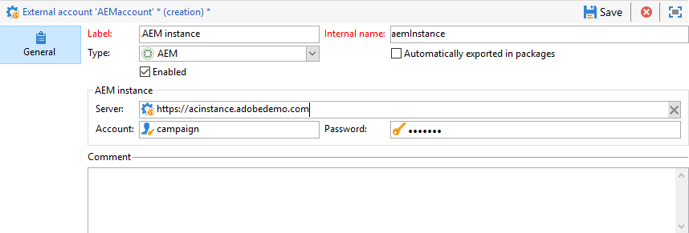

# Account esterni{#external-accounts}

Adobe Campaign è dotato di un set di account esterni predefiniti. Per impostare connessioni con sistemi esterni, puoi creare nuovi account esterni.

Gli account esterni sono utilizzati da processi tecnici quali flussi di lavoro tecnici o flussi di lavoro per campagne. Ad esempio, quando imposti un trasferimento di file in un flusso di lavoro o uno scambio di dati con un’altra applicazione (Adobe Target, Experience Manager, ecc.), devi selezionare un account esterno.

## Creare un account esterno {#creating-an-external-account}

Per creare un nuovo account esterno, segui i passaggi indicati di seguito. Le impostazioni dettagliate dipendono dal tipo di account esterno.

1. Da campagna **[!UICONTROL Explorer]**, seleziona **[!UICONTROL Administration]** &#39;>&#39; **[!UICONTROL Platform]** &#39;>&#39; **[!UICONTROL External accounts]**.

   

1. Fai clic sul pulsante **[!UICONTROL New]**.

   

1. Immetti un **[!UICONTROL Label]** e un **[!UICONTROL Internal Name]**.
1. Seleziona l’account esterno **[!UICONTROL Type]** quale desideri creare.
1. Configura l’accesso all’account specificando le credenziali in base al tipo di account esterno scelto.

   Le informazioni necessarie vengono in genere fornite dal provider del server a cui ti stai connettendo.

1. Controlla la **[!UICONTROL Enabled]** per attivare la connessione.
1. Fai clic su **[!UICONTROL Save]**.

L’account esterno viene creato e aggiunto all’elenco degli account esterni.

## Account esterni specifici per la campagna

### Messaggi non recapitati {#bounce-mails-external-account}

Il **Messaggi non recapitati** account esterno specifica l&#39;account POP3 esterno da utilizzare per la connessione al servizio e-mail. Per ulteriori informazioni su questo account esterno, consulta questa [pagina](../../workflow/using/inbound-emails.md).

Tutti i server configurati per l&#39;accesso POP3 possono essere utilizzati per ricevere la posta di ritorno.


Per configurare **[!UICONTROL Bounce mails (defaultPopAccount)]** account esterno:

* **[!UICONTROL Server]**

  URL del server POP3.

* **[!UICONTROL Port]**

  Numero porta di connessione POP3. La porta predefinita è 110.

* **[!UICONTROL Account]**

  Nome dell’utente.

* **[!UICONTROL Password]**

  Password dell’account utente.

* **[!UICONTROL Encryption]**

  Tipo di crittografia scelta tra **[!UICONTROL By default]**, **[!UICONTROL POP3 + STARTTLS]**, **[!UICONTROL POP3]** o **[!UICONTROL POP3S]**.

* **[!UICONTROL Function]**

  E-mail in entrata o router SOAP

>[!IMPORTANT]
>
>Prima di configurare l’account esterno POP3 utilizzando Microsoft OAuth 2.0, è necessario registrare l’applicazione nel portale di Azure. Per ulteriori informazioni, consulta [questa pagina](https://docs.microsoft.com/en-us/azure/active-directory/develop/quickstart-register-app).

Per configurare un POP3 esterno tramite **Microsoft OAuth 2.0**, controlla **[!UICONTROL Microsoft OAuth 2.0]** e compilare i campi seguenti:

* **[!UICONTROL Azure tenant]**

  L’ID di Azure (o l’ID di directory (tenant)) si trova nel **Elementi di base** della panoramica dell’applicazione nel portale di Azure.

* **[!UICONTROL Azure Client ID]**

  L’ID client (o ID applicazione (client)) si trova nella sezione **Elementi di base** della panoramica dell’applicazione nel portale di Azure.

* **[!UICONTROL Azure Client secret]**

  L’ID del segreto client si trova in **Segreti client** colonna da **Certificati e segreti** dell’applicazione nel portale di Azure.

* **[!UICONTROL Azure Redirect URL]**

  L’URL di reindirizzamento si trova nella sezione **Autenticazione** dell’applicazione nel portale di Azure. Deve terminare con la seguente sintassi `nl/jsp/oauth.jsp`, ad es. `https://redirect.adobe.net/nl/jsp/oauth.jsp`.

Dopo aver immesso le diverse credenziali, puoi fare clic su **[!UICONTROL Setup the connection]** per completare la configurazione dell’account esterno.

### Indirizzamento{#routing-external-account}

Il **[!UICONTROL Routing]** l’account esterno ti consente di configurare ogni canale disponibile in Adobe Campaign in base ai pacchetti installati.


È possibile configurare i seguenti canali:

* [E-mail](#email-routing-external-account)
* [Dispositivo mobile (SMS)](../../delivery/using/sms-set-up.md#creating-an-smpp-external-account)
* [Telefono](../../delivery/using/communication-channels.md#other-channels)
* [Direct mail](../../delivery/using/about-direct-mail-channel.md)
* [Agenzia](../../delivery/using/communication-channels.md#other-channels)
* [X (precedentemente noto come Twitter)](../../social/using/about-social-marketing.md)
* [Canale iOS](../../delivery/using/configuring-the-mobile-application.md)
* [Canale Android](../../delivery/using/configuring-the-mobile-application-android.md)

### Indirizzamento e-mail {#email-routing-external-account}

L’account esterno di indirizzamento e-mail è fornito per impostazione predefinita, adattato alla configurazione.

In qualità di cliente on-premise/ibrido, puoi creare nuovi account esterni di instradamento o aggiornare i parametri come descritto di seguito. Questa configurazione è riservata agli utenti esperti e può influire sul recapito messaggi. Per qualsiasi domanda, contatta l’Assistenza clienti di Adobe o il tuo rappresentante Adobe.

* È possibile utilizzare una **Mid-sourcing**, **Esterno** instradamento, o **In blocco** tipo di instradamento della consegna.

* Per **In blocco** e **Mid-sourcing** modalità di consegna, puoi specificare i parametri di branding in **Marchio** scheda. Questi parametri vengono utilizzati per sostituire [parametri predefiniti](../../installation/using/deploying-an-instance.md#email-channel-parameters) per **URL pagina mirror** e **Indirizzo errore** con impostazioni specifiche per il tuo marchio.

  

* Per configurare un account esterno di mid-sourcing, consulta [questa sezione](mid-sourcing-server.md)

### Istanza di esecuzione  {#execution-instance-external-account}

Se si dispone di un&#39;architettura con raggruppamenti, è necessario specificare le istanze di esecuzione collegate all&#39;istanza di controllo e collegarle. I modelli di messaggi transazionali vengono distribuiti nell’istanza di esecuzione.


* **[!UICONTROL URL]**

  URL del server in cui è installata l’istanza di esecuzione.

* **[!UICONTROL Account]**

  Il nome dell&#39;account deve corrispondere all&#39;agente del Centro messaggi definito nella cartella dell&#39;operatore.

* **[!UICONTROL Password]**

  Password dell’account definita nella cartella dell’operatore.

Per ulteriori informazioni su questa configurazione, consulta [pagina](../../message-center/using/configuring-instances.md#control-instance).

## Accesso agli account esterni dei sistemi

### FTP {#ftp-external-account}

L’account esterno FTP consente di configurare e testare l’accesso a un server esterno a Adobe Campaign. Per configurare le connessioni con i sistemi esterni, ad esempio i server FTP 898 utilizzati per i trasferimenti di file, puoi creare account esterni. Per ulteriori informazioni, consulta questa [pagina](../../workflow/using/file-transfer.md).

A questo scopo, specifica in questo account esterno l’indirizzo e le credenziali utilizzati per stabilire la connessione al server FTP


* **[!UICONTROL Server]**

  Nome del server FTP.

* **[!UICONTROL Port]**

  Numero porta di connessione FTP. La porta predefinita è 21.

* **[!UICONTROL Account]**

  Nome dell’utente.

* **[!UICONTROL Password]**

  Password dell’account utente.

* **[!UICONTROL Encryption]**

  Tipo di crittografia scelta tra **[!UICONTROL None]** o **[!UICONTROL SSL]**.

Per sapere dove individuare queste credenziali, consulta questa [pagina](https://help.dreamhost.com/hc/en-us/articles/115000675027-FTP-overview-and-credentials).

### SFTP {#sftp-external-account}

L’account esterno SFTP consente di configurare e testare l’accesso a un server esterno a Adobe Campaign. Per impostare connessioni con sistemi esterni, come SFTP utilizzato per i trasferimenti di file, puoi creare account esterni personalizzati. Per ulteriori informazioni, consulta questa [pagina](../../workflow/using/file-transfer.md).


* **[!UICONTROL Server]**

  URL del server SFTP.

* **[!UICONTROL Port]**

  Numero porta di connessione FTP. La porta predefinita è 22.

* **[!UICONTROL Account]**

  Nome account utilizzato per connettersi al server SFTP.

* **[!UICONTROL Password]**

  Password utilizzata per la connessione al server SFTP.

<!--To add SSH keys on Windows:

1. Create the **HOME** environment variable with value set as the installation directory.

2. Add your private key to the `/$HOME/.ssh/id_rsa` folder.

3. Restart the Adobe Campaign services.
-->

### Database esterno (FDA) {#external-database-external-account}

Utilizza il **Database esterno** digitare account esterno per la connessione a un database esterno. Ulteriori informazioni sull’opzione Federated Data Access (FDA) in [questa sezione](../../installation/using/about-fda.md).

I database esterni compatibili con Campaign sono elencati nel [Matrice di compatibilità](../../rn/using/compatibility-matrix.md)


Le impostazioni di configurazione dell&#39;account esterno dipendono dal motore del database. Per ulteriori informazioni, consulta le sezioni seguenti:

* Configurare l’accesso a [Vertiche analytics](../../installation/using/configure-fda-vertica.md)
* Configurare l’accesso a [Snowflake](../../installation/using/configure-fda-snowflake.md)
* Configurare l’accesso a [BigQuery Google](../../installation/using/configure-fda-google-big-query.md)
* Configurare l’accesso a [Azure synapse](../../installation/using/configure-fda-synapse.md)
* Configurare l’accesso a [Hadoop](../../installation/using/configure-fda-hadoop.md)
* Configurare l’accesso a [Oracle](../../installation/using/configure-fda-oracle.md)
* Configurare l’accesso a [Netezza](../../installation/using/configure-fda-netezza.md)
* Configurare l’accesso a [SAP HANA](../../installation/using/configure-fda-sap-hana.md)
* Configurare l’accesso a [Snowflake](../../installation/using/configure-fda-snowflake.md)
* Configurare l’accesso a [Sybase IQ](../../installation/using/configure-fda-sybase.md)
* Configurare l’accesso a [Teradata](../../installation/using/configure-fda-teradata.md)


## Account esterni per l’integrazione di Adobe Solution

### Adobe Experience Cloud {#adobe-experience-cloud-external-account}

Per connettersi alla console Adobe Campaign utilizzando un Adobe ID, devi configurare il **[!UICONTROL Adobe Experience Cloud (MAC)]** account esterno.


* **[!UICONTROL IMS server]**

  URL del server IMS. Assicurati che le istanze di stage e produzione puntino allo stesso endpoint di produzione IMS.

* **[!UICONTROL IMS scope]**

  Gli ambiti definiti qui devono essere un sottoinsieme di quelli per i quali è stato eseguito il provisioning da IMS.

* **[!UICONTROL IMS client identifier]**

  ID del client IMS.

* **[!UICONTROL IMS client secret]**

  Credenziali del segreto client IMS.

* **[!UICONTROL Callback server]**

  URL di accesso dell’istanza di Adobe Campaign.

* **[!UICONTROL IMS organization ID]**

  ID della tua organizzazione. Per trovare l’ID organizzazione, consulta [questa pagina](https://experienceleague.adobe.com/docs/core-services/interface/administration/organizations.html?lang=it){_blank}.

* **[!UICONTROL Association mask]**

  Sintassi che consentirà la sincronizzazione dei nomi di configurazione nel dashboard di Enterprise con i gruppi in Adobe Campaign.

* **[!UICONTROL Server]**

  URL dell’istanza di Adobe Experience Cloud.

* **[!UICONTROL Tenant]**

  Nome del tenant Adobe Experience Cloud.

Per ulteriori informazioni su questa configurazione, consulta [questa pagina](../../integrations/using/configuring-ims.md).

## Analisi web {#web-analytics-external-account}

Il **[!UICONTROL Web Analytics]** l’account esterno ti consente di inoltrare dati da Adobe Analytics ad Adobe Campaign sotto forma di segmenti. Al contrario, invia indicatori e attributi delle campagne e-mail consegnate da Adobe Campaign al connettore Adobe Analytics.


Per questo account esterno, è necessario arricchire la formula di calcolo per gli URL tracciati e approvare la connessione tra le due soluzioni. Per ulteriori informazioni, consulta questa [pagina](../../platform/using/gs-aa.md).

### Adobe Experience Manager {#adobe-experience-manager-external-account}

Il **[!UICONTROL AEM (AEM instance)]** l’account esterno consente di gestire il contenuto delle consegne e-mail e dei moduli direttamente in Adobe Experience Manager.



* **[!UICONTROL Server]**

  URL del server Adobe Experience Manager.

* **[!UICONTROL Port]**

  Nome account utilizzato per connettersi all’istanza di authoring Adobe Experience Manager.

* **[!UICONTROL Password]**

  Password utilizzata per la connessione all’istanza di authoring Adobe Experience Manager.

Per ulteriori informazioni, consulta questa [sezione](../../integrations/using/about-adobe-experience-manager.md).

## Account esterni del connettore CRM

### Microsoft Dynamics CRM {#microsoft-dynamics-crm-external-account}

>[!NOTE]
>
> **[!UICONTROL On-premise]** e **[!UICONTROL Office 365]** I tipi di distribuzione ora sono obsoleti. [Ulteriori informazioni](../../rn/using/deprecated-features.md).

Il **[!UICONTROL Microsoft Dynamics CRM]** l’account esterno ti consente di importare ed esportare dati di Microsoft Dynamics in Adobe Campaign.

Ulteriori informazioni su Campaign - Connettore Microsoft Dynamics CRM in questo [pagina](../../platform/using/crm-ms-dynamics.md).

Con **[!UICONTROL Web API]** tipo di distribuzione e **[!UICONTROL Password credentials]** autenticazione, è necessario fornire i seguenti dettagli:


* **[!UICONTROL Account]**

  Account utilizzato per accedere a Microsoft CRM.

* **[!UICONTROL Server]**

  URL del server Microsoft CRM.

  Per trovare il Microsoft CRM **[!UICONTROL Server URL]**, accedere all&#39;account di Microsoft Dynamics CRM e quindi fare clic su **Dynamics 365** e seleziona la tua app. Potrai quindi trovare il tuo **[!UICONTROL Server URL]** nella barra degli indirizzi del browser, ad es. `https://myserver.crm.dynamics.com/`.

* **[!UICONTROL Client identifier]**

  ID client, reperibile dal portale di gestione di Microsoft Azure in **[!UICONTROL Update your code]** categoria, **[!UICONTROL Client ID]** campo.

* **[!UICONTROL CRM version]**

  Scegli **[!UICONTROL Dynamics CRM 365]** Versione CRM.

Con **[!UICONTROL Web API]** tipo di distribuzione e **[!UICONTROL Certificate]** autenticazione, è necessario fornire i seguenti dettagli:


* **[!UICONTROL Server]**

  URL del server Microsoft CRM.

  Per trovare il Microsoft CRM **[!UICONTROL Server URL]**, accedere all&#39;account di Microsoft Dynamics CRM e quindi fare clic su **Dynamics 365** e seleziona la tua app. Potrai quindi trovare il tuo **[!UICONTROL Server URL]** nella barra degli indirizzi del browser, ad es. `https://myserver.crm.dynamics.com/`.

* **[!UICONTROL Private Key (Base64 encoded)]**

  La chiave privata deve essere codificata in Base64.

  A tale scopo, è possibile utilizzare l&#39;aiuto di un codificatore Base64 o la riga di comando `base64 -w0 private.key` per Linux.

* **[!UICONTROL Custom Key identifier]**

* **[!UICONTROL Key ID]**

* **[!UICONTROL Client identifier]**

  ID client, reperibile dal portale di gestione di Microsoft Azure in **[!UICONTROL Update your code]** categoria, **[!UICONTROL Client ID]** campo.

* **[!UICONTROL CRM version]**

  Versione del CRM tra **[!UICONTROL Dynamics CRM 2007]**, **[!UICONTROL Dynamics CRM 2015]** o **[!UICONTROL Dynamics CRM 2016]**.

Per ulteriori informazioni su questa configurazione, consulta [pagina](../../platform/using/crm-connectors.md).

### Salesforce.com CRM  {#salesforce-crm-external-account}

Il **[!UICONTROL Salesforce CRM]** l’account esterno ti consente di importare ed esportare i dati di Salesforce in Adobe Campaign.


Per configurare l’account esterno del sistema di gestione delle relazioni con i clienti di Salesforce affinché funzioni con Adobe Campaign, è necessario fornire i seguenti dettagli:

* **[!UICONTROL Account]**

  Account utilizzato per accedere a Salesforce CRM.

* **[!UICONTROL Password]**

  Password utilizzata per accedere a Salesforce CRM.

* **[!UICONTROL Client identifier]**

  Per sapere dove trovare l’identificatore del client, consulta questa [pagina](https://help.salesforce.com/articleView?id=000205876&amp;type=1).

* **[!UICONTROL Security token]**

  Per sapere dove trovare il token di sicurezza, consulta questa [pagina](https://help.salesforce.com/articleView?id=000205876&amp;type=1).

* **[!UICONTROL API version]**

  Seleziona la versione dell’API.

Per questo account esterno, devi configurare Salesforce CRM con la configurazione guidata.

Per ulteriori informazioni su questa configurazione, consulta [pagina](../../platform/using/crm-connectors.md).

## Trasferisci dati account esterni

### Servizio Amazon Simple Storage (S3) {#amazon-simple-storage-service--s3--external-account}

Il connettore Amazon Simple Storage Service (S3) può essere utilizzato per importare o esportare dati in Adobe Campaign. Può essere impostato in un’attività del flusso di lavoro. Per ulteriori informazioni, consulta questa [pagina](../../workflow/using/file-transfer.md).


Quando imposti questo nuovo account esterno, dovrai fornire i seguenti dettagli:

* **[!UICONTROL AWS S3 Account Server]**

  URL del server, deve essere compilato come segue:

  ```
  <S3bucket name>.s3.amazonaws.com/<s3object path>
  ```

* **[!UICONTROL AWS access key ID]**

  Per sapere dove trovare il tuo ID chiave di accesso ad AWS, consulta questa [pagina](https://docs.aws.amazon.com/general/latest/gr/aws-sec-cred-types.html#access-keys-and-secret-access-keys) .

* **[!UICONTROL Secret access key to AWS]**

  Per sapere dove trovare la chiave di accesso segreta ad AWS, consulta questa [pagina](https://aws.amazon.com/fr/blogs/security/wheres-my-secret-access-key/).

* **[!UICONTROL AWS Region]**

  Per ulteriori informazioni sull’area geografica di AWS, consulta [pagina](https://aws.amazon.com/about-aws/global-infrastructure/regions_az/).

* Il **[!UICONTROL Use server side encryption]** casella di controllo consente di memorizzare il file in modalità crittografata S3.

Per informazioni su dove trovare l’ID della chiave di accesso e la chiave di accesso segreta, consulta Servizi web di Amazon [documentazione](https://docs.aws.amazon.com/general/latest/gr/aws-sec-cred-types.html#access-keys-and-secret-access-keys).

### Archiviazione BLOB di Azure {#azure-blob-external-account}

Il **Archiviazione BLOB di Azure** l’account esterno può essere utilizzato per importare o esportare dati in Adobe Campaign utilizzando un **[!UICONTROL Transfer file]** attività del flusso di lavoro. Per ulteriori informazioni, consulta questa [sezione](../../workflow/using/file-transfer.md).


Per configurare **[!UICONTROL Azure external account]** per lavorare con Adobe Campaign, devi fornire i seguenti dettagli:

* **[!UICONTROL Server]**

  URL del server di archiviazione BLOB di Azure.

* **[!UICONTROL Encryption]**

  Tipo di crittografia scelta tra **[!UICONTROL None]** o **[!UICONTROL SSL]**.

* **[!UICONTROL Access key]**

  Per sapere dove trovare **[!UICONTROL Access key]**, fai riferimento a questo [pagina](https://docs.microsoft.com/en-us/azure/storage/common/storage-account-keys-manage?tabs=azure-portal).
