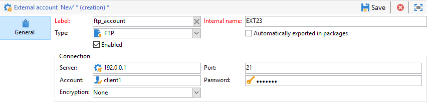
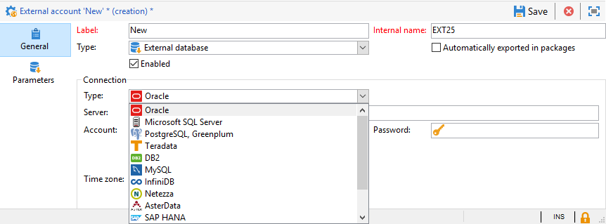
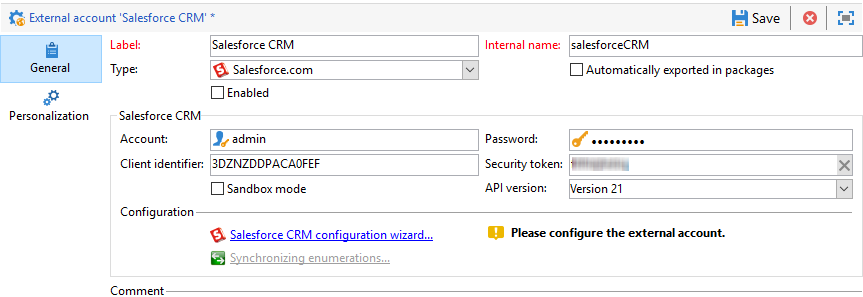

# Account esterni{#external-accounts}

Adobe Campaign è dotato di un set di account esterni predefiniti. Per configurare le connessioni con i sistemi esterni, potete creare nuovi account esterni.

Gli account esterni sono utilizzati da processi tecnici quali flussi di lavoro tecnici o flussi di lavoro per campagne. Quando imposti un trasferimento di file in un flusso di lavoro o uno scambio di dati con un’altra applicazione (Adobe Target, Experience Manager, ecc.), devi selezionare un account esterno.

Puoi impostare i seguenti tipi di account esterni:

* [Routing account esterno](#routing-external-account)
* [Account esterno FTP](#ftp-external-account)
* [Account esterno del database esterno](#external-database-external-account)
* [Account esterno di Web Analytics](#web-analytics-external-account)
* [Account esterno di connessione Facebook](#facebook-connect-external-account)
* [Account esterno dell&#39;istanza di esecuzione](#execution-instance-external-account)
* [Account esterno Adobe Experience Cloud](#adobe-experience-cloud-external-account)
* [Account esterno SFTP](#sftp-external-account)
* [Account esterno Adobe Experience Manager](#adobe-experience-manager-external-account)
* [Account esterno  Amazon Simple Storage Service (S3)](#amazon-simple-storage-service--s3--external-account)
* [Account esterno di Microsoft Dynamics CRM](#microsoft-dynamics-crm-external-account)
* [Account esterno Oracle on demand](#oracle-on-demand-external-account)
* [Account esterno di Salesforce CRM](#salesforce-crm-external-account)

## Creazione di un account esterno {#creating-an-external-account}

Per creare un nuovo account esterno, attenetevi alla procedura seguente. Le impostazioni dettagliate dipendono dal tipo di account esterno.

1. Da Campaign **[!UICONTROL Explorer]**, selezionare **[!UICONTROL Administration]** &#39;>&#39; **[!UICONTROL Platform]** &#39;>&#39; **[!UICONTROL External accounts]**.

   

1. Fai clic sul pulsante **[!UICONTROL New]**.

   

1. Enter a **[!UICONTROL Label]** and an **[!UICONTROL Internal Name]**.
1. Selezionate l’account esterno **[!UICONTROL Type]** da creare.
1. Configurate l&#39;accesso all&#39;account specificando le credenziali in base al tipo di account esterno scelto.

   Le informazioni necessarie vengono in genere fornite dal provider del server a cui ti stai connettendo.

1. Selezionare l&#39; **[!UICONTROL Enabled]** opzione per attivare la connessione.
1. Fai clic su **[!UICONTROL Save]**.

L&#39;account esterno viene creato e aggiunto all&#39;elenco dei conti esterni.

## Account esterno di Bounce Mail {#bounce-mails-external-account}

L&#39;account esterno **Bounce mails** specifica l&#39;account POP3 esterno da utilizzare per connettersi al servizio e-mail. For more on this external account, refer to this [page](../../workflow/using/inbound-emails.md).

Tutti i server configurati per l&#39;accesso POP3 possono essere utilizzati per ricevere la posta di ritorno.


Per configurare l&#39;account **[!UICONTROL Bounce mails (defaultPopAccount)]** esterno:

* **[!UICONTROL Server]**

   URL del server POP3.

* **[!UICONTROL Port]**

   Numero porta di connessione POP3. La porta predefinita è 110.

* **[!UICONTROL Account]**

   Nome dell’utente.

* **[!UICONTROL Password]**

   Password dell&#39;account utente.

* **[!UICONTROL Encryption]**

   Tipo di cifratura scelta tra **[!UICONTROL By default]**, **[!UICONTROL POP3 + STARTTLS]**, **[!UICONTROL POP3]** o **[!UICONTROL POP3S]**.

## Routing account esterno {#routing-external-account}

L&#39;account **[!UICONTROL Routing]** esterno consente di configurare ogni canale disponibile in  Adobe Campaign a seconda dei pacchetti installati.


È possibile configurare i seguenti canali:

* [E-mail](../../installation/using/deploying-an-instance.md#email-channel-parameters)
* [Dispositivo mobile (SMS)](../../delivery/using/sms-channel.md#creating-an-smpp-external-account)
* [Telefono](../../delivery/using/steps-about-delivery-creation-steps.md#other-channels)
* [Direct mail](../../delivery/using/about-direct-mail-channel.md)
* [Agenzia](../../delivery/using/steps-about-delivery-creation-steps.md#other-channels)
* [Facebook](../../social/using/publishing-on-facebook-walls.md#delegating-write-access-to-adobe-campaign)
* [Twitter](../../social/using/configuring-publishing-on-twitter.md)
* [Canale iOS](../../delivery/using/configuring-the-mobile-application.md)
* [Canale Android](../../delivery/using/configuring-the-mobile-application-android.md)

## Account esterno FTP {#ftp-external-account}

L&#39;account FTP esterno consente di configurare e testare l&#39;accesso a un server esterno  Adobe Campaign. Per configurare le connessioni con i sistemi esterni, come i server FTP 898, utilizzati per i trasferimenti di file, potete creare i vostri account esterni. Per ulteriori informazioni, consulta questa [pagina](../../workflow/using/file-transfer.md).

A tal fine, specificate in questo account esterno l&#39;indirizzo e le credenziali utilizzati per stabilire la connessione al server FTP



* **[!UICONTROL Server]**

   Nome del server FTP.

* **[!UICONTROL Port]**

   Numero porta di connessione FTP. La porta predefinita è 21.

* **[!UICONTROL Account]**

   Nome dell’utente.

* **[!UICONTROL Password]**

   Password dell&#39;account utente.

* **[!UICONTROL Encryption]**

   Tipo di cifratura scelta tra **[!UICONTROL None]** o **[!UICONTROL SSL]**.

Per sapere dove individuare queste credenziali, fare riferimento a questa [pagina](https://help.dreamhost.com/hc/en-us/articles/115000675027-FTP-overview-and-credentials).

## Account esterno del database esterno {#external-database-external-account}

Utilizzate il tipo di database **** esterno per la connessione a un database esterno. Ulteriori informazioni sull&#39;opzione Federated Data Access (FDA) in [questa sezione](../../installation/using/about-fda.md).

I database esterni compatibili con Campaign sono elencati nella matrice [Compatibilità](../../rn/using/compatibility-matrix.md)



Le impostazioni di configurazione dell&#39;account esterno dipendono dal motore del database. Ulteriori informazioni nelle sezioni seguenti:

* Configurare l&#39;accesso alla sinapsi di [Azure](../../installation/using/configure-fda-synapse.md)
* Configurare l&#39;accesso a [Hadoop](../../installation/using/configure-fda-hadoop.md)
* Configurare l&#39;accesso a [Oracle](../../installation/using/configure-fda-oracle.md)
* Configurare l&#39;accesso a [Netezza](../../installation/using/configure-fda-netezza.md)
* Configurare l&#39;accesso a [SAP HANA](../../installation/using/configure-fda-sap-hana.md)
* Configurare l&#39;accesso al Snowflake [](../../installation/using/configure-fda-snowflake.md)
* Configurare l&#39;accesso a [Sybase IQ](../../installation/using/configure-fda-sybase.md)
* Configurare l&#39;accesso a [Teradata](../../installation/using/configure-fda-teradata.md)

## Account esterno di Web Analytics {#web-analytics-external-account}

L&#39;account **[!UICONTROL Web Analytics (Adobe Analytics - Data connector)]** esterno consente di inoltrare i dati da  Adobe Analytics a  Adobe Campaign sotto forma di segmenti. Al contrario, invia indicatori e attributi delle campagne e-mail distribuite da  Adobe Campaign a  Adobe Analytics - Connettore dati.


Per questo account esterno, la formula di calcolo per gli URL tracciati deve essere arricchita e la connessione tra le due soluzioni deve essere approvata. Per ulteriori informazioni, consulta questa [pagina](../../platform/using/adobe-analytics-data-connector.md#step-2--create-the-external-account-in-campaign).

## Account esterno di connessione Facebook {#facebook-connect-external-account}

L&#39;account **[!UICONTROL Facebook Connect]** esterno consente di visualizzare contenuti personalizzati nelle applicazioni Facebook, semplificando l&#39;acquisizione di potenziali clienti tramite questo social network.

Per ogni applicazione Facebook, è necessario creare un account esterno di tipo **[!UICONTROL Facebook Connect]** type. For more on this, refer to [page](../../social/using/creating-a-facebook-application.md#configuring-external-accounts).


* **[!UICONTROL Hosting mode]**

   Modalità di hosting dell&#39;applicazione tra **[!UICONTROL hosted by a partner]** o **[!UICONTROL hosted by this instance]**.

* **[!UICONTROL Application ID]**

   ID app dell’applicazione Facebook.

* **[!UICONTROL Application secret]**

   Segreto app dell’applicazione Facebook.

Se scegliete l&#39;hosting da questa modalità di istanza, l&#39;URL di Canvas protetto deve essere incollato nel campo dei giochi Web (https) **di** Facebook

Per sapere dove individuare queste credenziali, fare riferimento a questa [pagina](https://developers.facebook.com/docs/facebook-login/access-tokens).

## Account esterno dell&#39;istanza di esecuzione {#execution-instance-external-account}

Se si dispone di un&#39;architettura suddivisa, è necessario specificare le istanze di esecuzione collegate all&#39;istanza di controllo e collegarle. I modelli di messaggi transazionali vengono distribuiti nell&#39;istanza di esecuzione


* **[!UICONTROL URL]**

   URL del server in cui è installata l’istanza di esecuzione.

* **[!UICONTROL Account]**

   Il nome dell&#39;account deve corrispondere all&#39;agente del Centro messaggi come definito nella cartella dell&#39;operatore.

* **[!UICONTROL Password]**

   La password dell&#39;account come definito nella cartella dell&#39;operatore.

For more information on this configuration, refer to this [page](../../message-center/using/creating-a-shared-connection.md#control-instance).

## Adobe Experience Cloud external account {#adobe-experience-cloud-external-account}

Per connettersi alla console  Adobe Campaign utilizzando un Adobe ID , è necessario configurare l’account **[!UICONTROL Adobe Experience Cloud (MAC)]** esterno.


* **[!UICONTROL IMS server]**

   URL del server IMS. Accertatevi che le istanze di fase e produzione puntino allo stesso punto finale di produzione IMS.

* **[!UICONTROL IMS scope]**

   Gli ambiti qui definiti devono essere un sottoinsieme di quelli predisposti da IMS.

* **[!UICONTROL IMS client identifier]**

   ID del client IMS.

* **[!UICONTROL IMS client secret]**

   Credenziali del segreto client IMS.

* **[!UICONTROL Callback server]**

   URL di accesso dell’istanza di Adobe Campaign .

* **[!UICONTROL IMS organization ID]**

   ID della tua organizzazione IMS. Per trovare l’ID organizzazione, fare riferimento a questa [pagina](https://docs.adobe.com/content/help/en/core-services/interface/manage-users-and-products/faq.html) (**dove si trova l’ID organizzazione IMS?**).

* **[!UICONTROL Association mask]**

   Sintassi che consentirà la sincronizzazione dei nomi di configurazione in Enterprise Dashboard con i gruppi in  Adobe Campaign.

* **[!UICONTROL Server]**

   URL dell’istanza Adobe Experience Cloud.

* **[!UICONTROL Tenant]**

   Nome del tenant Adobe Experience Cloud.

For more information on this configuration, refer to this [page](../../integrations/using/configuring-ims.md).

## Account esterno SFTP {#sftp-external-account}

L&#39;account esterno SFTP consente di configurare e testare l&#39;accesso a un server esterno  Adobe Campaign. Per impostare connessioni con sistemi esterni come SFTP utilizzati per i trasferimenti di file, potete creare i vostri account esterni. Per ulteriori informazioni, consulta questa [pagina](../../workflow/using/file-transfer.md).


* **[!UICONTROL Server]**

   URL del server SFTP.

* **[!UICONTROL Port]**

   Numero porta di connessione FTP. La porta predefinita è 22.

* **[!UICONTROL Account]**

   Nome account utilizzato per connettersi al server SFTP.

* **[!UICONTROL Password]**

   Password utilizzata per connettersi al server SFTP.

## Account esterno Adobe Experience Manager {#adobe-experience-manager-external-account}

L&#39;account **[!UICONTROL AEM (AEM instance)]** esterno consente di gestire direttamente in Adobe Experience Manager il contenuto delle comunicazioni e-mail e dei moduli.


* **[!UICONTROL Server]**

   URL del server Adobe Experience Manager.

* **[!UICONTROL Port]**

   Nome account usato per connettersi all’istanza di creazione Adobe Experience Manager.

* **[!UICONTROL Password]**

   Password utilizzata per connettersi all’istanza di creazione Adobe Experience Manager.

Per ulteriori informazioni, consulta questa [sezione](../../integrations/using/about-adobe-experience-manager.md).

## Account esterno  Amazon Simple Storage Service (S3) {#amazon-simple-storage-service--s3--external-account}

Il connettore  Amazon Simple Storage Service (S3) può essere utilizzato per importare o esportare dati in  Adobe Campaign. Può essere impostato in un&#39;attività del flusso di lavoro. Per ulteriori informazioni, consulta questa [pagina](../../workflow/using/file-transfer.md).


Quando imposti questo nuovo account esterno, dovrai fornire i seguenti dettagli:

* **[!UICONTROL AWS S3 Account Server]**

   L’URL del server deve essere compilato come segue:

   ```
   <S3bucket name>.s3.amazonaws.com/<s3object path>
   ```

* **[!UICONTROL AWS access key ID]**

   Per sapere dove trovare l&#39;ID della chiave di accesso AWS, fai riferimento a questa [pagina](https://docs.aws.amazon.com/general/latest/gr/aws-sec-cred-types.html#access-keys-and-secret-access-keys) .

* **[!UICONTROL Secret access key to AWS]**

   Per sapere dove trovare la chiave di accesso segreta per AWS, fare riferimento a questa [pagina](https://aws.amazon.com/fr/blogs/security/wheres-my-secret-access-key/).

* **[!UICONTROL AWS Region]**

   Per ulteriori informazioni sull&#39;area AWS, fare riferimento a questa [pagina](https://aws.amazon.com/about-aws/global-infrastructure/regions_az/).

* La **[!UICONTROL Use server side encryption]** casella di controllo consente di archiviare il file in modalità codificata S3.

Per informazioni su dove trovare l&#39;ID della chiave di accesso e la chiave di accesso segreta, consultare  [documentazione](https://docs.aws.amazon.com/general/latest/gr/aws-sec-cred-types.html#access-keys-and-secret-access-keys) dei servizi Web di Amazon.

## Account esterno di Microsoft Dynamics CRM {#microsoft-dynamics-crm-external-account}

L&#39;account **[!UICONTROL Microsoft Dynamics CRM]** esterno consente di importare ed esportare i dati di Microsoft Dynamics in  Adobe Campaign.

La configurazione del connettore Microsoft Dynamics per l&#39;utilizzo con  Adobe Campaign dipende dal tipo di distribuzione.
Con i tipi **[!UICONTROL On-premise]** di distribuzione e **[!UICONTROL Office 365]** distribuzione, dovete fornire i seguenti dettagli:


* **[!UICONTROL Account]**

   Account utilizzato per accedere a Microsoft CRM.

* **[!UICONTROL Server]**

   URL del server Microsoft CRM.

* **[!UICONTROL Password]**

   Password utilizzata per accedere a Microsoft CRM.

* **[!UICONTROL Company name]** per la distribuzione locale e Office 365

   Nome della tua Azienda.

* **[!UICONTROL Organization name]** per la distribuzione locale

   Nome dell’organizzazione.
Nome organizzazione che si trova nel dashboard Risorse sviluppatori in Microsoft Dynamics, **[!UICONTROL Unique Name]** campo.

* **[!UICONTROL CRM version]** per locale

   Versione del CRM tra **[!UICONTROL Dynamics CRM 2007]**, **[!UICONTROL Dynamics CRM 2015]** o **[!UICONTROL Dynamics CRM 2016]**.

Con **[!UICONTROL Web API]** il tipo di distribuzione e **[!UICONTROL Password credentials]** l&#39;autenticazione, dovete fornire i seguenti dettagli:


* **[!UICONTROL Account]**

   Account utilizzato per accedere a Microsoft CRM.

* **[!UICONTROL Server]**

   URL del server Microsoft CRM.

* **[!UICONTROL Client identifier]**

   ID client che si trova nel portale di gestione di Microsoft Azure nel **[!UICONTROL Update your code]** campo **[!UICONTROL Client ID]** category.

* **[!UICONTROL CRM version]**

   Versione del CRM tra **[!UICONTROL Dynamics CRM 2007]**, **[!UICONTROL Dynamics CRM 2015]** o **[!UICONTROL Dynamics CRM 2016]**.

Con **[!UICONTROL Web API]** il tipo di distribuzione e **[!UICONTROL Certificate]** l&#39;autenticazione, dovete fornire i seguenti dettagli:


* **[!UICONTROL Server]**

   URL del server Microsoft CRM.

* **[!UICONTROL Private Key (Base64 encoded)]**

   Chiave privata codificata in Base64

* **[!UICONTROL Custom Key identifier]**

* **[!UICONTROL Key ID]**

* **[!UICONTROL Client identifier]**

   ID client che si trova nel portale di gestione di Microsoft Azure nel **[!UICONTROL Update your code]** campo **[!UICONTROL Client ID]** category.

* **[!UICONTROL CRM version]**

   Versione del CRM tra **[!UICONTROL Dynamics CRM 2007]**, **[!UICONTROL Dynamics CRM 2015]** o **[!UICONTROL Dynamics CRM 2016]**.

For more information on this configuration, refer to this [page](../../platform/using/crm-connectors.md#example-for-microsoft-dynamics).

## Account esterno Oracle on demand {#oracle-on-demand-external-account}

Il conto **[!UICONTROL Oracle on demand]** esterno consente di importare ed esportare i dati Oracle in  Adobe Campaign.


Per configurare l&#39;account esterno Oracle on demand per l&#39;utilizzo con  Adobe Campaign, è necessario fornire i seguenti dettagli:

* **[!UICONTROL Account]**

   Account utilizzato per accedere a Oracle CRM su richiesta.

* **[!UICONTROL Server]**

   URL del server Oracle CRM su richiesta.

* **[!UICONTROL Password]**

   Password utilizzata per accedere a Oracle CRM su richiesta.

For more information on this configuration, refer to this [page](../../platform/using/crm-connectors.md#example-for-oracle-on-demand).

## Account esterno di Salesforce CRM {#salesforce-crm-external-account}

L’account **[!UICONTROL Salesforce CRM]** esterno consente di importare ed esportare i dati Salesforce in  Adobe Campaign.



Per configurare l&#39;account esterno di Salesforce CRM in modo che funzioni con  Adobe Campaign, devi fornire i seguenti dettagli:

* **[!UICONTROL Account]**

   Account utilizzato per accedere a Salesforce CRM.

* **[!UICONTROL Password]**

   Password utilizzata per accedere a Salesforce CRM.

* **[!UICONTROL Client identifier]**

   Per sapere dove trovare l’identificatore client, fare riferimento a questa [pagina](https://help.salesforce.com/articleView?id=000205876&amp;type=1).

* **[!UICONTROL Security token]**

   Per sapere dove trovare il token di protezione, fare riferimento a questa [pagina](https://help.salesforce.com/articleView?id=000205876&amp;type=1).

* **[!UICONTROL API version]**

   Versione dell&#39;API tra **[!UICONTROL Version 37]**, **[!UICONTROL Version 21]** o **[!UICONTROL Version 15]**.

Per questo account esterno, devi configurare Salesforce CRM con la procedura guidata di configurazione.

For more information on this configuration, refer to this [page](../../platform/using/crm-connectors.md#example-for-salesforce-com).
