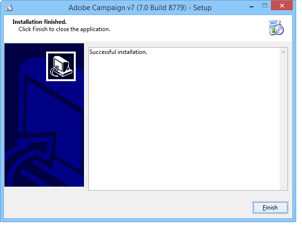

# Installazione del server{#installing-the-server}

## Esecuzione del programma di installazione {#executing-the-installation-program}

Per una piattaforma Windows a 32 bit, installare Adobe Campaign a 32 bit. Per una piattaforma Windows a 64 bit, installare Adobe Campaign a 64 bit.

I passaggi di installazione per il server Adobe Campaign sono i seguenti:

1. Esegui il file **setup.exe**.

   

1. Selezionare il tipo di installazione.

   

   Sono disponibili diversi tipi di installazione:

   * **[!UICONTROL Installation of an application server]** : Installa il server applicazioni Adobe Campaign e la console client.
   * **[!UICONTROL Minimal installation (Network)]** : Installazione del computer client dalla rete. Se necessario, sul computer verrà installato solo un numero limitato di DLL e tutti gli altri componenti verranno utilizzati da un&#39;unità di rete.
   * **[!UICONTROL Installation of a client]** : Installazione dei componenti richiesti per il client Adobe Campaign.
   * **[!UICONTROL Custom installation]** : L&#39;utente sceglie gli elementi da installare.

   Seleziona **Installazione di un server applicazioni** e segui i diversi passaggi come mostrato di seguito:

   

1. Seleziona la directory di installazione:

   

1. Fai clic su **[!UICONTROL Finish]** per avviare l&#39;installazione:

   

   La barra di avanzamento mostra la distanza dell’installazione:

   

   Al termine dell’installazione, viene visualizzato un messaggio per informarti:

   

   >[!NOTE]
   >
   >Una volta completata l&#39;installazione del server, è necessario riavviare il server per evitare possibili problemi di rete.

   Al termine dell’installazione, avvia Adobe Campaign per creare i file di configurazione. Fare riferimento a [Primo avvio del server](#first-start-up-of-the-server).

## Test di installazione di riepilogo {#summary-installation-testing}

Puoi verificare l’installazione iniziale utilizzando il seguente comando:

```
nlserver pdump
```

Se Adobe Campaign non viene avviato, la risposta è:

```
No task
```

## Primo avvio del server {#first-start-up-of-the-server}

Al termine del test di installazione, apri un prompt dei comandi tramite il menu **[!UICONTROL Start > Programs > Adobe Campaign]** e immetti il seguente comando:

```
nlserver web
```


I file nella directory di installazione vengono utilizzati per configurare i moduli server Adobe Campaign.

Vengono visualizzate le seguenti informazioni:

```
15:30:12 >   Application server for Adobe Campaign Classic (7.X YY.R build XXX@SHA1) of DD/MM/YYYY
15:30:12 >   Web server start (pid=664, tid=4188)...
15:30:12 >   Creation of server configuration file '[INSTALL]bin..confserverConf.xml' server via '[INSTALL]bin..conffraserverConf.xml.sample
15:30:12 >   Creation of server configuration file '[INSTALL]bin..confconfig-default.xml' server via '[INSTALL]bin..confmodelsconfig-default.xml
15:30:12 >   Server started
15:30:12 >   Stop requested (pid=664)
15:30:12 >   Web server stop (pid=664, tid=4188)...
```

Premere **Ctrl+C** per interrompere il processo, quindi immettere il seguente comando:

```
nlserver start web
```

Vengono visualizzate le seguenti informazioni:

```
12:17:21 >   Application server for Adobe Campaign Classic (7.X YY.R build XXX@SHA1) of DD/MM/YYYY
12:17:21 >   Start of the 'web@default' ('nlserver web -tracefile:web@default -instance:default -detach -tomcat -autorepair') task in a new process 
12:17:21 >   Application server for Adobe Campaign Classic (7.X YY.R build XXX@SHA1) of DD/MM/YYYY
12:17:21 >   Web server start (pid=29188, tid=-1224824320)...
12:17:21 >   Generation of configuration changes '[INSTALL]bin..confserverConf.xml.diff' between '[INSTALL]bin..confserverConf.xml' and '[INSTALL]bin..conffraserverConf.xml.sample'
12:17:22 >   Tomcat started
12:17:22 >   Server started
```

Per interromperlo, immetti:

```
nlserver stop web
```

Vengono visualizzate le seguenti informazioni:

```
12:18:31 >   Application server for Adobe Campaign Classic (7.X YY.R build XXX@SHA1) of DD/MM/YYYY
12:18:31 >   Stop requested for 'web@default' ('nlserver web -tracefile:web@default -instance:default -detach -tomcat -autorepair', pid=29188, tid=-1224824320)...
12:18:31 >   Stop requested (pid=29188)
12:18:31 >   Web server stopped (pid=29188, tid=-1224824320)...
```

## Password per l&#39;identificatore interno {#password-for-the-internal-identifier}

Il server Adobe Campaign definisce un accesso tecnico denominato **internal** che dispone di tutti i diritti su tutte le istanze. Subito dopo l&#39;installazione, l&#39;accesso non dispone di una password. È obbligatorio definirne uno.

Ulteriori informazioni in [questa sezione](../../installation/using/configuring-campaign-server.md#internal-identifier).

## Avvio dei servizi Adobe Campaign {#starting-adobe-campaign-services}

Per avviare i servizi Adobe Campaign, puoi utilizzare il gestore dei servizi o immettere quanto segue nella riga di comando (con i diritti appropriati):

```
net start nlserver6
```

Se devi interrompere i processi Adobe Campaign in un secondo momento, utilizza il comando :

```
net stop nlserver6
```

## Installazione di LibreOffice {#installing-libreoffice}

Scarica LibreOffice, ad esempio da [https://www.libreoffice.org/download/libreoffice-fresh/](https://www.libreoffice.org/download/libreoffice-fresh/) e segui i normali passaggi di installazione.

Aggiungi la seguente variabile di ambiente:

```
OOO_BASIS_INSTALL_DIR="C:\Program Files (x86)\LibreOffice 6\"
```
