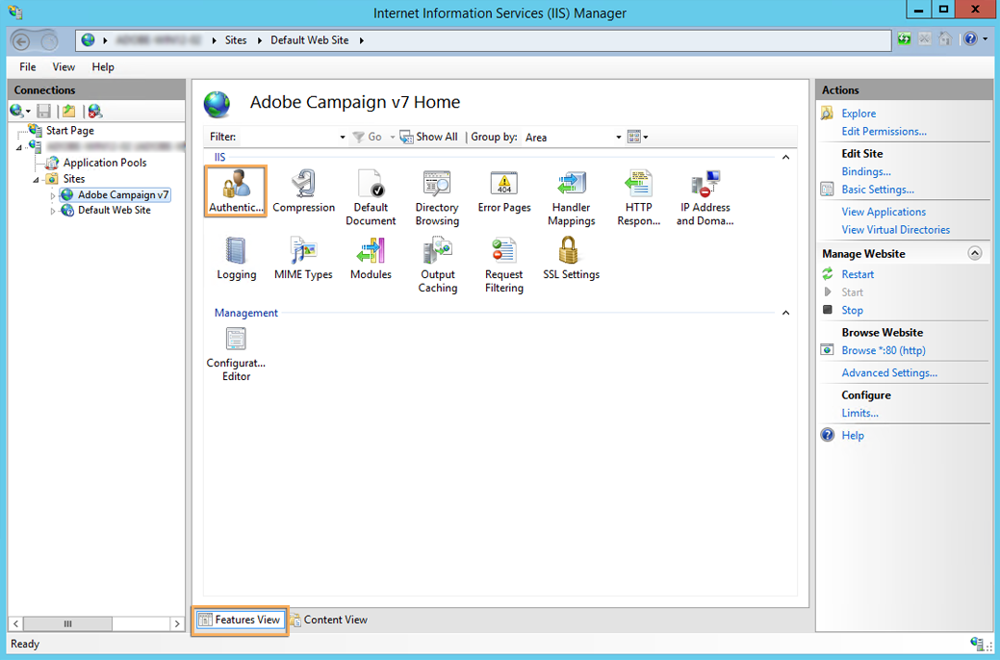

# Integrazione in un server web per Windows {#integration-into-a-web-server-for-windows}

Adobe Campaign include Apache Tomcat che funge da punto di ingresso nel server applicazioni tramite HTTP (e SOAP).

Puoi utilizzare questo server Tomcat integrato per soddisfare le richieste HTTP.

In questo caso:

* la porta di ascolto predefinita è 8080. Per modificarlo, fare riferimento a [questa sezione](../../installation/using/configure-tomcat.md).
* Le console client si connettono quindi utilizzando un URL come ```https:// `<computer>`:8080```.

Tuttavia, per motivi di sicurezza e amministrazione, si consiglia di utilizzare un server Web dedicato come punto di ingresso principale per il traffico HTTP quando il computer che esegue Adobe Campaign è esposto su Internet e si desidera aprire l&#39;accesso alla console al di fuori della rete.

Un server web consente inoltre di garantire la riservatezza dei dati con il protocollo HTTP.

Allo stesso modo, è necessario utilizzare un server Web quando si desidera utilizzare la funzionalità di tracciamento, disponibile solo come modulo di estensione del server Web.

## Configurazione del server Web IIS {#configuring-the-iis-web-server}

La procedura di configurazione per un server Web IIS di Microsoft è prevalentemente grafica. Comporta l’utilizzo di un sito web per accedere alle risorse del server Adobe Campaign: file Java (.jsp), fogli di stile (.css, .xsl), immagini (.png), DLL ISAPI per il reindirizzamento, ecc.


### Passaggi di configurazione {#configuration-steps}

Per integrare Adobe Campaign con il server web IIS di Microsoft, effettua le seguenti operazioni:

1. Apri Microsoft IIS.
1. Crea e configura il sito (ad esempio, Adobe Campaign) in base ai parametri della rete (porta di connessione TCP, host DNS, indirizzo IP).

   Specificare almeno il nome del sito e il percorso di accesso alla directory virtuale. Poiché non viene utilizzato il percorso per accedere alla directory del sito Web, è possibile utilizzare la directory seguente.

   ```
   C:\inetpub\wwwroot
   ```

   

1. Uno script di **VBS** consente di configurare automaticamente le risorse utilizzate dal server Adobe Campaign nella directory virtuale appena creata. Per avviarlo, fai doppio clic sul file **iis_neolane_setup.vbs** che si trova nella cartella `[INSTALL]\conf`, dove `[INSTALL]` è il percorso per accedere alla cartella di installazione di Adobe Campaign.

   >[!NOTE]
   >
   >Per eseguire lo script VBS o eseguire lo script come amministratore, è necessario aver effettuato l&#39;accesso come amministratore.

   Fare clic su **[!UICONTROL OK]** se il server Web viene utilizzato come server di reindirizzamento di tracciamento, altrimenti fare clic su **[!UICONTROL Cancel]**.

   Quando nel server Web sono già configurati più siti, viene visualizzata una pagina intermedia per specificare il sito Web a cui si applica l&#39;installazione: immettere il numero collegato al sito e fare clic su **[!UICONTROL OK]**.

1. Nella scheda **[!UICONTROL Content View]**, verificare che il sito Web sia configurato correttamente con le risorse Adobe Campaign:

   Se la struttura non è visualizzata, riavviare Microsoft IIS.

### Gestione dei diritti {#managing-rights}

È quindi necessario configurare le impostazioni di protezione per la DLL ISAPI e per le risorse nella directory di installazione di Adobe Campaign.

A questo scopo, esegui i seguenti passaggi:

1. Selezionare la scheda **[!UICONTROL Features View]** e fare doppio clic sul collegamento **Autenticazione**.

   

1. Nella scheda **Protezione directory** del sito Web verificare che l&#39;accesso anonimo sia abilitato. Se necessario, fare clic sul collegamento **[!UICONTROL Edit]** per modificare le impostazioni.

   

### Avvio del server web e verifica della configurazione {#launching-the-web-server-and-testing-the-configuration}

Ora devi verificare se la configurazione è corretta.

A tale scopo, attenersi alla procedura descritta di seguito.

1. Riavviare il server IIS di Microsoft utilizzando la riga di comando **iisreset**.

1. Avvia il servizio Adobe Campaign, quindi assicurati che sia in esecuzione.

1. Verifica il modulo di tracciamento inserendo il seguente URL in un browser Web:

   ```
   https://<computer>/r/test
   ```

   Il browser deve visualizzare la seguente risposta:

   ```
   <redir status='OK' date='YYYY/MM/DD HH:MM:SS' build='XXXX' host='myserver.mydomain.com' localHost='localhost'/>
   ```

Per verificare la presenza del modulo di reindirizzamento, eseguire la riga di comando seguente:

```
nlserver pdump
```

Deve inoltre fornire le seguenti informazioni:

```sql
HH:MM:SS >   Application server for Adobe Campaign Classic (7.X YY.R build XXX@SHA1) of DD/MM/YYYY
webmdl@default (1644) - 18.2 Mo
```

È inoltre possibile verificare che la DLL ISAPI sia caricata correttamente.

A questo scopo, esegui i seguenti passaggi:

1. Modificare i filtri ISAPI per il sito Adobe Campaign facendo clic sull&#39;icona **[!UICONTROL Driver mapping]**.
1. La sezione controlla il contenuto del filtro ISAPI.


## Modifica del limite di dimensione del file di caricamento {#changing-the-upload-file-size-limit}

Durante la configurazione del server Web IIS, viene automaticamente impostato un limite di circa 28 MB per i file impostati che vengono caricati sul server.

Questo può avere un impatto su Adobe Campaign, in particolare se desideri caricare file di dimensioni superiori a questo limite.

Se ad esempio si utilizza un&#39;attività di tipo **Caricamento dati (file)** in un flusso di lavoro per importare un file da 50 MB, un errore impedirà la corretta esecuzione del flusso di lavoro.

In questo caso, devi aumentare questo limite.

Per ulteriori informazioni su questa opzione di Microsoft IIS, consulta la sezione &quot;HowTo&quot; della [documentazione di Microsoft](https://learn.microsoft.com/en-us/iis/configuration/system.webServer/security/requestFiltering/requestLimits/){target="_blank"}.

